# apnic-skills

[](README.zh-CN.md) | **English**

A comprehensive Go SDK for APNIC (Asia-Pacific Network Information Centre) public data services, providing full coverage of all APNIC data endpoints and query capabilities.

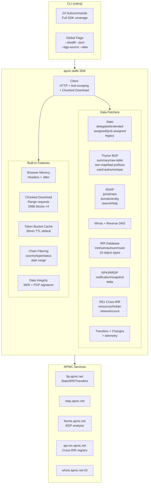

## Installation

```bash
go get github.com/cyberspacesec/apnic-skills
```

## Quick Start

```go
package main

import (
    "context"
    "fmt"
    "log"

    apnic "github.com/cyberspacesec/apnic-skills"
)

func main() {
    client := apnic.NewClient()
    ctx := context.Background()

    // RDAP IP lookup
    network, err := client.RDAPLookupIP(ctx, "1.1.1.1")
    if err != nil {
        log.Fatal(err)
    }
    fmt.Printf("Network: %s, Country: %s, Type: %s\n",
        network.Handle, network.Country, network.Type)

    // Fetch Delegated Stats
    entries, err := client.GetDelegatedEntries(ctx)
    if err != nil {
        log.Fatal(err)
    }
    fmt.Printf("Total entries: %d\n", len(entries))

    // Chain filtering
    result := apnic.NewFilter(entries).
        ByCountry("CN").
        ByType("ipv4").
        ByStatus("allocated").
        Result()
    fmt.Printf("CN allocated IPv4 entries: %d\n", len(result))
}
```

## Architecture Overview

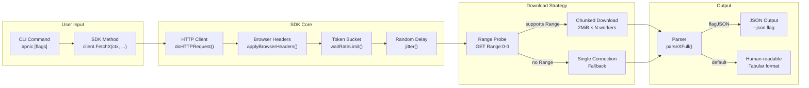

## API Overview

### 1. Delegated Stats (IP/ASN Allocation Records)

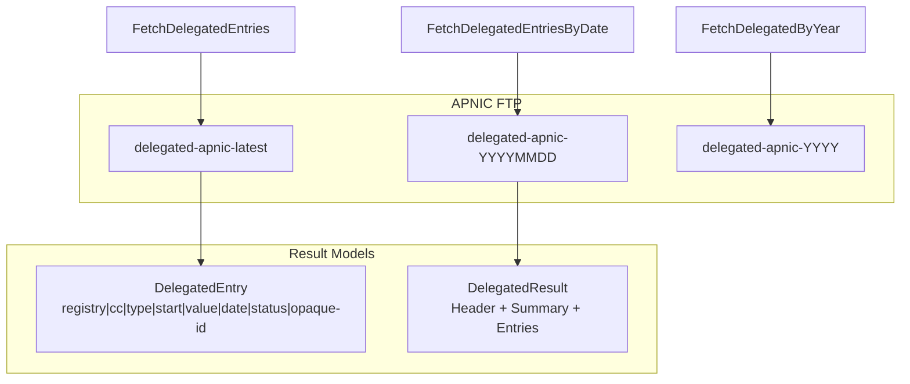

| Method | Description |
|--------|-------------|
| `FetchDelegatedEntries(ctx)` | Fetch latest standard delegated stats |
| `GetDelegatedEntries(ctx)` | Cached standard delegated stats |
| `FetchDelegatedEntriesByDate(ctx, date)` | Fetch delegated stats by date |
| `FetchDelegatedResult(ctx, date)` | Full result with header/summary |
| `FetchDelegatedByYear(ctx, year)` | Fetch by year |
| `FetchDelegatedResultByYear(ctx, year)` | Full result by year |

### 2. Extended Delegated Stats (with Organization Opaque-IDs)

| Method | Description |
|--------|-------------|
| `FetchExtendedEntries(ctx)` | Fetch latest extended stats |
| `GetExtendedEntries(ctx)` | Cached extended stats |
| `FetchExtendedEntriesByDate(ctx, date)` | Fetch by date |
| `FetchExtendedResult(ctx, date)` | Full result with header/summary |
| `FetchExtendedByYear(ctx, year)` | Fetch by year |
| `FetchExtendedResultByYear(ctx, year)` | Full result by year |

### 3. Assigned Stats (Aggregated by Prefix Size)

| Method | Description |
|--------|-------------|
| `FetchAssignedEntries(ctx)` | Fetch latest assigned stats |
| `GetAssignedEntries(ctx)` | Cached assigned stats |
| `FetchAssignedEntriesByDate(ctx, date)` | Fetch by date |
| `FetchAssignedResult(ctx, date)` | Full result with header/summary |

### 3b. IPv6 Assigned Stats (Per-prefix IPv6 Records)

| Method | Description |
|--------|-------------|
| `FetchIPv6AssignedEntries(ctx)` | Fetch latest per-prefix IPv6 records |
| `FetchIPv6AssignedEntriesByDate(ctx, date)` | Fetch by date |
| `FetchIPv6AssignedResult(ctx, date)` | Full result with header/summary |

> Unlike aggregated `assigned`, `ipv6-assigned` lists each IPv6 allocation (`registry|cc|ipv6|start|prefix|date`), no status/opaque-id column.

### 4. Legacy Stats (Historical Legacy Resources)

| Method | Description |
|--------|-------------|
| `FetchLegacyEntries(ctx)` | Fetch latest legacy records |
| `GetLegacyEntries(ctx)` | Cached legacy records |
| `FetchLegacyEntriesByDate(ctx, date)` | Fetch by date |
| `FetchLegacyResult(ctx, date)` | Full result with header/summary |

### 5. RDAP Queries (Structured Registration Data)

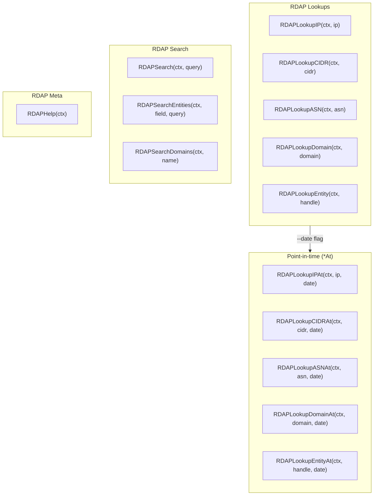

| Method | Description |
|--------|-------------|
| `RDAPLookupIP(ctx, ip)` | RDAP IP address lookup |
| `RDAPLookupCIDR(ctx, cidr)` | RDAP CIDR block lookup |
| `RDAPLookupASN(ctx, asn)` | RDAP ASN lookup |
| `RDAPLookupDomain(ctx, domain)` | RDAP domain lookup (reverse DNS) |
| `RDAPLookupEntity(ctx, handle)` | RDAP entity/contact lookup |
| `RDAPSearch(ctx, query)` | RDAP entity name search (equivalent to `RDAPSearchEntities(ctx, "fn", query)`) |
| `RDAPSearchEntities(ctx, field, query)` | RDAP entity search: `field="fn"` (name, wildcards `*`) / `field="handle"` (exact) |
| `RDAPHelp(ctx)` | RDAP `/help`: server capability (rdapConformance) and notices |
| `RDAPSearchDomains(ctx, name)` | RDAP `/domains`: search in-addr.arpa domains by name |

All RDAP lookups have `*At` variants (e.g., `RDAPLookupIPAt(ctx, ip, date)`) for point-in-time historical queries (RFC3339), returning the resource state at that UTC instant, based on APNIC `history_version_0` extension.

### 6. Transfers (IP/ASN Transfer Records)

| Method | Description |
|--------|-------------|
| `FetchTransfers(ctx)` | Fetch latest transfer records (daily JSON snapshot) |
| `GetTransfers(ctx)` | Cached transfer records |
| `FetchTransfersByYear(ctx, year)` | Fetch transfers by year |
| `FetchTransfersAll(ctx, date)` | Fetch cumulative transfers-all (pipe-delimited, all transfers since 2010); `date=""` for latest, `YYYYMMDD` for archive |
| `FetchTransfersAllMD5(ctx, date)` | MD5 checksum for transfers-all |
| `FetchTransfersAllASC(ctx, date)` | PGP signature (.asc) for transfers-all |

### 7. Changes (Resource Change Records)

| Method | Description |
|--------|-------------|
| `FetchChanges(ctx)` | Fetch latest change records |
| `GetChanges(ctx)` | Cached change records |
| `FetchChangesByDate(ctx, date)` | Fetch changes by date |

### 7b. Whois/RDAP Service Telemetry

| Method | Description |
|--------|-------------|
| `FetchTelemetry(ctx, date)` | Fetch whois-rdap-stats telemetry (hourly): query volume, type distribution, top ASN; `date=""` for latest |
| `FetchTelemetryMD5(ctx, date)` | MD5 checksum for telemetry JSON |

### 7c. IRR Database Dump (RPSL)

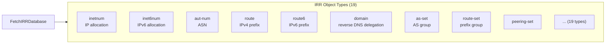

| Method | Description |
|--------|-------------|
| `FetchIRRDatabase(ctx, objType)` | Fetch and parse IRR database dump (`apnic.db.<type>.gz`), `objType` in `IRRObjectTypes` (19 types) |
| `GetIRRDatabase(ctx, objType)` | Cached IRR database dump |
| `FetchIRRCurrentSerial(ctx)` | Fetch `APNIC.CURRENTSERIAL` (current IRR serial number) |

> `domain` type IRR dump contains reverse DNS delegation info (`x.in-addr.arpa` + `nserver`/`zone-c`).

### 7d. thyme BGP Routing Table Analysis

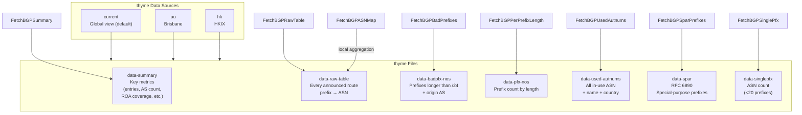

| Method | Description |
|--------|-------------|
| `FetchBGPSummary(ctx)` | Fetch thyme `data-summary`: BGP table metrics (entry count, AS count, ROA coverage, address space %, colon-separated key-value) |
| `FetchBGPRawTable(ctx)` | Fetch thyme `data-raw-table`: every announced route `prefix\tASN` |
| `FetchBGPASNMap(ctx)` | Aggregate raw table by origin ASN (local derivation, no extra request) |
| `FetchBGPBadPrefixes(ctx, source)` | Fetch thyme `data-badpfx-nos`: prefixes longer than /24 with origin AS (route leak candidates) |
| `FetchBGPPerPrefixLength(ctx, source)` | Fetch thyme `data-pfx-nos`: prefix count per prefix length (/N:count grid) |
| `FetchBGPUsedAutnums(ctx, source)` | Fetch thyme `data-used-autnums`: all in-use ASN with registered name, country code |
| `FetchBGPSparPrefixes(ctx, source)` | Fetch thyme `data-spar`: RFC 6890 Special Purpose Address Registry prefixes with origin AS |
| `FetchBGPSinglePfx(ctx, source)` | Fetch thyme `data-singlepfx`: ASN count announcing fewer than 20 prefixes (grouped by RIR) |

> `source` is per-call data source: `"current"` (default, global), `"au"` (Brisbane), `"hk"` (HKIX). Empty string uses client default (`WithThymeSource`, default `current`).

### 7e. RPKI / RRDP

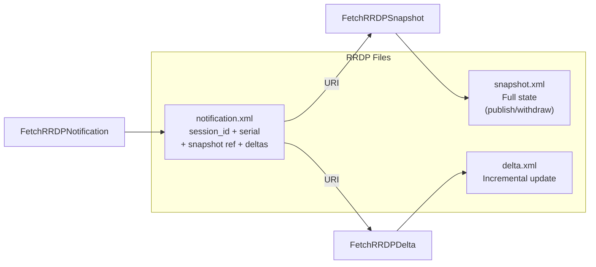

| Method | Description |
|--------|-------------|
| `FetchRRDPNotification(ctx)` | Fetch RRDP `notification.xml`: session_id, serial, current snapshot reference and delta list |
| `FetchRRDPSnapshot(ctx, uri)` | Stream-parse RRDP snapshot.xml: only `<publish>`/`<withdraw>` rsync URIs, discard base64 CMS body (memory-bound) |
| `FetchRRDPDelta(ctx, uri)` | Stream-parse RRDP delta.xml (incremental, same format as snapshot) |

### 7f. REx Cross-RIR Resource Registry

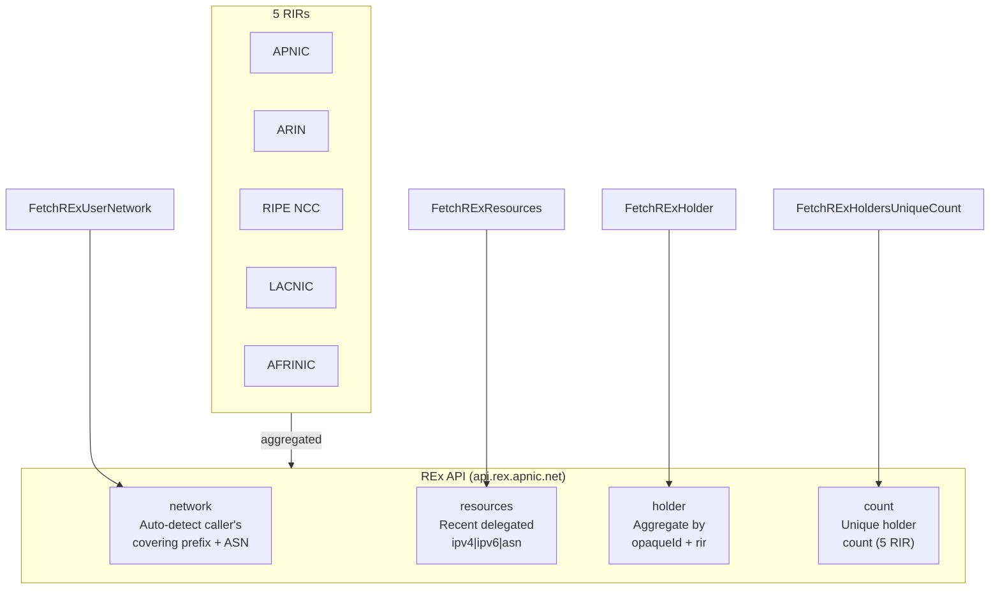

REx (Resource EXplorer, `api.rex.apnic.net/v1/*`) is a public REST API from APNIC that aggregates delegated resources across all five RIRs (APNIC/ARIN/RIPE/LACNIC/AFRINIC) into a unified view, grouped by resource holder (opaqueId). This capability cannot be replaced by per-RIR stats/RDAP:

| Method | Description |
|--------|-------------|
| `FetchRExUserNetwork(ctx)` | Self-locate network: return covering prefix, origin ASN, economy code based on caller's source IP (no parameters) |
| `FetchRExResources(ctx, type)` | Cross-RIR recent delegated resources (with holder attribution), `type` can be `ipv4`/`ipv6`/`asn` or empty |
| `FetchRExHolder(ctx, opaqueID, rir)` | Aggregate all ASN and prefixes held by one organization, given opaqueId and responsible RIR |
| `FetchRExHoldersUniqueCount(ctx)` | Total unique holder count across all RIRs |

> `rir` values: `afrinic`/`apnic`/`arin`/`lacnic`/`ripencc` (RIPE NCC code is `ripencc`, not `ripe`). `opaqueId` can be obtained from `RExResource.OpaqueID` or extended delegated stats. REx uses HTTPS public API, shares unified HTTP client, inherits anti-scraping headers.

### 8. Whois Queries

| Method | Description |
|--------|-------------|
| `QueryWhois(ctx, query)` | Raw Whois query |
| `QueryWhoisIP(ctx, ip)` | IP address Whois query (parsed result) |
| `QueryWhoisASN(ctx, asn)` | ASN Whois query (parsed result) |
| `QueryWhoisWithFlags(ctx, query, flags)` | Whois query with flags |
| `ParseWhoisResponse(response)` | Parse Whois response text |

### 9. Reverse DNS

| Method | Description |
|--------|-------------|
| `ReverseDNS(ctx, ip)` | IP reverse DNS (PTR) lookup |

### 10. Historical Data

| Method | Description |
|--------|-------------|
| `FetchHistoricalDelegated(ctx, date)` | Fetch historical delegated data by date |
| `FetchHistoricalExtended(ctx, date)` | Fetch historical extended data by date |
| `FetchHistoricalAssigned(ctx, date)` | Fetch historical assigned stats by date |
| `FetchHistoricalLegacy(ctx, date)` | Fetch historical legacy data by date |
| `FetchDelegatedByYear(ctx, year)` | Fetch delegated data by year |
| `FetchExtendedByYear(ctx, year)` | Fetch extended data by year |
| `ListAvailableYears()` | List available historical data years |

### 11. Data Integrity Verification

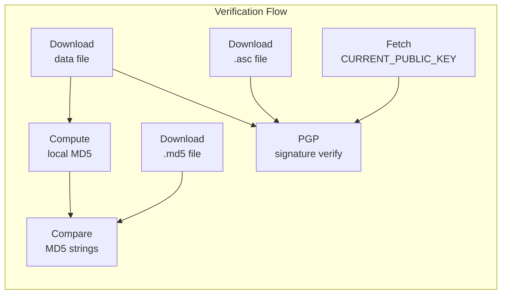

| Method | Description |
|--------|-------------|
| `VerifyMD5(ctx, dataType, date)` | End-to-end: download data file + MD5 sidecar, compute locally and compare |
| `FetchMD5Checksum(ctx, dataType, date)` | Fetch MD5 checksum (compatible with BSD `MD5 (file) =` and GNU style) |
| `FetchASCSignature(ctx, dataType, date)` | Fetch PGP signature (.asc) |
| `FetchPublicKey(ctx)` | Fetch APNIC signing public key (CURRENT_PUBLIC_KEY) |

### 12. Filtering & Grouping

| Method | Description |
|--------|-------------|
| `FilterEntries(entries, country, resType)` | Filter by country and type |
| `FilterByStatus(entries, status)` | Filter by status |
| `FilterByDateRange(entries, start, end)` | Filter by date range |
| `FilterExtendedByOpaqueID(entries, opaqueID)` | Filter by organization ID |
| `FilterExtendedByCountry(entries, country)` | Filter extended by country |
| `FilterExtendedByType(entries, resType)` | Filter extended by type |
| `FilterExtendedByStatus(entries, status)` | Filter extended by status |
| `GroupByCountry(entries)` | Group by country |
| `GroupExtendedByOpaqueID(entries)` | Group by organization |
| `GroupExtendedByCountry(entries)` | Group extended by country |

### 13. Chain Filtering API

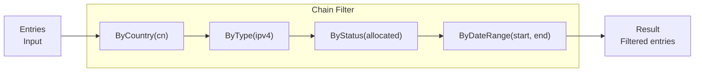

```go
// Standard chain filtering
result := apnic.NewFilter(entries).
    ByCountry("CN").
    ByType("ipv4").
    ByStatus("allocated").
    ByDateRange(start, end).
    Result()

// Extended chain filtering
extResult := apnic.NewExtendedFilter(extEntries).
    ByCountry("JP").
    ByType("ipv6").
    ByOpaqueID("A92E1062").
    Result()
```

### 14. CIDR Calculation

```go
// Standard version
cidr, err := entry.CIDR()

// Extended version
cidr, err := extEntry.CIDR()

// Legacy version
cidr, err := legacyEntry.CIDR()
```

## Client Configuration

```go
client := apnic.NewClient(
    apnic.WithCacheTTL(10 * time.Minute),
    apnic.WithUserAgent("my-app/1.0"),
    apnic.WithRDAPBaseURL("https://rdap.apnic.net"),
    apnic.WithWhoisServer("whois.apnic.net:43"),
    apnic.WithWhoisTimeout(15 * time.Second),
    apnic.WithHTTPClient(&http.Client{Timeout: 30 * time.Second}),
)
```

### Anti-Scraping & Browser Mimicry (Default On)

To avoid being detected as a scraper, SDK enables browser mimicry middleware by default: all HTTP exits (including whois jitter) inject mainstream Chrome request headers (UA, Accept-Language, Sec-Fetch-*, Sec-Ch-Ua-*, etc.), plus token bucket rate limiting and random jitter between requests. Adjustable via Options:

```go
client := apnic.NewClient(
    apnic.WithStealth(true),                       // default true; false sends only UA+Accept (backward compatible)
    apnic.WithBrowserUserAgent("Mozilla/5.0 ..."), // custom browser UA
    apnic.WithJitter(200*time.Millisecond, 800*time.Millisecond), // random delay range per request
    apnic.WithRateLimit(2.0),                      // global max requests per second (token bucket, 0=unlimited)
    apnic.WithFTPBaseURL(apnic.DefaultFTPBaseURL),  // FTP root for IRR/transfers-all/telemetry
    apnic.WithRRDPBaseURL(apnic.DefaultRRDPBaseURL),
    apnic.WithThymeBaseURL(apnic.DefaultThymeBaseURL),
    apnic.WithRExBaseURL(apnic.DefaultRExBaseURL),  // REx cross-RIR registry
)
```

> Compatibility: when stealth is on, sets `Accept-Encoding: gzip`. Go Transport won't auto-decompress, so `fetchText`, RRDP stream parsers and REx `fetchJSON` explicitly handle `Content-Encoding: gzip` to avoid double decompression. Test with `APNIC_NO_JITTER=1` to skip jitter for speed.

### Chunked Download for Large Files (Default On)

APNIC FTP throttles large files (delegated 4.3MB, extended, IRR `apnic.db.inetnum.gz` 50MB+) to **single-connection bandwidth ~8-22 KB/s**—this is not anti-scrap detection (same speed for any UA, no 403, normal `accept-ranges: bytes`), but server-level rate limiting. Single connection for 50MB IRR dump takes ~40 min, far exceeding typical timeouts.

SDK enables **multi-connection chunked download** by default: probe Range support, then split file into ~2MB chunks, download with 4 concurrent Range requests in round-robin (each connection independently rate-limited, total throughput 3-4×), merge via `io.Pipe` with on-demand gzip decompression. Each chunk request goes through `doHTTPRequest`, inherits full browser headers + token bucket + jitter. Endpoints without Range support or with transport-layer gzip transparently fall back to single connection.

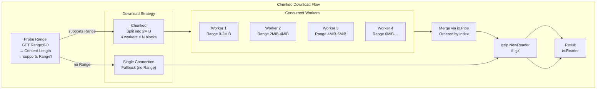

```go
client := apnic.NewClient(
    apnic.WithMaxConcurrentDownloads(4),             // concurrent Range requests (0/1 disables chunking)
    apnic.WithChunkSize(2*1024*1024),                // explicit chunk size; default 2MiB
    apnic.WithDownloadTimeout(5*time.Minute),        // per-chunk timeout (recommend ≥ chunk_size/8KBps)
)
```

> Chunk strategy: default 2MiB per chunk (~90s at 22KB/s, well below suggested 5min per-chunk timeout). `maxConcurrent` controls concurrency, not chunk count—50MB file splits into ~25 chunks rotated via 4 workers. Hard caps: 64 chunks max, 16 concurrency max, to avoid server pressure. If per-chunk timeout still triggers, reduce `WithChunkSize` (e.g., 1MiB) or increase `WithDownloadTimeout`.
>
> Slow block tolerance: when a chunk hits `context deadline exceeded` due to stuck connection, SDK auto-splits it into two sub-chunks with new concurrent retry, bypassing the dead TCP connection, avoiding single-point jitter killing the whole download.

## CLI (Command-Line Interface)

The repository includes a cobra-based `apnic` CLI covering all SDK capabilities:

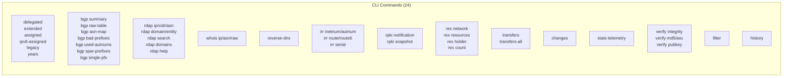

```bash
# Build
go build -o bin/apnic ./cmd/apnic

# Examples
apnic delegated --json | jq '.Entries | length'
apnic filter --source delegated --country CN --type ipv4
apnic rdap ip 1.1.1.1 --date 2020-06-01T00:00:00Z
apnic rdap help            # RDAP server capability and notices
apnic rdap domains 1       # Search in-addr.arpa reverse DNS domains
apnic transfers-all        # Cumulative transfer set (since 2010)
apnic transfers-all --date 20220904
apnic stats-telemetry      # whois/RDAP service query telemetry
apnic irr inetnum          # IRR database dump (RPSL)
apnic irr serial           # APNIC.CURRENTSERIAL
apnic bgp summary          # thyme BGP table analysis metrics
apnic bgp raw-table        # thyme raw routing table
apnic bgp asn-map          # Aggregate by origin ASN
apnic bgp bad-prefixes     # Prefixes longer than /24 + origin AS (route leak candidates)
apnic bgp per-prefix-length  # Prefix count by prefix length
apnic bgp used-autnums     # All in-use ASN + name/country
apnic bgp spar-prefixes    # RFC 6890 Special Purpose Address Registry prefixes
apnic bgp single-pfx       # ASN count with <20 prefixes (by RIR)
apnic bgp --bgp-source au  # Use Brisbane data source
apnic rpki notification    # RRDP notification (session/serial/snapshot/deltas)
apnic rpki snapshot        # Stream-parse current snapshot
apnic rex network          # REx self-locate network (covering prefix/ASN/economy by source IP)
apnic rex resources ipv4   # Cross-RIR recent delegated resources (holder attribution)
apnic rex holder <opaqueId> <rir>  # Aggregate all ASN/prefixes held by one organization
apnic rex count            # Unique holder count across all RIRs
apnic verify integrity --type delegated
```

Anti-scraping global flags: `--stealth` (default true), `--browser-ua`, `--jitter 200ms-800ms`, `--rate-limit` (requests per second), `--ftp-base-url`/`--rrdp-base-url`/`--thyme-base-url`/`--rex-base-url`, `--bgp-source` (thyme BGP source: `current`/`au`/`hk`, default `current`).

- Full subcommand and parameter documentation in [docs/SKILLS.md](docs/SKILLS.md).
- Multi-command workflow examples (country resource audit / IP全景 investigation / transfer/change tracking / data integrity verification) in [docs/workflows.md](docs/workflows.md).

## Test Coverage

- SDK: **100.0%** statement coverage
- CLI: All named functions **100%** (overall 99.1%, difference is `main()` entry `osExit(runMain())` unreachable)

## Data Flow Example: IP Investigation

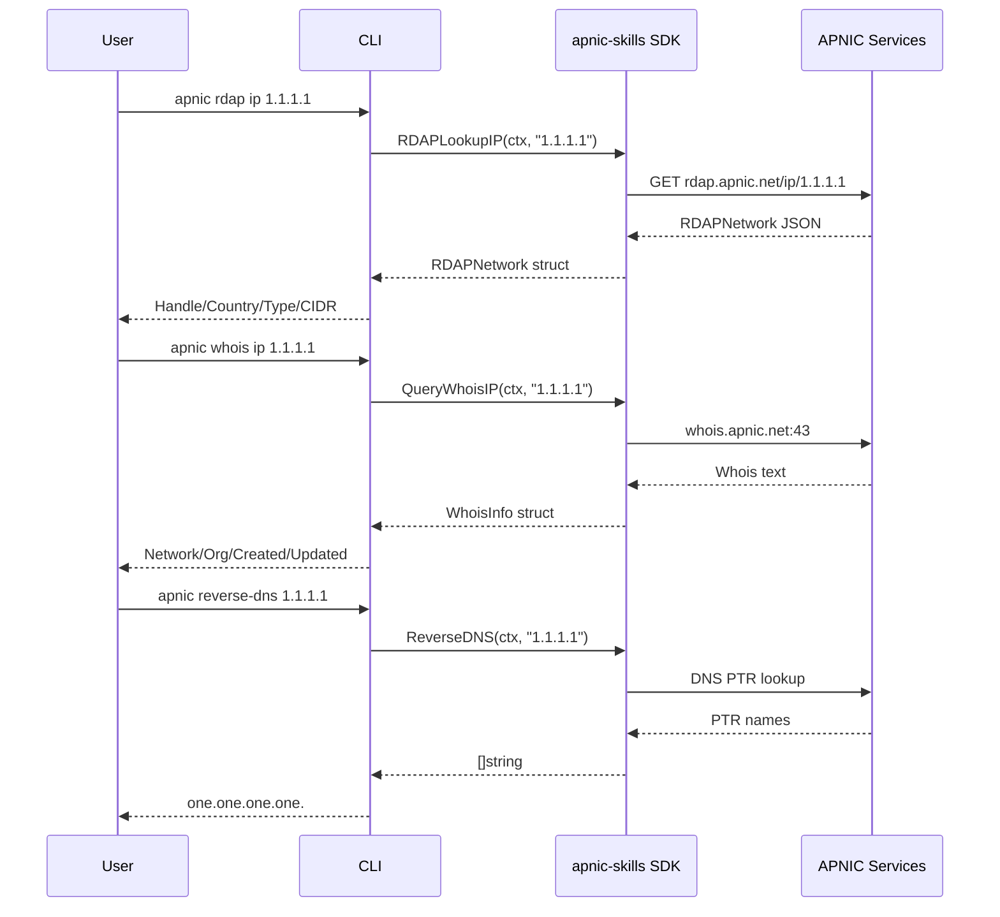

## License

MIT