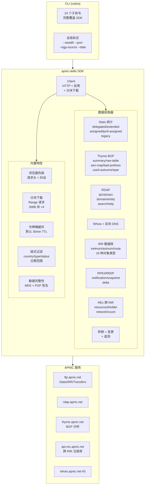

# apnic-skills

**简体中文** | [English](README.md)

APNIC（亚太互联网络信息中心）Go 语言 SDK，完整覆盖 APNIC 提供的所有公开数据服务与查询能力。



## 架构总览

## 安装

```bash
go get github.com/cyberspacesec/apnic-skills
```

## 快速开始

```go
package main

import (
    "context"
    "fmt"
    "log"

    apnic "github.com/cyberspacesec/apnic-skills"
)

func main() {
    client := apnic.NewClient()
    ctx := context.Background()

    // RDAP 查询 IP
    network, err := client.RDAPLookupIP(ctx, "1.1.1.1")
    if err != nil {
        log.Fatal(err)
    }
    fmt.Printf("Network: %s, Country: %s, Type: %s\n",
        network.Handle, network.Country, network.Type)

    // 获取 Delegated Stats
    entries, err := client.GetDelegatedEntries(ctx)
    if err != nil {
        log.Fatal(err)
    }
    fmt.Printf("Total entries: %d\n", len(entries))

    // 链式过滤
    result := apnic.NewFilter(entries).
        ByCountry("CN").
        ByType("ipv4").
        ByStatus("allocated").
        Result()
    fmt.Printf("CN allocated IPv4 entries: %d\n", len(result))
}
```

## API 概览

### 1. Delegated Stats（IP/ASN 分配记录）

| 方法 | 说明 |
|------|------|
| `FetchDelegatedEntries(ctx)` | 获取最新标准版分配记录 |
| `GetDelegatedEntries(ctx)` | 带缓存的标准版分配记录 |
| `FetchDelegatedEntriesByDate(ctx, date)` | 获取指定日期的分配记录 |
| `FetchDelegatedResult(ctx, date)` | 获取完整结果（含 header/summary） |

### 2. Extended Delegated Stats（扩展版，含组织标识）

| 方法 | 说明 |
|------|------|
| `FetchExtendedEntries(ctx)` | 获取最新扩展版分配记录 |
| `GetExtendedEntries(ctx)` | 带缓存的扩展版分配记录 |
| `FetchExtendedEntriesByDate(ctx, date)` | 获取指定日期的扩展版 |
| `FetchExtendedResult(ctx, date)` | 获取完整结果（含 header/summary） |

### 3. Assigned Stats（按前缀大小聚合的分配统计）

| 方法 | 说明 |
|------|------|
| `FetchAssignedEntries(ctx)` | 获取最新分配统计 |
| `GetAssignedEntries(ctx)` | 带缓存的分配统计 |
| `FetchAssignedEntriesByDate(ctx, date)` | 获取指定日期的分配统计 |

### 3b. IPv6 Assigned Stats（逐条 IPv6 分配记录）

| 方法 | 说明 |
|------|------|
| `FetchIPv6AssignedEntries(ctx)` | 获取最新逐条 IPv6 分配记录 |
| `FetchIPv6AssignedEntriesByDate(ctx, date)` | 获取指定日期的逐条 IPv6 分配记录 |
| `FetchIPv6AssignedResult(ctx, date)` | 获取完整结果（含 header/summary） |

> 与聚合版 `assigned` 不同，`ipv6-assigned` 列出每一条 IPv6 分配（`registry|cc|ipv6|start|prefix|date`），无 status/opaque-id 列。

### 4. Legacy Stats（历史遗留资源）

| 方法 | 说明 |
|------|------|
| `FetchLegacyEntries(ctx)` | 获取最新历史遗留记录 |
| `GetLegacyEntries(ctx)` | 带缓存的历史遗留记录 |
| `FetchLegacyEntriesByDate(ctx, date)` | 获取指定日期的历史遗留记录 |

### 5. RDAP 查询（结构化数据）

| 方法 | 说明 |
|------|------|
| `RDAPLookupIP(ctx, ip)` | RDAP IP 地址查询 |
| `RDAPLookupCIDR(ctx, cidr)` | RDAP CIDR 查询 |
| `RDAPLookupASN(ctx, asn)` | RDAP ASN 查询 |
| `RDAPLookupDomain(ctx, domain)` | RDAP 域名查询（反向 DNS） |
| `RDAPLookupEntity(ctx, handle)` | RDAP 实体/联系人查询 |
| `RDAPSearch(ctx, query)` | RDAP 实体名称搜索（等价于 `RDAPSearchEntities(ctx,"fn",query)`） |
| `RDAPSearchEntities(ctx, field, query)` | RDAP 实体搜索：`field="fn"` 名称搜索（支持 `*` 通配）/ `field="handle"` 精确查找 |
| `RDAPHelp(ctx)` | RDAP `/help`：服务能力声明（rdapConformance 扩展）与通知 |
| `RDAPSearchDomains(ctx, name)` | RDAP `/domains`：按名称搜索 in-addr.arpa 反向 DNS 域 |

所有 RDAP lookup 均提供 `*At` 变体（如 `RDAPLookupIPAt(ctx, ip, date)`）用于点对点历史查询（RFC3339），返回该 UTC 时刻的资源状态，基于 APNIC `history_version_0` 扩展。

### 6. Transfers（IP/ASN 转移记录）

| 方法 | 说明 |
|------|------|
| `FetchTransfers(ctx)` | 获取最新转移记录（每日 JSON 快照） |
| `GetTransfers(ctx)` | 带缓存的转移记录 |
| `FetchTransfersByYear(ctx, year)` | 获取指定年份的转移记录 |
| `FetchTransfersAll(ctx, date)` | 获取累积 transfers-all 全集（管道分隔，自 2010 年起全部转移）；`date=""` 取最新，`YYYYMMDD` 取当日归档 |
| `FetchTransfersAllMD5(ctx, date)` | transfers-all 的 MD5 校验值 |
| `FetchTransfersAllASC(ctx, date)` | transfers-all 的 PGP 签名（.asc） |

### 7. Changes（资源变更记录）

| 方法 | 说明 |
|------|------|
| `FetchChanges(ctx)` | 获取最新变更记录 |
| `GetChanges(ctx)` | 带缓存的变更记录 |
| `FetchChangesByDate(ctx, date)` | 获取指定日期的变更记录 |

### 7b. Whois/RDAP 服务遥测

| 方法 | 说明 |
|------|------|
| `FetchTelemetry(ctx, date)` | 获取 whois-rdap-stats 遥测（每小时发布）：查询总量、按类型分布、Top ASN；`date=""` 取最新 |
| `FetchTelemetryMD5(ctx, date)` | 遥测 JSON 的 MD5 校验值 |

### 7c. IRR 全量转储（RPSL）

| 方法 | 说明 |
|------|------|
| `FetchIRRDatabase(ctx, objType)` | 获取并解析指定类型的 IRR 数据库转储（`apnic.db.<type>.gz`），`objType` 见 `IRRObjectTypes`（19 类） |
| `GetIRRDatabase(ctx, objType)` | 带缓存的 IRR 数据库转储 |
| `FetchIRRCurrentSerial(ctx)` | 获取 `APNIC.CURRENTSERIAL`（IRR 数据库当前序号） |

> `domain` 类型的 IRR 转储承载反向 DNS 委派信息（`x.in-addr.arpa` + `nserver`/`zone-c`）。

### 7d. thyme BGP 路由表分析

| 方法 | 说明 |
|------|------|
| `FetchBGPSummary(ctx)` | 获取 thyme `data-summary`：BGP 路由表分析指标（条目数、AS 数、ROA 覆盖、地址空间占比等，冒号键值） |
| `FetchBGPRawTable(ctx)` | 获取 thyme `data-raw-table`：每条已宣告路由 `prefix\tASN` |
| `FetchBGPASNMap(ctx)` | 按 origin ASN 聚合 raw table（本地派生，无额外请求） |
| `FetchBGPBadPrefixes(ctx, source)` | 获取 thyme `data-badpfx-nos`：长度超过 /24 的前缀及其 origin AS（疑似路由泄漏） |
| `FetchBGPPerPrefixLength(ctx, source)` | 获取 thyme `data-pfx-nos`：按前缀长度统计已宣告前缀数（/N:count 网格） |
| `FetchBGPUsedAutnums(ctx, source)` | 获取 thyme `data-used-autnums`：所有在用 ASN 及注册名、国家码 |
| `FetchBGPSparPrefixes(ctx, source)` | 获取 thyme `data-spar`：特殊用途地址注册表（RFC 6890）前缀及 origin AS |
| `FetchBGPSinglePfx(ctx, source)` | 获取 thyme `data-singlepfx`：宣告少于 20 个前缀的 ASN 计数（按 RIR 分组） |

> `source` 为 per-call 数据源参数：`"current"`（默认，全球视图）、`"au"`（Brisbane）、`"hk"`（HKIX），空串走客户端默认（`WithThymeSource` 设置，默认 `current`）。

### 7e. RPKI / RRDP

| 方法 | 说明 |
|------|------|
| `FetchRRDPNotification(ctx)` | 获取 RRDP `notification.xml`：session_id、serial、当前 snapshot 引用与 deltas 列表 |
| `FetchRRDPSnapshot(ctx, uri)` | 流式解析 RRDP snapshot.xml：仅保留 `<publish>`/`<withdraw>` 的 rsync URI，丢弃 base64 CMS body（边界内存） |
| `FetchRRDPDelta(ctx, uri)` | 流式解析 RRDP delta.xml（增量更新，格式同 snapshot） |

### 7f. REx 跨 RIR 资源注册库

REx（Resource EXplorer，`api.rex.apnic.net/v1/*`）是 APNIC 提供的公开 REST API，将五大 RIR（APNIC/ARIN/RIPE/LACNIC/AFRINIC）的委派资源聚合为统一视图，并按持有组织（opaqueId）归集。这是各 RIR 独立 stats/RDAP 无法替代的能力：

| 方法 | 说明 |
|------|------|
| `FetchRExUserNetwork(ctx)` | 自定位网络：按调用方源 IP 返回覆盖前缀、起源 ASN、经济体代码（无需参数） |
| `FetchRExResources(ctx, type)` | 跨 RIR 最近委派资源视图（带持有者归因），`type` 可为 `ipv4`/`ipv6`/`asn` 或空 |
| `FetchRExHolder(ctx, opaqueID, rir)` | 按 opaqueId 聚合某组织持有的全部 ASN 与前缀及规模指标 |
| `FetchRExHoldersUniqueCount(ctx)` | 全 RIR 去重持有者总数 |

> `rir` 取值为 `afrinic`/`apnic`/`arin`/`lacnic`/`ripencc`（RIPE NCC 的代码是 `ripencc`，不是 `ripe`）。`opaqueId` 可从 `RExResource.OpaqueID` 或扩展 delegated stats 获取。REx 走 HTTPS 公开 API，复用统一 HTTP 出口，自动获益于反爬伪装。

### 8. Whois 查询

| 方法 | 说明 |
|------|------|
| `QueryWhois(ctx, query)` | 原始 Whois 查询 |
| `QueryWhoisIP(ctx, ip)` | IP 地址 Whois 查询（返回解析结果） |
| `QueryWhoisASN(ctx, asn)` | ASN Whois 查询（返回解析结果） |
| `QueryWhoisWithFlags(ctx, query, flags)` | 带标志的 Whois 查询 |
| `ParseWhoisResponse(response)` | 解析 Whois 响应文本 |

### 9. 反向 DNS

| 方法 | 说明 |
|------|------|
| `ReverseDNS(ctx, ip)` | IP 反向 DNS 解析 |

### 10. 历史数据

| 方法 | 说明 |
|------|------|
| `FetchHistoricalDelegated(ctx, date)` | 获取指定日期的历史分配数据 |
| `FetchHistoricalExtended(ctx, date)` | 获取指定日期的历史扩展数据 |
| `FetchHistoricalAssigned(ctx, date)` | 获取指定日期的历史分配统计 |
| `FetchHistoricalLegacy(ctx, date)` | 获取指定日期的历史遗留数据 |
| `FetchDelegatedByYear(ctx, year)` | 获取指定年份的分配数据 |
| `FetchExtendedByYear(ctx, year)` | 获取指定年份的扩展数据 |
| `ListAvailableYears()` | 列出可用的历史数据年份 |

### 11. 数据校验

| 方法 | 说明 |
|------|------|
| `VerifyMD5(ctx, dataType, date)` | 端到端校验：下载数据文件 + MD5 旁挂文件，本地计算并比对 |
| `FetchMD5Checksum(ctx, dataType, date)` | 获取 MD5 校验值（兼容 BSD `MD5 (file) =` 与 GNU 风格） |
| `FetchASCSignature(ctx, dataType, date)` | 获取 PGP 签名（.asc） |
| `FetchPublicKey(ctx)` | 获取 APNIC 签名公钥（CURRENT_PUBLIC_KEY） |

### 12. 过滤与分组

| 方法 | 说明 |
|------|------|
| `FilterEntries(entries, country, resType)` | 按国家和类型过滤 |
| `FilterByStatus(entries, status)` | 按状态过滤 |
| `FilterByDateRange(entries, start, end)` | 按日期范围过滤 |
| `FilterExtendedByOpaqueID(entries, opaqueID)` | 按组织标识过滤 |
| `FilterExtendedByCountry(entries, country)` | 按国家过滤扩展版 |
| `FilterExtendedByType(entries, resType)` | 按类型过滤扩展版 |
| `FilterExtendedByStatus(entries, status)` | 按状态过滤扩展版 |
| `GroupByCountry(entries)` | 按国家分组 |
| `GroupExtendedByOpaqueID(entries)` | 按组织分组 |
| `GroupExtendedByCountry(entries)` | 按国家分组扩展版 |

### 13. 链式过滤 API

```go
// 标准版链式过滤
result := apnic.NewFilter(entries).
    ByCountry("CN").
    ByType("ipv4").
    ByStatus("allocated").
    ByDateRange(start, end).
    Result()

// 扩展版链式过滤
extResult := apnic.NewExtendedFilter(extEntries).
    ByCountry("JP").
    ByType("ipv6").
    ByOpaqueID("A92E1062").
    Result()
```

### 14. CIDR 计算

```go
// 标准版
cidr, err := entry.CIDR()

// 扩展版
cidr, err := extEntry.CIDR()

// 历史遗留版
cidr, err := legacyEntry.CIDR()
```

## 客户端配置

```go
client := apnic.NewClient(
    apnic.WithCacheTTL(10 * time.Minute),
    apnic.WithUserAgent("my-app/1.0"),
    apnic.WithRDAPBaseURL("https://rdap.apnic.net"),
    apnic.WithWhoisServer("whois.apnic.net:43"),
    apnic.WithWhoisTimeout(15 * time.Second),
    apnic.WithHTTPClient(&http.Client{Timeout: 30 * time.Second}),
)
```

### 反爬与浏览器伪装（默认开启）

为避免被目标站点识别为爬虫，SDK 默认启用浏览器伪装中间件：所有 HTTP 出口（含 whois 抖动）注入主流 Chrome 的完整请求头（UA、Accept-Language、Sec-Fetch-*、Sec-Ch-Ua-* 等），并在请求间加入令牌桶限速与随机抖动。可通过 Option 调整或关闭：

```go
client := apnic.NewClient(
    apnic.WithStealth(true),                       // 默认 true；false 时仅发 UA+Accept（向后兼容）
    apnic.WithBrowserUserAgent("Mozilla/5.0 ..."), // 自定义浏览器 UA
    apnic.WithJitter(200*time.Millisecond, 800*time.Millisecond), // 每请求随机延迟区间
    apnic.WithRateLimit(2.0),                      // 全局每秒最大请求数（令牌桶，0=不限速）
    apnic.WithFTPBaseURL(apnic.DefaultFTPBaseURL),  // IRR/transfers-all/telemetry 的 FTP 根
    apnic.WithRRDPBaseURL(apnic.DefaultRRDPBaseURL),
    apnic.WithThymeBaseURL(apnic.DefaultThymeBaseURL),
    apnic.WithRExBaseURL(apnic.DefaultRExBaseURL),  // REx 跨 RIR 资源注册库
)
```

> 兼容性说明：stealth 开启时设置 `Accept-Encoding: gzip`，Go Transport 不会自动解压，故 `fetchText`、RRDP 流式解析器与 REx `fetchJSON` 均显式处理 `Content-Encoding: gzip`，避免双重解压。测试中可用 `APNIC_NO_JITTER=1` 跳过抖动以加速。

### 大文件分块下载（默认开启）

APNIC FTP 对大文件（delegated 4.3MB、extended、IRR `apnic.db.inetnum.gz` 50MB+ 等）实施**单连接带宽限速 ~8-22 KB/s**——这不是反爬检测（任意 UA 速度相同、无 403、响应头正常 `accept-ranges: bytes`），而是服务器级限流。单连接下载 50MB 的 IRR dump 需 ~40 分钟，远超常规超时。

SDK 默认启用**多连接分块下载**：探测支持 Range 后，将文件切成 ~2MB 的小块，以 4 个并发 Range 请求轮转下载（每连接独立限速，总吞吐提升 3-4 倍），再用 `io.Pipe` 流式合并、按需 gzip 解压。每个分块请求仍走 `doHTTPRequest`，完整继承浏览器伪装头 + 令牌桶限速 + 抖动。不支持 Range 或传输层 gzip 的端点透明回退单连接。

```go
client := apnic.NewClient(
    apnic.WithMaxConcurrentDownloads(4),             // 并发 Range 请求数（0/1 禁用分块）
    apnic.WithChunkSize(2*1024*1024),                // 显式每块大小；默认 2MiB
    apnic.WithDownloadTimeout(5*time.Minute),        // 单块超时（建议 ≥ 单块大小/8KBps）
)
```

> 选块策略：默认每块 2MiB（在 22KB/s 限速下约 90 秒下完，远低于建议的 5 分钟单块超时）。`maxConcurrent` 仅控制并发数，不限制块数——50MB 文件会切成 ~25 块经 4 个 worker 轮转。块数硬上限 64，并发硬上限 16，避免对服务器造成压力。若仍遇单块超时，可调小 `WithChunkSize`（如 1MiB）或调大 `WithDownloadTimeout`。
>
> 慢块容错：当某个分块因连接卡住触发 `context deadline exceeded` 时，SDK 会自动将该块拆成两个子块以新连接并发重试，绕开卡死的 TCP 连接，避免单点抖动拖垮整个下载。

## 命令行工具（CLI）

仓库附带基于 cobra 的 `apnic` CLI，封装全部 SDK 能力：

```bash
# 构建
go build -o bin/apnic ./cmd/apnic

# 示例
apnic delegated --json | jq '.Entries | length'
apnic filter --source delegated --country CN --type ipv4
apnic rdap ip 1.1.1.1 --date 2020-06-01T00:00:00Z
apnic rdap help            # RDAP 服务能力声明与通知
apnic rdap domains 1       # 搜索 in-addr.arpa 反向 DNS 域
apnic transfers-all        # 累积转移全集（自 2010）
apnic transfers-all --date 20220904
apnic stats-telemetry      # whois/RDAP 服务查询遥测
apnic irr inetnum          # IRR 数据库转储（RPSL）
apnic irr serial           # APNIC.CURRENTSERIAL
apnic bgp summary          # thyme BGP 路由表分析指标
apnic bgp raw-table        # thyme 原始路由表
apnic bgp asn-map          # 按 origin ASN 聚合
apnic bgp bad-prefixes     # 长度超过 /24 的前缀及 origin AS（路由泄漏候选）
apnic bgp per-prefix-length  # 按前缀长度统计已宣告前缀数
apnic bgp used-autnums     # 所有在用 ASN 及注册名/国家码
apnic bgp spar-prefixes    # 特殊用途地址注册表（RFC 6890）前缀
apnic bgp single-pfx       # 宣告少于 20 前缀的 ASN 计数（按 RIR）
apnic rpki notification    # RRDP notification（session/serial/snapshot/deltas）
apnic rpki snapshot        # 流式解析当前 snapshot
apnic rex network          # REx 自定位网络（源 IP 的覆盖前缀/ASN/经济体）
apnic rex resources ipv4   # 跨 RIR 最近委派资源（持有者归因）
apnic rex holder <opaqueId> <rir>  # 聚合某组织持有的全部 ASN/前缀
apnic rex count            # 全 RIR 去重持有者总数
apnic verify integrity --type delegated
```

反爬相关全局标志：`--stealth`（默认 true）、`--browser-ua`、`--jitter 200ms-800ms`、`--rate-limit`（每秒请求数）、`--ftp-base-url`/`--rrdp-base-url`/`--thyme-base-url`/`--rex-base-url`、`--bgp-source`（thyme BGP 数据源：`current`/`au`/`hk`，默认 `current`）。

- 每个子命令与参数的完整说明见 [docs/SKILLS.md](docs/SKILLS.md)（渐进式披露）。
- 多命令组合工作流（国家资源审计 / IP 全景调查 / 转移变更追踪 / 数据完整性校验）见 [docs/workflows.md](docs/workflows.md)。

## License

MIT
