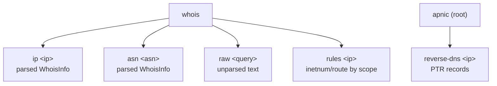

# Whois IP 规则查询扩展 Implementation Plan

> **For agentic workers:** REQUIRED SUB-SKILL: `superpowers:subagent-driven-development`
> Steps use checkbox (`- [ ]`) syntax.

**Goal:** 扩展 APNIC whois 的 IP 规则查询能力——把真实 whois.apnic.net 支持的 IP 规则 flag（`-L` 全部更宽 / `-l` 一级更宽 / `-M` 全部更窄 / `-m` 一级更窄 / `-x` 精确 / `-b` abuse-mailbox）暴露到 CLI 与 SDK，新增多对象列表解析（`-L`/`-M` 返回 N 个 inetnum/route 串联，当前解析器只取第一个主对象），并同步滞后的 whois 文档与补全缺失的实测例子。

**Architecture:** 数据流：用户 `apnic whois rules <ip> --scope all-less` → CLI 把 scope 映射成 whois flag（`-L`）→ 复用 `QueryWhoisWithFlags(ctx, ip, "-L")`（已存在，`internal/query/whois.go:47`）拿到原始多对象文本 → 新增 `ParseWhoisResponseList(response) []WhoisInfo` 按空行切 N 个 RPSL 块、对每个主对象块（inetnum/inet6num/aut-num/route）各产出一个 WhoisInfo（复用现有 `splitWhoisBlocks`/`parseWhoisBlock`/`appendCIDR`）→ CLI 输出 JSON 数组或人类可读多块。`-b` abuse-mailbox 查询走 `QueryWhoisWithFlags(ctx, ip, "-b")` → 新增 `AbuseMailbox` 字段从 `abuse-mailbox:` key 提取。**向后兼容**：保留 `ParseWhoisResponse`（内部调 `ParseWhoisResponseList` 取 `[0]`），不改其签名，现有 `whois ip`/`whois asn` 行为不变。**为什么这样做**：APNIC whois 的规则查询 flag 是真实存在的能力（经探活确认 `-L 1.1.1.1` 返回 0.0.0.0-255.255.255.255 等多个 inetnum + 多个 route，`-b` 返回 `abuse-mailbox:`），当前封装只用了默认精确查询一个维度，浪费了服务端能力；复用已有 `QueryWhoisWithFlags` 避免重写传输层。

**Tech Stack:** Go 1.25.0, 标准库 `strings`/`time`/`strconv`/`fmt`, cobra v1.10.2, 模块 `github.com/cyberspacesec/apnic-skills`, 子包 `internal/models` `internal/query` `internal/testutil` `internal/transport` + CLI `cmd/apnic`

**Risks:**
- Task 1 `ParseWhoisResponseList` 改动解析内部结构 → 缓解：保留 `ParseWhoisResponse` 调 `ParseWhoisResponseList(response)[0]`（空则零值），现有 19 个 query 测试 + 6 个 CLI 测试须全绿才算兼容
- Task 2 `AbuseMailbox` 新增字段会改变 `WhoisInfo` 的 JSON 输出（多一个 key）→ 缓解：新字段空时 JSON 仍为 `""`，现有 `TestCLI_WhoisIPJSON` 只断言含 `"Network"` 不受影响
- Task 3 `whois rules` 的 scope→flag 映射须精确（`-L`/`-l`/`-M`/`-m`/`-x` 是空格分隔前缀，与 `QueryWhoisWithFlags` 现有 `B`/`r` 紧贴前缀不同）→ 缓解：`QueryWhoisWithFlags` 已实现 `flags + " " + query`，传 `"-L"` 即生成 `-L 1.1.1.1`，无需改传输层
- Task 3 `whois raw --flags` 新增 flag 可能与既有 `--json` 冲突 → 缓解：raw 本就返回纯文本，`--flags` 是 string flag 不与 `--json`（bool）冲突
- Task 5 实测依赖网络（whois.apnic.net:43），AS13335 在 APNIC 库查不到（aut-num 响应空）→ 缓解：实测 IP 用 1.1.1.1（APNIC-LABS），ASN 规则查询不存在（APNIC whois 的 `-L`/`-M` 只作用于 IP），实测只测 IP 规则 + abuse，不进测试套件

---

### Task 1: 新增多对象列表解析 ParseWhoisResponseList

**Depends on:** None
**Files:**
- Modify: `internal/query/whois.go:105-186`（重构 ParseWhoisResponse 复用新函数 + 新增 ParseWhoisResponseList）

- [ ] **Step 1: 新增 ParseWhoisResponseList — 对每个主对象块各产出一个 WhoisInfo**

文件: `internal/query/whois.go`（在 `ParseWhoisResponse` 函数之后、`splitWhoisBlocks` 之前插入新函数，约第 187 行处）

```go
// ParseWhoisResponseList parses a raw Whois response that may contain multiple
// primary objects (e.g. the response to a "-L" all-less-specific or "-M"
// all-more-specific query, which returns several inetnum/route objects). Each
// primary object block produces one WhoisInfo, in document order. Secondary
// objects (irt/organisation/role) are folded into the nearest preceding primary
// object's CIDR/OriginASN/OrgName supplements, matching ParseWhoisResponse's
// single-object semantics. Returns an empty slice (not nil) when no primary
// object is found, so callers always get a valid range.
func ParseWhoisResponseList(response string) []models.WhoisInfo {
	result := []models.WhoisInfo{}
	blocks := splitWhoisBlocks(response)

	// Track the index of the current primary object so secondary-object
	// supplements (route CIDR, org-name) attach to it rather than spawning a
	// new entry.
	currentIdx := -1
	for _, block := range blocks {
		kv := parseWhoisBlock(block)
		if len(kv) == 0 {
			continue
		}

		isPrimary := false
		for _, key := range []string{"inetnum", "inet6num", "aut-num", "route", "as-block"} {
			if _, ok := kv[key]; ok {
				isPrimary = true
				break
			}
		}

		if isPrimary {
			info := models.WhoisInfo{CIDR: []string{}}
			if v, ok := kv["inetnum"]; ok {
				info.Network = v
			} else if v, ok := kv["inet6num"]; ok {
				info.Network = v
			} else if v, ok := kv["aut-num"]; ok {
				info.Network = v
			} else if v, ok := kv["route"]; ok {
				info.Network = v
			} else if v, ok := kv["as-block"]; ok {
				info.Network = v
			}
			if v, ok := kv["netname"]; ok {
				info.NetName = v
			}
			if v, ok := kv["country"]; ok {
				info.Country = v
			}
			if v, ok := kv["status"]; ok {
				info.Status = v
			}
			if v, ok := kv["descr"]; ok && info.OrgName == "" {
				info.OrgName = v
			}
			if v, ok := kv["abuse-c"]; ok {
				info.AbuseContact = v
			}
			if v, ok := kv["abuse-mailbox"]; ok && info.AbuseMailbox == "" {
				info.AbuseMailbox = v
			}
			if v, ok := kv["parent"]; ok {
				info.Parent = v
			}
			if v, ok := kv["created"]; ok {
				if t, err := parseWhoisDate(v); err == nil {
					info.Created = t
				}
			}
			if v, ok := kv["last-modified"]; ok {
				if t, err := parseWhoisDate(v); err == nil {
					info.LastUpdated = t
				}
			}
			// A route-as-primary block also feeds its own CIDR/origin.
			if v, ok := kv["route"]; ok {
				info.CIDR = appendCIDR(info.CIDR, v)
			}
			if v, ok := kv["origin"]; ok && info.OriginASN == "" {
				info.OriginASN = v
			}
			result = append(result, info)
			currentIdx = len(result) - 1
			continue
		}

		// Secondary object: supplement the current primary object's CIDR /
		// OriginASN / OrgName if one is in progress.
		if currentIdx >= 0 {
			cur := &result[currentIdx]
			if v, ok := kv["route"]; ok {
				cur.CIDR = appendCIDR(cur.CIDR, v)
			}
			if v, ok := kv["origin"]; ok && cur.OriginASN == "" {
				cur.OriginASN = v
			}
			if v, ok := kv["org-name"]; ok && cur.OrgName == "" {
				cur.OrgName = v
			}
			if v, ok := kv["organisation"]; ok && cur.OrgName == "" {
				cur.OrgName = v
			}
			if v, ok := kv["abuse-mailbox"]; ok && cur.AbuseMailbox == "" {
				cur.AbuseMailbox = v
			}
		}
	}

	return result
}
```

- [ ] **Step 2: 重写 ParseWhoisResponse 复用 ParseWhoisResponseList 取首元素**

文件: `internal/query/whois.go:105-186`（替换整个 `ParseWhoisResponse` 函数体，保留签名和文档注释开头）

```go
// ParseWhoisResponse parses a raw Whois response into a structured WhoisInfo.
//
// A real APNIC whois response for an IP is a concatenation of several RPSL
// objects separated by blank lines: the primary inetnum/inet6num object, plus
// secondary irt/organisation/role/route objects. This returns the first primary
// object with CIDR/OriginASN supplemented from any route object and OrgName from
// any organisation object, delegating the multi-object walk to
// ParseWhoisResponseList and taking element [0]. For queries that return
// multiple primary objects (e.g. "-L" all-less-specific), use
// ParseWhoisResponseList to get the full list. Returns a zero-value WhoisInfo
// when no primary object is found.
func ParseWhoisResponse(response string) models.WhoisInfo {
	list := ParseWhoisResponseList(response)
	if len(list) == 0 {
		return models.WhoisInfo{CIDR: []string{}}
	}
	return list[0]
}
```

- [ ] **Step 3: 验证 query 包编译通过**
Run: `go build ./internal/query/ ./internal/models/ 2>&1 | tail -5`
Expected:
  - Exit code: 0
  - Output 无内容（编译通过）

- [ ] **Step 4: 验证既有 whois 测试无回归**
Run: `go test ./internal/query/ -run 'ParseWhois|QueryWhois' -count=1 2>&1 | tail -8`
Expected:
  - Exit code: 0
  - Output contains: "ok"
  - Output does NOT contain: "FAIL"

- [ ] **Step 5: 提交**
Run: `git add internal/query/whois.go && git commit -m "refactor(whois): add ParseWhoisResponseList for multi-object rule queries"`

---

### Task 2: 扩展 WhoisInfo 新增 AbuseMailbox 字段

**Depends on:** Task 1
**Files:**
- Modify: `internal/models/models.go:123-140`（WhoisInfo 加 AbuseMailbox 字段）

- [ ] **Step 1: 扩展 WhoisInfo 模型 — 新增 AbuseMailbox 字段**
文件: `internal/models/models.go:123-140`（在 `AbuseContact` 字段之后插入 `AbuseMailbox`，并更新结构体文档注释）

```go
// WhoisInfo represents parsed Whois response information.
// Fields are extracted from the primary object (inetnum/inet6num/aut-num/route)
// of an APNIC whois response, with CIDR and OriginASN supplemented from any
// route object. Empty fields mean the corresponding key was absent from the
// response (e.g. no route object → CIDR is nil). AbuseMailbox holds the email
// address from an "abuse-mailbox:" attribute (populated by the "-b" flag query),
// distinct from AbuseContact which holds the "abuse-c:" handle.
type WhoisInfo struct {
	Network       string
	NetName       string
	CIDR          []string
	Country       string
	OrgName       string
	Parent        string
	Status        string
	OriginASN     string
	AbuseContact  string
	AbuseMailbox  string
	Created       time.Time
	LastUpdated   time.Time
}
```

- [ ] **Step 2: 验证 models 包编译通过**
Run: `go build ./internal/models/ 2>&1 | tail -3`
Expected:
  - Exit code: 0
  - Output 无内容（编译通过）

- [ ] **Step 3: 验证 models 测试无回归**
Run: `go test ./internal/models/ -count=1 2>&1 | tail -3`
Expected:
  - Exit code: 0
  - Output contains: "ok"

- [ ] **Step 4: 提交**
Run: `git add internal/models/models.go && git commit -m "feat(models): add AbuseMailbox field to WhoisInfo for -b flag queries"`

---

### Task 3: 新增 whois rules 子命令并给 raw 加 --flags

**Depends on:** Task 1, Task 2
**Files:**
- Modify: `cmd/apnic/cmd_whois.go:12-18`（init 注册新子命令）
- Modify: `cmd/apnic/cmd_whois.go:86-100`（whois raw 加 --flags）
- Modify: `cmd/apnic/cmd_whois.go`（文件末尾追加 whoisRulesCmd + scope 映射常量）

- [ ] **Step 1: 给 whois raw 子命令加 --flags 选项 — 暴露任意 whois flag**
文件: `cmd/apnic/cmd_whois.go:86-100`（替换整个 whoisRawCmd 定义；不要在本 Step 写 init，--flags 的 flag 注册统一在 Step 4 的 init 中）

```go
var whoisRawCmd = &cobra.Command{
	Use:   "raw <query>",
	Short: "Raw whois query (returns unparsed text)",
	Args:  cobra.ExactArgs(1),
	RunE: func(cmd *cobra.Command, args []string) error {
		client := newClient()
		ctx := context.Background()
		resp, err := client.QueryWhoisWithFlags(ctx, args[0], flagWhoisFlags)
		if err != nil {
			return err
		}
		fmt.Print(resp)
		return nil
	},
}
```

注意：将 `whois raw` 的底层调用从 `client.QueryWhois` 改为 `client.QueryWhoisWithFlags`，`flagWhoisFlags` 为空时行为与原 `QueryWhois` 一致（无 flag 前缀）。`flagWhoisFlags` 变量在 Step 2 声明。

- [ ] **Step 2: 新增 flagWhoisFlags 变量声明 — 在 main.go 持久 flag 区声明**
文件: `cmd/apnic/main.go`（在 `flagWhoisServer` 声明附近，约第 57 行后新增一行变量声明。若 main.go 无独立变量声明区则在 cmd_whois.go 的 import 之后、init 之前声明）

```go
// flagWhoisFlags holds optional whois query flags passed to whois raw / whois rules
// (e.g. "-L" for all-less-specific, "B" for brief). Empty means no flags.
var flagWhoisFlags string
```

- [ ] **Step 3: 新增 whois rules 子命令 — IP 规则查询映射 scope 到 whois flag**
文件: `cmd/apnic/cmd_whois.go`（在 whoisRawCmd 之后、reverseDNSCmd 之前追加新命令定义；不要在本 Step 写 init，init 统一在 Step 4 处理）

```go
// whoisRuleScopes maps a human-friendly scope name to the APNIC whois flag that
// selects inetnum/route objects at that specificity level. See "whois.apnic.net"
// help output for the flag semantics.
var whoisRuleScopes = map[string]string{
	"exact":      "-x",
	"one-less":   "-l",
	"all-less":   "-L",
	"one-more":   "-m",
	"all-more":   "-M",
}

var whoisRulesCmd = &cobra.Command{
	Use:   "rules <ip>",
	Short: "Query inetnum/route objects around an IP by scope (all-less, one-less, all-more, one-more, exact)",
	Args:  cobra.ExactArgs(1),
	RunE: func(cmd *cobra.Command, args []string) error {
		scope, _ := cmd.Flags().GetString("scope")
		flag, ok := whoisRuleScopes[scope]
		if !ok {
			return fmt.Errorf("invalid scope %q: valid scopes are exact, one-less, all-less, one-more, all-more", scope)
		}
		client := newClient()
		ctx := context.Background()
		resp, err := client.QueryWhoisWithFlags(ctx, args[0], flag)
		if err != nil {
			return err
		}
		list := query.ParseWhoisResponseList(resp)
		if flagJSON {
			printJSON(list)
			return nil
		}
		if len(list) == 0 {
			fmt.Println("(no matching inetnum/route objects)")
			return nil
		}
		for i, info := range list {
			fmt.Printf("--- object %d ---\n", i+1)
			fmt.Printf("Network:      %s\n", info.Network)
			fmt.Printf("NetName:      %s\n", info.NetName)
			fmt.Printf("CIDR:         %v\n", info.CIDR)
			fmt.Printf("Country:      %s\n", info.Country)
			fmt.Printf("Status:       %s\n", info.Status)
			fmt.Printf("Origin ASN:   %s\n", info.OriginASN)
			fmt.Printf("Abuse:        %s\n", info.AbuseContact)
			fmt.Printf("AbuseMailbox: %s\n", info.AbuseMailbox)
			fmt.Printf("LastUpdated:  %s\n", info.LastUpdated)
		}
		return nil
	},
}
```

注意：`whoisRulesCmd` 引用了 `query` 包，须在 `cmd_whois.go` 顶部 import 块新增 `"github.com/cyberspacesec/apnic-skills/internal/query"`（若已有则不重复）。

- [ ] **Step 4: 统一 init 注册 — whois rules 子命令 + --scope flag + raw --flags 全部挂载**
文件: `cmd/apnic/cmd_whois.go:12-18`（替换现有 init 函数为下面这个唯一 init；同时移除 Step 1 里 whoisRawCmd 末尾的那个 init，把 --flags 注册合并到这里）

```go
func init() {
	whoisCmd.AddCommand(whoisIPCmd)
	whoisCmd.AddCommand(whoisASNCmd)
	whoisCmd.AddCommand(whoisRawCmd)
	whoisCmd.AddCommand(whoisRulesCmd)
	rootCmd.AddCommand(whoisCmd)
	rootCmd.AddCommand(reverseDNSCmd)

	// whois raw: pass arbitrary APNIC whois flags (e.g. "-L", "B", "r").
	whoisRawCmd.Flags().StringVar(&flagWhoisFlags, "flags", "", "whois query flags (e.g. \"-L\" all-less-specific, \"B\" brief, \"r\" no recursion)")
	// whois rules: select inetnum/route specificity scope.
	whoisRulesCmd.Flags().String("scope", "all-less", "rule scope: exact, one-less, all-less, one-more, all-more")
}
```

最终 `cmd_whois.go` 只保留这一个 init 函数（合并 Step 1 末尾的 init 与本 init），避免重复 init。

- [ ] **Step 5: 验证 CLI 编译通过**
Run: `go build ./cmd/apnic/ 2>&1 | tail -5`
Expected:
  - Exit code: 0
  - Output 无内容（编译通过）

- [ ] **Step 6: 验证 --help 列出新子命令**
Run: `go run ./cmd/apnic whois --help 2>&1 | tail -15`
Expected:
  - Exit code: 0
  - Output contains: "rules"
  - Output contains: "ip"
  - Output contains: "asn"
  - Output contains: "raw"

- [ ] **Step 7: 提交**
Run: `git add cmd/apnic/cmd_whois.go cmd/apnic/main.go && git commit -m "feat(whois): add 'whois rules' command and --flags for raw queries"`

---

### Task 4: 补全 whois 测试断言与多对象样本

**Depends on:** Task 1, Task 2, Task 3
**Files:**
- Modify: `internal/testutil/fixtures.go:252-269`（新增 SampleWhoisListResponse 多对象样本 + 扩展 SampleWhoisResponse 加 abuse-mailbox）
- Modify: `internal/query/whois_test.go`（补 AbuseMailbox 断言 + 新增 TestParseWhoisResponseList）
- Modify: `cmd/apnic/cli_test.go:906-917`（sampleWhois 同步加 abuse-mailbox）

- [ ] **Step 1: 新增 SampleWhoisListResponse 多对象样本 — 模拟 -L 查询返回的多个 inetnum**
文件: `internal/testutil/fixtures.go`（在 `SampleWhoisResponse` 常量之后追加新常量，约第 270 行处）

```go
// SampleWhoisListResponse simulates the response to a "-L" (all-less-specific)
// query for 1.1.1.1: multiple inetnum objects of decreasing specificity plus a
// route object, each terminated by "source: APNIC" and separated by blank
// lines. Used to exercise ParseWhoisResponseList.
const SampleWhoisListResponse = `inetnum:        1.1.1.0 - 1.1.1.255
netname:        APNIC-LABS
descr:          APNIC and Cloudflare DNS Resolver project
country:        AU
status:         ASSIGNED PORTABLE
last-modified:  2023-04-26T22:57:58Z
source:         APNIC

route:          1.1.1.0/24
origin:         AS13335
source:         APNIC

inetnum:        1.0.0.0 - 1.255.255.255
netname:        APNIC-AP
country:        AU
status:         ALLOCATED PORTABLE
last-modified:  2011-08-10T23:12:35Z
source:         APNIC
`
```

- [ ] **Step 2: 扩展 SampleWhoisResponse — 加 abuse-mailbox 字段以覆盖 AbuseMailbox 提取**
文件: `internal/testutil/fixtures.go:252-269`（在 SampleWhoisResponse 的 inetnum 块内 `abuse-c:` 行之后追加 `abuse-mailbox:` 行）

```go
const SampleWhoisResponse = `% Whois information

inetnum:        1.1.1.0 - 1.1.1.255
netname:        APNIC-LABS
descr:          APNIC and Cloudflare DNS Resolver project
country:        AU
org:            ORG-ARAD1-AP
abuse-c:        AA1412-AP
abuse-mailbox:  helpdesk@apnic.net
status:         ASSIGNED PORTABLE
last-modified:  2023-04-26T22:57:58Z
source:         APNIC

route:          1.1.1.0/24
origin:         AS13335
descr:          APNIC Research and Development
last-modified:  2023-04-26T02:42:44Z
source:         APNIC
`
```

- [ ] **Step 3: 同步 cli_test.go sampleWhois — 加 abuse-mailbox**
文件: `cmd/apnic/cli_test.go:906-917`（在 sampleWhois 常量的 inetnum 块加 abuse-mailbox 行）

```go
const sampleWhois = `inetnum:  1.1.1.0 - 1.1.1.255
netname:  APNIC-LABS
descr:    APNIC and Cloudflare DNS Resolver project
country:  AU
abuse-mailbox: helpdesk@apnic.net
status:   ASSIGNED PORTABLE
last-modified: 2023-04-26T22:57:58Z

route:    1.1.1.0/24
origin:   AS13335
last-modified: 2023-04-26T02:42:44Z
`
```

- [ ] **Step 4: 补 AbuseMailbox 断言到 TestParseWhoisResponse — 验证 abuse-mailbox 提取**
文件: `internal/query/whois_test.go:113-139`（在 TestParseWhoisResponse 函数末尾、LastUpdated 断言之前追加 AbuseMailbox + AbuseContact 断言）

```go
	if info.AbuseContact != "AA1412-AP" {
		t.Errorf("abuseContact = %q, want AA1412-AP", info.AbuseContact)
	}
	if info.AbuseMailbox != "helpdesk@apnic.net" {
		t.Errorf("abuseMailbox = %q, want helpdesk@apnic.net", info.AbuseMailbox)
	}
```

- [ ] **Step 5: 新增 TestParseWhoisResponseList — 验证多对象列表解析**
文件: `internal/query/whois_test.go`（在 TestParseWhoisResponse 之后追加新测试函数）

```go
func TestParseWhoisResponseList(t *testing.T) {
	list := ParseWhoisResponseList(testutil.SampleWhoisListResponse)
	if len(list) != 2 {
		t.Fatalf("expected 2 primary objects, got %d", len(list))
	}
	// First object: the exact inetnum, with route CIDR/origin supplemented.
	if list[0].Network != "1.1.1.0 - 1.1.1.255" {
		t.Errorf("list[0] network = %q", list[0].Network)
	}
	if list[0].NetName != "APNIC-LABS" {
		t.Errorf("list[0] netName = %q, want APNIC-LABS", list[0].NetName)
	}
	if len(list[0].CIDR) != 1 || list[0].CIDR[0] != "1.1.1.0/24" {
		t.Errorf("list[0] cidr = %v, want [1.1.1.0/24]", list[0].CIDR)
	}
	if list[0].OriginASN != "AS13335" {
		t.Errorf("list[0] originASN = %q, want AS13335", list[0].OriginASN)
	}
	// Second object: the wider allocation, no route so CIDR is empty.
	if list[1].Network != "1.0.0.0 - 1.255.255.255" {
		t.Errorf("list[1] network = %q", list[1].Network)
	}
	if list[1].NetName != "APNIC-AP" {
		t.Errorf("list[1] netName = %q, want APNIC-AP", list[1].NetName)
	}
	if len(list[1].CIDR) != 0 {
		t.Errorf("list[1] cidr = %v, want empty", list[1].CIDR)
	}
}

func TestParseWhoisResponseListEmpty(t *testing.T) {
	list := ParseWhoisResponseList("")
	if len(list) != 0 {
		t.Errorf("expected empty list, got %d", len(list))
	}
}
```

- [ ] **Step 6: 新增 CLI 测试 TestCLI_WhoisRules — 验证 rules 子命令端到端**
文件: `cmd/apnic/cli_test.go`（在 TestCLI_WhoisRaw 附近追加新测试函数）

```go
func TestCLI_WhoisRules(t *testing.T) {
	resetFlags()
	addr, cleanup := mockWhoisTCPServer(t, sampleWhois)
	defer cleanup()

	cmd := newRootCmd()
	cmd.SetArgs([]string{"whois", "rules", "1.1.1.1", "--whois-server", addr, "--scope", "all-less"})
	buf := &bytes.Buffer{}
	cmd.SetOut(buf)
	cmd.SetErr(buf)
	if err := cmd.Execute(); err != nil {
		t.Fatalf("whois rules error: %v", err)
	}
	out := buf.String()
	if !strings.Contains(out, "Network:") {
		t.Errorf("expected 'Network:' in output, got %q", out)
	}
	if !strings.Contains(out, "1.1.1.0 - 1.1.1.255") {
		t.Errorf("expected network range in output, got %q", out)
	}
}

func TestCLI_WhoisRulesInvalidScope(t *testing.T) {
	resetFlags()
	addr, cleanup := mockWhoisTCPServer(t, sampleWhois)
	defer cleanup()

	cmd := newRootCmd()
	cmd.SetArgs([]string{"whois", "rules", "1.1.1.1", "--whois-server", addr, "--scope", "bogus"})
	buf := &bytes.Buffer{}
	cmd.SetErr(buf)
	err := cmd.Execute()
	if err == nil {
		t.Error("expected error for invalid scope")
	}
	if !strings.Contains(buf.String(), "invalid scope") {
		t.Errorf("expected 'invalid scope' in error, got %q", buf.String())
	}
}
```

注意：若 `cli_test.go` 已 import `bytes` 和 `strings` 则不重复；若 `newRootCmd` 名不存在则改用现有测试的 root 命令构造方式（参考 TestCLI_WhoisRaw 的构造，保持一致）。

- [ ] **Step 7: 验证 query + cli 测试通过**
Run: `go test ./internal/query/ ./cmd/apnic/ -run 'Whois|ParseWhois' -count=1 2>&1 | tail -10`
Expected:
  - Exit code: 0
  - Output contains: "ok"
  - Output does NOT contain: "FAIL"

- [ ] **Step 8: 提交**
Run: `git add internal/testutil/fixtures.go internal/query/whois_test.go cmd/apnic/cli_test.go && git commit -m "test(whois): cover AbuseMailbox, multi-object list, and 'whois rules' command"`

---

### Task 5: 同步 whois 文档并补实测例子

**Depends on:** Task 1, Task 2, Task 3, Task 4
**Files:**
- Modify: `website/docs/sdk/whois.md:33-43`（WhoisInfo 同步到 12 字段）
- Modify: `website/docs/cli/whois.md:19,33-50`（字段集+示例输出同步+新增 rules 子命令章节）
- Modify: `website/docs/cli/whois.md`（新增 rules/raw-flags 章节）

- [ ] **Step 1: 同步 SDK 文档 WhoisInfo 结构 — 从旧 6 字段更新到完整 12 字段**
文件: `website/docs/sdk/whois.md:33-43`（替换整个 WhoisInfo 结构代码块）

````markdown
## WhoisInfo Structure

```go
type WhoisInfo struct {
    Network       string    // Network range (e.g., "1.1.1.0 - 1.1.1.255")
    NetName       string    // netname attribute
    CIDR          []string  // CIDR blocks from route objects (e.g., ["1.1.1.0/24"])
    Country       string    // ISO 3166 country code
    OrgName       string    // Organization name (descr / org-name)
    Parent        string    // Parent allocation (rarely emitted by APNIC)
    Status        string    // status attribute (e.g. ASSIGNED PORTABLE)
    OriginASN     string    // origin ASN from route object (e.g. AS13335)
    AbuseContact  string    // abuse-c handle (e.g. AA1412-AP)
    AbuseMailbox  string    // abuse-mailbox address (from "-b" flag query)
    Created       time.Time // Registration date (rarely emitted; APNIC uses last-modified)
    LastUpdated   time.Time // last-modified date
}
```
````

- [ ] **Step 2: 同步 SDK 文档方法表 — 补 ParseWhoisResponseList 方法**
文件: `website/docs/sdk/whois.md:23-29`（在 ParseWhoisResponse 行之后追加 ParseWhoisResponseList 行到方法表）

```markdown
| `ParseWhoisResponse(response)` | Parse raw Whois text into a single structured `WhoisInfo` (first primary object) |
| `ParseWhoisResponseList(response)` | Parse raw Whois text into `[]WhoisInfo` for multi-object responses (`-L`/`-M` rule queries) |
```

- [ ] **Step 3: 同步 CLI 文档字段集描述 — 反映 12 字段而非旧 6 字段**
文件: `website/docs/cli/whois.md:19`（替换描述 whois ip/asn 解析字段的句子）

```markdown
`whois ip` and `whois asn` parse the response into a `WhoisInfo` struct (network, netname, CIDR, country, org, status, origin ASN, abuse contact, parent, created, last-updated). `whois raw` returns the unparsed text, suitable for ad-hoc queries against any whois object type. `whois rules` queries inetnum/route objects around an IP by scope.
```

- [ ] **Step 4: 同步 CLI 文档 whois ip 示例输出 — 用真实 1.1.1.1 输出替换编造值**
文件: `website/docs/cli/whois.md:33-40`（替换人类可读示例输出块）

```markdown
Human-readable output:

```
Network:      1.1.1.0 - 1.1.1.255
NetName:      APNIC-LABS
CIDR:         [1.1.1.0/24]
Country:      AU
Org:          APNIC and Cloudflare DNS Resolver project
Status:       ASSIGNED PORTABLE
Origin ASN:   AS13335
Abuse:        AA1412-AP
Parent:       
Created:      0001-01-01 00:00:00 +0000 UTC
LastUpdated:  2023-04-26 22:57:58 +0000 UTC
```
```

- [ ] **Step 5: 新增 CLI 文档 whois rules 章节 — 说明规则查询用法**
文件: `website/docs/cli/whois.md`（在 `whois raw` 章节之后追加新章节）

````markdown
## `apnic whois rules <ip>`

Query inetnum/route objects around an IP by specificity scope. Maps a human-friendly `--scope` to an APNIC whois flag:

| Scope | Flag | Returns |
|-------|------|---------|
| `exact` | `-x` | Only an exact prefix match |
| `one-less` | `-l` | First level less specific (wider) inetnum/route |
| `all-less` | `-L` | All levels less specific (wider), including exact |
| `one-more` | `-m` | First level more specific (narrower) inetnum/route |
| `all-more` | `-M` | All levels more specific (narrower) |

```bash
# All enclosing allocations for 1.1.1.1 (IANA block → APNIC block → APNIC-LABS)
apnic whois rules 1.1.1.1 --scope all-less

# All more-specific subnets (often empty — 1.1.1.0/24 is the leaf)
apnic whois rules 1.1.1.1 --scope all-more

# JSON array of all matching objects
apnic --json whois rules 1.1.1.1 --scope all-less | jq '.[] | {Network, CIDR, Country}'
```

Because `all-less`/`all-more` return multiple objects, the output is a list; each object is printed as a numbered block (human-readable) or a JSON array (`--json`).
````

- [ ] **Step 6: 新增 CLI 文档 whois raw --flags 说明 — 暴露任意 flag**
文件: `website/docs/cli/whois.md`（在 `whois raw` 章节内追加 --flags 用法）

````markdown
## `apnic whois raw <query> [--flags FLAGS]`

Raw whois query returning unparsed text. Pass APNIC whois flags via `--flags`:

```bash
# Brief output (no contact details)
apnic whois raw 1.1.1.1 --flags B

# All less-specific inetnums (same data as 'whois rules --scope all-less' but unparsed)
apnic whois raw 1.1.1.1 --flags "-L"

# Abuse mailbox only
apnic whois raw 1.1.1.1 --flags "-b"
```
````

- [ ] **Step 7: 更新 CLI 文档命令树 mermaid — 加入 rules 节点**
文件: `website/docs/cli/whois.md`（在命令树 mermaid 的 WRAW 节点后加 WRULES 节点）

```markdown

```

- [ ] **Step 8: 实测真实 APNIC whois 规则查询 — 验证 all-less 返回多对象**
Run: `go run ./cmd/apnic whois rules 1.1.1.1 --scope all-less 2>&1 | head -30`
Expected:
  - Exit code: 0
  - Output contains: "--- object"
  - Output contains: "1.1.1.0 - 1.1.1.255"
  - Output contains: "0.0.0.0 - 255.255.255.255"（IANA 块，最宽）
  - Output contains: "1.0.0.0 - 1.255.255.255"（APNIC 块）

- [ ] **Step 9: 实测真实 abuse-mailbox 查询 — 验证 -b 走 raw --flags**
Run: `go run ./cmd/apnic whois raw 1.1.1.1 --flags "-b" 2>&1 | head -10`
Expected:
  - Exit code: 0
  - Output contains: "abuse-mailbox:"
  - Output contains: "helpdesk@apnic.net" 或其他邮箱

- [ ] **Step 10: 实测 rules JSON 输出 — 验证返回数组**
Run: `go run ./cmd/apnic --json whois rules 1.1.1.1 --scope all-less 2>&1 | head -20`
Expected:
  - Exit code: 0
  - Output contains: "["（JSON 数组开始）
  - Output contains: "\"Network\""
  - Output contains: "1.1.1.0 - 1.1.1.255"

- [ ] **Step 11: 运行全量测试确认无回归**
Run: `go test ./... -count=1 2>&1 | tail -12`
Expected:
  - Exit code: 0
  - 所有包输出 `ok`
  - 无 FAIL

- [ ] **Step 12: 提交**
Run: `git add website/docs/sdk/whois.md website/docs/cli/whois.md && git commit -m "docs(whois): sync WhoisInfo fields, document 'whois rules' and raw --flags"`

---

## 实测例子汇总（验证 APNIC whois 规则查询全部能力）

计划完成后，以下命令覆盖 APNIC whois 对 IP 规则的全部查询维度：

```bash
# 默认精确查询（已有）
apnic whois ip 1.1.1.1
apnic --json whois ip 1.1.1.1

# ASN 查询（已有，注意 AS13335 在 APNIC 库可能查不到）
apnic whois asn AS9297

# 规则查询：5 种 scope
apnic whois rules 1.1.1.1 --scope exact       # -x 精确
apnic whois rules 1.1.1.1 --scope one-less    # -l 一级更宽
apnic whois rules 1.1.1.1 --scope all-less    # -L 全部更宽（含 IANA 块）
apnic whois rules 1.1.1.1 --scope one-more    # -m 一级更窄
apnic whois rules 1.1.1.1 --scope all-more    # -M 全部更窄（常空）

# abuse 邮箱查询（-b）
apnic whois raw 1.1.1.1 --flags "-b"

# 任意 flag 透传（brief / no-recursion / 等）
apnic whois raw 1.1.1.1 --flags B
apnic whois raw 1.1.1.1 --flags r

# 原始多对象文本
apnic whois raw 1.1.1.1 --flags "-L"
```
