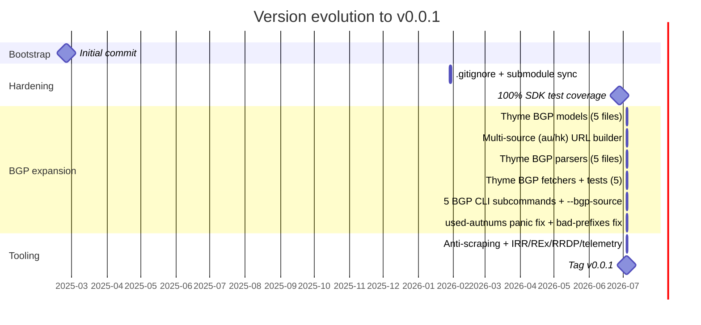

# Changelog

A chronological record of notable changes to the `apnic-skills` project. The list below is derived from the git history and organized according to the [Keep a Changelog](https://keepachangelog.com/en/1.1.0/) convention. Dates follow the commit dates on the `main` branch.

All releases are tagged on the `main` branch. Semantic versioning is followed; until the public API is declared stable, releases remain on the `0.0.x` line.

## [Unreleased]

No tracked changes yet. See the `main` branch for in-flight work.

## [v0.0.1] — 2026-07-04

The first tagged release. It ships the complete APNIC data-service SDK, the companion CLI, the anti-scraping toolkit, chunked-download infrastructure, and 100% test coverage for every SDK API.

### Added

- **Full APNIC data-service SDK** — Type-safe Go bindings for the APNIC public data endpoints (assigned address space, AS reports, BGP routing data, statistics, and more).
- **CLI** — A `cli` command that exposes each SDK call as a subcommand, including the `--bgp-source` flag for multi-region selection.
- **Thyme BGP models** — Struct definitions for 5 additional thyme BGP data files (`c898ac5`).
- **Thyme multi-source support** — `buildThymeURL` accepts a `source` argument so data can be pulled from the `au` or `hk` mirrors (`a0d7eea`).
- **Thyme BGP parsers** — Parsers for the 5 additional thyme BGP data files (`d66aac1`).
- **Thyme BGP fetchers** — 5 BGP data fetchers with unit tests (`4de97b9`).
- **5 BGP CLI subcommands** — The 5 thyme BGP fetchers are reachable from the CLI, switchable with `--bgp-source` (`a354914`).
- **Anti-scraping toolkit** — Stealth-oriented HTTP downloader with header rotation and transport hardening (`fb80f57`).
- **IRR, REx, RRDP, telemetry, and IPv6-assigned data services** — New SDK packages with coverage (`fb80f57`).
- **Chunked-download infrastructure** — Adaptive 2 MiB chunking with bounded concurrency; each per-chunk context is cancelled only after the body has been fully read to avoid the `io.ReadAll` cancel trap (`fb80f57`).
- **DNS reverse-lookup indirection** — `SetLookupAddr` makes the empty-result branch testable; the default resolver is a named function rather than an anonymous closure so coverage is preserved (`fb80f57`).

### Changed

- **Repository hygiene** — Refined `.gitignore` and synchronized submodules (`2fe1585`).
- **BGP naming** — Renamed the internal `BPG` symbol to `BGP` across the package (`1b886ee`).

### Fixed

- **used-autnums slice-bound panic** — Guarded an out-of-range index in the `used-autnums` parser and added regression tests (`1b886ee`).
- **bad-prefixes truncation** — Corrected truncation behaviour for the `bad-prefixes` parser, with tests (`1b886ee`).
- **per-chunk context cancellation** — Moved the `context.Cancel` call to after the response body is read so `io.ReadAll` no longer surfaces `context canceled` (`fb80f57`).

### Removed

- Nothing removed in this release.

## Pre-release history

The commits below pre-date the first tag. They are summarized here for completeness.

| Date | Commit | Summary |
|---|---|---|
| 2025-02-24 | `6788e05` | Initial commit. |
| 2026-01-29 | `2fe1585` | Improve `.gitignore` and sync submodules. |
| 2026-06-28 | `86f30c9` | Achieve 100% test coverage for all APNIC SDK APIs. |
| 2026-07-04 | `ef1db1d` | Migrate CNNIC IPWHOIS / WebWHOIS requirement docs from `go-cnnic`. |

## Version evolution

The diagram below tracks how the project grew from the initial commit to the first tagged release.

## Link references

[Keep a Changelog]: https://keepachangelog.com/en/1.1.0/
[v0.0.1]: https://github.com/cyberspacesec/apnic-skills/releases/tag/v0.0.1
[Unreleased]: https://github.com/cyberspacesec/apnic-skills/compare/v0.0.1...HEAD
