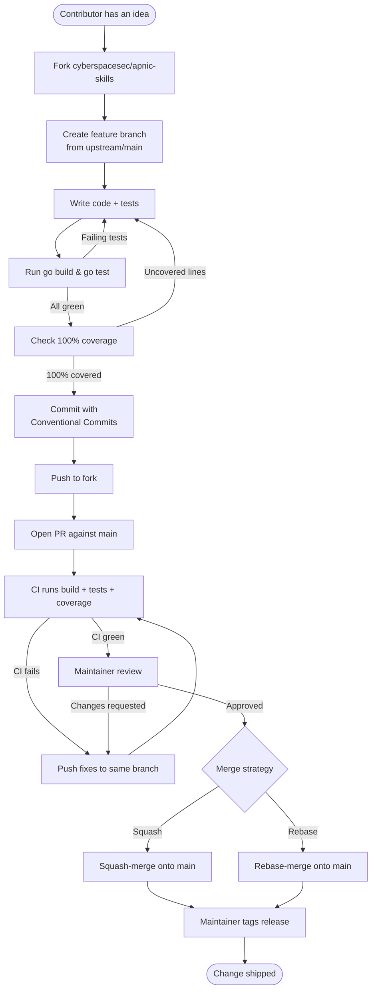

# Contributing

Thanks for your interest in improving `apnic-skills`. This page describes how to set up a development environment, the conventions the project follows, and the path a change takes from idea to merged pull request.

## Development environment

### Prerequisites

- **Go 1.25** or newer.
- **Git**, with a configured GitHub account.
- A fork of [cyberspacesec/apnic-skills](https://github.com/cyberspacesec/apnic-skills) under your own account.

### Get the source

```bash
git clone https://github.com/<your-username>/apnic-skills.git
cd apnic-skills
git remote add upstream https://github.com/cyberspacesec/apnic-skills.git
git fetch upstream
```

### Build and test

```bash
# Build the CLI and the SDK packages
go build ./...

# Run the full test suite
go test ./...

# Check coverage (the project requires 100% SDK statement coverage)
go test -coverprofile=coverage.out ./...
go tool cover -func=coverage.out
```

The CLI uses named helper functions rather than anonymous closures so that coverage stays complete on the command paths; please follow the same pattern when adding new subcommands.

## Commit conventions

The project follows [Conventional Commits](https://www.conventionalcommits.org/). Each commit message should start with a type, an optional scope in parentheses, and a short imperative summary:

```
<type>(<scope>): <summary>
```

| Type | Use it for |
|---|---|
| `feat` | A new feature (a new SDK call, a new CLI subcommand). |
| `fix` | A bug fix. |
| `docs` | Documentation-only changes. |
| `chore` | Tooling, dependency bumps, housekeeping. |
| `refactor` | Code restructuring without behaviour change. |
| `test` | Adding or improving tests. |
| `perf` | A performance improvement. |

Examples drawn from the actual history:

- `feat(bgp): add models for 5 additional thyme BGP data files`
- `feat(cli): expose 5 thyme BGP subcommands + --bgp-source flag`
- `fix(bgp): used-autnums slice-bound panic, rename BPG→BGP, add bad-prefixes truncation + tests`
- `chore: commit prior anti-scraping + coverage work ...`
- `docs: 从 go-cnnic 迁入 CNNIC IPWHOIS / WebWHOIS 需求文档`

Keep the summary line under 72 characters where possible. Reference the issue or PR number in the body when relevant.

## Testing requirements

- **100% statement coverage is required for the SDK.** Run `go tool cover -func` before opening a PR; any uncovered line must be reached by a test or removed.
- **CLI named functions must also stay at 100% coverage.** Prefer named functions over closures for any new CLI glue code — this is the convention that keeps the command paths measurable (see the [DNS lookupAddr note](https://github.com/cyberspacesec/apnic-skills) in the project memory).
- **Chunked-download tests** must cancel per-chunk contexts *after* the body has been fully read; cancelling earlier surfaces `context canceled` from `io.ReadAll`. If you touch the downloader, keep this ordering.
- Every PR should include at least one test that would fail without the change it ships.

## Pull-request process

1. **Fork** the repository and create a feature branch from the latest `main`:
   ```bash
   git checkout -b feat/<short-description> upstream/main
   ```
2. **Commit** your changes using the Conventional Commits format above. Keep commits focused; squash noisy WIP commits before pushing.
3. **Test locally** — `go build ./...`, `go test ./...`, and the coverage check must all pass.
4. **Push** your branch and open a pull request against `main`. Fill in the PR template: what changed, why, and how it was tested.
5. **Review** — address reviewer feedback by pushing additional commits to the same branch. Avoid force-pushes that erase review context unless explicitly requested.
6. **Merge** — once CI is green and a maintainer approves, the PR is squash-merged or rebased onto `main`. Maintainers handle release tagging.

## Contribution flow

The diagram below traces a change from fork to merge.



## Code of conduct

Be respectful and constructive in issues and reviews. Personal attacks, harassment, and discriminatory language are not tolerated and will result in comments being deleted and repeat offenders being blocked from the repository.

## Need help?

- Open a [GitHub issue](https://github.com/cyberspacesec/apnic-skills/issues) for bugs or feature requests.
- For security-sensitive reports, prefer a private vulnerability disclosure over a public issue.
