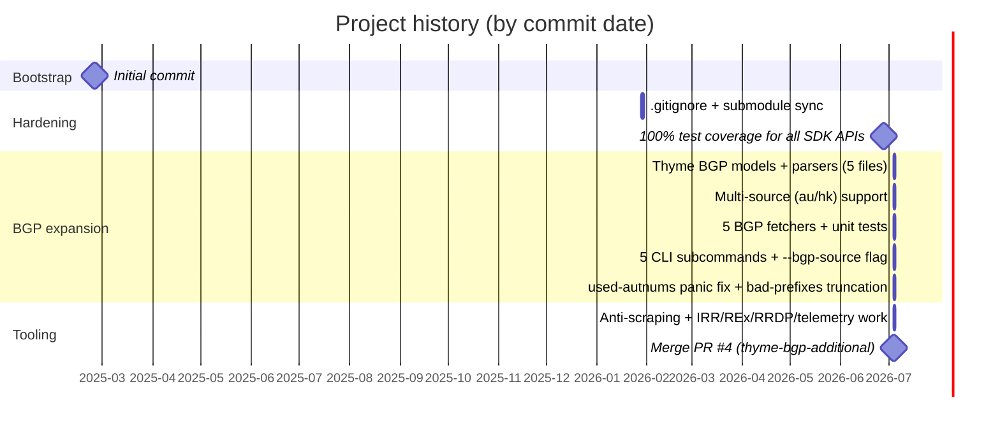

# About

Background information about the `apnic-skills` project: how it has evolved, the terms under which you can use it, and how to contribute.

## Sub-pages

- [Changelog](changelog.md) — Key version changes, drawn from the git history.
- [License](license.md) — The MIT License under which the project is distributed.
- [Contributing](contributing.md) — Development setup, the 100% test-coverage requirement, and the pull-request process.

## Project at a Glance

| | |
|---|---|
| **Language** | Go 1.25 |
| **Module** | `github.com/cyberspacesec/apnic-skills` |
| **License** | MIT |
| **Test coverage** | 100% (SDK statement coverage; CLI named functions 100%) |
| **Repository** | [cyberspacesec/apnic-skills](https://github.com/cyberspacesec/apnic-skills) |
| **Documentation** | [cyberspacesec.github.io/apnic-skills](https://cyberspacesec.github.io/apnic-skills/) |

## Release Timeline

See the [Changelog](changelog.md) for the detailed, dated feature list.
