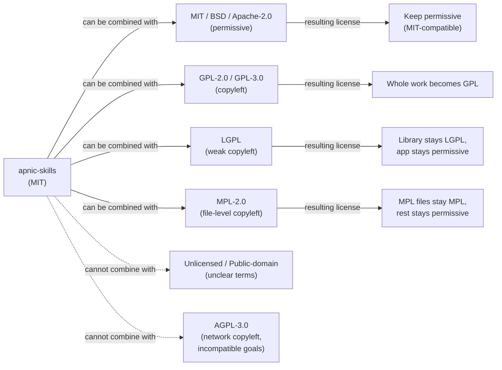

# License

The `apnic-skills` project is distributed under the **MIT License**, one of the most permissive open-source licenses available. The full text is reproduced below from the [`LICENSE`](https://github.com/cyberspacesec/apnic-skills/blob/main/LICENSE) file at the root of the repository.

## What the MIT License lets you do

| Permission | Granted? | Notes |
|---|---|---|
| Commercial use | Yes | Use the SDK and CLI in commercial products. |
| Modification | Yes | Fork, patch, and redistribute freely. |
| Distribution | Yes | Ship the code as part of your own bundle. |
| Sublicensing | Yes | Combine with stricter licenses if needed. |
| Private use | Yes | No disclosure obligation. |
| Trademark use | No | The project name and logos are not licensed. |
| Liability | No | Provided "as is", without warranty of any kind. |
| Patent grant | Implicit only | MIT does not include an explicit patent grant. |

The only condition is that the copyright notice and the permission notice above be included in all copies or substantial portions of the Software.

## License text

```
MIT License

Copyright (c) 2025 Cyberspace Security

Permission is hereby granted, free of charge, to any person obtaining a copy
of this software and associated documentation files (the "Software"), to deal
in the Software without restriction, including without limitation the rights
to use, copy, modify, merge, publish, distribute, sublicense, and/or sell
copies of the Software, and to permit persons to whom the Software is
furnished to do so, subject to the following conditions:

The above copyright notice and this permission notice shall be included in all
copies or substantial portions of the Software.

THE SOFTWARE IS PROVIDED "AS IS", WITHOUT WARRANTY OF ANY KIND, EXPRESS OR
IMPLIED, INCLUDING BUT NOT LIMITED TO THE WARRANTIES OF MERCHANTABILITY,
FITNESS FOR A PARTICULAR PURPOSE AND NONINFRINGEMENT. IN NO EVENT SHALL THE
AUTHORS OR COPYRIGHT HOLDERS BE LIABLE FOR ANY CLAIM, DAMAGES OR OTHER
LIABILITY, WHETHER IN AN ACTION OF CONTRACT, TORT OR OTHERWISE, ARISING FROM,
OUT OF OR IN CONNECTION WITH THE SOFTWARE OR THE USE OR OTHER DEALINGS IN THE
SOFTWARE.
```

## Compatibility

Because the MIT License is permissive and GPL-compatible, `apnic-skills` can be combined with a wide range of other open-source work. The diagram below summarizes the common pairings.



## Third-party dependencies

The Go module graph is recorded in the repository's `go.sum`. Each transitive dependency carries its own license; none of the dependencies currently in use impose terms stricter than the MIT License on the consuming project.

## Attribution

When redistributing `apnic-skills` — in source or binary form, in whole or in part — retain the copyright line (`Copyright (c) 2025 Cyberspace Security`) and the permission notice shown above. A pointer back to the upstream repository is appreciated but not required.
