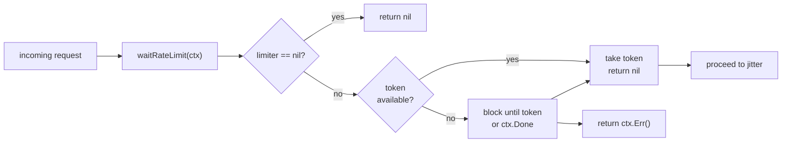
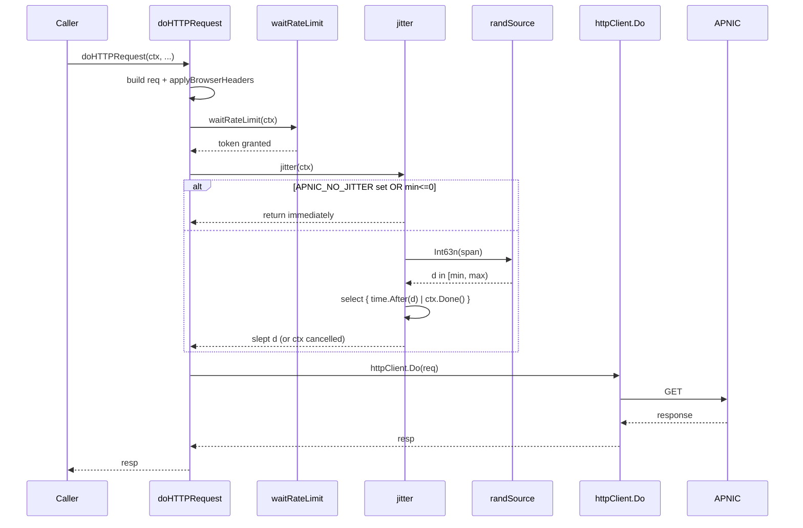
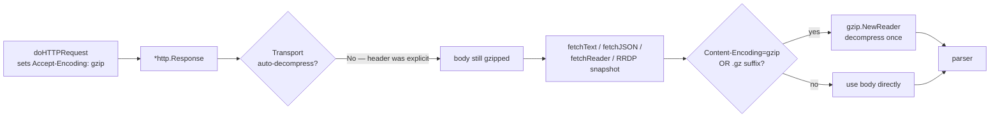

# Anti-Scraping

APNIC's FTP and web services throttle and, in places, shape traffic that does not look like a browser. The SDK responds with a three-part anti-scraping strategy applied inside `doHTTPRequest`: browser-mimicry request headers, a global token-bucket rate limiter, and per-request random jitter. All three are on by default and configurable via functional options.

Source: [`stealth.go`](https://github.com/cyberspacesec/apnic-skills/blob/main/stealth.go).

## Where Anti-Scraping Sits

Anti-scraping is not a separate layer the caller invokes; it is woven into the single HTTP outlet. The diagram shows its position in the request chain.

```mermaid
graph LR
    Caller["Fetch* / chunk worker"] --> DoReq["doHTTPRequest"]
    DoReq --> Build["http.NewRequestWithContext"]
    Build --> Headers["applyBrowserHeaders<br/>(or UA+Accept if stealth off)"]
    Headers --> Extra["inject extra headers<br/>(Range, etc.)"]
    Extra --> Rate["waitRateLimit<br/>token bucket"]
    Rate --> Jit["jitter<br/>200–800ms"]
    Jit --> Do["httpClient.Do(req)"]
    Do --> Srv["APNIC server"]

    style Headers fill:#fde7c2
    style Rate fill:#cfe8d5
    style Jit fill:#cfe8d5
```



Because this runs inside `doHTTPRequest`, **every** outbound request — the Range probe, each parallel chunk, RDAP, REx, RRDP, plain `fetchText` — carries the browser profile and observes the rate limit. There is no code path that calls `httpClient.Do` directly.

## Browser-Mimicry Headers

`applyBrowserHeaders(req, accept)` sets a complete browser header set when stealth is enabled, or a minimal `User-Agent` + `Accept` pair when it is disabled (the pre-stealth behavior, kept for backward compatibility).

The `accept` argument is caller-supplied and content-appropriate: `"text/plain"` for stats, `"application/rdap+json, application/json"` for RDAP, `"application/json"` for REx, `"application/xml, text/xml"` for RRDP snapshots, `"text/plain, */*"` for the Range probe.

Headers injected when stealth is **on**:

| Header | Value | Purpose |
|--------|-------|---------|
| `User-Agent` | `defaultBrowserUA` (Chrome 124 on Windows) or `WithBrowserUserAgent` override | Avoid the SDK UA string `"APNIC-Go-SDK/1.0 (security)"`. |
| `Accept` | caller-supplied | Keep content negotiation correct. |
| `Accept-Language` | `en-US,en;q=0.9` | Browser-typical language preference. |
| `Accept-Encoding` | `gzip` | See [gzip handling](#gzip-content-encoding-handling) below. |
| `Sec-Fetch-Site` | `none` | Top-level navigation. |
| `Sec-Fetch-Mode` | `navigate` | Browser navigation request. |
| `Sec-Fetch-Dest` | `document` | Document destination. |
| `Sec-Fetch-User` | `?1` | User-initiated. |
| `Sec-Ch-Ua` | `"Chromium";v="124", "Not.A/Brand";v="99"` | Client Hints brand list. |
| `Sec-Ch-Ua-Mobile` | `?0` | Desktop. |
| `Sec-Ch-Ua-Platform` | `"Windows"` | Platform hint. |
| `Upgrade-Insecure-Requests` | `1` | HSTS-style upgrade signal. |
| `Connection` | `keep-alive` | Reuse connections. |

The default browser UA is:

```
Mozilla/5.0 (Windows NT 10.0; Win64; x64) AppleWebKit/537.36 (KHTML, like Gecko) Chrome/124.0.0.0 Safari/537.36
```

At the header level, this combination is indistinguishable from a real Chrome navigation request. The `accept` value is the only content-specific tell, and it is legitimate (a browser would send exactly these for the respective content types).

## Token-Bucket Rate Limiting

`WithRateLimit(perSecond)` installs a `rateLimiter` wrapping `golang.org/x/time/rate.Limiter` with the given rate and a burst of `1`. `waitRateLimit(ctx)` blocks until a token is available or the context is cancelled. A nil limiter (the default) makes the call a no-op.



The burst of `1` means the limiter enforces a steady cadence rather than allowing a startup burst. To allow concurrency under the rate limit (e.g. 4 parallel chunk downloads at 2 req/s), set `perSecond` high enough to admit the worker pool — the limiter is a global ceiling, not a per-connection one.

## Request Jitter

`jitter(ctx)` adds a random delay in `[jitterMin, jitterMax)` before each request when stealth is on. The default range is `200ms`–`800ms`. The delay is drawn from a per-Client `randSource` (a `*rand.Rand` seeded with `1` at construction) guarded by a mutex, so jitter is deterministic within a single Client instance and does not perturb the global `math/rand` source.

Two escape hatches:

- `WithJitter(min, max)` — set a custom range. If `max < min`, the values are silently swapped. A zero or negative `min` disables jitter entirely.
- `APNIC_NO_JITTER` environment variable — if set to any non-empty value, jitter is skipped unconditionally. This is a testing affordance: the test suite sets it so tests run fast without each test opting out. Production callers never set it.

The jitter sleep is context-aware: a long jitter returns immediately if `ctx` is cancelled, so a cancelled context is never blocked by a pending jitter.



## gzip Content-Encoding Handling

The `Accept-Encoding: gzip` header set by `applyBrowserHeaders` is **explicit**, which triggers a Go `http.Transport` subtlety: when the caller sets `Accept-Encoding` themselves, Transport leaves the response untouched (it does **not** auto-decompress). The SDK handles decompression itself in each fetch helper, exactly once, at the entry point. This avoids double-decompression and lets the `.gz` URL-suffix path (APNIC archives historical files as `*.gz` with no `Content-Encoding` header) share the same decompression branch.

Three helpers do explicit decompression:

| Helper | Decompression trigger | Notes |
|--------|----------------------|-------|
| `fetchText` | `Content-Encoding: gzip` **or** URL ends in `.gz` | Single GET, full buffer. |
| `fetchJSON` (REx) | `Content-Encoding: gzip` | REx uses transport gzip, not `.gz` URLs. |
| `fetchReader` / `singleStream` / `downloadChunked` | `Content-Encoding: gzip` **or** URL ends in `.gz` | Streaming `gzip.Reader` over the merged pipe or raw body. |
| RRDP `FetchRRDPSnapshot` | `Content-Encoding: gzip` | Streaming over `xml.Decoder`. |



There is no double-decompression risk: the decision is made once at the entry of each helper, and the `.gz`-suffix and `Content-Encoding` conditions are checked together with an OR.

## Interaction with Chunked Download

Each parallel chunk request is a separate call to `doHTTPRequest`, so each carries the full browser header set, waits on the global rate limiter, and jitters independently. This means:

- The rate limiter is a **global** ceiling across all in-flight chunks. A 4-worker pool with `WithRateLimit(2.0)` cannot exceed 2 req/s combined.
- Jitter applies per chunk, so the 4 workers do not synchronize their request timing — they spread out naturally.

To get the full parallel throughput that chunking is designed for, leave the rate limiter off (the default) or set it generously. See [Chunked Download](chunked-download.md) for the worker model.

## Configuration Summary

```go
client := apnic.NewClient(
    apnic.WithStealth(true),                                              // default
    apnic.WithBrowserUserAgent("Mozilla/5.0 (Macintosh; ...) Chrome/..."), // override UA
    apnic.WithJitter(100*time.Millisecond, 500*time.Millisecond),          // custom range
    apnic.WithRateLimit(2.0),                                              // 2 req/s, burst 1
)
```

Disabling stealth (`WithStealth(false)`) reverts to the minimal `User-Agent` + `Accept` header set and turns off jitter — useful for trusted, rate-unlimited environments or for matching the pre-stealth request profile.

## Next

- [HTTP Client](http-client.md) — the `Client` struct and `doHTTPRequest` that hosts this middleware.
- [Chunked Download](chunked-download.md) — how each chunk inherits the anti-scraping profile.
