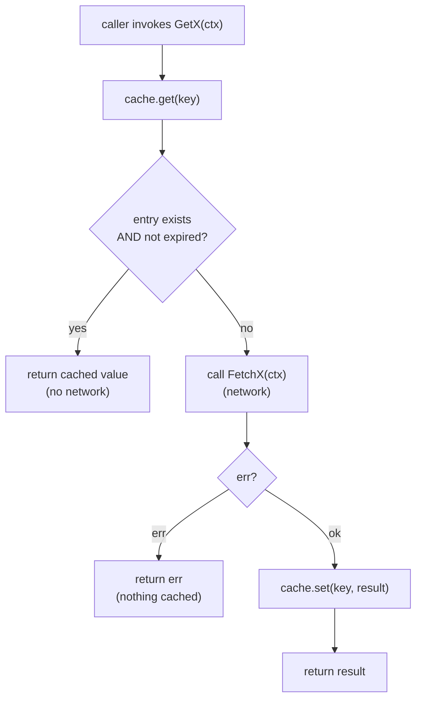
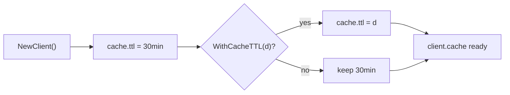
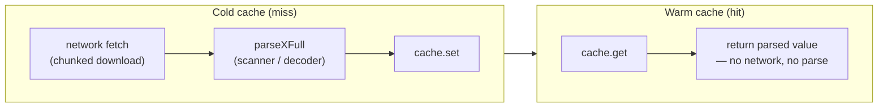

# Caching

The SDK ships with a small, in-process, TTL-based cache. It is not a requirement — every `Fetch*` method bypasses it — but the `Get*` methods wrap their `Fetch*` counterpart with a cache lookup so repeated calls within the TTL window return instantly without re-hitting APNIC.

Source: [`internal/transport/cache.go`](https://github.com/cyberspacesec/apnic-skills/blob/main/internal/transport/cache.go).

## The cache struct

```mermaid
classDiagram
    class cache {
        -mu sync.RWMutex
        -ttl time.Duration
        -data map[string]cacheEntry
        +get(key) (interface{}, bool)
        +set(key, data)
    }
    class cacheEntry {
        +data interface{}
        +lastUpdated time.Time
    }
    class Client {
        +cache *cache
    }
    Client --> cache : owns
    cache --> cacheEntry : stores by key
```

`cache` is a `sync.RWMutex`-guarded `map[string]cacheEntry`. Each entry holds the cached value (`interface{}`) and its `lastUpdated` timestamp. `get` takes a read lock; `set` takes a write lock. The TTL is stored on the cache, not per-key, so all keys share the same lifetime.

`get` returns `(data, true)` only if the key exists **and** `time.Since(entry.lastUpdated) < ttl`. An expired entry is treated as a miss (it is not proactively evicted; it is overwritten on the next `set`).

## Get* vs Fetch*

This is the central distinction in the SDK's public API:

| Method family | Cache behavior | When to use |
|---------------|----------------|-------------|
| `Get*` (e.g. `GetDelegatedEntries`) | Checks cache; on hit returns immediately. On miss, calls the `Fetch*` counterpart, caches the result, and returns it. | Repeated reads of slowly-changing data within a session. |
| `Fetch*` (e.g. `FetchDelegatedEntries`) | Always hits the network. Never reads from or writes to the cache. | When freshness matters more than latency. |

`Fetch*` methods are the building blocks; `Get*` methods are the cached convenience wrappers. The cache lookup and population is the only thing `Get*` adds.



Note the failure path: if `Fetch*` errors, nothing is cached, so the next `Get*` call retries the network. There is no negative caching.

## Cache Keys

Keys are package-level string constants, one per data type:

| Key constant | Value | Method |
|--------------|-------|--------|
| `cacheKeyDelegated` | `"delegated"` | `GetDelegatedEntries` |
| `cacheKeyExtended` | `"extended"` | `GetExtendedEntries` |
| `cacheKeyAssigned` | `"assigned"` | `GetAssignedEntries` |
| `cacheKeyIPv6Assigned` | `"ipv6-assigned"` | `GetIPv6AssignedEntries` |
| `cacheKeyLegacy` | `"legacy"` | `GetLegacyEntries` |
| `cacheKeyTransfers` | `"transfers"` | `GetTransfers` |
| `cacheKeyChanges` | `"changes"` | `GetChanges` |
| `cacheKeyIRR(objType)` | `"irr:" + objType` | `GetIRRDatabase` |

IRR is the only keyed-by-parameter cache: each object type (`inetnum`, `aut-num`, `route`, ...) gets its own entry, so `GetIRRDatabase(ctx, "inetnum")` and `GetIRRDatabase(ctx, "route")` do not collide.

Data types **without** a `Get*` variant — RDAP lookups, REx, RRDP, BGP thyme files, whois — are always fetched fresh. This is deliberate: those are point-in-time or query-parameterized lookups where staleness is rarely acceptable and caching by parameter would balloon memory.

## TTL Control

`WithCacheTTL(ttl)` sets the cache's TTL. The default is `30 * time.Minute`.

| Value | Effect |
|-------|--------|
| `30 * time.Minute` (default) | Entries live 30 minutes. |
| Any positive duration | Entries live that long. |
| `0` | Entries always expire (since `time.Since(lastUpdated) >= 0` is always true), so `Get*` always misses and behaves like `Fetch*`. This effectively disables caching without removing the wrapper. |

There is no negative TTL or "disable" flag; `0` is the disable sentinel.



## Concurrency

The `sync.RWMutex` makes the cache safe for concurrent use across goroutines. `get` uses `RLock` (multiple concurrent readers); `set` uses `Lock` (exclusive). The common case — many `Get*` reads after a single populate — runs fully parallel under the read lock.

Because the cache is per-`Client` and the SDK is typically used with one shared `Client`, the cache is effectively a process-wide singleton for that client's data. Two goroutines calling `GetDelegatedEntries` simultaneously on a cold cache will both miss and both fetch; the second `set` simply overwrites the first. If you want to avoid the duplicate fetch, use a singleflight wrapper at the call site — the SDK does not do it internally.

## What Gets Cached

The cache stores the **parsed** result, not the raw bytes. `GetDelegatedEntries` caches `[]DelegatedEntry`; `GetTransfers` caches `*TransfersResult`; `GetIRRDatabase` caches `*IRRDatabase`. This means a cache hit skips not only the network but also the parser — important for large files where parsing is a meaningful fraction of total latency.



## Interaction with Chunked Download

Because `Get*` calls `Fetch*` which calls `fetchReader` which may chunk, a cold-cache `Get*` for a large file pays the full chunked-download + parse cost once, then serves subsequent calls from memory for the TTL window. The chunked-download configuration (`WithMaxConcurrentDownloads`, etc.) affects only the cold path; warm hits are pure map lookups.

## Example

```go
client := apnic.NewClient(
    apnic.WithCacheTTL(10 * time.Minute), // default 30min
)

// First call: network + parse, then cached.
entries, err := client.GetDelegatedEntries(ctx)

// Within 10 minutes: instant cache hit, no network.
again, err := client.GetDelegatedEntries(ctx)

// Bypass the cache for a guaranteed-fresh read.
fresh, err := client.FetchDelegatedEntries(ctx)
```

## Next

- [Parser Design](parser-design.md) — what runs on the cold path between the network fetch and the cache `set`.
- [HTTP Client](http-client.md) — the transport beneath every `Fetch*`.
