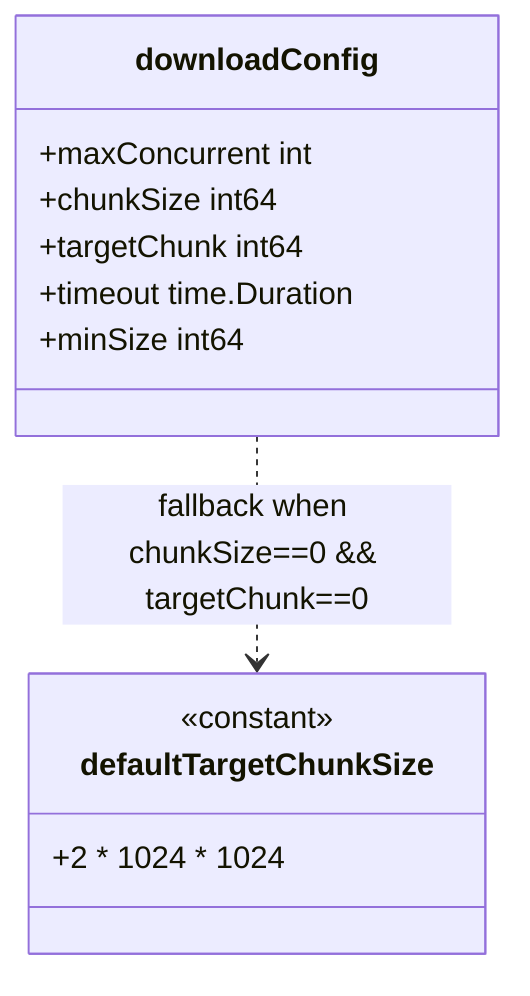
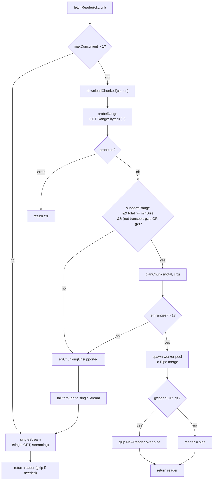
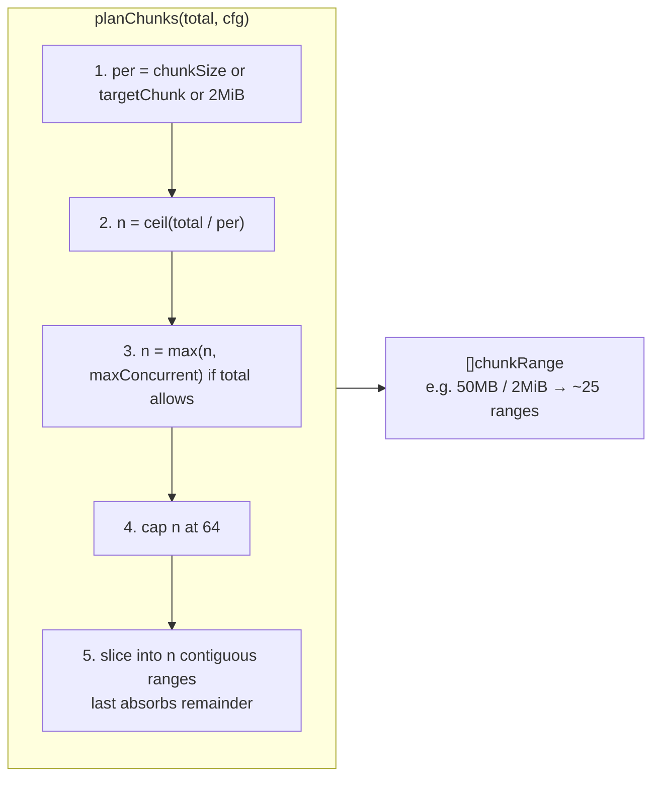
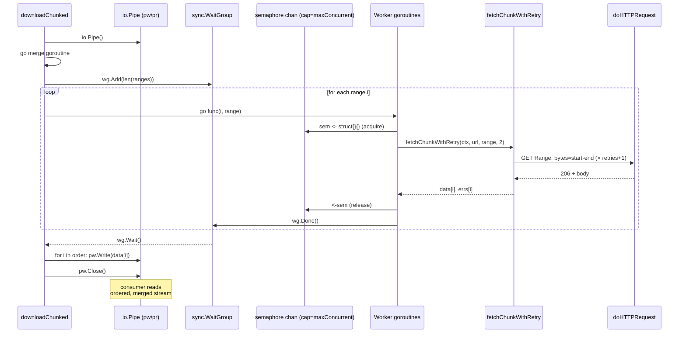
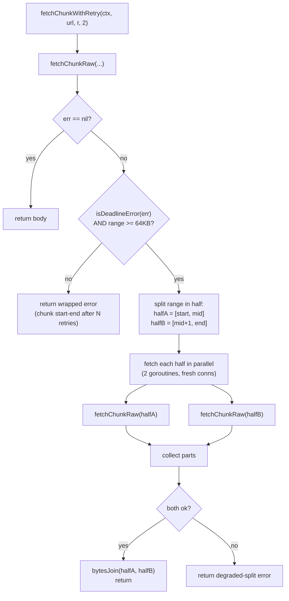
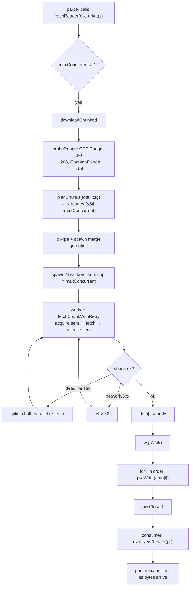
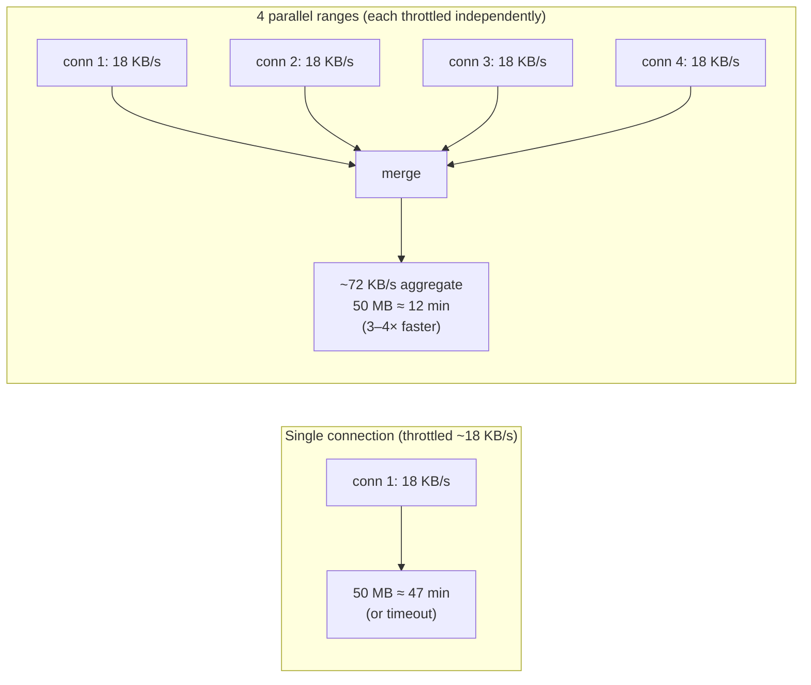

# Chunked Download

APNIC's FTP server throttles large files per-connection to roughly 8–18 KB/s. A multi-megabyte file — an IRR dump, a dated delegated-stats archive, the RRDP snapshot — downloaded over a single connection routinely exceeds the client timeout. The SDK solves this by splitting the file into parallel HTTP `Range` requests: each connection is throttled independently, so N parallel ranges multiply throughput.

Source: [`internal/transport/downloader.go`](https://github.com/cyberspacesec/apnic-skills/blob/main/internal/transport/downloader.go).

This is the single most consequential optimization in the SDK. In practice it turns a multi-minute (or timeout-failing) delegated-stats fetch into one that completes in seconds, a roughly **3–4× throughput improvement** on APNIC's typical per-connection throttle.

## downloadConfig



| Field | Default | Meaning |
|-------|---------|---------|
| `maxConcurrent` | `4` | In-flight worker cap (hard-capped at 16 by `effectiveConcurrency`). `<= 1` disables chunking entirely and falls back to a single connection. |
| `chunkSize` | `0` | Explicit bytes per chunk. `0` means "use `targetChunk`". |
| `targetChunk` | `defaultTargetChunkSize` (2 MiB) | Default chunk size when `chunkSize == 0`. |
| `timeout` | `0` | Per-chunk request timeout. `0` inherits `httpClient.Timeout`. |
| `minSize` | `512 * 1024` (512 KB) | Files smaller than this skip chunking — overhead isn't worth it. |

Crucially, `maxConcurrent` caps **concurrency**, not the **number of chunks**. A 50 MB IRR dump split into 2 MiB chunks yields ~25 ranges that stream through the worker pool, keeping each individual request small enough to finish well inside the per-chunk timeout under APNIC's throttle. At APNIC's ~22 KB/s per-connection throttle, 2 MiB takes ~90 s — comfortably under the recommended 5-minute per-chunk timeout.

Options that configure this: `WithMaxConcurrentDownloads(n)`, `WithChunkSize(bytes)`, `WithDownloadTimeout(d)`.

## Entry Point: fetchReader

`fetchReader(ctx, url)` is the streaming entry point parsers call. It decides between chunked and single-stream:



The `errChunkingUnsupported` sentinel is the internal signal that the server cannot be safely chunked (no `Accept-Ranges`, returned `200` to a `Range` request, or uses transport-layer gzip on a non-`.gz` URL). On that sentinel, `fetchReader` falls through to `singleStream` rather than returning an error — callers see a working download either way.

### Why transport-gzip defeats chunking

A `Range` request cuts bytes at arbitrary offsets. If the bytes on the wire are transport-layer gzip (the server applies `Content-Encoding: gzip` to a non-`.gz` URL), cutting the gzip stream mid-byte produces corrupted, undecodable fragments. Only `.gz` URLs are safe to chunk: there the gzip container is the *content*, not a transport encoding, so each range fetches a valid slice of the file that the consumer reassembles before decompressing. `downloadChunked` therefore refuses transport-gzip on non-`.gz` URLs.

## probeRange

```go
func (c *Client) probeRange(ctx context.Context, url string) (total int64, supportsRange bool, gzipped bool, err error)
```

`probeRange` issues a single `GET` with `Range: bytes=0-0` (asking for 1 byte) through `doHTTPRequest` — so it carries the full browser header set, rate limit, and jitter. From the response it learns three things:

| Signal | Source | Meaning |
|--------|--------|---------|
| `supportsRange` | `StatusCode == 206 (Partial Content)` | Server honors `Range`. A `200` means the server ignored the header — chunking is unsafe. |
| `total` | `Content-Range: bytes 0-0/TOTAL` (on 206) or `Content-Length` (on 200) | Total file size, for chunk planning. |
| `gzipped` | `Content-Encoding: gzip` **or** URL ends in `.gz` | Whether the merged stream needs a `gzip.Reader` wrapper. |

The 1-byte probe body is drained (capped at 64 bytes) so the connection can be reused by the transport pool. Non-206/200 statuses surface as a `range probe status: %d` error.

## planChunks

`planChunks(total, cfg)` splits `total` bytes into contiguous inclusive `[start, end]` ranges:

1. Pick `per` = `chunkSize` if `> 0`, else `targetChunk`, else `defaultTargetChunkSize`.
2. `n = ceil(total / per)` — the range count.
3. If `maxConcurrent > 1` and `n < maxConcurrent` and `total >= maxConcurrent`, raise `n` to `maxConcurrent` so the worker pool is not starved (at least as many ranges as workers, when the file is large enough).
4. Cap `n` at **64** — a hard ceiling on range count.
5. Compute `base = total / n`, assign `start = i*base`, `end = start + base - 1`, and let the last range absorb the remainder (`end = total - 1`).

The `n >= maxConcurrent` floor is the key to utilizing the worker pool: without it, a small file split into 2 ranges would leave 2 of 4 workers idle. With it, `planChunks` produces at least `maxConcurrent` ranges (when the file allows), so workers stay busy.



## The Concurrent Worker Model

`downloadChunked` launches one goroutine per range, but caps in-flight work with a buffered-channel semaphore of size `effectiveConcurrency(len(ranges))` — the minimum of `maxConcurrent` (capped at 16), `len(ranges)`, and 1. Each goroutine acquires a semaphore slot before fetching and releases it on completion, so ranges queue up and drain through the worker pool as earlier ones finish.

Results are collected positionally: `data[i]` and `errs[i]` are indexed by the range's original position, not completion order. After `wg.Wait()`, the main goroutine writes the chunks to an `io.Pipe` **in order** (range 0, then 1, ...), so the consumer reads a correctly-ordered stream regardless of which worker finished first. If any chunk failed, the pipe is closed with that error before any write.



### Why io.Pipe

`io.Pipe` gives the consumer a streaming `io.Reader` that yields bytes as soon as the first chunk is fetched, without waiting for the whole download. The parser (e.g. `parseDelegatedFull`) can begin scanning lines while later chunks are still in flight. Memory stays bounded: the pipe buffers only what the consumer hasn't read yet, not the whole file.

### gzipClosingReader

When the file is gzipped, `downloadChunked` wraps the pipe reader in a `gzipClosingReader` so that `Close()` on the gzip reader also closes the underlying pipe reader. This ensures the merge goroutine is reaped when the consumer stops reading early (e.g. a parser that returns partway), preventing a goroutine leak.

## fetchChunkWithRetry — Retry and Slow-Chunk Splitting

Each chunk is fetched by `fetchChunkWithRetry(ctx, url, r, retries)`, which delegates to `fetchChunkRaw` and then, on a deadline/stall error, degrades to splitting the range in half.

### Retry policy (`fetchChunkRaw`)

`fetchChunkRaw` retries up to `retries` times (the SDK passes `2`) on transient errors:

- Network errors from `doHTTPRequest` → retry.
- `5xx` server errors → retry.
- `4xx` (non-5xx) client errors → **do not retry**, return immediately (the request is wrong, not transient).
- `200` to a `Range` request (server ignored Range) → return `errChunkingUnsupported` immediately; chunking is unsafe.

Each attempt gets its own per-chunk timeout context (`downloadCfg.timeout` if set), and — critically — the context cancel is deferred until **after** the body is fully read. Calling `cancel()` immediately after `Do` returns would abort the in-flight `io.ReadAll` with `context canceled`, because the response body is streamed lazily. This is the per-chunk context-cancel trap: cancel must fire only after `io.ReadAll` completes.

```mermaid
sequenceDiagram
    participant W as Worker
    participant FCR as fetchChunkRaw
    participant Do as doHTTPRequest
    participant Srv as APNIC

    W->>FCR: fetchChunkRaw(ctx, url, range, retries=2)
    loop attempt 0..retries
        FCR->>FCR: chunkCtx, cancel = WithTimeout(ctx, cfg.timeout)
        FCR->>Do: GET Range: bytes=start-end
        Do->>Srv: request
        Srv-->>Do: resp
        Do-->>FCR: resp, err
        alt err != nil
            FCR->>FCR: cancel() (err path)
            FCR->>FCR: lastErr = err; continue
        else status 200 (Range ignored)
            FCR->>FCR: cancel(); return errChunkingUnsupported
        else status not 206
            alt 5xx
                FCR->>FCR: cancel(); lastErr; continue
            else 4xx
                FCR->>FCR: cancel(); return lastErr (no retry)
            end
        else 206
            FCR->>FCR: io.ReadAll(resp.Body)
            FCR->>FCR: resp.Body.Close()
            FCR->>FCR: cancel() AFTER body read
            FCR-->>W: body, nil
        end
    end
    FCR-->>W: nil, lastErr
```

### Slow-chunk splitting (degraded mode)

If `fetchChunkRaw` returns a deadline error (a stalled connection — `context deadline exceeded`, `Client.Timeout`, or `context.DeadlineExceeded`), `fetchChunkWithRetry` does **not** give up. Instead it splits the failed range in half and fetches each half concurrently on **fresh connections**, sidestepping the single stalled TCP connection:



The 64 KB floor prevents infinite halving: a range smaller than 64 KB is not split again. The split is single-level (each half is fetched via `fetchChunkRaw`, not recursively via `fetchChunkWithRetry`), keeping the recovery bounded. This recovers from the single most common chunk failure — one stuck connection out of N — without abandoning the whole download.

## Single-Connection Fallback

`singleStream(ctx, url)` is the path taken when chunking is disabled (`maxConcurrent <= 1`) or unsupported. It does a single `GET`, returns a streaming `io.Reader`, and wraps it in a `gzip.Reader` when the response is gzipped (by `Content-Encoding` or `.gz` suffix). Unlike `fetchText`, it does **not** buffer the whole body into a string — the parser consumes the stream directly.

## Full Flow

Putting it all together, here is the complete chunked-download path for a large `.gz` IRR dump:



## Throughput: Chunked vs. Single-Connection



The exact multiplier depends on APNIC's per-connection throttle at fetch time and on network RTT; the SDK defaults (`maxConcurrent=4`, `targetChunk=2MiB`) are tuned so each chunk finishes inside the recommended 5-minute per-chunk timeout at ~22 KB/s throttle, the observed typical rate.

## Next

- [HTTP Client](http-client.md) — `doHTTPRequest`, which every chunk request flows through.
- [Anti-Scraping](anti-scraping.md) — the headers, rate limit, and jitter applied to each chunk.
- [Caching](caching.md) — how `Get*` methods cache the parsed result of a chunked download.
