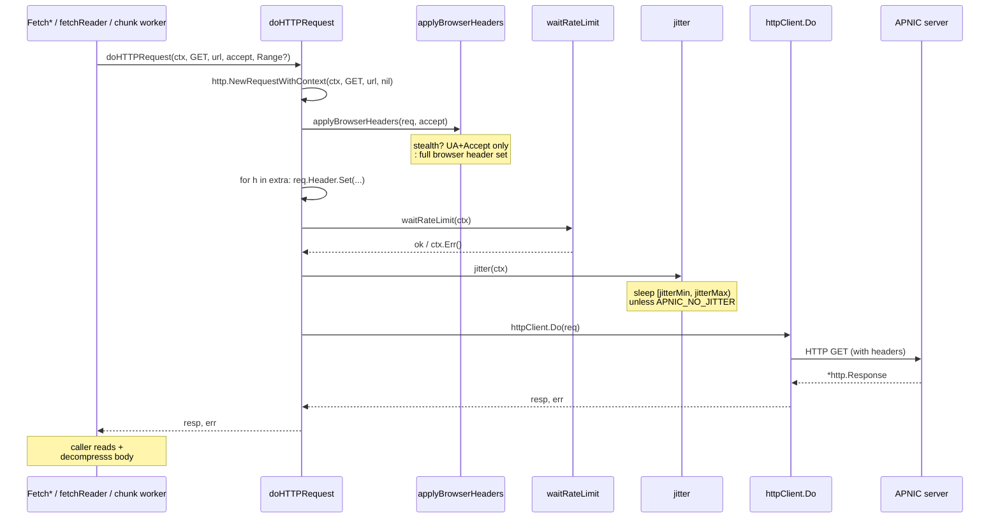
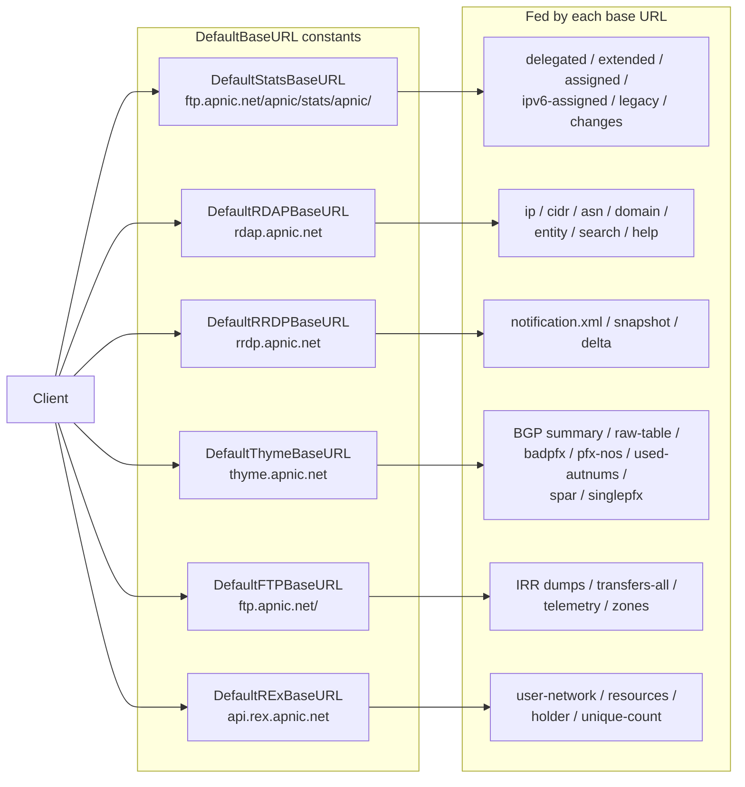

# HTTP Client

The `Client` is the single entry point for every APNIC service. It owns all configuration (base URLs, timeouts, stealth state, download tunables) and exposes one HTTP execution outlet — `doHTTPRequest` — that every fetch helper and every chunk request must go through.

Source: [`internal/transport/client.go`](https://github.com/cyberspacesec/apnic-skills/blob/main/internal/transport/client.go), [`internal/transport/stealth.go`](https://github.com/cyberspacesec/apnic-skills/blob/main/internal/transport/stealth.go).

## Client Structure

```mermaid
classDiagram
    class Client {
        -httpClient *http.Client
        -whoisServer string
        -whoisTimeout time.Duration
        -rdapBaseURL string
        -statsBaseURL string
        -ftpBaseURL string
        -rrdpBaseURL string
        -thymeBaseURL string
        -thymeSource string
        -rexBaseURL string
        -rdapDate time.Time
        -cache *cache
        -userAgent string
        -stealth bool
        -browserUA string
        -jitterMin time.Duration
        -jitterMax time.Duration
        -rateLimiter *rateLimiter
        -rand *randSource
        -downloadCfg downloadConfig
        -dialWhois dialFunc
        +NewClient(opts ...Option) *Client
        +doHTTPRequest(ctx, method, url, accept, extra ...http.Header) (*http.Response, error)
        +applyBrowserHeaders(req, accept)
        +jitter(ctx)
        +waitRateLimit(ctx) error
        +fetchReader(ctx, url) (io.Reader, error)
        +fetchText(ctx, url) (string, error)
        +fetchTextStr(ctx, url) (string, error)
        +fetchJSON(ctx, url, accept, out) error
    }

    class cache {
        -mu sync.RWMutex
        -ttl time.Duration
        -data map[string]cacheEntry
        +get(key) (interface{}, bool)
        +set(key, data)
    }

    class rateLimiter {
        -limiter *rate.Limiter
        +wait(ctx) error
    }

    class randSource {
        -mu sync.Mutex
        -r *rand.Rand
        +Int63n(n) int64
    }

    class downloadConfig {
        +maxConcurrent int
        +chunkSize int64
        +targetChunk int64
        +timeout time.Duration
        +minSize int64
    }

    Client --> cache : owns
    Client --> rateLimiter : owns (optional)
    Client --> randSource : owns
    Client --> downloadConfig : embeds
```

The fields cluster into four groups:

1. **Transport** — `httpClient`, `userAgent`, `dialWhois` (a test hook for whois dialing).
2. **Service base URLs** — one per APNIC data outlet. Defaults are constants: `DefaultStatsBaseURL`, `DefaultRDAPBaseURL`, `DefaultRRDPBaseURL`, `DefaultThymeBaseURL`, `DefaultFTPBaseURL`, `DefaultRExBaseURL`. `thymeSource` (`"current"` / `"au"` / `"hk"`) selects the BGP analysis vantage point.
3. **Anti-scraping** — `stealth`, `browserUA`, `jitterMin`, `jitterMax`, `rateLimiter`, `rand`. These are documented in [Anti-Scraping](anti-scraping.md).
4. **Chunked download** — `downloadCfg` (`maxConcurrent`, `chunkSize`, `targetChunk`, `timeout`, `minSize`), documented in [Chunked Download](chunked-download.md).

`rdapDate` is a client-wide point-in-time for RDAP historical (`history_version_0`) queries; a zero value means live data. Per-call `*At` methods override it.

## The Functional Option Pattern

`NewClient` constructs a fully-defaulted `Client`, then applies each `Option` in order. `Option` is a function type that mutates the receiver:

```go
type Option func(*Client)
```

This pattern keeps construction readable, extensible without API breaks, and zero-config for the common case (`apnic.NewClient()`). The full option surface:

| Option | Default | Effect |
|--------|---------|--------|
| `WithHTTPClient(hc)` | `&http.Client{Timeout: 15s}` | Replace the underlying HTTP client. |
| `WithCacheTTL(ttl)` | `30 * time.Minute` | Set cache TTL; `0` disables caching (entries always expire). |
| `WithUserAgent(ua)` | `"APNIC-Go-SDK/1.0 (security)"` | UA used when stealth is **off**. |
| `WithRDAPBaseURL(url)` | `https://rdap.apnic.net` | RDAP base URL. |
| `WithStatsBaseURL(url)` | `https://ftp.apnic.net/apnic/stats/apnic/` | Stats/FTP base URL. |
| `WithWhoisServer(server)` | `whois.apnic.net:43` | Whois server address. |
| `WithWhoisTimeout(t)` | `10s` | Whois connection timeout. |
| `WithRDAPDate(t)` | zero (live) | Client-wide RDAP point-in-time. |
| `WithStealth(enable)` | `true` | Toggle browser-mimicry headers + jitter. |
| `WithBrowserUserAgent(ua)` | Chrome 124 UA | UA used when stealth is **on**. |
| `WithJitter(min, max)` | `200ms`, `800ms` | Jitter range; swaps if `max < min`; `min <= 0` disables. |
| `WithRateLimit(perSecond)` | disabled | Token-bucket rate (burst 1); `<= 0` disables. |
| `WithRRDPBaseURL(url)` | `https://rrdp.apnic.net` | RPKI RRDP base. |
| `WithThymeBaseURL(url)` | `https://thyme.apnic.net` | BGP analysis base. |
| `WithThymeSource(source)` | `"current"` | `"current"` / `"au"` / `"hk"`. |
| `WithFTPBaseURL(url)` | `https://ftp.apnic.net/` | FTP root for IRR/transfers/telemetry. |
| `WithRExBaseURL(url)` | `https://api.rex.apnic.net` | REx cross-RIR API base. |
| `WithMaxConcurrentDownloads(n)` | `4` | Parallel Range requests; `<= 1` disables chunking. |
| `WithChunkSize(bytes)` | `0` (use `targetChunk`) | Explicit chunk size; `0` splits evenly. |
| `WithDownloadTimeout(d)` | `0` (inherit `httpClient`) | Per-chunk request timeout. |

Options that take a URL silently ignore empty strings, so a caller can pass a partial override without resetting others to zero values.

## doHTTPRequest — the Unified Outlet

`doHTTPRequest` is the only place in the SDK that calls `httpClient.Do`. It builds the request, applies browser headers, injects caller-supplied extra headers, waits on the rate limiter, jitters, and performs the request. It deliberately does **not** read or decompress the body — each caller (`fetchText`, `doRDAPRequestAt`, `fetchJSON`, the chunk fetcher) owns its own body handling.

```go
func (c *Client) doHTTPRequest(ctx context.Context, method, url, accept string,
    extra ...http.Header) (*http.Response, error)
```

The variadic `extra ...http.Header` is the extension point used by the chunked-download layer to inject `Range: bytes=start-end` (and by the probe to inject `Range: bytes=0-0`). Extra headers are applied **after** `applyBrowserHeaders`, so a caller can add request-specific headers without losing the stealth profile.

### Request Lifecycle



### Why one outlet matters

Because every HTTP path — the Range probe, every parallel chunk, the single-stream fallback, RDAP, REx, RRDP snapshot, and plain `fetchText` — goes through `doHTTPRequest`, the anti-scraping policy is applied uniformly and cannot be accidentally bypassed. A new fetch helper that calls `httpClient.Do` directly would skip stealth, rate limiting, and jitter; the single-outlet design makes that mistake impossible.

## Fetch Helpers

`doHTTPRequest` returns a raw `*http.Response`. Three thin helpers layer the right body handling on top, and the parser layer chooses which helper to call:

| Helper | Returns | Body handling | Used by |
|--------|---------|---------------|---------|
| `fetchReader(ctx, url)` | `io.Reader` | Chunked-or-single-stream, gzip-decompressed transparently; does **not** buffer | `parseDelegatedFull` (streaming) |
| `fetchText(ctx, url)` | `string` | Single GET, full buffer into `strings.Builder`, gzip via `Content-Encoding` **or** `.gz` suffix | BGP `data-summary`, `data-badpfx-nos`, RRDP notification, `APNIC.CURRENTSERIAL` |
| `fetchTextStr(ctx, url)` | `string` | `fetchReader` + full buffer (so large files still benefit from chunking, then materialize) | BGP `data-raw-table`, `data-used-autnums`, IRR dumps |
| `fetchJSON(ctx, url, accept, out)` | decoded into `out` | Single GET, explicit gzip decompression, `json.Decode` | REx endpoints |

`fetchTextStr` is the bridge between the chunked transport and string-consuming parsers: it reuses `fetchReader` (which may chunk a 50 MB IRR dump) and then copies the merged stream into a `strings.Builder`. Parsers that consume `io.Reader` (delegated stats, RRDP snapshot XML) skip the materialization step entirely.

## Default Base URLs



Each base URL is individually overridable, which is useful for pointing the SDK at a mirror or a local test fixture without touching the others.

## Next

- [Anti-Scraping](anti-scraping.md) — what `applyBrowserHeaders`, `waitRateLimit`, and `jitter` actually inject and why.
- [Chunked Download](chunked-download.md) — how the `Range` header injected via `extra` is used.
