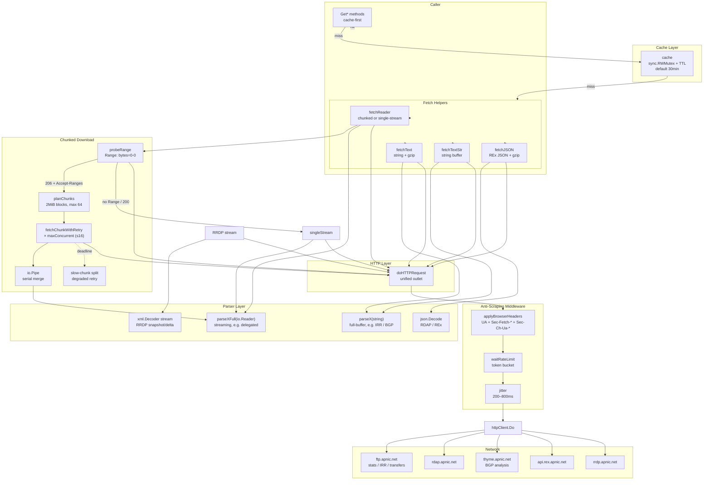

# Architecture

The apnic-skills SDK is built around a single `Client` that funnels every outbound request — HTTP, chunked Range download, and whois — through one anti-scraping-aware transport. This section documents the internal design of that transport and the parser pipeline behind it.

## Architecture at a Glance

The diagram below shows the full request path from a caller's `Fetch*` / `Get*` method down to the wire. Every layer is documented in its own page under this section.

## Layer Responsibilities

| Layer | Source file | Responsibility |
|-------|-------------|----------------|
| **HTTP Client** | `client.go` | Holds all configuration, base URLs, and the `Option` functional-options pattern. `doHTTPRequest` is the single execution outlet. |
| **Anti-Scraping** | `stealth.go` | Browser-mimicry headers, token-bucket rate limiter, request jitter, and explicit gzip handling. Applied inside `doHTTPRequest`. |
| **Chunked Download** | `downloader.go` | Range-probe, chunk planning, concurrent worker pool, retry with slow-chunk splitting, `io.Pipe` merge. Used by `fetchReader`. |
| **Caching** | `cache.go` | `sync.RWMutex`-guarded map with per-key TTL. Backs every `Get*` method. |
| **Parser Design** | `fetcher.go`, `bgp.go`, `irr.go`, `rrdp.go`, `rdap.go`, `rex.go` | Streaming vs. full-buffer parsers, boundary defense, error handling. |

## Design Principles

1. **One outlet.** All HTTP traffic — including the Range probe and every chunk — goes through `doHTTPRequest`, so stealth, rate limiting, and jitter apply uniformly and cannot be bypassed by a sub-path.
2. **Configurable, not optional.** Anti-scraping is on by default (`stealth: true`), but every knob is a functional option (`WithStealth`, `WithJitter`, `WithRateLimit`, `WithMaxConcurrentDownloads`, ...).
3. **Degrade gracefully.** Chunked download falls back to a single connection when the server does not honor `Range`; a stalled chunk is split in half and re-fetched on fresh connections rather than failing the whole download.
4. **Stream where it matters.** Multi-megabyte files (delegated stats, RRDP snapshots, IRR dumps) are parsed from an `io.Reader` so peak memory stays bounded; only small thyme BGP files are buffered into a string.
5. **Cache is opt-in per call.** `Get*` methods wrap `Fetch*` methods with a TTL cache; callers that need freshness call `Fetch*` directly.

## Pages in this section

- [HTTP Client](http-client.md) — `Client` struct, functional options, `doHTTPRequest` request lifecycle.
- [Anti-Scraping](anti-scraping.md) — browser headers, token-bucket limiter, jitter, gzip handling.
- [Chunked Download](chunked-download.md) — Range probe, chunk planning, worker pool, slow-chunk splitting.
- [Caching](caching.md) — `cache` struct, `Get*` vs `Fetch*`, TTL control.
- [Parser Design](parser-design.md) — streaming vs. full-buffer parsers, boundary defense, error handling.
