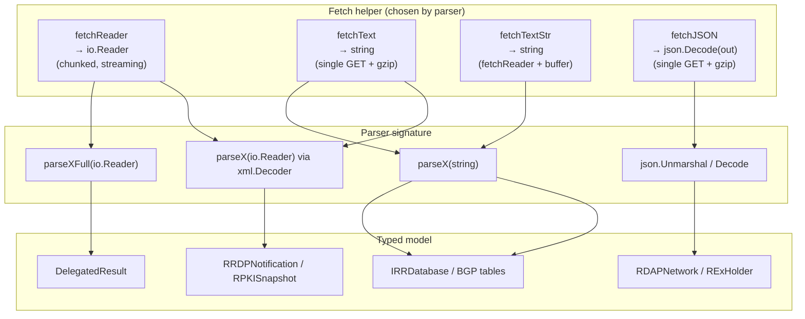
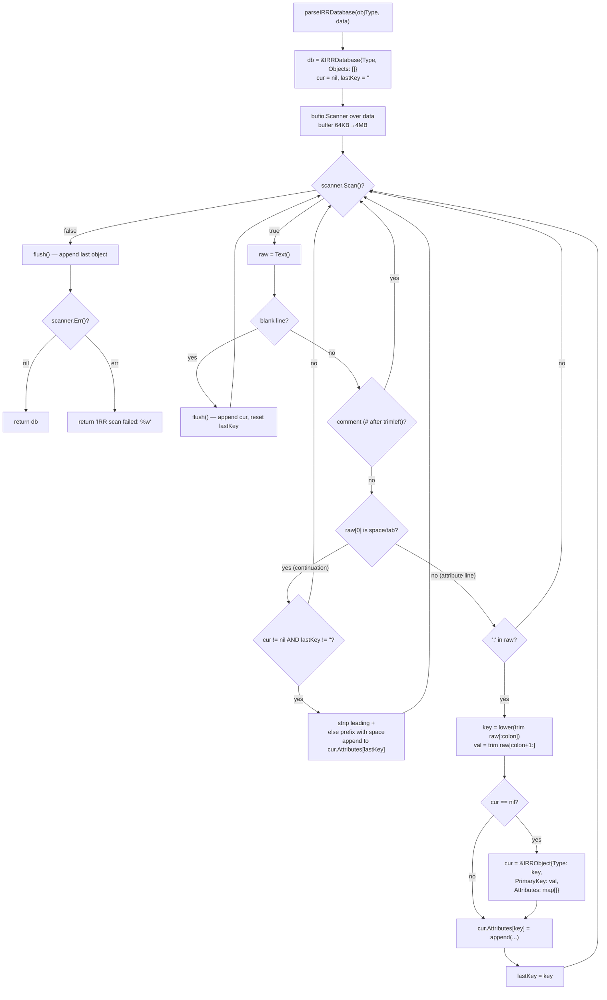
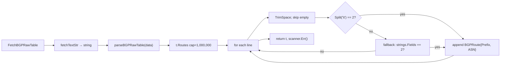

# Parser Design

The SDK's parsers turn APNIC's text, XML, and JSON wire formats into typed Go models. They are deliberately decoupled from the transport: a parser takes either an `io.Reader` (streaming) or a `string` (full-buffer) and has no knowledge of HTTP, caching, or chunked download. This separation lets the transport layer (`fetchReader` / `fetchText` / `fetchTextStr`) choose the right fetch strategy and the parser stay a pure function of its input.

Sources: [`internal/stats/fetcher.go`](https://github.com/cyberspacesec/apnic-skills/blob/main/internal/stats/fetcher.go), [`internal/query/bgp.go`](https://github.com/cyberspacesec/apnic-skills/blob/main/internal/query/bgp.go), [`internal/query/irr.go`](https://github.com/cyberspacesec/apnic-skills/blob/main/internal/query/irr.go), [`internal/query/rrdp.go`](https://github.com/cyberspacesec/apnic-skills/blob/main/internal/query/rrdp.go), [`internal/query/rdap.go`](https://github.com/cyberspacesec/apnic-skills/blob/main/internal/query/rdap.go), [`internal/query/rex.go`](https://github.com/cyberspacesec/apnic-skills/blob/main/internal/query/rex.go).

## Naming Convention

Parsers follow a small set of naming patterns:

| Pattern | Input | Example | Used for |
|---------|-------|---------|----------|
| `parseXFull(io.Reader)` | stream | `parseDelegatedFull` | Large, line-oriented files (delegated stats). Returns the full result including header + summaries + entries. |
| `parseX(string)` | full buffer | `parseIRRDatabase`, `parseBGPRawTable`, `parseBGPUsedAutnums` | Files that need whole-string operations (last-comma search, tab/whitespace fallback) or are small enough to buffer. |
| `parseXFromReader(io.Reader)` | stream | `parseRRDPNotification`, `parseRPKISnapshot` | XML streams decoded with `xml.Decoder.Token()`. |
| `json.Decode` inline | stream | `doRDAPRequestAt`, `fetchJSON` | RDAP / REx JSON, decoded directly from the response body. |

The `Full` suffix marks the streaming, complete-result variant; the no-suffix `parseX(string)` form is for full-buffer parsers. There is no `parseX(io.Reader)` without `Full` in the text-parser family — the distinction is load-bearing.

## Streaming vs. Full-Buffer



### Why streaming matters

The delegated-stats file and RRDP snapshots are multi-megabyte. A streaming parser scans line-by-line (or token-by-token for XML) and holds only the accumulated result in memory, not the raw file. `parseDelegatedFull` uses `bufio.Scanner` over the `io.Reader` returned by `fetchReader`; peak memory is the result slice plus the scanner's line buffer. `parseRPKISnapshot` uses `xml.Decoder.Token()` to walk the snapshot element-by-element, discarding the large base64 CMS bodies of `<publish>` elements so only the rsync URIs are retained.

### When full-buffer is the right call

Thyme BGP files and IRR dumps are parsed from a `string`. For IRR, the RPSL continuation-line folding and last-comma country extraction are easier over the whole string. For BGP, `parseBGPUsedAutnums` needs `strings.LastIndex(line, ",")` and a substring slice that's awkward to do on a raw byte stream. These files are fetched via `fetchTextStr`, which reuses the chunked `fetchReader` transport and then materializes the merged stream into a `strings.Builder` — so large IRR dumps still get the chunked-download speedup, they just buffer the result before parsing.

### fetchReader vs fetchText vs fetchTextStr

| Helper | Returns | Buffers? | Chunked? | Typical parser |
|--------|---------|----------|----------|----------------|
| `fetchReader` | `io.Reader` | No | Yes (or single-stream fallback) | `parseDelegatedFull`, RRDP snapshot |
| `fetchText` | `string` | Yes (whole body) | No (single GET) | Small BGP files (`data-summary`, `data-badpfx-nos`), `APNIC.CURRENTSERIAL`, RRDP `notification.xml` |
| `fetchTextStr` | `string` | Yes (whole body) | Yes (via `fetchReader` + buffer) | Large BGP files (`data-raw-table`, `data-used-autnums`), IRR dumps |
| `fetchJSON` | decoded `out` | No (streaming decode) | No | REx endpoints |

The choice is per-parser and reflects a trade-off: streaming keeps memory bounded but complicates whole-string operations; buffering simplifies parsing at the cost of holding the file in memory. The SDK streams the biggest files (delegated, RRDP) and buffers the rest.

## Parser Pipeline

```mermaid
flowchart LR
    Call["Fetch* method"] --> BuildURL["buildXURL(...)"]
    BuildURL --> Fetch["fetchReader / fetchText / fetchTextStr / fetchJSON"]
    Fetch -->|"io.Reader"| Scan
    Fetch -->|"string"| Str
    Fetch -->|"json body"| Dec

    subgraph Stream["Streaming text parse"]
        Scan["bufio.Scanner<br/>scanner.Buffer(64KB, 4MB)"]
        Scan --> LineLoop["for scanner.Scan()<br/>line = TrimSpace(Text())"]
        LineLoop --> Skip{"skip blank / # / header?"}
        Skip -->|"yes"| LineLoop
        Skip -->|"no"| FieldSplit["Split | / tab / whitespace"]
        FieldSplit --> Guard{"len(parts) >= N?"}
        Guard -->|"no"| LineLoop
        Guard -->|"yes"| Build["build entry<br/>(parse sub-values)"]
        Build --> Append["append to result"]
        Append --> LineLoop
    end

    subgraph Str["Full-buffer parse"]
        Str["bufio.Scanner over<br/>strings.NewReader(data)"]
        Str --> StrLoop["for scanner.Scan()<br/>(same defensive loop)"]
    end

    subgraph XML["XML stream"]
        Dec["xml.Decoder.Token()"]
        Dec --> Tok{"token type"}
        Tok -->|"StartElement"| Attr["match local name<br/>snapshot/publish/withdraw"]
        Tok -->|"CharData"| Discard["discard base64 body"]
    end

    Scan --> Model["typed model"]
    Str --> Model
    Dec --> Model
    Model --> Caller["return to caller / cache.set"]
```

Every text parser uses `bufio.Scanner` with an enlarged buffer: `scanner.Buffer(make([]byte, 0, 64*1024), 4*1024*1024)` — a 64 KB initial buffer that grows to 4 MB. RPSL lines and BGP route lines can be long, and the default 64 KB `Scanner` cap would panic on a line exceeding it. The 4 MB ceiling is a safety bound; lines longer than 4 MB are treated as a scan error.

## Defensive Boundary Handling

Parsers are written to **skip** malformed lines rather than fail the whole parse. APNIC's files occasionally contain header rows, separators, column labels, and oddities the parser doesn't model; the strategy is to recognize and skip them, parsing only the lines that match the expected shape.

The general pattern, repeated across every parser:

```go
for scanner.Scan() {
    line := strings.TrimSpace(scanner.Text())
    if line == "" || strings.HasPrefix(line, "#") || strings.HasPrefix(line, "-") {
        continue // blank, comment, or dash separator
    }
    // ... split and validate ...
    if len(parts) < N { continue } // too few fields
    // ... build entry, skipping on parse errors ...
}
```

### Example: parseBGPUsedAutnums slice-bounds defense

`data-used-autnums` lines look like:

```
1 LVLT-1 - Level 3 Parent, LLC, US
```

The parser extracts:

- `asn` = first whitespace field (`"1"`).
- `country` = text after the last comma (`"US"`).
- `FullName` = the text between the ASN and the comma (`"LVLT-1 - Level 3 Parent, LLC"`).

The naive implementation would slice `line[len(asn):commaIdx]`, but that panics if the comma appears **at or before** the ASN — for example a malformed line `"1, Foo"` or `", foo"`, where `len(asn) > commaIdx` and the slice would go out of range. The parser guards explicitly:

```go
commaIdx := strings.LastIndex(line, ",")
if commaIdx < 0 {
    continue
}
country := strings.TrimSpace(line[commaIdx+1:])
// Guard against a comma that appears at or before the ASN (e.g. "1, Foo"
// or ", foo"), where len(asn) > commaIdx would slice out of range.
if len(asn) > commaIdx {
    continue
}
rest := strings.TrimSpace(line[len(asn):commaIdx])
```

This is the defensive style used throughout: validate the indices you are about to slice on, and `continue` on any shape that would let the slice escape its bounds. The parse never panics on a malformed line.

### Other boundary defenses

| Parser | Defense |
|--------|---------|
| `parseDelegatedFull` | `len(parts) < 7` → skip; per-field parse errors (`parseIPv4Count`, etc.) → skip the entry, not the whole file. |
| `parseBGPRawTable` | Tab split first; if not exactly 2 fields, fall back to `strings.Fields` (any-whitespace); still not 2 → skip. |
| `parseBGPBadPrefixes` | Skip the column header row by name (`"Origin"` / `"Address"`); require exactly 2 whitespace fields. |
| `parseBGPPerPrefixLength` | Each `/N:count` token parsed independently; a token that fails `strconv.Atoi` is skipped, not fatal. |
| `parseBGPSparPrefixes` | Tab split with fallback to whitespace; description is `fields[2:]` joined, so it may contain spaces. |
| `parseBGPSinglePfx` | Non-numeric prefix/ASN counts skipped; RIR is `fields[2:]` joined. |
| `parseIRRDatabase` | Colon-less lines skipped; continuation lines with no active attribute ignored; `+`-prefix continuation folds without extra space. |
| `parseRPKISnapshot` | Namespace-agnostic element matching via `localName` / `attrLocal`; `CharData` (base64 bodies) discarded. |

## Error Handling

Parsers distinguish **scan errors** (the `bufio.Scanner` hit an I/O or buffer error) from **skipped lines** (a malformed line that the parser deliberately ignored):

- Skipped lines never produce an error — the parse continues and returns the valid entries.
- `scanner.Err()` is checked at the end and wrapped (e.g. `"IRR database scan failed: %w"`). A non-nil scan error means the stream was truncated or a line exceeded the 4 MB buffer; the result so far is still returned in some parsers but the error surfaces.

JSON and XML parsers propagate decode errors with context:

| Parser | Error wrapping |
|--------|-----------------|
| `parseRRDPNotification` | `"RRDP notification XML decode failed: %w"` |
| `parseRPKISnapshot` | `"RPKI snapshot XML stream failed: %w"` |
| `doRDAPRequestAt` | `"JSON decode failed: %w"`; RDAP 404 → `ErrNotFound` with the server's error title; other non-200 → status-coded error. |
| `fetchJSON` (REx) | `"JSON decode failed: %w"`; non-200 includes the plain-text server message in the error. |

## Detailed Flow: IRR Database Parse

IRR dumps are RPSL text: objects separated by blank lines, attributes as `key: value` lines, with continuation lines (leading whitespace or `+`) folded into the preceding attribute. `parseIRRDatabase(objType, data)` builds an `IRRDatabase` of `IRRObject`s, each with a `Type`, `PrimaryKey`, and multi-valued `Attributes` map.



The continuation-line folding is the subtle part: a line beginning with whitespace (or `+`) belongs to the previous attribute. A leading `+` suppresses the implicit extra space (RPSL convention); otherwise a space is prepended so the folded value reads naturally. This parser is independent of `ParseWhoisResponse` because IRR dumps are bulk multi-object files, while whois responses are typically single objects with a different surrounding format.

## Detailed Flow: BGP data-raw-table

`data-raw-table` is the largest thyme file — every BGP route as `prefix\tASN`. `parseBGPRawTable` allocates a result slice with capacity `1_000_000` (the file is that large) and scans line-by-line:



The tab-first, whitespace-fallback split is defensive against mixed delimiters in the source file. The large preallocation avoids repeated slice growth for a million-entry result.

## Summary

- Parsers are pure functions of `io.Reader` or `string`, decoupled from transport.
- Large files stream (`parseXFull`, `xml.Decoder`); smaller or whole-string-needing files buffer (`parseX(string)`).
- `fetchReader` (streaming, chunked), `fetchText` (string, single GET), and `fetchTextStr` (string, chunked) are the three fetch strategies a parser chooses from.
- Every parser skips malformed lines and guards slice indices — the parse never panics on bad input.
- Scan errors are wrapped with context; skipped lines are silent.

## Next

- [Caching](caching.md) — where the parsed result lands after this pipeline.
- [Chunked Download](chunked-download.md) — the transport behind `fetchReader` / `fetchTextStr`.
