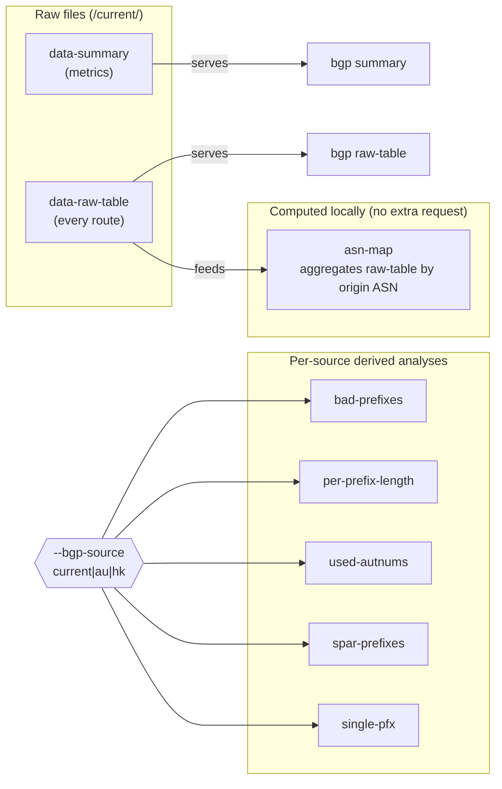

# BGP Commands

The `bgp` command group fetches APNIC thyme ([`thyme.apnic.net`](https://thyme.apnic.net)) BGP routing-table analysis. Thyme publishes a periodic snapshot of the Internet BGP table: two raw files under `/current/` (`data-summary` and `data-raw-table`), plus a set of derived per-source analyses available for the `current`, `au`, and `hk` collectors.

Source: [`cmd_bgp.go`](https://github.com/cyberspacesec/apnic-skills/blob/main/cmd/apnic/cmd_bgp.go).

## The `--bgp-source` flag

The global flag `--bgp-source` selects the thyme data source. It applies to the derived-analysis subcommands (`bad-prefixes`, `per-prefix-length`, `used-autnums`, `spar-prefixes`, `single-pfx`) but not to `summary` or `raw-table`, which are sourced from the `current` raw files only.

| Value | Meaning |
|-------|---------|
| `current` (default) | The current global snapshot. |
| `au` | The Australia collector view. |
| `hk` | The Hong Kong collector view. |

## Command and Data Source Map



## `apnic bgp summary`

Fetch the thyme `data-summary` metrics: colon-separated key/value pairs (entries examined, AS counts, ROA coverage, % of address space announced, etc.).

```bash
apnic bgp summary
apnic --json bgp summary | jq '.entries'
```

Output: `# bgp summary: N metrics` then `Key<Tab>Value` per metric.

## `apnic bgp raw-table`

Fetch the thyme `data-raw-table` — every announced route as `prefix<Tab>ASN` lines. The human-readable output is capped at 50 rows for terminal sanity; use `--json` to get the full slice.

```bash
apnic bgp raw-table
apnic --json bgp raw-table | jq 'length'        # total route count
apnic --json bgp raw-table | jq '.routes[0:5]'
```

## `apnic bgp asn-map`

Aggregate the raw BGP table by origin ASN locally — no extra network request beyond fetching the raw table. Returns the set of unique origin ASNs and the prefixes each announces.

```bash
apnic bgp asn-map
apnic --json bgp asn-map | jq '.asns | keys | length'   # unique origin ASN count
```

## `apnic bgp bad-prefixes`

Fetch prefixes longer than `/24` together with their origin AS — candidate route leaks (more-specifics that should probably be aggregated).

```bash
apnic bgp bad-prefixes
apnic bgp bad-prefixes --bgp-source au
apnic --json bgp bad-prefixes --bgp-source hk | jq '.prefixes[0:10]'
```

Output: `# bgp bad-prefixes: N entries (source=au)` then `OriginAS<Tab>Address` per row. Capped at 50 rows in human-readable mode.

## `apnic bgp per-prefix-length`

Count announced prefixes grouped by prefix length.

```bash
apnic bgp per-prefix-length
apnic --json bgp per-prefix-length | jq -r '.counts[] | "/\(.length)\t\(.count)"'
```

Output: `/<len><Tab><count>` per length.

## `apnic bgp used-autnums`

List every in-use ASN with its registered name and country.

```bash
apnic bgp used-autnums --bgp-source hk
apnic --json bgp used-autnums | jq '.autnums[] | select(.country=="AU")'
```

Output: `ASN<Tab>Country<Tab>FullName` per ASN. Capped at 50 rows in human-readable mode.

## `apnic bgp spar-prefixes`

Prefixes drawn from the IANA Special Purpose Address Registry ([RFC 6890](https://www.rfc-editor.org/rfc/rfc6890)) that are observed in the BGP table.

```bash
apnic bgp spar-prefixes
```

Output: `Prefix<Tab>OriginAS<Tab>Description` per entry.

## `apnic bgp single-pfx`

Tally the ASNs that announce fewer than 20 prefixes, grouped by RIR. Useful for spotting small/one-off originators.

```bash
apnic bgp single-pfx --bgp-source au
```

Output: `PrefixCount<Tab>ASNCount<Tab>RIR` per row.

## Output modes

| Subcommand | Human-readable cap | `--json` shape |
|------------|--------------------|----------------|
| `summary` | none (all metrics) | `BGPSummary` |
| `raw-table` | 50 routes | `BGPRawTable` |
| `asn-map` | count only | `BGPASNMap` |
| `bad-prefixes` | 50 prefixes | `BGPBadPrefixes` |
| `per-prefix-length` | none | `BGPPerPrefixLength` |
| `used-autnums` | 50 ASNs | `BGPUsedAutnums` |
| `spar-prefixes` | none | `BGPSparPrefixes` |
| `single-pfx` | none | `BGPSinglePfx` |

When `--bgp-source` is empty, the human-readable summary line reports `source=current`.
