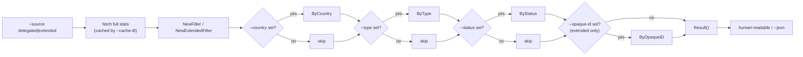
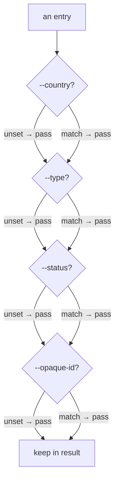

# Filter Command

The `filter` command fetches the latest delegated (or extended) stats and applies a chain of AND-combined filters in memory. It is the fastest way to narrow APNIC's full allocation list to a slice of interest — for example, all allocated IPv4 in a specific country, or every resource held by one opaque identifier.

Source: [`cmd_filter.go`](https://github.com/cyberspacesec/apnic-skills/blob/main/cmd/apnic/cmd_filter.go).

## Filter Pipeline

`filter` builds a fluent chain: it fetches the chosen source, wraps it in a `Filter` / `ExtendedFilter`, applies each specified `ByXxx` step (each returns a new, narrowed filter), and finally calls `Result()`. Unspecified flags are skipped — the chain only contains the stages you ask for.



## `apnic filter`

### Flags

| Flag | Type | Default | Description |
|------|------|---------|-------------|
| `--source` | string | `delegated` | Data source: `delegated` or `extended`. |
| `--country` | string | (none) | ISO 3166 country code (e.g. `CN`). |
| `--type` | string | (none) | Resource type: `ipv4`, `ipv6`, or `asn`. |
| `--status` | string | (none) | Status: `allocated`, `assigned`, `reserved`, or `available`. |
| `--opaque-id` | string | (none) | Opaque-id / org identifier (**extended source only**). |

Filters are combined with **AND** semantics: an entry must match every specified flag to survive. An unspecified flag imposes no constraint.

### Source selection

`--source delegated` wraps the standard delegated stats in an `apnic.Filter` and supports `--country`, `--type`, `--status`. `--source extended` wraps the extended stats (which carry `opaque-id`) in an `apnic.ExtendedFilter` and additionally supports `--opaque-id`. Passing `--opaque-id` with `--source delegated` has no effect (the delegated file has no opaque-id column). An unknown `--source` value is an error.

### Examples

```bash
# All allocated IPv4 in China
apnic filter --country CN --type ipv4 --status allocated

# Everything held by one APNIC organisation (extended)
apnic filter --source extended --country JP --opaque-id A92E1062

# All reserved IPv6, as JSON for jq
apnic --json filter --type ipv6 --status reserved | jq '.[0:10]'

# All ASN allocations in Australia
apnic filter --country AU --type asn
```

### Output format (human-readable)

`--source delegated`:

```
# 312 entries after filter
CN	ipv4	1.0.1.0	256	allocated
CN	ipv4	1.0.2.0	512	allocated
...
```

Columns are tab-separated: `Country  Type  Start  Value  Status`.

`--source extended` adds a trailing opaque-id column:

```
# 87 entries after filter
JP	ipv4	133.0.0.0	65536	allocated	A92E1062
JP	ipv4	133.1.0.0	65536	allocated	A92E1062
...
```

Columns: `Country  Type  Start  Value  Status  OpaqueID`.

### Output (`--json`)

With `--json`, the full filtered slice is emitted — `[]DelegatedEntry` for `delegated`, `[]DelegatedExtendedEntry` for `extended`.

## Filter Semantics



Each stage is a no-op when its flag is unset, so `apnic filter` with no filters returns the entire source unchanged (subject to the source's own row order).

## Global flags of note

| Flag | Effect on filter |
|------|------------------|
| `--stats-base-url` / `--ftp-base-url` | Override where the delegated/extended stats are fetched from. |
| `--cache-ttl` | The full stats file is cached after fetch; raise the TTL when re-filtering across many flag combinations in a script. |
| `--stealth` / `--jitter` | Apply to the underlying fetch; keep `--stealth=true` (default) for unattended batch use. |
| `--json` | Emit the filtered slice verbatim. |

## Output summary

| `--source` | Human-readable columns | `--json` shape |
|------------|-------------------------|----------------|
| `delegated` (default) | `Country  Type  Start  Value  Status` | `[]DelegatedEntry` |
| `extended` | `Country  Type  Start  Value  Status  OpaqueID` | `[]DelegatedExtendedEntry` |
