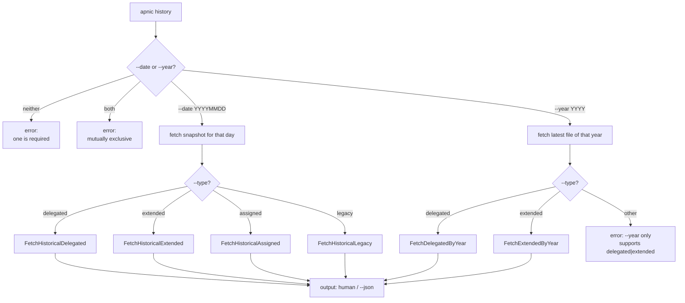
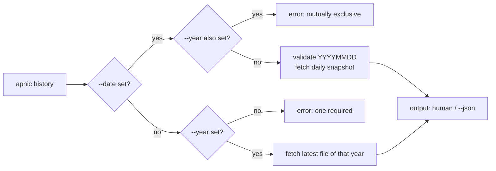

# History Command

The `history` command fetches historical APNIC stats snapshots, either for a specific date (`--date`) or for the latest file published in a given year (`--year`). A companion `years` command lists the years for which historical stats are available. Together they cover point-in-time and "latest-of-year" retrieval across the four historical data files.

Source: [`cmd_history.go`](https://github.com/cyberspacesec/apnic-skills/blob/main/cmd/apnic/cmd_history.go).

## Historical Data Retrieval



`years` is a separate top-level command that lists the years `history --year` accepts.

## `apnic history`

Fetch a historical stats snapshot. Exactly one of `--date` or `--year` must be given; they are mutually exclusive. `--type` selects which data file to fetch.

### Flags

| Flag | Type | Default | Description |
|------|------|---------|-------------|
| `--type` | string | `delegated` | Data type: `delegated`, `extended`, `assigned`, or `legacy`. |
| `--date` | string | (none) | Fetch the snapshot for a specific day (`YYYYMMDD`). |
| `--year` | int | `0` | Fetch the latest file published in the given year (>=2001). |

> **Mutual exclusion:** `--date` and `--year` cannot both be set, and at least one must be set. `--year` only supports `--type delegated` or `--type extended`; `--type assigned` and `--type legacy` are date-only.

### Examples

```bash
# Delegated snapshot for a specific date
apnic history --type delegated --date 20200101

# Latest extended stats published in 2020
apnic history --type extended --year 2020

# Legacy stats for a date, as JSON
apnic --json history --type legacy --date 20150101 | jq '.entries[0:5]'

# Assigned counts by date
apnic history --type assigned --date 20240601
```

### Output format (human-readable)

By date, for each type:

```
# delegated history: 128432 entries (date=20200101)
# extended history: 128432 entries (date=20200101)
# assigned history: 812 entries (date=20200101)
# legacy history: 187 entries (date=20200101)
```

By year:

```
# delegated by-year: 119832 entries (year=2020)
# extended by-year: 119832 entries (year=2020)
```

With `--json`, the full result struct (`DelegatedResult`, `ExtendedResult`, `AssignedResult`, or `LegacyResult` — same shape as the live stats commands) is emitted alongside the human-readable summary line.

## `apnic years`

List the years for which historical APNIC stats are available. Used together with `apnic history --year`.

```bash
apnic years
apnic --json years
```

Human-readable output is one year per line; `--json` emits a JSON array of integers.

## Year and Date Resolution



The human-readable summary echoes the resolved selector: `(date=YYYYMMDD)` for by-date fetches and `(year=YYYY)` for by-year fetches.

## Relationship to the stats family

The `history` command is the historical counterpart to the live [stats](stats.md) commands:

| Live command | Historical by-date | Historical by-year |
|--------------|--------------------|--------------------|
| `delegated` | `history --type delegated --date …` | `history --type delegated --year …` |
| `extended` | `history --type extended --date …` | `history --type extended --year …` |
| `assigned` | `history --type assigned --date …` | (not supported) |
| `legacy` | `history --type legacy --date …` | (not supported) |
| `ipv6-assigned` | (not supported by `history`) | (not supported) |

Use `years` to discover the year range, then `history --year` to fetch the latest file of a given year, or `history --date` for an exact day.

## Global flags of note

| Flag | Effect on history |
|------|-------------------|
| `--stats-base-url` / `--ftp-base-url` | Override the APNIC stats/FTP root where historical archives live. |
| `--cache-ttl` | Caches the fetched snapshot; useful when iterating over several years/dates in a script. |
| `--max-concurrent-downloads` / `--chunk-size` | Tune the parallel `Range` download of large historical files. |
| `--stealth` / `--jitter` | APNIC FTP throttles automation; keep `--stealth=true` (default) for unattended batch use. |
| `--json` | Emit the full result struct alongside the human-readable summary. |

## Output summary

| Subcommand | Human-readable | `--json` |
|------------|----------------|----------|
| `history --type delegated --date/--year …` | `# delegated history/by-year: N entries (…=…)` | `DelegatedResult` |
| `history --type extended --date/--year …` | `# extended history/by-year: N entries (…=…)` | `ExtendedResult` |
| `history --type assigned --date …` | `# assigned history: N entries (date=…)` | `AssignedResult` |
| `history --type legacy --date …` | `# legacy history: N entries (date=…)` | `LegacyResult` |
| `years` | one year per line | JSON array of ints |
