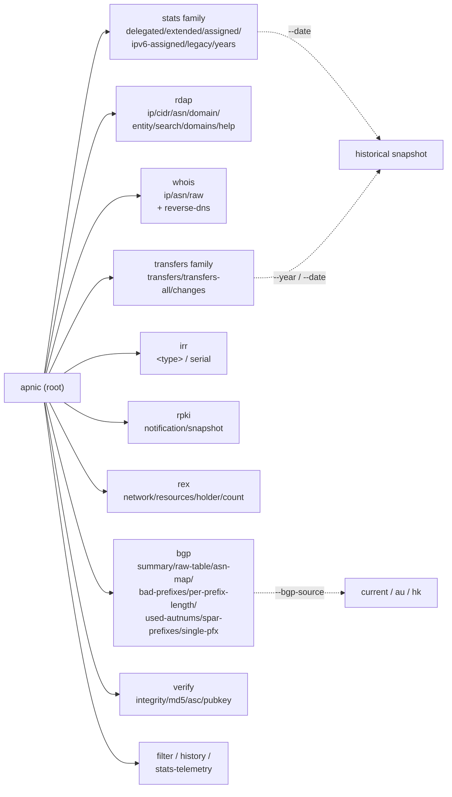
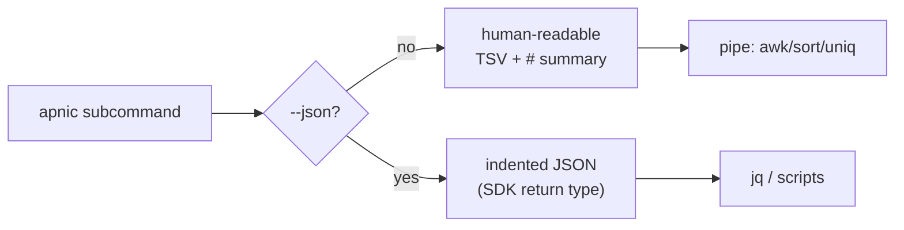

# CLI Reference

The `apnic` command-line interface is a [cobra](https://github.com/spf13/cobra)-based program that exposes every capability of the `apnic-skills` SDK. It is the primary way to query APNIC public data services from a terminal or shell script: delegated stats, RDAP lookups, whois, BGP table analysis, IRR dumps, RPKI repository, cross-RIR REx data, transfers, telemetry, and verification.

The binary is built from [`cmd/apnic/main.go`](https://github.com/cyberspacesec/apnic-skills/blob/main/cmd/apnic/main.go) and the per-domain `cmd_*.go` files alongside it. Run `apnic <command> --help` at any time for an authoritative list of flags.

## Command Hierarchy

The CLI is organised as a root command with **24 subcommands** spanning nine functional groups. Top-level commands that do not take a subcommand (for example `transfers`, `filter`, `history`) act directly; group commands (`rdap`, `whois`, `bgp`, `irr`, `rpki`, `rex`, `verify`) own nested subcommands.



## Global Flags

These persistent flags are inherited by **every** subcommand. They configure the underlying SDK `Client` (see [`internal/transport/client.go`](https://github.com/cyberspacesec/apnic-skills/blob/main/internal/transport/client.go)).

| Flag | Type | Default | Description |
|------|------|---------|-------------|
| `--json` | bool | `false` | Output raw, indented JSON where supported. Otherwise human-readable TSV/text. |
| `--stealth` | bool | `true` | Send browser-mimicry headers and request jitter to avoid bot detection. |
| `--browser-ua` | string | Chrome UA | User-Agent used when `--stealth` is enabled. |
| `--user-agent` | string | SDK default | Custom User-Agent (used when `--stealth=false`). |
| `--jitter` | string | `200ms-800ms` | Random per-request delay range; stealth only. Format `min-max`. |
| `--rate-limit` | float | `0` (unlimited) | Global max requests per second. |
| `--cache-ttl` | duration | `30m` | Cache time-to-live; `0` disables caching. |
| `--timeout` | duration | SDK default | HTTP request timeout, e.g. `30s`, `2m`. |
| `--bgp-source` | string | `current` | thyme BGP data source: `current`, `au`, or `hk`. |
| `--stats-base-url` | string | `https://ftp.apnic.net/apnic/stats/apnic/` | Base URL for APNIC stats/FTP data. |
| `--rdap-base-url` | string | `https://rdap.apnic.net` | Base URL for RDAP queries. |
| `--whois-server` | string | `whois.apnic.net:43` | Whois server address. |
| `--rrdp-base-url` | string | `https://rrdp.apnic.net` | Base URL for RPKI RRDP. |
| `--thyme-base-url` | string | `https://thyme.apnic.net` | Base URL for thyme BGP analysis. |
| `--ftp-base-url` | string | `https://ftp.apnic.net/` | APNIC FTP root for IRR/transfers-all/telemetry. |
| `--rex-base-url` | string | `https://api.rex.apnic.net` | Base URL for the REx cross-RIR resource registry. |
| `--max-concurrent-downloads` | int | `4` | Parallel Range requests for large-file download; `0` or `1` disables chunking. |
| `--chunk-size` | string | split evenly | Target chunk size, e.g. `1MB`, `512KB`. |
| `--download-timeout` | duration | inherits `--timeout` | Per-chunk download timeout. |

### Anti-scraping flags

APNIC's FTP and web endpoints throttle or block obvious automation. The defaults (`--stealth=true`, Chrome UA, 200–800 ms jitter) are tuned for unattended batch use. For a polite, identifiable bot, disable stealth and set your own UA:

```bash
apnic --stealth=false --user-agent "my-research-bot/1.0 (contact: me@example.org)" delegated
```

To throttle aggressively, combine `--rate-limit` and `--jitter`:

```bash
apnic --rate-limit 1 --jitter 500ms-1500ms irr inetnum
```

### Chunked download flags

APNIC FTP throttles large files per connection, so the SDK downloads them with parallel HTTP `Range` requests. `--max-concurrent-downloads` controls the parallelism (not the number of chunks), and `--chunk-size` sets the target chunk size for large files (default splits the file evenly). See the [chunk-size-adaptive memory note](https://github.com/cyberspacesec/apnic-skills/blob/main/website/docs/architecture/) for details.

```bash
apnic --max-concurrent-downloads 8 --chunk-size 2MB irr route
```

## Output Modes

Every subcommand supports two output modes:

- **Human-readable** (default): TSV or labelled key/value lines, with a leading `# comment` summarising the count and parameters. Suitable for piping into `awk`, `sort`, `uniq`.
- **JSON** (`--json`): indented JSON reflecting the SDK return type verbatim. Suitable for programmatic consumption with `jq`.



## Quick Examples

```bash
# Latest delegated stats, human-readable
apnic delegated

# Same, as JSON, piped through jq
apnic --json delegated | jq '.entries[0]'

# RDAP lookup for an IP, point-in-time two years ago
apnic rdap ip 1.1.1.1 --date 2024-06-01T00:00:00Z

# Filter delegated stats for China IPv4 allocations
apnic filter --country CN --type ipv4 --status allocated

# Verify the integrity of the latest delegated stats file
apnic verify integrity --type delegated

# BGP routing-table summary, Hong Kong collector
apnic bgp summary --bgp-source hk

# Historical delegated snapshot for a specific date
apnic history --type delegated --date 20200101

# List years of available historical stats
apnic years
```

## Subcommand Reference

| Group | Command | Description |
|-------|---------|-------------|
| [Stats](stats.md) | `delegated`, `extended`, `assigned`, `ipv6-assigned`, `legacy`, `years` | RIR statistics exchange format files. |
| [RDAP](rdap.md) | `rdap ip/cidr/asn/domain/entity`, `rdap search/domains/help` | Structured registration data, with point-in-time history. |
| [Whois](whois.md) | `whois ip/asn/raw`, `reverse-dns` | Parsed and raw whois queries. |
| [BGP](bgp.md) | `bgp summary/raw-table/asn-map/bad-prefixes/per-prefix-length/used-autnums/spar-prefixes/single-pfx` | thyme BGP routing-table analysis. |
| [IRR](irr.md) | `irr <type>`, `irr serial` | Internet Routing Registry RPSL dumps. |
| [RPKI](rpki.md) | `rpki notification/snapshot` | RRDP repository data. |
| [REx](rex.md) | `rex network/resources/holder/count` | Cross-RIR resource registry. |
| [Transfers](transfers.md) | `transfers`, `transfers-all`, `changes` | IP/ASN transfer and change records. |
| [Verify](verify.md) | `verify integrity/md5/asc/pubkey` | MD5 / PGP signature verification. |
| [Filter](filter.md) | `filter` | Chain-filter delegated/extended stats. |
| [History](history.md) | `history` | Historical stats snapshots by date or year. |
