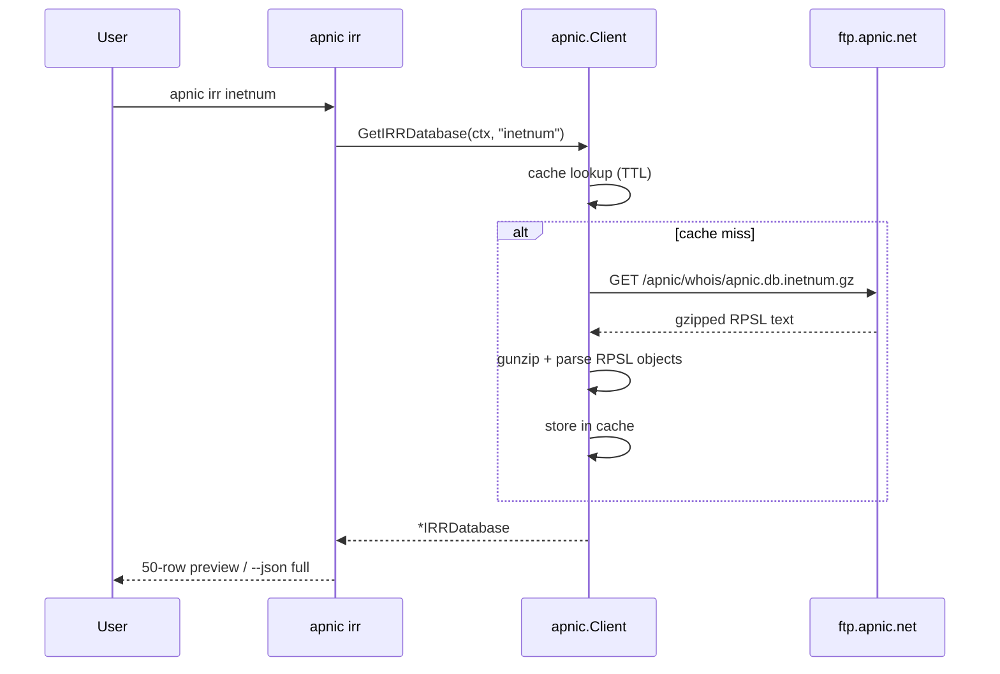

# IRR Commands

The `irr` command group fetches APNIC Internet Routing Registry (IRR) database dumps. APNIC publishes gzipped RPSL (Routing Policy Specification Language) objects under `ftp.apnic.net/apnic/whois/apnic.db.<type>.gz`, one file per object class. The CLI fetches, gunzips, and parses these into structured objects; a separate `serial` subcommand returns the current IRR database serial number (`APNIC.CURRENTSERIAL`).

Source: [`cmd_irr.go`](https://github.com/cyberspacesec/apnic-skills/blob/main/cmd/apnic/cmd_irr.go).

## Command Classification

The 19 valid object types group into four families. `serial` is a metadata command that does not parse a dump — it returns the single integer tracking the current IRR database revision.

```mermaid
graph TB
    IRR["irr"]

    IRR --> SERIAL["serial<br/>APNIC.CURRENTSERIAL"]
    IRR --> TYPES["irr &lt;type&gt;<br/>fetch + parse RPSL dump"]

    subgraph NET["Network objects"]
        INET["inetnum"]
        INET6["inet6num"]
        ROUTE["route"]
        ROUTE6["route6"]
        AUTNUM["aut-num"]
    end

    subgraph ROUTING["Routing sets"]
        ASSET["as-set"]
        ASBLOCK["as-block"]
        RTSET["route-set"]
        PSET["peering-set"]
        RTRSET["rtr-set"]
        INETRTR["inet-rtr"]
    end

    subgraph ORG["Organisational objects"]
        MNT["mntner"]
        ORG["organisation"]
        ROLE["role"]
        IRT["irt"]
    end

    subgraph META["Metadata / other"]
        DOM["domain<br/>(reverse-DNS delegations)"]
        KC["key-cert"]
        FS["filter-set"]
        LIM["limerick"]
    end

    TYPES --> NET
    TYPES --> ROUTING
    TYPES --> ORG
    TYPES --> META
```

## `apnic irr <type>`

Fetch and parse one RPSL object-class dump. The object type is the only positional argument and must be one of the 19 valid types.

### Valid types

| Family | Types |
|--------|-------|
| Network objects | `inetnum`, `inet6num`, `route`, `route6`, `aut-num` |
| Routing sets | `as-set`, `as-block`, `route-set`, `peering-set`, `rtr-set`, `inet-rtr` |
| Organisational | `mntner`, `organisation`, `role`, `irt` |
| Metadata / other | `domain`, `key-cert`, `filter-set`, `limerick` |

### Flags

This subcommand takes no flags beyond the [global flags](index.md#global-flags). The fetched dump is cached within the configured `--cache-ttl`, so repeated invocations inside the TTL are cheap.

### Examples

```bash
# Parsed inetnum objects
apnic irr inetnum

# IPv6 route objects, as JSON
apnic --json irr route6 | jq '.objects[0:5]'

# All reverse-DNS delegation objects (x.in-addr.arpa with nserver/zone-c)
apnic irr domain

# Throttle a large route dump fetch
apnic --rate-limit 1 --max-concurrent-downloads 4 --chunk-size 2MB irr route
```

### Output format (human-readable)

```
# irr route: 184532 objects
route	203.0.113.0/24
route	203.0.113.128/25
...
... (50 more)
```

Columns are tab-separated: `Type  PrimaryKey`. The human-readable view is capped at 50 rows for terminal sanity; the `... (N more)` footer reports the remainder. With `--json`, the full `IRRDatabase` (`Type`, `Objects[]` of `{Type, PrimaryKey, ...}`) is emitted.

## `apnic irr serial`

Fetch the `APNIC.CURRENTSERIAL` value — the current IRR database serial number. This is the lightweight way to check whether the IRR database has advanced since your last fetch; bump the serial and re-pull the dumps that interest you.

```bash
apnic irr serial
# 4287153

apnic --json irr serial
# { "serial": 4287153 }
```

Human-readable output is a single integer. With `--json`, an object `{"serial": <int64>}` is emitted.

## Fetch and Parse Flow



`GetIRRDatabase` caches the parsed database by object type for the duration of `--cache-ttl`. The gzipped dumps can be large (the `route` dump exceeds 100 MB), so the SDK fetches them with parallel HTTP `Range` requests — tune that with `--max-concurrent-downloads` and `--chunk-size`.

## Global flags of note

| Flag | Effect on IRR |
|------|---------------|
| `--ftp-base-url` | Override the APNIC FTP root (`ftp.apnic.net/`). |
| `--cache-ttl` | Caches the parsed `IRRDatabase`; raise it for batch loops over many types. |
| `--max-concurrent-downloads` / `--chunk-size` | Tune the parallel `Range` download of large gzipped dumps. |
| `--rate-limit` / `--jitter` | APNIC FTP throttles automation; keep `--stealth=true` (default) for unattended batch use. |
| `--json` | Emit the full `IRRDatabase` struct. |

## Output summary

| Subcommand | Human-readable | `--json` |
|------------|----------------|----------|
| `irr <type>` | `# irr <type>: N objects` then 50 rows of `Type<Tab>PrimaryKey` | `IRRDatabase` object |
| `irr serial` | single integer | `{"serial": <int64>}` |
