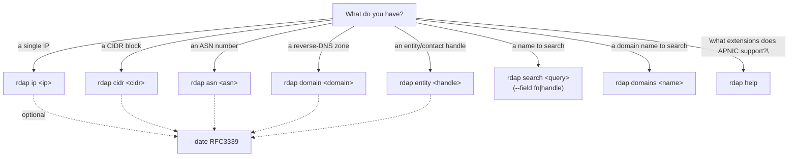
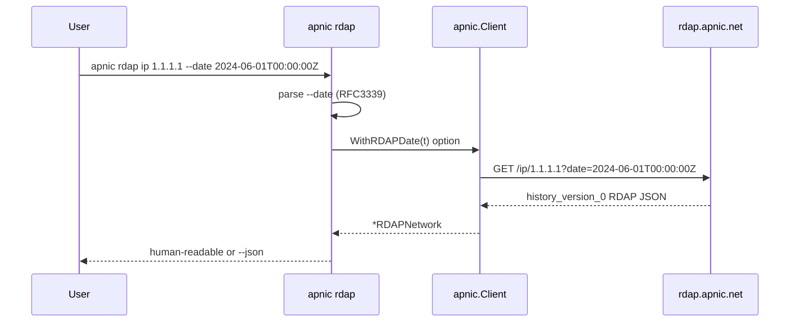

# RDAP Commands

The `rdap` command group queries the APNIC RDAP (Registration Data Access Protocol, [RFC 7480–7483](https://www.rfc-editor.org/rfc/rfc7480)) service at `https://rdap.apnic.net` for structured registration data. Unlike whois text, RDAP returns JSON with a stable schema, including the `history_version_0` extension that enables point-in-time queries.

Source: [`cmd_rdap.go`](https://github.com/cyberspacesec/apnic-skills/blob/main/cmd/apnic/cmd_rdap.go).

## Query Type Selection

Choose the lookup subcommand based on what you have. The `--date` flag (RFC3339 UTC) is accepted by every lookup subcommand and switches the query from live to point-in-time.



## Common flag: `--date`

All lookup subcommands accept `--date` (RFC3339, e.g. `2024-06-01T00:00:00Z`). When set, the query returns the resource state as it was at that UTC instant, using APNIC's `history_version_0` RDAP extension. When omitted, the query is live. The flag is defined once on the `rdap` parent command and re-declared on each lookup subcommand so it appears in each subcommand's `--help`.

## `apnic rdap ip <ip>`

RDAP lookup for a single IP address.

```bash
apnic rdap ip 1.1.1.1
apnic rdap ip 1.1.1.1 --date 2024-06-01T00:00:00Z
apnic --json rdap ip 1.1.1.1 | jq '.country, .cidr0_cidrs'
```

Human-readable output prints `Handle`, `Start`, `End`, `Version`, `Name`, `Country`, `Type`, `Status`, each `CIDR0` entry, `Entity` rows (handle + roles), and `Event` rows (action + date).

## `apnic rdap cidr <cidr>`

RDAP lookup for a CIDR block (uses the `cidr0` RDAP extension).

```bash
apnic rdap cidr 1.1.1.0/24
```

Output shape is identical to `rdap ip` (both return an `RDAPNetwork`).

## `apnic rdap asn <asn>`

RDAP lookup for an Autonomous System Number. Pass the plain number (e.g. `13335`), not the `AS13335` form.

```bash
apnic rdap asn 13335
apnic --json rdap asn 13335 | jq '{handle, name, country, type}'
```

Human-readable output:

```
Handle:  13335
ASN:     13335 - 13335
Name:    CLOUDFLAREAP-AP
Type:    ...
Country: US
```

## `apnic rdap domain <domain>`

RDAP lookup for a domain object, typically a reverse-DNS zone such as `1.0.0.1.in-addr.arpa`.

```bash
apnic rdap domain 1.0.0.1.in-addr.arpa
```

## `apnic rdap entity <handle>`

RDAP lookup for an entity or contact, e.g. an organisation handle (`ORG-ARAD1-AP`) or a role/contact handle (`AIC3-AP`).

```bash
apnic rdap entity ORG-ARAD1-AP
apnic --json rdap entity ORG-ARAD1-AP | jq '.roles, .vcardArray'
```

## `apnic rdap search <query>`

Search the APNIC RDAP entity database by friendly name (`fn`) or by handle.

| Flag | Type | Default | Description |
|------|------|---------|-------------|
| `--field` | string | `fn` | Search field: `fn` (name, supports wildcards) or `handle` (exact match). |

APNIC requires wildcards for substring matches. An exact name only matches an entity whose name equals that string.

```bash
# Search by friendly name with a wildcard
apnic rdap search "*CLOUD*" --field fn

# Exact handle match
apnic rdap search ORG-ARAD1-AP --field handle
```

## `apnic rdap domains <name>`

Search the APNIC RDAP database for reverse-DNS domain objects (RFC 7482 `/domains?name=`). Returns matching `in-addr.arpa` zones in `domainSearchResults`.

```bash
apnic rdap domains "1.in-addr.arpa"
```

## `apnic rdap help`

Fetch the RDAP `/help` endpoint (RFC 7483). Returns `rdapConformance` extensions (e.g. `history_version_0`, `cidr0`, `nro_rdap_profile_0`), notices (terms of service, inaccuracy reporting), and `port43`. Useful to discover which RDAP extensions APNIC supports.

```bash
apnic rdap help
apnic --json rdap help | jq '.rdapConformance'
```

## Point-in-time Query Flow



When `--date` is empty, the CLI passes a no-op option and the SDK issues a plain live lookup.

## Output

| Mode | Shape |
|------|-------|
| human-readable | Labelled key/value lines for `ip`/`cidr`; compact TSV for `search`/`domains`; labelled fields for `asn`/`domain`/`entity`/`help`. |
| `--json` | The verbatim SDK struct: `RDAPNetwork`, `RDAPAutnum`, `RDAPDomain`, `RDAPEntity`, `RDAPSearchResult`, `RDAPDomainSearchResult`, `RDAPHelpInfo`. See the [types reference](../types/index.md). |
