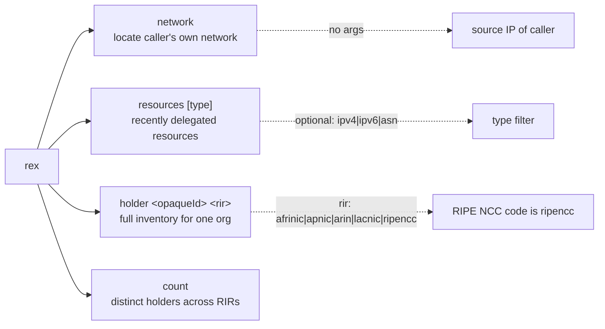
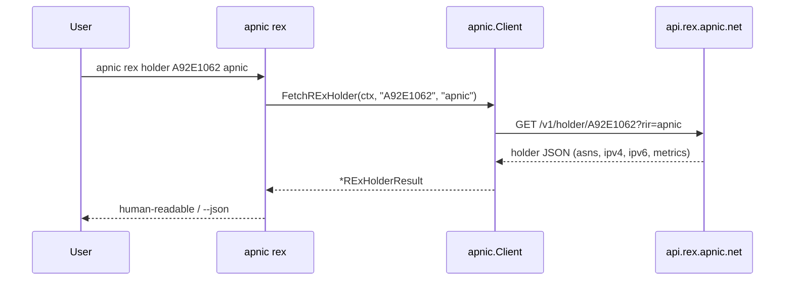

# REx Commands

The `rex` command group queries the APNIC REx (Resource EXplorer) cross-RIR resource registry REST API at `https://api.rex.apnic.net`. REx aggregates delegated resources across **all five RIRs** (APNIC, ARIN, RIPE, LACNIC, AFRINIC) and attributes them to resource-holder organisations via opaque identifiers — capabilities that go beyond the per-RIR stats and RDAP endpoints elsewhere in this CLI. All endpoints return JSON and require no authentication.

Source: [`cmd_rex.go`](https://github.com/cyberspacesec/apnic-skills/blob/main/cmd/apnic/cmd_rex.go).

## Command Map



## `apnic rex network`

Locate the caller's own network from the source IP of the request. Returns the covering prefix, the origin ASN, and the economy (country) — no parameters required. The server infers these from the TCP peer address.

```bash
apnic rex network
apnic --json rex network | jq '.prefix, .asn, .economy'
```

### Output format (human-readable)

```
# rex user-network
ip	203.0.113.45
prefix	203.0.113.0/24
asn	13335
economy	AU
```

## `apnic rex resources [type]`

List a bounded, most-recent-first window of cross-RIR delegated resources with holder attribution. The optional positional argument filters by resource kind: `ipv4`, `ipv6`, or `asn`. Omit it to list all kinds. REx returns the most recently delegated resources, **not** the full historical list.

| Positional | Type | Description |
|------------|------|-------------|
| `[type]` | string | Optional filter: `ipv4`, `ipv6`, or `asn`. |

```bash
apnic rex resources
apnic rex resources asn
apnic --json rex resources ipv4 | jq '.items[0:10]'
```

### Output format (human-readable)

```
# rex resources: 500 items
ipv4	203.0.113.0/24	ExampleCorp	APNIC	AU	A92E1062
ipv6	2001:db8::/32	ExampleCorp	APNIC	AU	A92E1062
asn	64512	ExampleCorp	RIPE	NL	B7F30011
...
```

Columns are tab-separated: `Type  Resource  HolderName  RIR  CC  OpaqueID`.

## `apnic rex holder <opaqueId> <rir>`

Aggregate every ASN and prefix held by one organisation, given its opaque identifier and the responsible RIR. Returns the holder's full ASN and prefix inventory together with derived size metrics (`/24` units for IPv4, `/48` units for IPv6).

| Positional | Type | Description |
|------------|------|-------------|
| `<opaqueId>` | string | The holder's opaque identifier (obtainable from `rex resources` or from the extended delegated stats `opaque-id` column). |
| `<rir>` | string | Responsible RIR. Must be one of `afrinic`, `apnic`, `arin`, `lacnic`, `ripencc`. |

> **Note:** The RIPE NCC code is `ripencc`, not `ripe`. Passing `ripe` is rejected by the API.

```bash
# Full inventory for one APNIC holder
apnic rex holder A92E1062 apnic

# RIPE NCC holder
apnic rex holder B7F30011 ripencc

apnic --json rex holder A92E1062 apnic | jq '{asns: .asns, ipv4_24: .ipv4_24_count, ipv6_48: .ipv6_48_count}'
```

### Output format (human-readable)

```
# rex holder: ExampleCorp (APNIC)
asns	3
asn	64512
asn	64513
asn	64514
ipv4	12 (/24 units: 256)
ipv4	203.0.113.0/24
ipv4	203.0.114.0/23
ipv6	4 (/48 units: 1024)
ipv6	2001:db8::/32
...
```

## `apnic rex count`

Return the total number of distinct resource-holder organisations across all five RIRs.

```bash
apnic rex count
# # rex holders unique-count
# count	154328

apnic --json rex count | jq '.count'
```

## Query Flow



`rex network` issues a parameterless GET and the server infers the caller's network from the source IP. `rex resources` appends an optional `?type=` filter. `rex count` returns a single aggregated integer.

## Global flags of note

| Flag | Effect on REx |
|------|---------------|
| `--rex-base-url` | Override the REx API root (`api.rex.apnic.net`). |
| `--rate-limit` / `--stealth` | REx is a public API with no documented hard rate limit, but polite throttling is recommended for batch loops. |
| `--cache-ttl` | Caches GET responses by URL; useful when iterating over many opaque IDs in a script. |
| `--json` | Emit the verbatim SDK struct. |

## Output summary

| Subcommand | Human-readable | `--json` |
|------------|----------------|----------|
| `rex network` | `# rex user-network` then `ip/prefix/asn/economy` rows | `RExUserNetwork` |
| `rex resources [type]` | `# rex resources: N items` then `Type<Tab>Resource<Tab>HolderName<Tab>RIR<Tab>CC<Tab>OpaqueID` rows | `RExResourcesResult` |
| `rex holder <opaqueId> <rir>` | header + counts + per-resource rows | `RExHolderResult` |
| `rex count` | `# rex holders unique-count` then `count<Tab>N` | `RExHoldersUniqueCount` |
