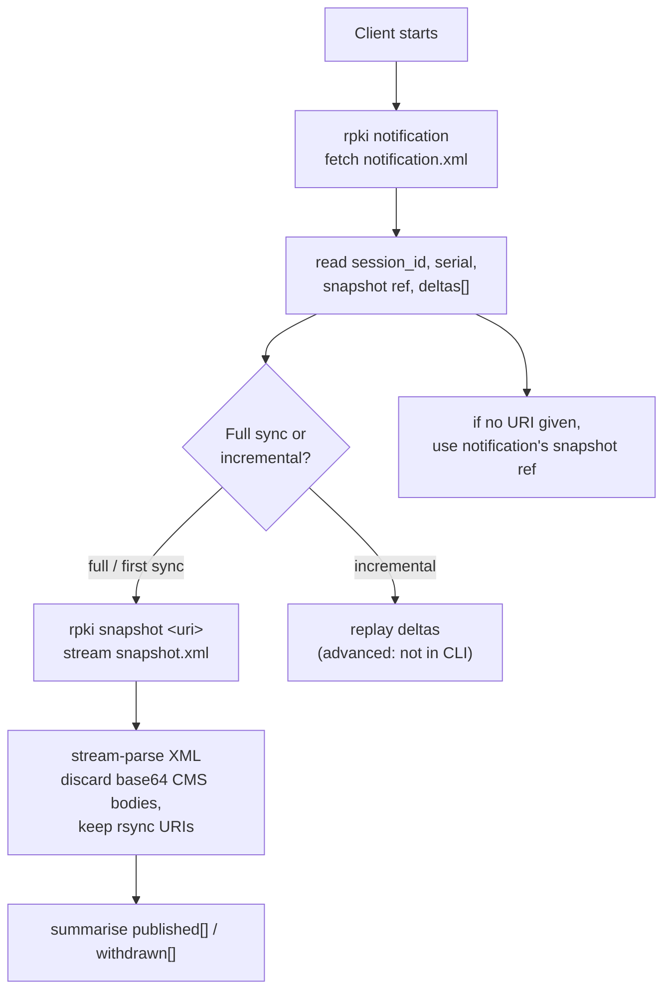

# RPKI Commands

The `rpki` command group fetches APNIC's RPKI (Resource Public Key Infrastructure) repository data via the RRDP (RPKI Repository Delta Protocol, [RFC 8182](https://www.rfc-editor.org/rfc/rfc8182)) endpoint at `https://rrdp.apnic.net`. RRDP exposes a `notification.xml` that points at the current full snapshot and a chain of incremental deltas; the CLI can fetch the notification metadata or stream and summarise a snapshot.

Source: [`cmd_rpki.go`](https://github.com/cyberspacesec/apnic-skills/blob/main/cmd/apnic/cmd_rpki.go).

## RRDP Synchronisation Flow

A client synchronises the RPKI repository by first reading `notification.xml`, then either downloading the snapshot (full state) or replaying deltas (incremental). The CLI's two subcommands map onto these two phases.



## `apnic rpki notification`

Fetch the RRDP `notification.xml` and return its metadata: session ID, current serial, the snapshot reference (URI + hash), and the list of deltas (each with a serial and URI).

```bash
apnic rpki notification
apnic --json rpki notification | jq '.session_id, .serial'
```

### Output format (human-readable)

```
# rpki notification: session=ab12cd34 serial=8421
snapshot	https://rrdp.apnic.net/.../snapshot.xml	<sha256>
deltas: 47
delta	8421	https://rrdp.apnic.net/.../8421-delta.xml
delta	8420	https://rrdp.apnic.net/.../8420-delta.xml
...
... (27 more deltas)
```

The delta list is capped at 20 rows in human-readable mode; use `--json` for the full `RRDPNotification` (session ID, serial, snapshot ref, full deltas slice).

## `apnic rpki snapshot [uri]`

Stream an RRDP `snapshot.xml` by URI and summarise the published and withdrawn RPKI objects. Snapshot files are large; the SDK streams the XML, keeps only the published/withdrawn rsync object URIs, and discards the base64 CMS bodies during parsing — so memory use stays bounded.

### URI resolution

The snapshot URI is resolved as follows:

| Argument | Resolution |
|----------|------------|
| (none) | Fetch `notification.xml` and use its snapshot reference. |
| relative path (e.g. `snapshot.xml`) | Joined to `--rrdp-base-url`. |
| absolute `http://` / `https://` URI | Fetched verbatim (as returned by `rpki notification`). |

### Flags

This subcommand takes no flags beyond the [global flags](index.md#global-flags). `--rrdp-base-url` selects the RRDP root used for relative-path resolution and for fetching the notification when no URI is given.

### Examples

```bash
# Resolve the snapshot URI from the notification, then stream it
apnic rpki snapshot

# Stream an explicit snapshot URI (as returned by 'rpki notification')
apnic rpki snapshot "https://rrdp.apnic.net/.../snapshot.xml"

# Relative path resolved against --rrdp-base-url
apnic rpki snapshot snapshot.xml

# Full JSON: published and withdrawn object URIs
apnic --json rpki snapshot | jq '.published | length, .withdrawn | length'
```

### Output format (human-readable)

```
# rpki snapshot: session=ab12cd34 serial=8421 published=1284 withdrawn=17
```

With `--json`, the full `RRDPSnapshot` (`SessionID`, `Serial`, `Published[]`, `Withdrawn[]`) is emitted.

## Notification-then-Snapshot Flow

```mermaid
sequenceDiagram
    participant U as User
    participant CLI as apnic rpki
    participant SDK as apnic.Client
    participant RRDP as rrdp.apnic.net

    U->>CLI: apnic rpki snapshot
    CLI->>SDK: resolveSnapshotURI(no args)
    SDK->>RRDP: GET /notification.xml
    RRDP-->>SDK: notification.xml (snapshot ref)
    SDK-->>CLI: snapshot URI
    CLI->>SDK: FetchRRDPSnapshot(ctx, uri)
    SDK->>RRDP: GET snapshot.xml (streamed)
    RRDP-->>SDK: streamed XML
    SDK->>SDK: stream-parse; keep rsync URIs,<br/>discard base64 CMS bodies
    SDK-->>CLI: *RRDPSnapshot
    CLI-->>U: summary / --json
```

When an explicit absolute URI is supplied, the notification fetch is skipped and the snapshot is streamed directly.

## Global flags of note

| Flag | Effect on RPKI |
|------|----------------|
| `--rrdp-base-url` | Override the RRDP root (`rrdp.apnic.net`); used for relative snapshot URIs and for resolving the snapshot from the notification. |
| `--timeout` | Per-request timeout; snapshot streams can be large, so consider `--timeout 5m`. |
| `--cache-ttl` | Caches the notification fetch; the snapshot stream is not cached. |
| `--json` | Emit the full `RRDPNotification` or `RRDPSnapshot` struct. |

## Output summary

| Subcommand | Human-readable | `--json` |
|------------|----------------|----------|
| `rpki notification` | `# rpki notification: session=… serial=…` then snapshot + up to 20 deltas | `RRDPNotification` |
| `rpki snapshot [uri]` | `# rpki snapshot: … published=N withdrawn=M` | `RRDPSnapshot` |
