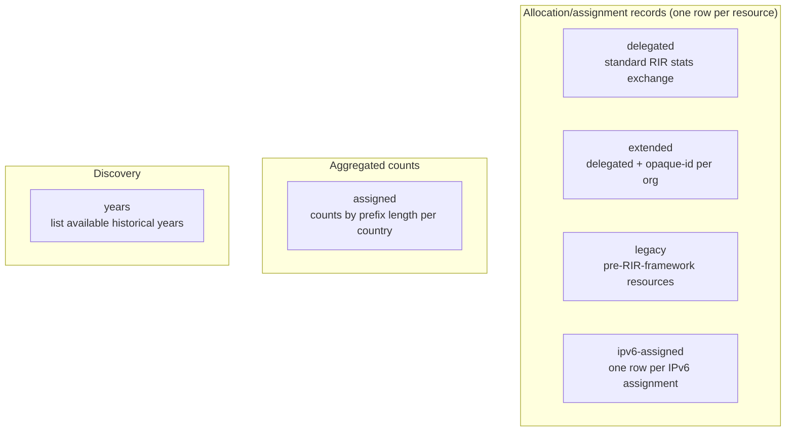
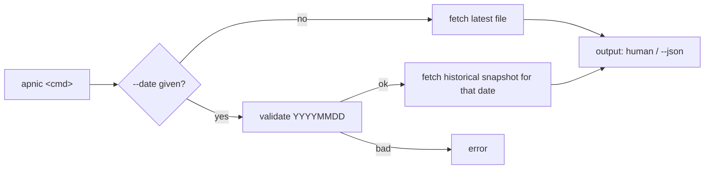

# Stats Commands

The stats family fetches the RIR statistics exchange format files that APNIC publishes under [`ftp.apnic.net/apnic/stats/apnic/`](https://ftp.apnic.net/apnic/stats/apnic/). These files enumerate every IP and ASN allocation/assignment recorded by APNIC and are the canonical source of truth for "who holds what" in the APNIC region.

All commands in this group live in [`cmd_stats.go`](https://github.com/cyberspacesec/apnic-skills/blob/main/cmd/apnic/cmd_stats.go). The `years` command lives in [`cmd_history.go`](https://github.com/cyberspacesec/apnic-skills/blob/main/cmd/apnic/cmd_history.go).

## Command Classification



## `apnic delegated`

Fetch the standard delegated stats file. Lists every IP/ASN allocation and assignment recorded by APNIC in the RIR statistics exchange format (`registry|cc|type|start|value|date|status`).

| Flag | Type | Default | Description |
|------|------|---------|-------------|
| `--date` | string | latest | Data date in `YYYYMMDD` format. |

### Examples

```bash
# Latest delegated stats
apnic delegated

# Historical snapshot
apnic delegated --date 20200101

# JSON, count IPv4 allocations by country
apnic --json delegated --date 20240601 \
  | jq -r '.entries[] | select(.type=="ipv4") | .country' \
  | sort | uniq -c | sort -rn | head
```

### Output format (human-readable)

```
# delegated stats: 145327 entries (date=latest)
AU	ipv4	1.0.0.0	256	allocated	20110412
AU	ipv4	1.0.1.0	256	allocated	20110412
...
```

Columns are tab-separated: `Country  Type  Start  Value  Status  Date`. With `--json`, the full `DelegatedResult` (header, summaries, entries) is emitted.

## `apnic extended`

Fetch the extended delegated stats file. Identical to `delegated` but each record carries an `opaque-id` identifying the resource-holder organisation, enabling per-organisation aggregation.

| Flag | Type | Default | Description |
|------|------|---------|-------------|
| `--date` | string | latest | Data date in `YYYYMMDD` format. |

### Examples

```bash
# Latest extended stats
apnic extended

# All resources held by one opaque-id
apnic --json extended | jq '.entries[] | select(.opaque_id=="A92E1062")'
```

### Output format (human-readable)

```
# extended stats: 145327 entries (date=latest)
AU	ipv4	1.0.0.0	256	allocated	A92E1062
...
```

## `apnic assigned`

Fetch the APNIC assigned stats file. Aggregates assignment counts by prefix size per country (e.g. how many `/24`s have been assigned).

| Flag | Type | Default | Description |
|------|------|---------|-------------|
| `--date` | string | latest | Data date in `YYYYMMDD` format. |

### Examples

```bash
apnic assigned --date 20240601
```

### Output format (human-readable)

```
# assigned stats: 842 entries (date=20240601)
AU	ipv4	24	1523
AU	ipv6	48	87
...
```

Columns: `Country  Type  Prefix  Count`.

## `apnic ipv6-assigned`

Fetch the `delegated-apnic-extended-ipv6-assigned` stats file. Unlike the aggregated `assigned` file, this lists each individual IPv6 assignment as a separate record (`registry|cc|ipv6|start|prefix|date`), with no status or extension columns.

| Flag | Type | Default | Description |
|------|------|---------|-------------|
| `--date` | string | latest | Data date in `YYYYMMDD` format. |

### Examples

```bash
apnic ipv6-assigned
```

### Output format (human-readable)

```
# ipv6-assigned stats: 53127 entries (date=latest)
AU	2001:200::	32
AU	2001:200:8000::	48
...
```

## `apnic legacy`

Fetch the APNIC legacy stats file. Legacy resources are address space transferred to APNIC from other registries before the current RIR statistics framework was established.

| Flag | Type | Default | Description |
|------|------|---------|-------------|
| `--date` | string | latest | Data date in `YYYYMMDD` format. |

### Examples

```bash
apnic legacy
```

### Output format (human-readable)

```
# legacy stats: 187 entries (date=latest)
AU	ipv4	1.0.0.0	256	legacy
...
```

## `apnic years`

List the years for which historical APNIC stats are available (used together with `apnic history --year`).

```bash
apnic years
apnic --json years
```

Output is one year per line (human-readable) or a JSON array of integers.

## Date Handling



When `--date` is omitted, the comment line in human-readable output reports `(date=latest)`; otherwise it echoes the supplied date. All five stats commands share the same `--date` flag (defined once in `init()` and attached to each command).

## Output: human-readable vs `--json`

| Mode | When to use | Shape |
|------|-------------|-------|
| human-readable | Quick inspection, piping into `awk`/`sort`/`uniq` | Tab-separated rows, leading `#` summary comment. |
| `--json` | Programmatic use with `jq` or scripts | Full SDK result struct (`DelegatedResult`, `ExtendedResult`, `AssignedResult`, `IPv6AssignedResult`, `LegacyResult`) with header, summaries, and entries. See the [types reference](../types/index.md). |
