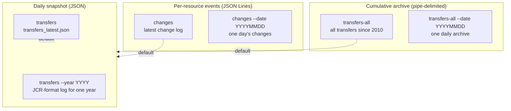
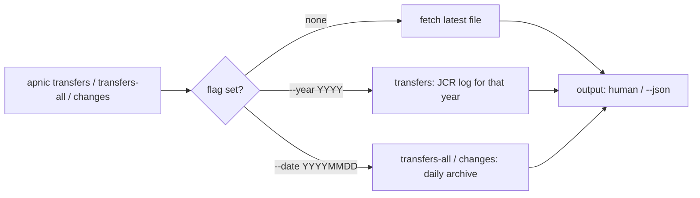

# Transfer Commands

The transfer family fetches APNIC IP/ASN transfer and resource-change records. Three top-level commands cover three different datasets: `transfers` (the daily JSON transfer snapshot, optionally by year), `transfers-all` (the cumulative historical pipe-delimited log since 2010), and `changes` (per-resource change events as JSON Lines).

Source: [`cmd_transfers_changes.go`](https://github.com/cyberspacesec/apnic-skills/blob/main/cmd/apnic/cmd_transfers_changes.go).

## Command and Dataset Map



## `apnic transfers`

Fetch APNIC inter- and intra-RIR IP/ASN transfer records. By default fetches the latest transfers (`transfers_latest.json`). Use `--year YYYY` to fetch the JCR-format transfer log for that year.

| Flag | Type | Default | Description |
|------|------|---------|-------------|
| `--year` | int | `0` (latest) | Fetch the JCR-format transfer log for a specific year. |

### Examples

```bash
# Latest transfer snapshot
apnic transfers

# Transfer log for a specific year
apnic transfers --year 2024

apnic --json transfers --year 2024 | jq '.transfers[0:5]'
```

### Output format (human-readable)

```
# transfers: 128 records (year=latest)
```

With `--year`, the summary reads `(year=2024)`. The human-readable output is the summary line only; the structured records are emitted under `--json` as the `TransfersResult` struct (`transfers[]`).

## `apnic transfers-all`

Fetch the APNIC cumulative `transfers-all` log. Unlike `transfers` (the daily JSON snapshot), this is the historical pipe-delimited format covering every IP/ASN transfer recorded since 2010. Use `--date YYYYMMDD` for a specific daily archive; omit for the latest cumulative file.

| Flag | Type | Default | Description |
|------|------|---------|-------------|
| `--date` | string | latest | Fetch the cumulative log for a specific date (`YYYYMMDD`). |

### Examples

```bash
# Latest cumulative transfers-all log
apnic transfers-all

# Cumulative log as of a specific date
apnic transfers-all --date 20220904

apnic --json transfers-all --date 20220904 | jq '.records[0:5]'
```

### Output format (human-readable)

```
# transfers-all: 4156 records (date=latest)
ipv4	203.0.113.0/24	ORG-A-AP	ORG-B-AP	Inter-RIR	20220904
asn	64512	ORG-A-AP	ORG-B-AP	Intra-RIR	20220601
...
```

Columns are tab-separated: `ResourceType  Resource  FromOrganisation  ToOrganisation  TransferType  TransferDate`. The transfer date is rendered as `YYYYMMDD`.

## `apnic changes`

Fetch APNIC resource change records (JSON Lines). Each record describes a delegated, cc-changed, or status-changed event for a resource. By default fetches the latest; use `--date YYYYMMDD` for a specific snapshot.

| Flag | Type | Default | Description |
|------|------|---------|-------------|
| `--date` | string | latest | Fetch the change log for a specific date (`YYYYMMDD`). |

### Examples

```bash
# Latest change log
apnic changes

# Changes for a specific date
apnic changes --date 20240601

apnic --json changes --date 20240601 | jq '.changes[0:5]'
```

### Output format (human-readable)

```
# changes: 932 records (date=latest)
```

The summary line reports `(date=latest)` or the supplied date. The structured records are emitted under `--json` as the `ChangesResult` struct (`changes[]`).

## Date and Year Resolution



The summary line in human-readable output echoes the resolved value: `year=latest` / `year=2024` for `transfers`, and `date=latest` / `date=20240601` for `transfers-all` and `changes`. `--year` is only valid on `transfers`; `--date` is only valid on `transfers-all` and `changes`.

## Global flags of note

| Flag | Effect on transfers |
|------|---------------------|
| `--ftp-base-url` | Override the APNIC FTP root (`ftp.apnic.net/`) where transfer archives live. |
| `--cache-ttl` | Caches the fetched archive; useful in scripts that re-query within a run. |
| `--stealth` / `--jitter` | APNIC FTP throttles automation; keep `--stealth=true` (default) for unattended batch use. |
| `--json` | Emit the structured `TransfersResult` / `TransfersAllResult` / `ChangesResult`. |

## Output summary

| Subcommand | Human-readable | `--json` |
|------------|----------------|----------|
| `transfers` | summary line only (`# transfers: N records (year=…)`) | `TransfersResult` |
| `transfers-all` | summary line + tab-separated record rows | `TransfersAllResult` |
| `changes` | summary line only (`# changes: N records (date=…)`) | `ChangesResult` |
