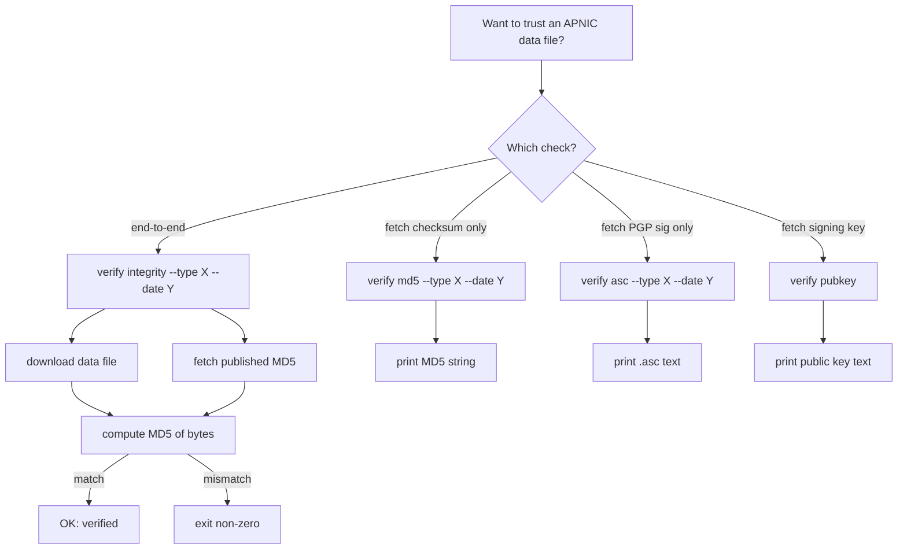
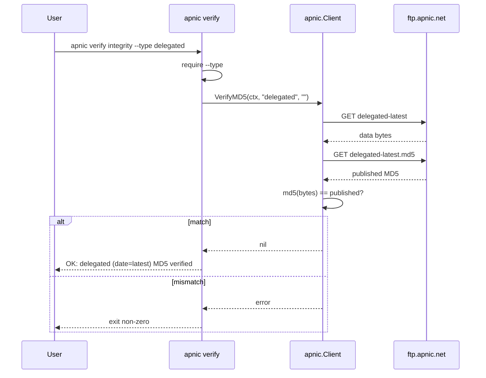

# Verify Commands

The `verify` command group verifies the integrity and authenticity of APNIC published data files. APNIC publishes MD5 checksums and PGP signatures (`.asc`) sidecar files for each stats file, all signed with a public key (`CURRENT_PUBLIC_KEY`). The CLI can fetch checksums, fetch signatures, fetch the signing public key, or perform an end-to-end integrity check.

Source: [`cmd_verify.go`](https://github.com/cyberspacesec/apnic-skills/blob/main/cmd/apnic/cmd_verify.go).

## Verification Flow



## `apnic verify integrity`

Verify the integrity of a published stats file end-to-end. Fetches both the data file and its MD5 checksum, computes the MD5 of the downloaded bytes, and compares. Exits non-zero on mismatch or fetch failure.

| Flag | Type | Default | Description |
|------|------|---------|-------------|
| `--type` | string | (required) | Data file type: `delegated`, `delegated-extended`, `assigned`, `delegated-ipv6-assigned`, `legacy`. |
| `--date` | string | latest | Data date in `YYYYMMDD`. |

### Examples

```bash
# Verify the latest delegated stats
apnic verify integrity --type delegated

# Verify a historical snapshot
apnic verify integrity --type delegated-extended --date 20240601

# Chain into a script; non-zero exit on mismatch
apnic verify integrity --type delegated && echo "trust ok"
```

### Output

```
OK: delegated (date=latest) MD5 verified
```

## `apnic verify md5`

Fetch the published MD5 checksum for a stats file (does not download the data file itself). Useful for comparing against a locally held copy.

| Flag | Type | Default | Description |
|------|------|---------|-------------|
| `--type` | string | (required) | Data file type: `delegated`, `delegated-extended`, `assigned`, `delegated-ipv6-assigned`, `legacy`. |
| `--date` | string | latest | Data date in `YYYYMMDD`. |

```bash
apnic verify md5 --type delegated
apnic verify md5 --type delegated-extended --date 20240601
```

Output is the bare MD5 hex string (one line).

## `apnic verify asc`

Fetch the PGP signature (`.asc`) for a stats file. The signature can be verified against the public key from `verify pubkey` using a local `gpg` toolchain.

| Flag | Type | Default | Description |
|------|------|---------|-------------|
| `--type` | string | (required) | Data file type: `delegated`, `delegated-extended`, `assigned`, `delegated-ipv6-assigned`, `legacy`. |
| `--date` | string | latest | Data date in `YYYYMMDD`. |

```bash
apnic verify asc --type delegated > delegated.asc
apnic verify asc --type legacy --date 20200101 > legacy.asc
```

Output is the verbatim `.asc` (PGP signature) text.

## `apnic verify pubkey`

Fetch the APNIC signing public key (`CURRENT_PUBLIC_KEY`). Use this together with the `.asc` from `verify asc` to cryptographically verify a data file with `gpg`.

```bash
apnic verify pubkey > apnic-pubkey.asc
gpg --import apnic-pubkey.asc
gpg --verify delegated.asc delegated-latest
```

Output is the verbatim public-key text.

## `--type` values

The `md5`, `asc`, and `integrity` subcommands all require `--type`, which selects the stats file (and its sidecar `.md5` / `.asc` files):

| `--type` | Stats file |
|----------|-----------|
| `delegated` | Standard RIR stats exchange format. |
| `delegated-extended` | Delegated + `opaque-id` per org. |
| `assigned` | Assignment counts by prefix length per country. |
| `delegated-ipv6-assigned` | One row per IPv6 assignment. |
| `legacy` | Pre-RIR-framework resources. |

## End-to-End Integrity Flow



For `verify md5` and `verify asc`, the data file is not downloaded — only the sidecar `.md5` or `.asc` is fetched and printed. `verify pubkey` fetches `CURRENT_PUBLIC_KEY` independently of `--type` / `--date`.

## Global flags of note

| Flag | Effect on verify |
|------|------------------|
| `--ftp-base-url` | Override the APNIC FTP root where stats files and sidecars live. |
| `--stats-base-url` | Override the stats subpath root. |
| `--max-concurrent-downloads` / `--chunk-size` | Tune the parallel `Range` download of the data file in `verify integrity`. |
| `--json` | `integrity` is a pass/fail check and always prints the `OK` line; `md5`/`asc`/`pubkey` print raw text. `--json` is a no-op for these outputs. |

## Output summary

| Subcommand | Output |
|------------|--------|
| `verify integrity --type X [--date Y]` | `OK: <type> (date=…) MD5 verified` on success; non-zero exit on failure. |
| `verify md5 --type X [--date Y]` | Bare MD5 hex string. |
| `verify asc --type X [--date Y]` | Verbatim `.asc` PGP signature text. |
| `verify pubkey` | Verbatim signing public-key text. |
