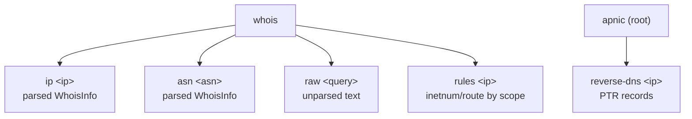
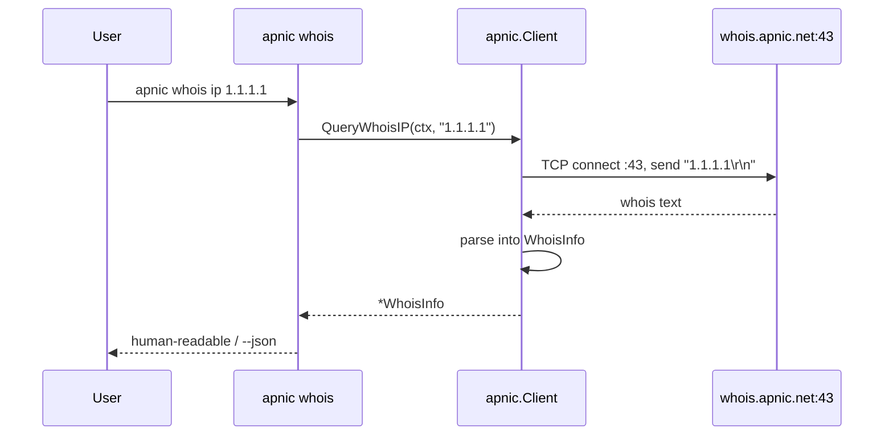

# Whois Commands

The `whois` command group queries the APNIC whois server (`whois.apnic.net:43`) and returns either parsed objects or raw text. A `reverse-dns` top-level command performs PTR lookups against the DNS.

Source: [`cmd_whois.go`](https://github.com/cyberspacesec/apnic-skills/blob/main/cmd/apnic/cmd_whois.go).

## Command Structure



`whois ip` and `whois asn` parse the response into a `WhoisInfo` struct (network, netname, CIDR, country, org, status, origin ASN, abuse contact, parent, created, last-updated). `whois raw` returns the unparsed text, suitable for ad-hoc queries against any whois object type. `whois rules` queries inetnum/route objects around an IP by scope.

## `apnic whois ip <ip>`

Parsed whois lookup for an IP address.

```bash
apnic whois ip 1.1.1.1
apnic --json whois ip 1.1.1.1 | jq '.cidr, .country, .org_name'
```

Human-readable output:

```
Network:      1.1.1.0 - 1.1.1.255
NetName:      APNIC-LABS
CIDR:         [1.1.1.0/24]
Country:      AU
Org:          APNIC and Cloudflare DNS Resolver project
Status:       ASSIGNED PORTABLE
Origin ASN:   AS13335
Abuse:        AA1412-AP
Parent:       
Created:      0001-01-01 00:00:00 +0000 UTC
LastUpdated:  2023-04-26 22:57:58 +0000 UTC
```

## `apnic whois asn <asn>`

Parsed whois lookup for an ASN. Accepts either `13335` or `AS13335` (the `AS`/`as` prefix is stripped by `normalizeASN`).

```bash
apnic whois asn 13335
apnic whois asn AS13335
```

Human-readable output prints `Network`, `Country`, and `Org`.

## `apnic whois raw <query> [--flags FLAGS]`

Raw whois query: returns the unparsed text response. Pass any whois query string (an IP, an ASN, an object key, or a whois search term).

```bash
apnic whois raw "1.1.1.1"
apnic whois raw "AS13335"
apnic whois raw -i mnt-by MAINT-APNIC
```

Output is the verbatim text from the whois server with no transformation. This is the escape hatch when the structured subcommands do not expose a field you need.

Pass APNIC whois flags via `--flags`:

```bash
# Brief output (no contact details)
apnic whois raw 1.1.1.1 --flags B

# All less-specific inetnums (same data as 'whois rules --scope all-less' but unparsed)
apnic whois raw 1.1.1.1 --flags "-L"

# Abuse mailbox only
apnic whois raw 1.1.1.1 --flags "-b"
```

## `apnic whois rules <ip>`

Query inetnum/route objects around an IP by specificity scope. Maps a human-friendly `--scope` to an APNIC whois flag:

| Scope | Flag | Returns |
|-------|------|---------|
| `exact` | `-x` | Only an exact prefix match |
| `one-less` | `-l` | First level less specific (wider) inetnum/route |
| `all-less` | `-L` | All levels less specific (wider), including exact |
| `one-more` | `-m` | First level more specific (narrower) inetnum/route |
| `all-more` | `-M` | All levels more specific (narrower) |

```bash
# All enclosing allocations for 1.1.1.1 (IANA block → APNIC block → APNIC-LABS)
apnic whois rules 1.1.1.1 --scope all-less

# All more-specific subnets (often empty — 1.1.1.0/24 is the leaf)
apnic whois rules 1.1.1.1 --scope all-more

# JSON array of all matching objects
apnic --json whois rules 1.1.1.1 --scope all-less | jq '.[] | {Network, CIDR, Country}'
```

Because `all-less`/`all-more` return multiple objects, the output is a list; each object is printed as a numbered block (human-readable) or a JSON array (`--json`).

## `apnic reverse-dns <ip>`

Reverse DNS (PTR) lookup for an IP address. This is a top-level command, not under `whois`, because it queries DNS rather than the whois server.

```bash
apnic reverse-dns 1.1.1.1
apnic --json reverse-dns 1.1.1.1
```

Human-readable output prints one PTR record per line, or `(no PTR records)` if none exist. With `--json`, a JSON array of strings is emitted.

## Query Flow



For `whois raw`, the parse step is skipped and the raw text is returned directly. For `reverse-dns`, the request goes to the resolver (not the whois server) and returns a `[]string` of PTR names.

## Global flags of note

| Flag | Effect on whois |
|------|-----------------|
| `--whois-server` | Override the default `whois.apnic.net:43`. |
| `--timeout` | Per-request timeout (whois queries can be slow; consider `--timeout 60s`). |
| `--stealth` / `--jitter` | Apply to HTTP only; whois is a raw TCP protocol and is not rate-jittered. Use `--rate-limit` for global throttling. |
| `--json` | Emit the parsed struct (`WhoisInfo`) or, for `raw`/`reverse-dns`, the raw text/array. |

## Output summary

| Subcommand | Human-readable | `--json` |
|------------|----------------|----------|
| `whois ip` | Labelled key/value fields | `WhoisInfo` object |
| `whois asn` | Labelled key/value fields | `WhoisInfo` object |
| `whois raw` | Raw text | Raw text (string) |
| `reverse-dns` | One PTR per line, or `(no PTR records)` | JSON array of strings |
