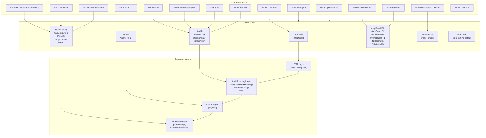

# Client Configuration

The `apnic-skills` client is highly configurable via functional options. This page documents all available options, their defaults, and common configuration patterns for anti-scraping, chunked downloads, caching, and service endpoints.

## Default Client

Calling `NewClient()` with no options provides sensible defaults for interactive use:

```go
client := apnic.NewClient()
```

| setting | default |
|---------|---------|
| HTTP client timeout | 15 seconds |
| Whois server | `whois.apnic.net:43` |
| Whois timeout | 10 seconds |
| RDAP base URL | `https://rdap.apnic.net` |
| Stats base URL | `https://ftp.apnic.net/apnic/stats/apnic/` |
| Cache TTL | 30 minutes |
| User-Agent (non-stealth) | `APNIC-Go-SDK/1.0 (security)` |
| Stealth | `true` (browser headers + jitter) |
| Browser UA | mainstream Chrome |
| Jitter range | 200–800 ms per request |
| Rate limit | none (unlimited) |
| Chunked download | enabled (4 workers, 2 MiB chunks, 512 KiB minimum) |
| RRDP base URL | `https://rrdp.apnic.net` |
| Thyme base URL | `https://thyme.apnic.net` |
| Thyme default source | `current` (global view) |
| FTP base URL | `https://ftp.apnic.net/` |
| REx base URL | `https://api.rex.apnic.net` |

All defaults are safe for normal use. Override them only when you have specific requirements (throttled networks, custom endpoints, integration tests, or unusual throughput patterns).

## All Options (Alphabetical)

| Option | Description |
|--------|-------------|
| `WithBrowserUserAgent(ua)` | User-Agent string used when stealth is enabled |
| `WithCacheTTL(d)` | Cache time-to-live for `Get*` methods (stats, extended, assigned, legacy, transfers, changes, IRR, telemetry) |
| `WithChunkSize(bytes)` | Target chunk size for chunked download (0 = split evenly across workers) |
| `WithDownloadTimeout(d)` | Per-chunk timeout for chunked downloads |
| `WithFTPBaseURL(url)` | APNIC FTP root URL (IRR, transfers-all, zones, telemetry) |
| `WithHTTPClient(hc)` | Custom `*http.Client` (overrides default 15s timeout) |
| `WithJitter(min, max)` | Random delay range per HTTP request when stealth is on |
| `WithMaxConcurrentDownloads(n)` | Parallel Range requests for large files (≤1 disables chunking) |
| `WithRateLimit(perSecond)` | Token-bucket rate limit (requests/second, 0 = unlimited) |
| `WithRDAPBaseURL(url)` | Base URL for RDAP queries |
| `WithRDAPDate(t)` | Default point-in-time for all RDAP lookups (APNIC `history_version_0`) |
| `WithRExBaseURL(url)` | Base URL for REx cross-RIR resource registry |
| `WithRRDPBaseURL(url)` | Base URL for RPKI RRDP |
| `WithStatsBaseURL(url)` | Base URL for delegated/extended/assigned/legacy stats files |
| `WithStealth(enable)` | Enable browser mimicry headers and request jitter (default `true`) |
| `WithThymeBaseURL(url)` | Base URL for thyme BGP analysis |
| `WithThymeSource(src)` | Default thyme data source: `current`, `au`, or `hk` |
| `WithUserAgent(ua)` | User-Agent when stealth is disabled |
| `WithWhoisServer(addr)` | Whois server address (`host:port`) |
| `WithWhoisTimeout(d)` | Whois connection timeout |

## Configuration Layers

The Client is built in layers. Functional options mutate these fields directly. The diagram below shows how HTTP, anti-scraping, caching, and download layers relate.



## Option Pattern in Action

Each option is a function that mutates the `*Client`. They are applied in order, so later options override earlier ones. This pattern enables clean, declarative configuration.

```go
client := apnic.NewClient(
    apnic.WithCacheTTL(10*time.Minute),
    apnic.WithUserAgent("my-scanner/2.0"),
    apnic.WithRDAPBaseURL("https://rdap.apnic.net"),
    apnic.WithWhoisServer("whois.apnic.net:43"),
    apnic.WithWhoisTimeout(15*time.Second),
    apnic.WithHTTPClient(&http.Client{Timeout: 30 * time.Second}),
)
```

Internally, `NewClient` constructs a `Client` with defaults, then applies each `Option` in sequence:

```go
func NewClient(opts ...Option) *Client {
    c := &Client{
        httpClient:   &http.Client{Timeout: 15 * time.Second},
        whoisServer:  "whois.apnic.net:43",
        whoisTimeout: 10 * time.Second,
        // ... other defaults
    }
    for _, opt := range opts {
        opt(c)  // mutate c in place
    }
    return c
}
```



```mermaid
flowchart LR
    subgraph Defaults["Default Client"]
        D1["httpClient.Timeout = 15s"]
        D2["cache.ttl = 30m"]
        D3["stealth = true"]
        D4["browserUA = Chrome"]
        D5["jitter = 200–800ms"]
        D6["maxConcurrent = 4"]
        D7["chunkSize = 2MiB"]
    end

    subgraph Chain["Option Chain"]
        O1["WithCacheTTL(10m)"]
        O2["WithJitter(0, 0)"]
        O3["WithRateLimit(5)"]
    end

    subgraph Final["Final Client"]
        F1["httpClient.Timeout = 15s"]
        F2["cache.ttl = 10m"]
        F3["stealth = true"]
        F4["jitter = 0 (disabled)"]
        F5["rateLimiter = 5 req/s"]
    end

    Defaults --> Chain --> Final
```

## Anti-Scraping Configuration

APNIC services are public but rate-limited. The SDK's anti-scraping stack (browser mimicry, jitter, token bucket) is enabled by default and tuned for courtesy. Adjust these knobs if you hit throttling or need higher throughput.

### What Stealth Mode Does

When `WithStealth(true)` (the default), every HTTP request from the SDK includes a full set of mainstream Chrome headers:

| header | value |
|--------|-------|
| `User-Agent` | Chrome UA (customizable via `WithBrowserUserAgent`) |
| `Accept` | `text/html,application/xhtml+xml,application/xml;q=0.9,*/*;q=0.8` |
| `Accept-Language` | `en-US,en;q=0.9` |
| `Accept-Encoding` | `gzip` (SDK handles decompression) |
| `Sec-Fetch-*` | `Sec-Fetch-Dest: document`, `Sec-Fetch-Mode: navigate`, `Sec-Fetch-Site: none`, `Sec-Fetch-User: ?1` |
| `Sec-Ch-Ua-*` | `Sec-Ch-Ua: "Chromium";v="130"`, `Sec-Ch-Ua-Mobile: ?0`, `Sec-Ch-Ua-Platform: "Linux"` |
| `Upgrade-Insecure-Requests` | `1` |

The whois port-43 connection adds a random sleep between 200–800 ms (default jitter range) before each query.

### Disabling Stealth

If your use case cannot tolerate extra headers (e.g., a minimal scanner, or integration with a gateway that rejects unknown headers), disable stealth:

```go
client := apnic.NewClient(
    apnic.WithStealth(false),       // send only UA + Accept
    apnic.WithUserAgent("my-bot/1.0"),
)
```

When stealth is off, the SDK sends a minimal `User-Agent` and `Accept` header only — the pre-stealth behavior. The jitter is also skipped.

### Jitter and Rate Limiting

Jitter randomizes the interval between HTTP requests. Rate limiting enforces a global ceiling. Both are orthogonal; you can have one without the other.

```go
// Tighter jitter for higher throughput (riskier)
client := apnic.NewClient(
    apnic.WithJitter(50*time.Millisecond, 150*time.Millisecond),
)

// No jitter (for benchmarks or trusted networks)
client := apnic.NewClient(
    apnic.WithJitter(0, 0),  // zero min disables jitter entirely
)

// Rate limit to 2 requests per second, burst = 1
client := apnic.NewClient(
    apnic.WithRateLimit(2.0),
)

// Combine both: max 5 req/s, with 100–300ms random jitter on top
client := apnic.NewClient(
    apnic.WithRateLimit(5.0),
    apnic.WithJitter(100*time.Millisecond, 300*time.Millisecond),
)
```

The token bucket has a burst capacity of 1. A rate limit of `2.0` means the bucket refills at 2 tokens per second; a request costs 1 token. If the bucket is empty, the SDK blocks until a token is available.

### Testing Without Jitter

For unit or integration tests, jitter adds non-determinism. Disable it via environment variable rather than code:

```bash
APNIC_NO_JITTER=1 go test ./...
```

This skips the `jitter()` call entirely, making request timing deterministic. The SDK still applies rate limiting and browser headers.

## Chunked Download Configuration

Large APNIC FTP files (delegated ~4.3 MB, extended, IRR dumps up to 50+ MB) are throttled per-connection to ~8–22 KB/s. A single TCP connection for a 50 MB IRR dump can take over 40 minutes — far beyond typical timeouts.

The SDK's chunked download layer probes Range support, then splits the file into ~2 MiB chunks and downloads them with 4 parallel Range requests. Each connection gets its own throttle bucket, yielding 3–4× throughput. The chunks are reassembled in order via `io.Pipe` and decompressed on the fly.

### Turning Chunking On/Off

```go
// Disable chunking (single connection, legacy behavior)
client := apnic.NewClient(
    apnic.WithMaxConcurrentDownloads(0),  // or 1
)

// Increase parallelism (8 workers)
client := apnic.NewClient(
    apnic.WithMaxConcurrentDownloads(8),
)

// Smaller chunks (helpful on very slow networks)
client := apnic.NewClient(
    apnic.WithChunkSize(1 * 1024 * 1024),  // 1 MiB
)

// Longer per-chunk timeout
client := apnic.NewClient(
    apnic.WithDownloadTimeout(10 * time.Minute),
)
```

### How Chunked Download Works

```mermaid
flowchart TB
    subgraph Probe["Range Probe"]
        Start["fetchText(url)"]
        Probe["GET Range: bytes=0-0"]
        Check{"Content-Length<br/>Accept-Ranges: bytes?"}
    end

    subgraph Strategy["Strategy Selection"]
        Chunked["Chunked Download<br/>Split by chunkSize<br/>Round-robin N workers"]
        Single["Single Connection<br/>io.ReadAll"]
    end

    subgraph Workers["Parallel Workers (N=4 default)"]
        W1["Worker 0<br/>Range 0–2MiB"]
        W2["Worker 1<br/>Range 2MiB–4MiB"]
        W3["Worker 2<br/>Range 4MiB–6MiB"]
        W4["Worker 3<br/>Range 6MiB–8MiB"]
        WN["... rotate through<br/>remaining chunks"]
    end

    subgraph Merge["Merge & Decompress"]
        Pipe["io.Pipe<br/>ordered by chunk index"]
        Gunzip["gzip.NewReader<br/>if .gz extension"]
        Parse["Parser<br/>line-by-line"]
    end

    Start --> Probe --> Check
    Check -->|yes| Chunked --> W1 & W2 & W3 & W4 --> WN --> Pipe --> Gunzip --> Parse
    Check -->|no| Single --> Gunzip --> Parse
```

Key behaviors:

- **Probe first:** A `Range: bytes=0-0` request checks whether the server supports Range requests and reveals `Content-Length`. If Range is unsupported or the response is transport-layer gzipped (APNIC does not do this, but some CDNs might), the SDK falls back to a single connection.
- **Minimum size:** Files smaller than `minSize` (default 512 KiB) skip chunking entirely — the overhead of Range probing outweighs the benefit.
- **Timeouts:** Each chunk request uses `WithDownloadTimeout` (default inherits HTTP client timeout). If a chunk stalls past its deadline, the SDK splits it into two sub-chunks and retries with new workers, avoiding a dead TCP connection from killing the entire download.
- **Decompression:** If the URL ends in `.gz`, the SDK transparently wraps the merged stream with `gzip.NewReader`.

### Troubleshooting Chunked Downloads

| symptom | likely cause | fix |
|---------|--------------|-----|
| `context deadline exceeded` on large IRR dump | per-chunk timeout too short | `WithDownloadTimeout(5 * time.Minute)` |
| still timing out | network is very slow | `WithChunkSize(512 * 1024)` + `WithDownloadTimeout(10 * time.Minute)` |
| `403 Forbidden` | Range probing rejected | server does not allow Range; SDK falls back to single connection automatically |
| multiple parallel connections still slow | APNIC FTP per-IP throttle | reduce `WithMaxConcurrentDownloads` and retry later; or distribute requests across IPs |

## Cache Configuration

The SDK caches large, static datasets (delegated, extended, assigned, legacy, transfers, changes, IRR dumps, telemetry) in memory for the duration of the cache TTL. The `Get*` methods (`GetDelegatedEntries`, `GetExtendedEntries`, etc.) return cached data if available; `Fetch*` methods always refetch.

### Default Cache Behavior

```go
client := apnic.NewClient()  // TTL = 30 minutes

// First call: fetches from APNIC FTP, parses, caches
entries, _ := client.GetDelegatedEntries(ctx)

// Second call within 30 min: returns cached result, no network I/O
cached, _ := client.GetDelegatedEntries(ctx)
```

### Adjusting TTL

```go
// Shorter TTL for fresher data
client := apnic.NewClient(
    apnic.WithCacheTTL(5 * time.Minute),
)

// Longer TTL for batch jobs that re-use the same dataset
client := apnic.NewClient(
    apnic.WithCacheTTL(2 * time.Hour),
)

// Effectively no caching (TTL = 1 nanosecond)
client := apnic.NewClient(
    apnic.WithCacheTTL(1),
)
```

The cache is an in-memory map with a timestamp per entry. It is not persisted to disk. Restarting your process clears the cache.

### Cache vs Fetch Methods

| method | cache behavior |
|--------|----------------|
| `GetDelegatedEntries(ctx)` | returns cached if within TTL, otherwise fetches |
| `FetchDelegatedEntries(ctx)` | always fetches from network, updates cache |
| `GetExtendedEntries(ctx)` | returns cached if within TTL |
| `FetchExtendedEntries(ctx)` | always fetches |
| `GetIRRDatabase(ctx, objType)` | returns cached if within TTL |
| `FetchIRRDatabase(ctx, objType)` | always fetches |

Use `Fetch*` when you know the upstream data has changed and want the latest. Use `Get*` for most read-only workloads.

## Service Endpoint Configuration

Each APNIC service has its own base URL. Override these for testing against a mirror, a local cache, or an alternate endpoint.

```go
client := apnic.NewClient(
    apnic.WithRDAPBaseURL("https://rdap-example.labs.apnic.net"),
    apnic.WithStatsBaseURL("https://mirror.example.org/apnic/stats/apnic/"),
    apnic.WithWhoisServer("whois.example.org:43"),
    apnic.WithRRDPBaseURL("https://rrdp-example.labs.apnic.net"),
    apnic.WithThymeBaseURL("https://thyme-example.labs.apnic.net"),
    apnic.WithFTPBaseURL("https://ftp.example.org/"),
    apnic.WithRExBaseURL("https://rex-example.labs.apnic.net"),
)
```

### RDAP Point-in-Time (Historical Queries)

APNIC's RDAP service supports `history_version_0` for point-in-time lookups. Set a global default:

```go
t, _ := time.Parse(time.RFC3339, "2022-06-01T00:00:00Z")
client := apnic.NewClient(
    apnic.WithRDAPDate(t),
)
// All RDAP calls now query the resource state as of 2022-06-01
net, _ := client.RDAPLookupIP(ctx, "1.1.1.1")
```

Or override per-call with the `*At` variants:

```go
netNow, _    := client.RDAPLookupIP(ctx, "1.1.1.1")                      // live
netThen, _   := client.RDAPLookupIPAt(ctx, "1.1.1.1", "2020-01-01T00:00:00Z") // historical
```

### thyme BGP Default Source

The thyme service publishes data from three vantage points. Set a default source so you don't have to pass it per-call:

```go
// Default to Brisbane
client := apnic.NewClient(
    apnic.WithThymeSource("au"),
)
// All FetchBGPSummary, FetchBGPBadPrefixes, etc. use "au" unless overridden

// Per-call override still works
hkBadPfx, _ := client.FetchBGPBadPrefixes(ctx, "hk")
```

## Custom HTTP Client

For fine-grained control (proxy, TLS config, connection pooling), inject a custom `*http.Client`:

```go
import (
    "net/http"
    "net/url"
    "time"
)

proxyURL, _ := url.Parse("http://proxy.example.org:8080")
transport := &http.Transport{
    Proxy: http.ProxyURL(proxyURL),
    TLSClientConfig: &tls.Config{InsecureSkipVerify: false},
    MaxIdleConns:        100,
    MaxIdleConnsPerHost: 10,
    IdleConnTimeout:     90 * time.Second,
}

client := apnic.NewClient(
    apnic.WithHTTPClient(&http.Client{
        Transport: transport,
        Timeout:   60 * time.Second,
    }),
)
```

When you provide a custom HTTP client, its timeout supersedes the default 15s. However, chunked download timeouts are controlled separately by `WithDownloadTimeout`, which defaults to inheriting the HTTP client timeout.

## Summary

| concern | options |
|---------|---------|
| anti-scraping | `WithStealth`, `WithBrowserUserAgent`, `WithJitter`, `WithRateLimit` |
| caching | `WithCacheTTL` |
| chunked download | `WithMaxConcurrentDownloads`, `WithChunkSize`, `WithDownloadTimeout` |
| endpoints | `WithRDAPBaseURL`, `WithStatsBaseURL`, `WithWhoisServer`, `WithRRDPBaseURL`, `WithThymeBaseURL`, `WithFTPBaseURL`, `WithRExBaseURL` |
| thyme source | `WithThymeSource` |
| RDAP historical | `WithRDAPDate` |
| whois | `WithWhoisServer`, `WithWhoisTimeout` |
| HTTP layer | `WithHTTPClient`, `WithUserAgent` |

For most users, the defaults are optimal. Override only when you hit a specific constraint (slow network, custom proxy, alternate endpoint, test environment). See [Chunked Download](../architecture/chunked-download.md) for an in-depth treatment of the Range-probe / multi-worker / merge pipeline.