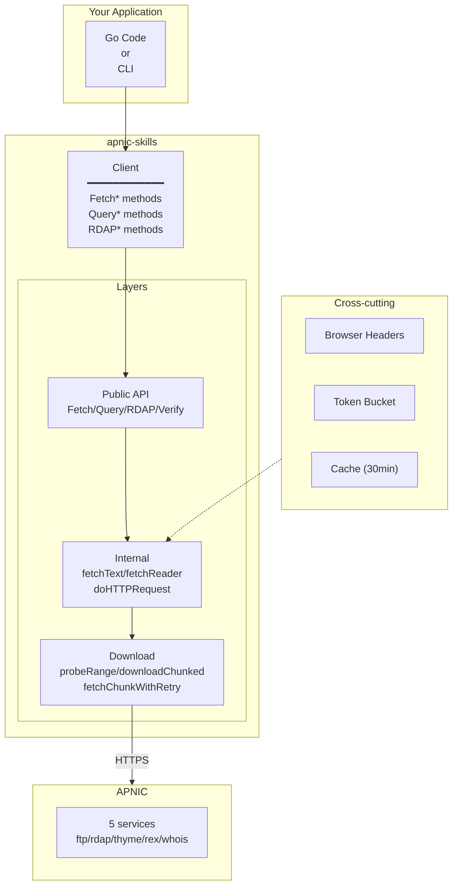

# Getting Started

Welcome to apnic-skills! This guide helps you get up and running with the APNIC Go SDK.

## What is apnic-skills?

apnic-skills is a comprehensive Go SDK for APNIC (Asia-Pacific Network Information Centre) public data services. It provides:

- **Full coverage** of all APNIC data endpoints (stats, RDAP, whois, IRR, RPKI/RRDP, thyme BGP, REx, transfers, changes, telemetry)
- **Anti-scraping** built-in (browser mimicry, rate limiting, jitter)
- **Chunked download** for large files (bypassing FTP throttling)
- **Chain filtering** fluent API
- **Data integrity** verification (MD5 + PGP)
- **CLI** covering all SDK capabilities

## Architecture at a Glance

## Where to Next?

1. **[Installation](installation.md)** — Install the SDK and CLI
2. **[Quick Start](quick-start.md)** — Your first query in 5 minutes
3. **[Configuration](configuration.md)** — Customize client behavior
4. **[SDK Reference](../sdk/index.md)** — Browse the full API
5. **[CLI Reference](../cli/index.md)** — Learn the command-line tool
6. **[Workflows](../workflows/index.md)** — Real-world usage patterns