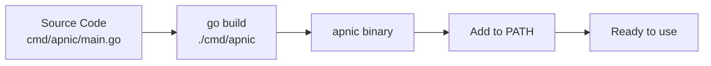

# Installation

## Prerequisites

- **Go** 1.21 or later
- Internet access (the SDK queries APNIC public services in real-time)

## Install the SDK

```bash
go get github.com/cyberspacesec/apnic-skills
```

## Install the CLI

Build the `apnic` CLI from source:

```bash
git clone https://github.com/cyberspacesec/apnic-skills.git
cd apnic-skills
go build -o bin/apnic ./cmd/apnic
```

Add to your `PATH`:

```bash
# Linux/macOS
export PATH="$PATH:$(pwd)/bin"
echo 'export PATH="$PATH:/path/to/apnic-skills/bin"' >> ~/.bashrc
```

Verify the installation:

```bash
apnic --help
```

## Build Flow



## Module Dependencies

The SDK uses minimal dependencies:

| Module | Purpose |
|--------|---------|
| `github.com/spf13/cobra` | CLI framework (CLI only) |
| Go standard library | HTTP, parsing, context, bufio |

## Verify Installation

```go
package main

import (
    "fmt"
    apnic "github.com/cyberspacesec/apnic-skills"
)

func main() {
    client := apnic.NewClient()
    fmt.Printf("Client created: %+v\n", client)
}
```

```bash
go run main.go
```

## Troubleshooting

### `module github.com/cyberspacesec/apnic-skills: not found`

Ensure your Go environment can reach GitHub. For private networks, configure `GOPROXY`:

```bash
go env -w GOPROXY=https://goproxy.cn,direct
```

### `context deadline exceeded` on first query

APNIC FTP throttles large files. The SDK uses chunked download by default (4 connections). If timeouts persist:

```go
client := apnic.NewClient(
    apnic.WithDownloadTimeout(10 * time.Minute),
    apnic.WithChunkSize(1024 * 1024), // 1MiB chunks
)
```

See [Chunked Download](../architecture/chunked-download.md) for details.