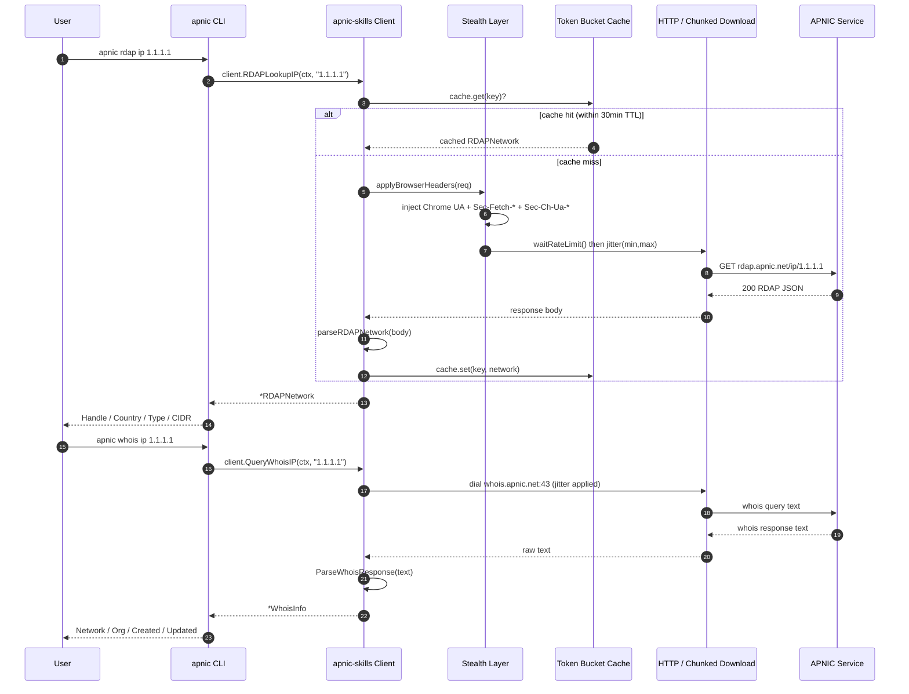
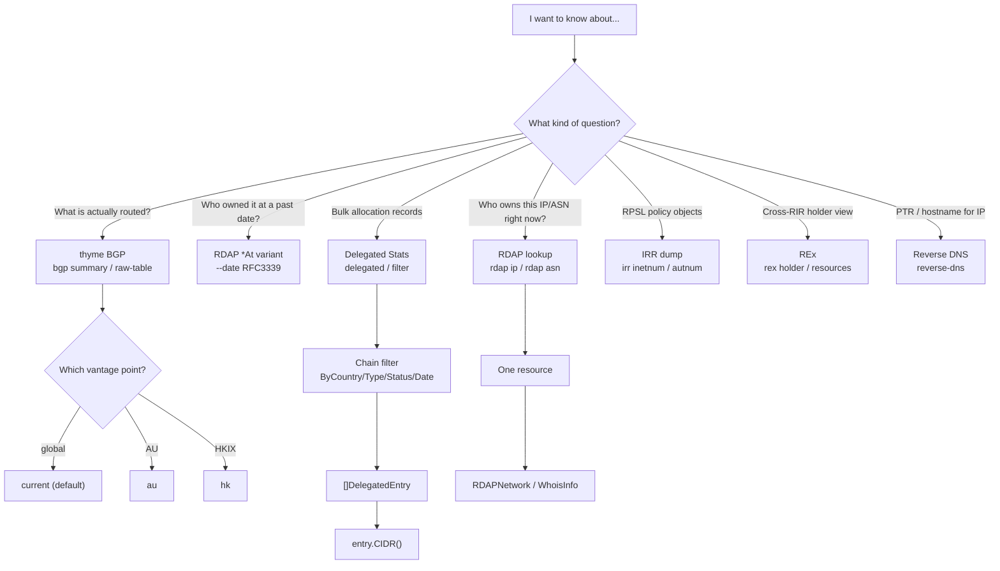

# Quick Start

This guide walks you through your first APNIC queries with both the `apnic` CLI and the Go SDK. By the end you will have performed an RDAP IP lookup, filtered delegated stats, queried Whois, resolved reverse DNS, and pulled thyme BGP summary metrics.

> Prerequisite: complete [Installation](installation.md) first. The examples below assume the `apnic` binary is on your `PATH` and the SDK is importable as `github.com/cyberspacesec/apnic-skills`.

## End-to-end Request Flow

Every query — whether issued from the CLI or the SDK — travels through the same pipeline. The CLI is a thin wrapper over the SDK; understanding this flow explains where anti-scraping, rate limiting, caching, and chunked download kick in.



Notice the cache short-circuit at step 5: a second `RDAPLookupIP` for the same IP within the cache TTL (default 30 minutes) returns without any network call. The stealth layer and rate limiter only run on the cache-miss path.

## 1. Your First Query: RDAP IP Lookup

RDAP (Registration Data Access Protocol) is the modern, structured replacement for Whois. The `rdap ip` subcommand returns a JSON object describing the network registration for an IPv4 or IPv6 address.

**CLI:**

```bash
apnic rdap ip 1.1.1.1
```

Sample output:

```
Handle:  1.1.1.0 - 1.1.1.255
Country: AU
Type:    ASSIGNED PORTABLE
CIDR:    1.1.1.0/24
```

Add `--json` for the raw RDAP payload (useful for piping into `jq`):

```bash
apnic rdap ip 1.1.1.1 --json | jq '.events[] | {eventAction, eventDate}'
```

**SDK:**

```go
package main

import (
    "context"
    "fmt"
    "log"

    apnic "github.com/cyberspacesec/apnic-skills"
)

func main() {
    client := apnic.NewClient()
    ctx := context.Background()

    network, err := client.RDAPLookupIP(ctx, "1.1.1.1")
    if err != nil {
        log.Fatal(err)
    }
    fmt.Printf("Network: %s, Country: %s, Type: %s\n",
        network.Handle, network.Country, network.Type)

    // Point-in-time historical lookup (RFC 3339, UTC instant):
    past, err := client.RDAPLookupIPAt(ctx, "1.1.1.1", "2020-06-01T00:00:00Z")
    if err != nil {
        log.Fatal(err)
    }
    fmt.Printf("State on 2020-06-01: %s\n", past.Handle)
}
```

The `*At` variants query APNIC's `history_version_0` extension and return the resource state as it was at that UTC instant. You can also set a global default with the `WithRDAPDate(t)` option so every RDAP call is historical without changing call sites.

## 2. Delegated Stats + Chain Filtering

The delegated stats file (`delegated-apnic-latest`) is the canonical record of all IP/ASN allocations in the APNIC region. It is large (~4.3 MB), so the SDK downloads it with chunked Range requests and caches the parsed result for 30 minutes by default.

**CLI:**

```bash
# Total entries in the latest delegated stats
apnic delegated --json | jq '.Entries | length'

# Pre-filtered subset: China-allocated IPv4
apnic filter --source delegated --country CN --type ipv4
```

**SDK with chain filtering:**

The fluent `Filter` builder lets you compose predicates without nesting function calls. Each method returns the same builder, so calls chain naturally and the order is preserved.

```go
client := apnic.NewClient()
ctx := context.Background()

entries, err := client.GetDelegatedEntries(ctx) // cached variant of FetchDelegatedEntries
if err != nil {
    log.Fatal(err)
}
fmt.Printf("Total entries: %d\n", len(entries))

// Chain: country = CN, type = ipv4, status = allocated
result := apnic.NewFilter(entries).
    ByCountry("CN").
    ByType("ipv4").
    ByStatus("allocated").
    Result()
fmt.Printf("CN allocated IPv4 entries: %d\n", len(result))

// Add a date-range predicate to the same chain
import "time"
start, _ := time.Parse("2006-01-02", "2020-01-01")
end, _ := time.Parse("2006-01-02", "2024-12-31")

recent := apnic.NewFilter(entries).
    ByCountry("CN").
    ByType("ipv4").
    ByStatus("allocated").
    ByDateRange(start, end).
    Result()
```

Each `DelegatedEntry` carries `Registry`, `Country`, `Type` (`ipv4`/`ipv6`/`asn`), `Start`, `Value`, `Date`, `Status`, and `OpaqueID`. Call `entry.CIDR()` to materialize the prefix as a `*net.IPNet` for subnet math.

## 3. Whois IP Query

Whois returns the human-readable registration record. The SDK dials `whois.apnic.net:43` directly (TCP, port 43), applies the same jitter as HTTP requests, and parses the response into a structured `WhoisInfo`.

**CLI:**

```bash
apnic whois ip 1.1.1.1
apnic whois asn 13335      # Cloudflare's ASN
apnic whois raw "1.1.1.1"  # unparsed text
```

**SDK:**

```go
info, err := client.QueryWhoisIP(ctx, "1.1.1.1")
if err != nil {
    log.Fatal(err)
}
fmt.Printf("Network: %s\nOrg: %s\nCreated: %s\nUpdated: %s\n",
    info.NetworkName, info.OrgName, info.Created, info.Updated)

// Raw, unparsed whois text
raw, err := client.QueryWhois(ctx, "AS13335")
if err != nil {
    log.Fatal(err)
}
fmt.Println(raw)
```

Whois queries are not cached (only the larger stats/RDAP fetches are). Tune the connection deadline with `WithWhoisTimeout(15 * time.Second)`.

## 4. Reverse DNS Lookup

Reverse DNS resolves an IP to its PTR record(s) via a standard DNS lookup. The SDK uses an indirectable resolver (`SetLookupAddr`) so the empty-result branch is fully testable, but by default it calls `net.DefaultResolver.LookupAddr`.

**CLI:**

```bash
apnic reverse-dns 1.1.1.1
# one.one.one.one.
```

**SDK:**

```go
names, err := client.ReverseDNS(ctx, "1.1.1.1")
if err != nil {
    log.Fatal(err)
}
for _, n := range names {
    fmt.Println(n) // e.g. one.one.one.one.
}
```

## 5. thyme BGP Summary (with `--bgp-source`)

APNIC's thyme service publishes periodic snapshots of the global BGP routing table from three vantage points. The `summary` subcommand fetches `data-summary`, a colon-separated key/value file of metrics (entries examined, AS count, ROA coverage, address-space % announced, and so on).

The `--bgp-source` global flag selects the vantage point. The SDK equivalent is the per-call `source` argument or the `WithThymeSource` default.

| `--bgp-source` | vantage point | notes |
|----------------|---------------|-------|
| `current` (default) | global view | the broadest snapshot |
| `au` | Brisbane | APNIC headquarters perspective |
| `hk` | HKIX | Hong Kong Internet Exchange |

**CLI:**

```bash
# Default (current, global view)
apnic bgp summary

# Brisbane vantage point
apnic bgp --bgp-source au summary

# JSON output for scripting
apnic bgp --bgp-source hk summary --json | jq '.Entries[] | select(.Key=="AS count")'
```

**SDK:**

```go
// Use the client default (set via WithThymeSource, or "current" if unset)
summary, err := client.FetchBGPSummary(ctx)
if err != nil {
    log.Fatal(err)
}
for _, e := range summary.Entries {
    fmt.Printf("%s\t%s\n", e.Key, e.Value)
}

// Override the source per call
auSummary, err := client.FetchBGPSummary(ctx)               // default source
badPfx, err    := client.FetchBGPBadPrefixes(ctx, "au")     // Brisbane
usedAutnums, _ := client.FetchBGPUsedAutnums(ctx, "hk")     // HKIX

// Pin the client default to Brisbane for all thyme calls
auClient := apnic.NewClient(apnic.WithThymeSource("au"))
_ = auClient
```

> `FetchBGPASNMap` is a local aggregation of `data-raw-table` — it issues no extra request, so it ignores `source`.

## Choosing a Query Path

APNIC exposes the same resource through several lenses. The flowchart below helps you pick the right entry point for a given question. As a rule of thumb: use **RDAP** for structured, machine-readable registration data; **Whois** for the human-readable record; **delegated stats** for bulk allocation data; **thyme BGP** for routing reality (what is actually announced); and **IRR** for RPSL policy objects.



## Putting It Together: A 5-Minute IP Investigation

Combining the above calls yields a complete picture of a single IP — registration (RDAP), human record (Whois), DNS (reverse), and routing reality (BGP).

```bash
apnic rdap ip 1.1.1.1                 # registration: country, type, CIDR
apnic whois ip 1.1.1.1                # human record: org, dates
apnic reverse-dns 1.1.1.1             # PTR: one.one.one.one.
apnic bgp summary                     # global routing table metrics
```

The equivalent SDK snippet:

```go
client := apnic.NewClient()
ctx := context.Background()

ip := "1.1.1.1"
net, _   := client.RDAPLookupIP(ctx, ip)
info, _  := client.QueryWhoisIP(ctx, ip)
ptrs, _  := client.ReverseDNS(ctx, ip)
bgp, _   := client.FetchBGPSummary(ctx)

fmt.Printf("RDAP:   %s (%s, %s)\n", net.Handle, net.Country, net.Type)
fmt.Printf("Whois:  %s, created %s\n", info.OrgName, info.Created)
fmt.Printf("PTR:    %v\n", ptrs)
fmt.Printf("BGP:    %d summary metrics\n", len(bgp.Entries))
```

## Where to Next

- **[Configuration](configuration.md)** — tune anti-scraping, caching, chunked download, and per-service base URLs.
- **[CLI Reference](../cli/index.md)** — all 24 subcommands and their flags.
- **[SDK Reference](../sdk/index.md)** — the full method surface.
- **[Workflows](../workflows/index.md)** — multi-command recipes (country audit, IP full-scope investigation, transfer tracking).
