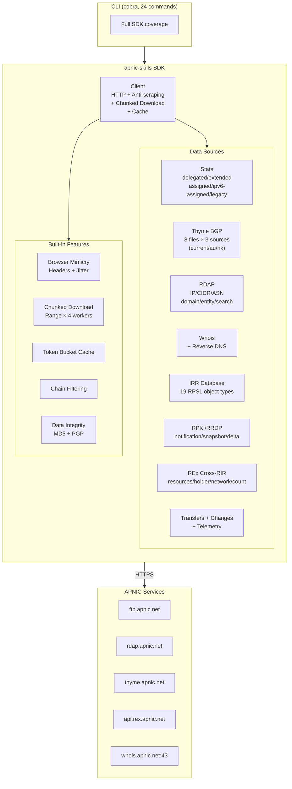
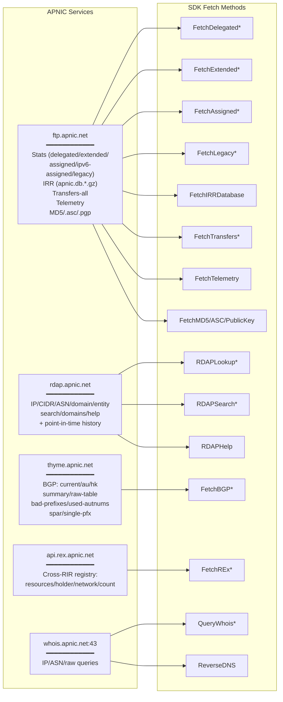
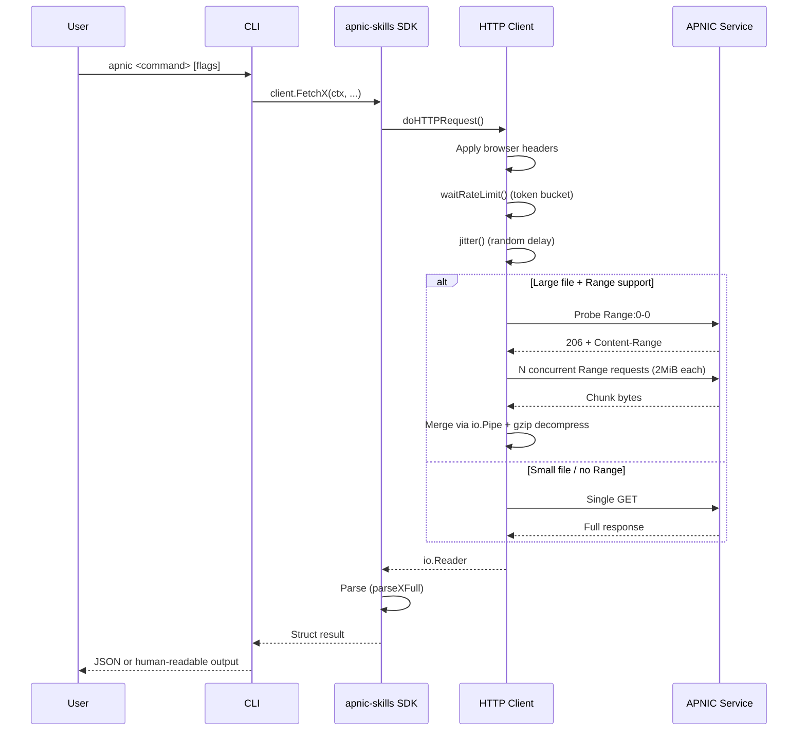

# apnic-skills

> A comprehensive Go SDK for APNIC (Asia-Pacific Network Information Centre) public data services, providing full coverage of all APNIC data endpoints and query capabilities.

[](https://pkg.go.dev/github.com/cyberspacesec/apnic-skills)
[](https://github.com/cyberspacesec/apnic-skills/blob/main/LICENSE)
[](https://github.com/cyberspacesec/apnic-skills)
[](https://goreportcard.com/report/github.com/cyberspacesec/apnic-skills)

## Overview



## Key Features

:material-speedometer: **High Performance** — Multi-connection chunked download for large files (delegated 4.3MB, IRR 50MB+), bypassing APNIC FTP single-connection throttling.

:material-shield-check: **Anti-Scraping** — Browser mimicry headers + token bucket rate limiting + random jitter, default on, configurable.

:material-database-search: **Comprehensive Coverage** — All APNIC public data services: stats, RDAP, whois, IRR, RPKI/RRDP, thyme BGP, REx cross-RIR registry, transfers, changes, telemetry.

:material-filter-variant: **Chain Filtering** — Fluent API for filtering delegated/extended stats by country, type, status, date range, opaque-id.

:material-check-circle: **Data Integrity** — MD5 and PGP signature verification of all published data.

:material-console: **Full CLI** — 24 cobra subcommands covering every SDK capability, with JSON output and global flags.

:material-test-tube: **100% Test Coverage** — SDK statement coverage 100%, CLI named functions 100%.

## Data Source Map



## Quick Links

| Resource | Description |
|----------|-------------|
| [Getting Started](getting-started/index.md) | Installation, quick start, configuration |
| [SDK Reference](sdk/index.md) | Complete API documentation by data source |
| [CLI Reference](cli/index.md) | All 24 subcommands documented |
| [Workflows](workflows/index.md) | Real-world usage workflows with examples |
| [Architecture](architecture/index.md) | HTTP client, anti-scraping, chunked download design |
| [API Types](types/index.md) | Struct/type reference |

## Quick Start

```bash
# Install
go get github.com/cyberspacesec/apnic-skills
```

```go
package main

import (
    "context"
    "fmt"
    "log"

    apnic "github.com/cyberspacesec/apnic-skills"
)

func main() {
    client := apnic.NewClient()
    ctx := context.Background()

    // RDAP IP lookup
    network, err := client.RDAPLookupIP(ctx, "1.1.1.1")
    if err != nil {
        log.Fatal(err)
    }
    fmt.Printf("Network: %s, Country: %s, Type: %s\n",
        network.Handle, network.Country, network.Type)

    // Delegated stats with chain filtering
    entries, err := client.GetDelegatedEntries(ctx)
    if err != nil {
        log.Fatal(err)
    }
    cn := apnic.NewFilter(entries).
        ByCountry("CN").
        ByType("ipv4").
        ByStatus("allocated").
        Result()
    fmt.Printf("CN allocated IPv4 entries: %d\n", len(cn))
}
```

## CLI Quick Reference

```bash
# Build
go build -o bin/apnic ./cmd/apnic

# Common commands
apnic delegated --json | jq '.Entries | length'
apnic rdap ip 1.1.1.1
apnic whois ip 1.1.1.1
apnic reverse-dns 1.1.1.1
apnic bgp summary --bgp-source au
apnic irr inetnum
apnic rex holder <opaqueId> apnic
apnic verify integrity --type delegated
```

## End-to-End Data Flow



## License

MIT — see [LICENSE](https://github.com/cyberspacesec/apnic-skills/blob/main/LICENSE).