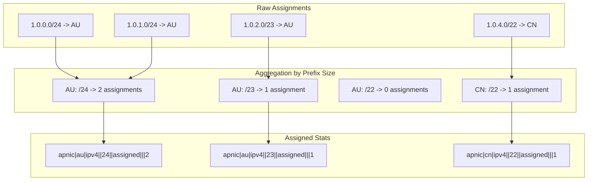
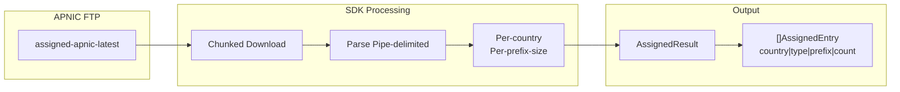
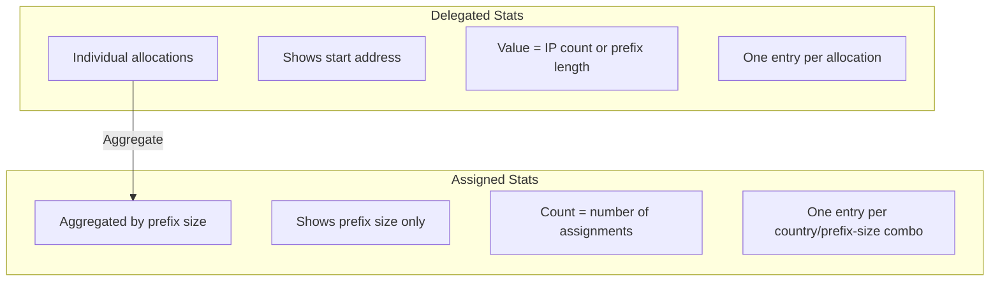

# Assigned Stats

Assigned stats show aggregated assignment counts by prefix size per country. Unlike delegated stats which list individual allocations, assigned stats aggregate assignments by the size of the prefix assigned.

## Overview

The assigned stats file provides a different view of IP address assignments - instead of individual allocation records, it shows how many assignments of each prefix size exist per country. This is useful for understanding assignment patterns and density.



## Methods

| Method | Description |
|--------|-------------|
| `FetchAssignedEntries(ctx)` | Fetch latest assigned stats |
| `GetAssignedEntries(ctx)` | Cached assigned stats (30min TTL) |
| `FetchAssignedEntriesByDate(ctx, date)` | Fetch by date (YYYYMMDD format) |
| `FetchAssignedResult(ctx, date)` | Full result with header/summary/entries |

### Method Signatures

```go
// Fetch latest assigned stats
func (c *Client) FetchAssignedEntries(ctx context.Context) (*AssignedResult, error)

// Cached variant - fetches fresh data if cache expired
func (c *Client) GetAssignedEntries(ctx context.Context) ([]AssignedEntry, error)

// Fetch by specific date (YYYYMMDD format)
func (c *Client) FetchAssignedEntriesByDate(ctx context.Context, date string) (*AssignedResult, error)

// Full result including header and summaries
func (c *Client) FetchAssignedResult(ctx context.Context, date string) (*AssignedResult, error)
```

## Data Structures

### AssignedEntry

```go
type AssignedEntry struct {
    Registry string    // "apnic"
    Country  string    // ISO 3166-1 alpha-2 country code
    Type     string    // "ipv4" or "ipv6"
    Prefix   string    // Prefix size (e.g., "24", "48", "256")
    Count    int64     // Number of assignments of this prefix size
    Status   string    // "assigned", "allocated"
}
```

### AssignedResult

```go
type AssignedResult struct {
    Header    StatsFileHeader // File metadata
    Summaries []StatsSummary  // Per-type summaries
    Entries   []AssignedEntry // Aggregated assignment counts
}
```

## Data Flow



## Examples

### Basic Usage

```go
package main

import (
    "context"
    "fmt"
    "log"

    apnic "github.com/cyberspacesec/apnic-skills"
)

func main() {
    client := apnic.NewClient()
    ctx := context.Background()

    // Fetch latest assigned stats
    result, err := client.FetchAssignedEntries(ctx)
    if err != nil {
        log.Fatal(err)
    }

    fmt.Printf("Total assignment records: %d\n", len(result.Entries))

    // Print summary
    fmt.Printf("\nFile info:\n")
    fmt.Printf("  Version: %s\n", result.Header.Version)
    fmt.Printf("  Records: %d\n", result.Header.Records)
    fmt.Printf("  Date range: %s to %s\n",
        result.Header.StartDate.Format("2006-01-02"),
        result.Header.EndDate.Format("2006-01-02"))

    // Print summaries
    for _, summary := range result.Summaries {
        fmt.Printf("  %s: %d records\n", summary.Type, summary.Count)
    }
}
```

### Analyzing Assignment Patterns

```go
// Analyze IPv4 assignment patterns by prefix size
result, _ := client.FetchAssignedEntries(ctx)

// Group by prefix size
prefixCounts := make(map[string]int64)
for _, entry := range result.Entries {
    if entry.Type == "ipv4" {
        prefixCounts[entry.Prefix] += entry.Count
    }
}

fmt.Println("IPv4 assignments by prefix size:")
for prefix, count := range prefixCounts {
    fmt.Printf("  /%s: %d assignments\n", prefix, count)
}
```

### Country-Specific Analysis

```go
result, _ := client.FetchAssignedEntries(ctx)

// Get assignments for a specific country
var australiaIPv4 []apnic.AssignedEntry
for _, entry := range result.Entries {
    if entry.Country == "AU" && entry.Type == "ipv4" {
        australiaIPv4 = append(australiaIPv4, entry)
    }
}

fmt.Println("Australia IPv4 assignments by prefix size:")
var totalIPs int64
for _, entry := range australiaIPv4 {
    // Prefix size to IP count
    prefixLen, _ := strconv.Atoi(entry.Prefix)
    ipsPerBlock := int64(1) << (32 - prefixLen)
    totalIPsInCategory := entry.Count * ipsPerBlock

    fmt.Printf("  /%s: %d blocks = %d IPs\n",
        entry.Prefix, entry.Count, totalIPsInCategory)
    totalIPs += totalIPsInCategory
}
fmt.Printf("Total IPv4 space assigned in AU: %d IPs\n", totalIPs)
```

### Historical Comparison

```go
// Compare assignments over time
current, _ := client.FetchAssignedResult(ctx, "")
past, _ := client.FetchAssignedResult(ctx, "20230101")

// Calculate total IPv4 assignments for each country
func totalByCountry(result *apnic.AssignedResult) map[string]int64 {
    totals := make(map[string]int64)
    for _, entry := range result.Entries {
        if entry.Type == "ipv4" {
            totals[entry.Country] += entry.Count
        }
    }
    return totals
}

currentTotals := totalByCountry(current)
pastTotals := totalByCountry(past)

fmt.Println("Countries with increased IPv4 assignments:")
for country, count := range currentTotals {
    pastCount := pastTotals[country]
    if count > pastCount {
        fmt.Printf("  %s: %d -> %d (+%d)\n",
            country, pastCount, count, count-pastCount)
    }
}
```

### Using Cached Data

```go
// First call fetches from network
entries1, err := client.GetAssignedEntries(ctx)
if err != nil {
    log.Fatal(err)
}

// Subsequent calls within TTL return cached data
entries2, err := client.GetAssignedEntries(ctx)
if err != nil {
    log.Fatal(err)
}

fmt.Printf("Cached data: %d entries\n", len(entries2))
```

## File Format

The assigned stats file uses a specialized pipe-delimited format:

```
# Header
2|apnic|1737030783|1234|20240101|20240116|0

# Summary lines
apnic|*|ipv4|567
apnic|*|ipv6|89

# Data lines: registry|cc|type||prefix_size||status|||count
apnic|ae|ipv4||4||assigned|||1
apnic|ae|ipv4||8||assigned|||2
apnic|au|ipv4||24||assigned|||150
apnic|au|ipv6||48||assigned|||200
```

## Key Differences from Delegated Stats



| Aspect | Delegated Stats | Assigned Stats |
|--------|----------------|----------------|
| Granularity | Individual allocations | Aggregated counts |
| Address info | Start address shown | No address details |
| Count meaning | IPs in allocation | Number of assignments |
| Use case | Who owns what | Assignment density |

## Prefix Size Interpretation

### IPv4

The prefix field represents the CIDR prefix length:

| Prefix | IPs per block | Example use |
|--------|--------------|-------------|
| 4 | 262,144 | /4 = 16M IPs |
| 8 | 16,777,216 | /8 = Class A |
| 16 | 65,536 | /16 = Class B |
| 24 | 256 | /24 = Class C |
| 32 | 1 | Single IP |

### IPv6

The prefix field represents the IPv6 prefix length:

| Prefix | Typical use |
|--------|-------------|
| 32 | LIR allocation |
| 48 | Site assignment |
| 56 | Small network |
| 64 | Single subnet |

## Data Sources

- **Latest**: `ftp://ftp.apnic.net/pub/stats/apnic/assigned-apnic-latest`
- **Archived**: `ftp://ftp.apnic.net/pub/stats/apnic/assigned-apnic-YYYYMMDD`

## See Also

- [IPv6 Assigned](ipv6-assigned.md) - Per-prefix IPv6 assignment records (not aggregated)
- [Delegated Stats](delegated.md) - Individual allocation records
- [Extended Stats](extended.md) - Allocation records with organization IDs
