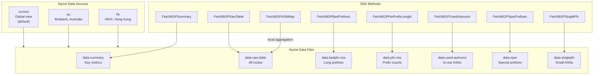
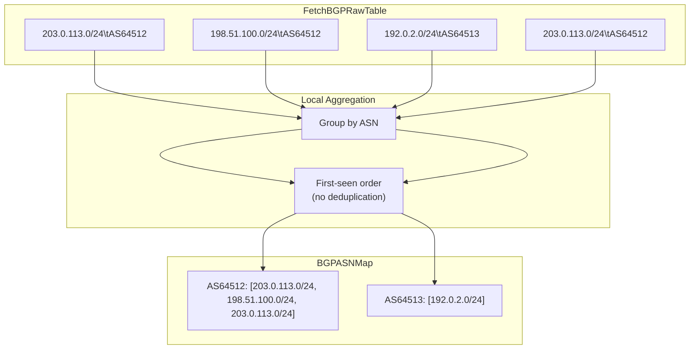

# thyme BGP Routing Table Analysis

APNIC's thyme service provides comprehensive BGP routing table analysis data. The SDK exposes 8 methods to fetch different aspects of BGP data from three data collection points (current/au/hk).



## Methods

| Method | Description | Source Parameter |
|--------|-------------|------------------|
| `FetchBGPSummary(ctx)` | BGP table metrics (entry count, AS count, ROA coverage) | Uses client default |
| `FetchBGPRawTable(ctx)` | Every announced route `prefix\tASN` | Uses client default |
| `FetchBGPASNMap(ctx)` | Routes aggregated by origin ASN (local derivation) | Uses client default |
| `FetchBGPBadPrefixes(ctx, source)` | Prefixes longer than /24 with origin AS | `"current"`, `"au"`, `"hk"` |
| `FetchBGPPerPrefixLength(ctx, source)` | Prefix count per prefix length (/N:count) | `"current"`, `"au"`, `"hk"` |
| `FetchBGPUsedAutnums(ctx, source)` | All in-use ASN with name and country | `"current"`, `"au"`, `"hk"` |
| `FetchBGPSparPrefixes(ctx, source)` | RFC 6890 special-purpose prefixes | `"current"`, `"au"`, `"hk"` |
| `FetchBGPSinglePfx(ctx, source)` | ASN count with fewer than 20 prefixes | `"current"`, `"au"`, `"hk"` |

## Data Sources

```mermaid
flowchart LR
    subgraph Global["Global View"]
        C["current<br/>thyme.apnic.net/current/"]
    end

    subgraph Regional["Regional Views"]
        A["au<br/>Brisbane collector"]
        H["hk<br/>HKIX collector"]
    end

    subgraph Config["SDK Configuration"]
        Opt["WithThymeSource(\"au\")"]
        Param["source parameter<br/>FetchBGPBadPrefixes(ctx, \"hk\")"]
    end

    Config --> C
    Config --> A
    Config --> H
```

### Source Selection

- **`current`** (default): Global BGP view aggregated from multiple collectors
- **`au`**: Brisbane, Australia - useful for Oceania/Asia-Pacific routing analysis
- **`hk`**: HKIX, Hong Kong - captures Asian routing dynamics

## BGPASNMap Aggregation Flow



## Examples

### Fetch BGP Summary

```go
package main

import (
    "context"
    "fmt"
    "log"

    apnic "github.com/cyberspacesec/apnic-skills"
)

func main() {
    client := apnic.NewClient()
    ctx := context.Background()

    summary, err := client.FetchBGPSummary(ctx)
    if err != nil {
        log.Fatal(err)
    }

    fmt.Println("BGP Summary Metrics:")
    for _, entry := range summary.Entries {
        fmt.Printf("  %s: %s\n", entry.Key, entry.Value)
    }
}
```

### Fetch Raw BGP Table

```go
package main

import (
    "context"
    "fmt"
    "log"

    apnic "github.com/cyberspacesec/apnic-skills"
)

func main() {
    client := apnic.NewClient()
    ctx := context.Background()

    table, err := client.FetchBGPRawTable(ctx)
    if err != nil {
        log.Fatal(err)
    }

    fmt.Printf("Total routes: %d\n", len(table.Routes))
    fmt.Println("\nFirst 5 routes:")
    for i, route := range table.Routes {
        if i >= 5 {
            break
        }
        fmt.Printf("  %s -> %s\n", route.Prefix, route.ASN)
    }
}
```

### Aggregate by Origin ASN

```go
package main

import (
    "context"
    "fmt"
    "log"

    apnic "github.com/cyberspacesec/apnic-skills"
)

func main() {
    client := apnic.NewClient()
    ctx := context.Background()

    // Fetch and aggregate by ASN
    asnMap, err := client.FetchBGPASNMap(ctx)
    if err != nil {
        log.Fatal(err)
    }

    fmt.Printf("Unique ASNs: %d\n", len(asnMap.ASNs))

    // Find ASNs announcing many prefixes
    for asn, prefixes := range asnMap.ASNs {
        if len(prefixes) > 100 {
            fmt.Printf("  %s: %d prefixes\n", asn, len(prefixes))
        }
    }
}
```

### Multi-Source Comparison

```go
package main

import (
    "context"
    "fmt"
    "log"

    apnic "github.com/cyberspacesec/apnic-skills"
)

func main() {
    client := apnic.NewClient()
    ctx := context.Background()

    sources := []string{"current", "au", "hk"}

    for _, source := range sources {
        summary, err := client.FetchBGPBadPrefixes(ctx, source)
        if err != nil {
            log.Printf("%s: %v", source, err)
            continue
        }

        fmt.Printf("%s: %d bad prefixes (longer than /24)\n",
            source, len(summary.Prefixes))
    }
}
```

### Configure Default Source

```go
package main

import (
    apnic "github.com/cyberspacesec/apnic-skills"
)

func main() {
    // Set default source to Brisbane collector
    client := apnic.NewClient(
        apnic.WithThymeSource("au"),
    )

    // This now uses "au" by default
    summary, _ := client.FetchBGPSummary(ctx)

    // Can still override per-call
    hkSummary, _ := client.FetchBGPBadPrefixes(ctx, "hk")
}
```

### Find Route Leak Candidates

```go
package main

import (
    "context"
    "fmt"
    "log"

    apnic "github.com/cyberspacesec/apnic-skills"
)

func main() {
    client := apnic.NewClient()
    ctx := context.Background()

    badPrefixes, err := client.FetchBGPBadPrefixes(ctx, "")
    if err != nil {
        log.Fatal(err)
    }

    fmt.Printf("Route leak candidates (prefixes longer than /24):\n")
    for i, pfx := range badPrefixes.Prefixes {
        if i >= 10 {
            break
        }
        fmt.Printf("  %s announced by %s\n", pfx.Address, pfx.OriginAS)
    }
}
```

### Analyze Prefix Length Distribution

```go
package main

import (
    "context"
    "fmt"
    "log"

    apnic "github.com/cyberspacesec/apnic-skills"
)

func main() {
    client := apnic.NewClient()
    ctx := context.Background()

    pfxLen, err := client.FetchBGPPerPrefixLength(ctx, "")
    if err != nil {
        log.Fatal(err)
    }

    fmt.Println("Prefix Length Distribution:")
    for _, c := range pfxLen.Counts {
        fmt.Printf("  /%d: %d prefixes\n", c.Length, c.Count)
    }
}
```

### List In-Use ASNs

```go
package main

import (
    "context"
    "fmt"
    "log"

    apnic "github.com/cyberspacesec/apnic-skills"
)

func main() {
    client := apnic.NewClient()
    ctx := context.Background()

    autnums, err := client.FetchBGPUsedAutnums(ctx, "")
    if err != nil {
        log.Fatal(err)
    }

    fmt.Printf("Total in-use ASNs: %d\n\n", len(autnums.Autnums))

    // Show ASNs from Japan
    fmt.Println("Japanese ASNs:")
    for _, a := range autnums.Autnums {
        if a.Country == "JP" {
            fmt.Printf("  AS%s: %s\n", a.ASN, a.Name)
        }
    }
}
```

### Special Purpose Address Registry

```go
package main

import (
    "context"
    "fmt"
    "log"

    apnic "github.com/cyberspacesec/apnic-skills"
)

func main() {
    client := apnic.NewClient()
    ctx := context.Background()

    spar, err := client.FetchBGPSparPrefixes(ctx, "")
    if err != nil {
        log.Fatal(err)
    }

    fmt.Println("RFC 6890 Special Purpose Prefixes in BGP:")
    for _, p := range spar.Prefixes {
        fmt.Printf("  %s (AS%s): %s\n", p.Prefix, p.OriginAS, p.Description)
    }
}
```

## Data Structures

### BGPSummary

```go
type BGPSummary struct {
    Entries []BGPKeyValue
}

type BGPKeyValue struct {
    Key   string // e.g., "Number of routes"
    Value string // e.g., "987654"
}
```

### BGPRawTable

```go
type BGPRawTable struct {
    Routes []BGPRoute
}

type BGPRoute struct {
    Prefix string // e.g., "203.0.113.0/24"
    ASN    string // e.g., "64512"
}
```

### BGPASNMap

```go
type BGPASNMap struct {
    ASNs map[string][]string // ASN -> list of prefixes
}
```

### BGPBadPrefixes

```go
type BGPBadPrefixes struct {
    Prefixes []BGPBadPrefix
}

type BGPBadPrefix struct {
    OriginAS string // e.g., "64512"
    Address  string // e.g., "203.0.113.128/25"
}
```

## Error Handling

```go
summary, err := client.FetchBGPSummary(ctx)
if err != nil {
    // Possible errors:
    // - Network timeout
    // - thyme service unavailable
    // - Invalid source parameter
    log.Printf("BGP fetch failed: %v", err)
    return
}
```
