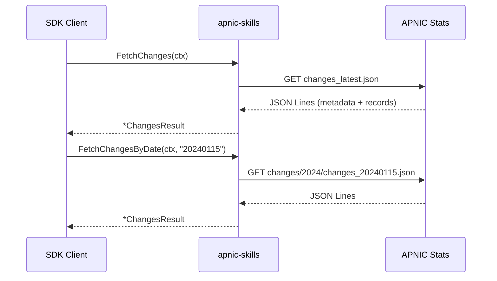
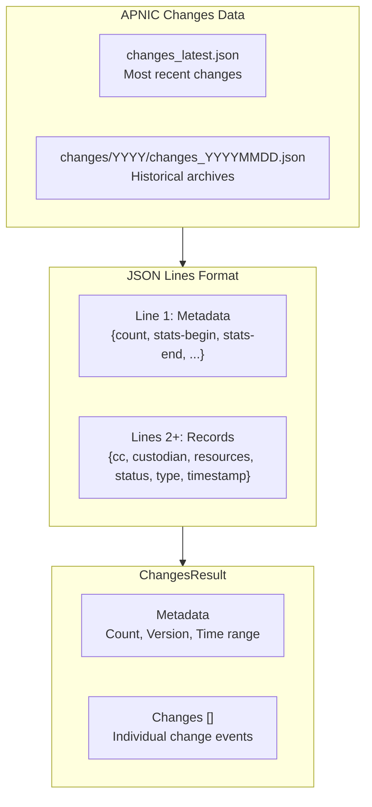

# Changes

The SDK provides access to APNIC's resource change records, which track modifications to IP and ASN allocations over time.



## Methods

| Method | Description |
|--------|-------------|
| `FetchChanges(ctx)` | Fetch latest resource change records |
| `GetChanges(ctx)` | Cached change records |
| `FetchChangesByDate(ctx, date)` | Fetch changes for a specific date (YYYYMMDD format) |

## Change Record Flow



## Examples

### Fetch Latest Changes

```go
package main

import (
    "context"
    "fmt"
    "log"

    apnic "github.com/cyberspacesec/apnic-skills"
)

func main() {
    client := apnic.NewClient()
    ctx := context.Background()

    changes, err := client.FetchChanges(ctx)
    if err != nil {
        log.Fatal(err)
    }

    fmt.Printf("Changes Metadata:\n")
    fmt.Printf("  Count: %d\n", changes.Metadata.Count)
    fmt.Printf("  Stats Period: %s to %s\n",
        changes.Metadata.StatsBegin, changes.Metadata.StatsEnd)
    fmt.Printf("  Version: %s\n", changes.Metadata.Version)
    fmt.Printf("  Timestamp: %s\n\n",
        changes.Metadata.Timestamp.Format("2006-01-02 15:04:05"))

    fmt.Printf("Change Records: %d\n\n", len(changes.Changes))

    // Show first few changes
    for i, c := range changes.Changes {
        if i >= 5 {
            break
        }
        fmt.Printf("Change %d:\n", i+1)
        fmt.Printf("  Country: %s\n", c.Country)
        fmt.Printf("  Custodian: %s\n", c.Custodian)
        fmt.Printf("  Type: %s\n", c.Type)
        fmt.Printf("  Status: %s\n", c.Status)
        fmt.Printf("  Resources: %v\n", c.Resources)
        fmt.Printf("  Timestamp: %s\n", c.Timestamp.Format("2006-01-02"))
        fmt.Println()
    }
}
```

### Fetch Changes by Date

```go
package main

import (
    "context"
    "fmt"
    "log"

    apnic "github.com/cyberspacesec/apnic-skills"
)

func main() {
    client := apnic.NewClient()
    ctx := context.Background()

    // Fetch changes for a specific date (YYYYMMDD)
    date := "20240115"
    changes, err := client.FetchChangesByDate(ctx, date)
    if err != nil {
        log.Fatal(err)
    }

    fmt.Printf("Changes for %s: %d records\n", date, len(changes.Changes))
}
```

### Analyze Changes by Country

```go
package main

import (
    "context"
    "fmt"
    "log"

    apnic "github.com/cyberspacesec/apnic-skills"
)

func main() {
    client := apnic.NewClient()
    ctx := context.Background()

    changes, _ := client.FetchChanges(ctx)

    // Count changes by country
    byCountry := make(map[string]int)
    for _, c := range changes.Changes {
        byCountry[c.Country]++
    }

    fmt.Println("Changes by Country:")
    for cc, count := range byCountry {
        fmt.Printf("  %s: %d\n", cc, count)
    }
}
```

### Analyze Changes by Type

```go
package main

import (
    "context"
    "fmt"

    apnic "github.com/cyberspacesec/apnic-skills"
)

func main() {
    client := apnic.NewClient()
    ctx := context.Background()

    changes, _ := client.FetchChanges(ctx)

    // Count by type
    byType := make(map[string]int)
    byStatus := make(map[string]int)

    for _, c := range changes.Changes {
        byType[c.Type]++
        byStatus[c.Status]++
    }

    fmt.Println("Changes by Type:")
    for t, count := range byType {
        fmt.Printf("  %s: %d\n", t, count)
    }

    fmt.Println("\nChanges by Status:")
    for s, count := range byStatus {
        fmt.Printf("  %s: %d\n", s, count)
    }
}
```

### Filter Changes for Specific Resources

```go
package main

import (
    "context"
    "fmt"

    apnic "github.com/cyberspacesec/apnic-skills"
)

func main() {
    client := apnic.NewClient()
    ctx := context.Background()

    changes, _ := client.FetchChanges(ctx)

    // Find changes involving specific resource
    targetPrefix := "203.0.113.0/24"

    for _, c := range changes.Changes {
        for _, r := range c.Resources {
            if r == targetPrefix {
                fmt.Printf("Found change for %s:\n", targetPrefix)
                fmt.Printf("  Country: %s\n", c.Country)
                fmt.Printf("  Custodian: %s\n", c.Custodian)
                fmt.Printf("  Status: %s\n", c.Status)
                fmt.Printf("  Type: %s\n", c.Type)
                fmt.Printf("  Timestamp: %s\n", c.Timestamp)
            }
        }
    }
}
```

### Compare Multiple Days

```go
package main

import (
    "context"
    "fmt"
    "log"

    apnic "github.com/cyberspacesec/apnic-skills"
)

func main() {
    client := apnic.NewClient()
    ctx := context.Background()

    dates := []string{
        "20240101",
        "20240108",
        "20240115",
    }

    for _, date := range dates {
        changes, err := client.FetchChangesByDate(ctx, date)
        if err != nil {
            log.Printf("%s: %v", date, err)
            continue
        }

        fmt.Printf("%s: %d changes\n", date, len(changes.Changes))
    }
}
```

## Data Structures

### ChangesResult

```go
type ChangesResult struct {
    Metadata ChangesMetadata
    Changes  []ChangeRecord
}

type ChangesMetadata struct {
    Count      int64
    StatsBegin string
    StatsEnd   string
    Timestamp  time.Time
    Version    string
}
```

### ChangeRecord

```go
type ChangeRecord struct {
    Country   string    // ISO country code
    Custodian string    // Organization handling the resource
    Resources []string  // Affected resources (prefixes, ASNs)
    Status    string    // Status of the change
    Type      string    // Type of change
    Timestamp time.Time // When the change occurred
}
```

## Change Types

| Type | Description |
|------|-------------|
| `NEW` | New allocation |
| `MODIFIED` | Modified allocation |
| `TRANSFERRED` | Transferred resource |
| `DELETED` | Deleted/deallocated |

## Status Values

| Status | Description |
|--------|-------------|
| `allocated` | Allocated to an LIR |
| `assigned` | Assigned to an end user |
| `reserved` | Reserved by the registry |
| `available` | Available pool |

## JSON Lines Format

The changes file uses JSON Lines format:

```json
{"count": 150, "stats-begin": "2024-01-14 00:00:00", "stats-end": "2024-01-14 23:59:59", "timestamp": "2024-01-15 00:30:00", "version": "2.0"}
{"cc": "JP", "custodian": "APNIC", "resources": ["203.0.113.0/24"], "status": "allocated", "timestamp": "2024-01-14T10:00:00", "type": "NEW"}
{"cc": "AU", "custodian": "Example ISP", "resources": ["198.51.100.0/24", "AS64512"], "status": "assigned", "timestamp": "2024-01-14T15:30:00", "type": "MODIFIED"}
```

## Error Handling

```go
changes, err := client.FetchChanges(ctx)
if err != nil {
    // Possible errors:
    // - Network timeout
    // - JSON parse failure
    // - Invalid date format
    log.Printf("Changes fetch failed: %v", err)
    return
}
```
