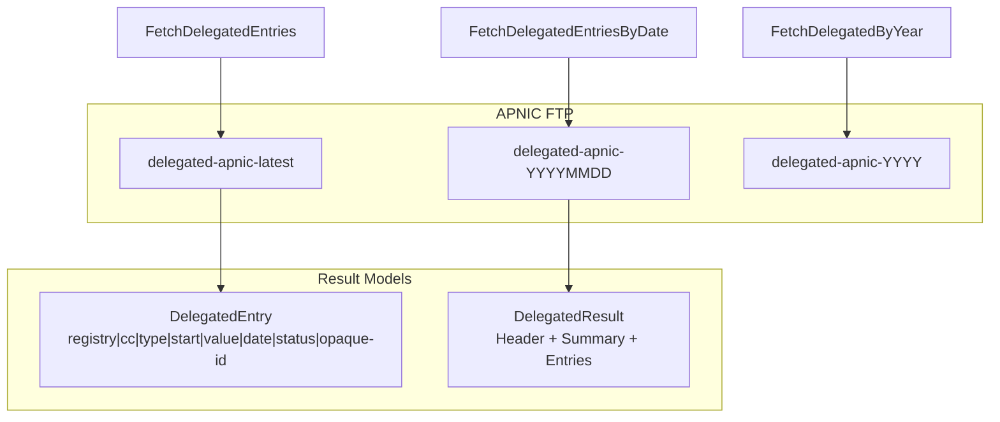
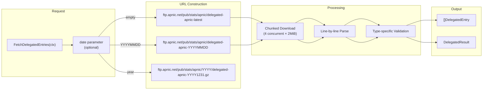

# Delegated Stats

Delegated stats contain IP and ASN allocation records from the APNIC registry. These are the authoritative records of which IP blocks and AS numbers have been allocated to organizations in the APNIC region.

## Overview

The delegated stats file follows the format defined by the five RIRs and contains records for IPv4 allocations, IPv6 allocations, and ASN assignments. Each record includes the registry, country code, resource type, starting address/count, date, and status.



## Methods

| Method | Description |
|--------|-------------|
| `FetchDelegatedEntries(ctx)` | Fetch latest standard delegated stats |
| `GetDelegatedEntries(ctx)` | Cached standard delegated stats (30min TTL) |
| `FetchDelegatedEntriesByDate(ctx, date)` | Fetch delegated stats by date (YYYYMMDD format) |
| `FetchDelegatedResult(ctx, date)` | Full result with header/summary/entries |
| `FetchDelegatedByYear(ctx, year)` | Fetch by year (last day of year) |
| `FetchDelegatedResultByYear(ctx, year)` | Full result by year |

### Method Signatures

```go
// Fetch latest delegated stats, returns only entries
func (c *Client) FetchDelegatedEntries(ctx context.Context) ([]DelegatedEntry, error)

// Cached variant - fetches fresh data if cache expired
func (c *Client) GetDelegatedEntries(ctx context.Context) ([]DelegatedEntry, error)

// Fetch by specific date (YYYYMMDD format, e.g., "20240115")
func (c *Client) FetchDelegatedEntriesByDate(ctx context.Context, date string) ([]DelegatedEntry, error)

// Full result including header and summaries
func (c *Client) FetchDelegatedResult(ctx context.Context, date string) (*DelegatedResult, error)

// Fetch by year (returns data from December 31 of that year)
func (c *Client) FetchDelegatedByYear(ctx context.Context, year int) ([]DelegatedEntry, error)

func (c *Client) FetchDelegatedResultByYear(ctx context.Context, year int) (*DelegatedResult, error)
```

## Data Structures

### DelegatedEntry

```go
type DelegatedEntry struct {
    Registry   string    // "apnic"
    Country    string    // ISO 3166-1 alpha-2 country code (e.g., "JP", "CN", "AU")
    Type       string    // "ipv4", "ipv6", or "asn"
    Start      string    // Starting address or AS number
    Value      int64     // Count (IPv4: number of IPs, IPv6: prefix length, ASN: count)
    Date       time.Time // Allocation/assignment date
    Status     string    // "allocated", "assigned", "available", "reserved"
    Extensions []string  // Additional fields (opaque-id in extended format)
}
```

### DelegatedResult

```go
type DelegatedResult struct {
    Header    StatsFileHeader  // File metadata
    Summaries []StatsSummary   // Per-type summaries
    Entries   []DelegatedEntry // Data records
}

type StatsFileHeader struct {
    Version   string    // File format version
    Registry  string    // "apnic"
    Serial    int64     // Serial number
    Records   int64     // Total record count
    StartDate time.Time // Data start date
    EndDate   time.Time // Data end date
    UTCOffset int       // UTC offset in seconds
}

type StatsSummary struct {
    Registry string // "apnic"
    Type     string // "asn", "ipv4", or "ipv6"
    Count    int64  // Number of records
}
```

## Data Flow



## Examples

### Basic Usage

```go
package main

import (
    "context"
    "fmt"
    "log"

    apnic "github.com/cyberspacesec/apnic-skills"
)

func main() {
    client := apnic.NewClient()
    ctx := context.Background()

    // Fetch latest delegated stats
    entries, err := client.FetchDelegatedEntries(ctx)
    if err != nil {
        log.Fatal(err)
    }

    fmt.Printf("Total entries: %d\n", len(entries))

    // Print first 5 IPv4 entries
    count := 0
    for _, entry := range entries {
        if entry.Type == "ipv4" && count < 5 {
            fmt.Printf("%s: %s/%d (%s) - %s\n",
                entry.Country, entry.Start, entry.Value, entry.Status, entry.Date.Format("2006-01-02"))
            count++
        }
    }
}
```

### Fetching by Date

```go
// Fetch delegated stats for a specific date
result, err := client.FetchDelegatedResult(ctx, "20240115")
if err != nil {
    log.Fatal(err)
}

fmt.Printf("File version: %s\n", result.Header.Version)
fmt.Printf("Records: %d\n", result.Header.Records)
fmt.Printf("Date range: %s to %s\n",
    result.Header.StartDate.Format("2006-01-02"),
    result.Header.EndDate.Format("2006-01-02"))

// Print summaries
for _, summary := range result.Summaries {
    fmt.Printf("%s: %d records\n", summary.Type, summary.Count)
}
```

### Fetching by Year

```go
// Fetch delegated stats from December 31, 2023
entries, err := client.FetchDelegatedByYear(ctx, 2023)
if err != nil {
    log.Fatal(err)
}

fmt.Printf("2023 year-end entries: %d\n", len(entries))
```

### Using Cached Data

```go
// First call fetches from network
entries1, err := client.GetDelegatedEntries(ctx)
if err != nil {
    log.Fatal(err)
}

// Second call returns cached data (within TTL)
entries2, err := client.GetDelegatedEntries(ctx)
if err != nil {
    log.Fatal(err)
}

// Both return the same data
fmt.Printf("Same data: %v\n", len(entries1) == len(entries2))
```

### Filtering Entries

```go
// Filter by country and type
entries, err := client.GetDelegatedEntries(ctx)
if err != nil {
    log.Fatal(err)
}

// Use chain filtering
cnIPv4 := apnic.NewFilter(entries).
    ByCountry("CN").
    ByType("ipv4").
    ByStatus("allocated").
    Result()

fmt.Printf("China allocated IPv4 entries: %d\n", len(cnIPv4))

// Filter by date range
start, _ := time.Parse("2006-01-02", "2023-01-01")
end, _ := time.Parse("2006-01-02", "2023-12-31")

recentAllocs := apnic.NewFilter(entries).
    ByType("ipv4").
    ByDateRange(start, end).
    Result()
```

### CIDR Calculation

```go
// Convert entry to CIDR notation
entries, _ := client.GetDelegatedEntries(ctx)

for _, entry := range entries {
    if entry.Type == "ipv4" {
        cidr, err := entry.CIDR()
        if err != nil {
            continue
        }
        fmt.Printf("%s -> %s (size: %d IPs)\n",
            entry.Start, cidr.String(), entry.Value)
        break // Just show first
    }
}
```

## File Format

The delegated stats file uses pipe-delimited format:

```
# Version, Registry, Serial, Records, Start-Date, End-Date, UTC-Offset
2|apnic|1737030783|45837|20240101|20240116|0

# Summary lines (registry|*|type|count)
apnic|*|ipv4|12345
apnic|*|ipv6|2345
apnic|*|asn|567

# Data lines (registry|cc|type|start|value|date|status[|extensions])
apnic|AU|ipv4|1.0.0.0|256|20110811|allocated
apnic|CN|ipv6|2001:200::|32|19990714|allocated
apnic|JP|asn|173|1|19930101|allocated
```

## Status Values

| Status | Description |
|--------|-------------|
| `allocated` | Allocated to an LIR (Local Internet Registry) |
| `assigned` | Assigned to an end user or ISP |
| `available` | Not yet allocated (available pool) |
| `reserved` | Reserved for special purposes |

## Resource Types

| Type | Value Meaning |
|------|---------------|
| `ipv4` | Number of IP addresses in the block |
| `ipv6` | Prefix length (e.g., 32 means /32) |
| `asn` | Number of consecutive AS numbers |

## Data Sources

The data is sourced from APNIC's FTP server:

- **Latest**: `ftp://ftp.apnic.net/pub/stats/apnic/delegated-apnic-latest`
- **Archived**: `ftp://ftp.apnic.net/pub/stats/apnic/delegated-apnic-YYYYMMDD`
- **By Year**: `ftp://ftp.apnic.net/pub/stats/apnic/YYYY/delegated-apnic-YYYY1231.gz`

## See Also

- [Extended Stats](extended.md) - Delegated stats with organization opaque-IDs
- [Assigned Stats](assigned.md) - Aggregated assignment counts by prefix size
- [Legacy Stats](legacy.md) - Historical pre-APNIC resource records
