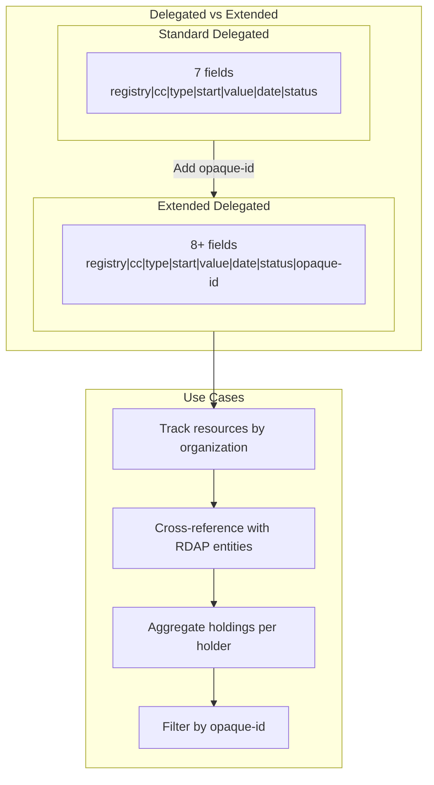
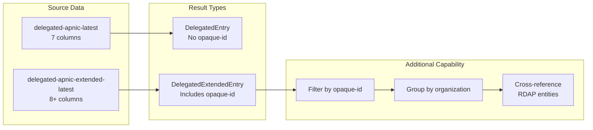

# Extended Stats

Extended delegated stats contain IP and ASN allocation records with an additional **opaque-id** field that uniquely identifies the resource holder organization. This allows tracking resources by organization across the entire APNIC registry.

## Overview

The extended format is identical to the standard delegated format but includes an 8th column (opaque-id) that serves as a persistent, privacy-preserving identifier for the organization holding the resource. This enables aggregation and analysis by resource holder without exposing organization names.



## Methods

| Method | Description |
|--------|-------------|
| `FetchExtendedEntries(ctx)` | Fetch latest extended stats |
| `GetExtendedEntries(ctx)` | Cached extended stats (30min TTL) |
| `FetchExtendedEntriesByDate(ctx, date)` | Fetch by date (YYYYMMDD format) |
| `FetchExtendedResult(ctx, date)` | Full result with header/summary/entries |
| `FetchExtendedByYear(ctx, year)` | Fetch by year (last day of year) |
| `FetchExtendedResultByYear(ctx, year)` | Full result by year |

### Method Signatures

```go
// Fetch latest extended stats, returns full result
func (c *Client) FetchExtendedEntries(ctx context.Context) (*ExtendedResult, error)

// Cached variant - fetches fresh data if cache expired
func (c *Client) GetExtendedEntries(ctx context.Context) ([]DelegatedExtendedEntry, error)

// Fetch by specific date (YYYYMMDD format)
func (c *Client) FetchExtendedEntriesByDate(ctx context.Context, date string) (*ExtendedResult, error)

// Full result including header and summaries
func (c *Client) FetchExtendedResult(ctx context.Context, date string) (*ExtendedResult, error)

// Fetch by year (returns data from December 31 of that year)
func (c *Client) FetchExtendedResultByYear(ctx context.Context, year int) (*ExtendedResult, error)
```

## Data Structures

### DelegatedExtendedEntry

```go
type DelegatedExtendedEntry struct {
    Registry   string    // "apnic"
    Country    string    // ISO 3166-1 alpha-2 country code
    Type       string    // "ipv4", "ipv6", or "asn"
    Start      string    // Starting address or AS number
    Value      int64     // Count (IPv4: IPs, IPv6: prefix length, ASN: count)
    Date       time.Time // Allocation/assignment date
    Status     string    // "allocated", "assigned", "available", "reserved"
    OpaqueID   string    // Unique identifier for the organization (e.g., "A92E1062")
    Extensions []string  // Additional extension fields
}
```

### ExtendedResult

```go
type ExtendedResult struct {
    Header    StatsFileHeader          // File metadata
    Summaries []StatsSummary           // Per-type summaries
    Entries   []DelegatedExtendedEntry // Data records with opaque-IDs
}
```

## Comparison: Standard vs Extended



| Feature | Standard Delegated | Extended Delegated |
|---------|-------------------|-------------------|
| Fields | 7 | 8+ |
| Organization ID | No | Yes (opaque-id) |
| Filtering by holder | No | Yes |
| Cross-RIR tracking | No | Yes (via REx) |
| File size | Smaller | Slightly larger |

## Examples

### Basic Usage

```go
package main

import (
    "context"
    "fmt"
    "log"

    apnic "github.com/cyberspacesec/apnic-skills"
)

func main() {
    client := apnic.NewClient()
    ctx := context.Background()

    // Fetch latest extended stats
    result, err := client.FetchExtendedEntries(ctx)
    if err != nil {
        log.Fatal(err)
    }

    fmt.Printf("Total entries: %d\n", len(result.Entries))

    // Print first 5 entries with opaque-ids
    for i, entry := range result.Entries {
        if i >= 5 {
            break
        }
        fmt.Printf("%s: %s/%d (%s) - OpaqueID: %s\n",
            entry.Country, entry.Start, entry.Value, entry.Status, entry.OpaqueID)
    }
}
```

### Filtering by Opaque-ID

```go
// Get extended entries
entries, err := client.GetExtendedEntries(ctx)
if err != nil {
    log.Fatal(err)
}

// Filter by opaque-id
filtered := apnic.NewExtendedFilter(entries).
    ByOpaqueID("A92E1062").
    Result()

fmt.Printf("Resources held by A92E1062: %d\n", len(filtered))

// Show all resources for this organization
for _, entry := range filtered {
    fmt.Printf("  %s: %s/%d (%s)\n",
        entry.Type, entry.Start, entry.Value, entry.Status)
}
```

### Grouping by Organization

```go
entries, _ := client.GetExtendedEntries(ctx)

// Group entries by opaque-id
groups := apnic.GroupExtendedByOpaqueID(entries)

// Print top 10 organizations by resource count
type orgCount struct {
    opaqueID string
    count    int
}
var counts []orgCount
for id, entries := range groups {
    counts = append(counts, orgCount{id, len(entries)})
}

// Sort by count descending
sort.Slice(counts, func(i, j int) bool {
    return counts[i].count > counts[j].count
})

fmt.Println("Top 10 organizations by resource count:")
for i, c := range counts {
    if i >= 10 {
        break
    }
    fmt.Printf("  %s: %d resources\n", c.opaqueID, c.count)
}
```

### Filtering by Country and Type

```go
entries, _ := client.GetExtendedEntries(ctx)

// Filter Japanese IPv6 allocations
jpIPv6 := apnic.NewExtendedFilter(entries).
    ByCountry("JP").
    ByType("ipv6").
    Result()

fmt.Printf("Japan IPv6 allocations: %d\n", len(jpIPv6))

// Filter Australian ASN assignments
auASN := apnic.NewExtendedFilter(entries).
    ByCountry("AU").
    ByType("asn").
    ByStatus("assigned").
    Result()

fmt.Printf("Australia assigned ASNs: %d\n", len(auASN))
```

### Historical Comparison

```go
// Compare extended stats from two dates
current, _ := client.FetchExtendedResult(ctx, "")
past, _ := client.FetchExtendedResult(ctx, "20230101")

// Count entries by opaque-id
currentCounts := make(map[string]int)
for _, e := range current.Entries {
    currentCounts[e.OpaqueID]++
}

pastCounts := make(map[string]int)
for _, e := range past.Entries {
    pastCounts[e.OpaqueID]++
}

// Find organizations that gained resources
fmt.Println("Organizations that gained IPv4 resources:")
for id, count := range currentCounts {
    if pastCount := pastCounts[id]; count > pastCount {
        fmt.Printf("  %s: %d -> %d\n", id, pastCount, count)
    }
}
```

### Cross-referencing with RDAP

```go
// Get extended entry and look up entity in RDAP
entries, _ := client.GetExtendedEntries(ctx)

// Find a specific organization's resources
for _, entry := range entries {
    if entry.OpaqueID == "A92E1062" && entry.Type == "ipv4" {
        // Look up the network in RDAP
        network, err := client.RDAPLookupIP(ctx, entry.Start)
        if err != nil {
            continue
        }

        fmt.Printf("Network: %s\n", network.Handle)
        fmt.Printf("Name: %s\n", network.Name)
        fmt.Printf("Country: %s\n", network.Country)
        fmt.Printf("Type: %s\n", network.Type)

        // Print associated entities
        for _, entity := range network.Entities {
            fmt.Printf("  Entity: %s (roles: %v)\n", entity.Handle, entity.Roles)
        }
        break
    }
}
```

## File Format

The extended stats file uses pipe-delimited format with 8+ columns:

```
# Header
2|apnic|1737030783|45837|20240101|20240116|0

# Summary lines
apnic|*|ipv4|12345
apnic|*|ipv6|2345
apnic|*|asn|567

# Data lines (with opaque-id)
apnic|AU|ipv4|1.0.0.0|256|20110811|allocated|A92E1062
apnic|CN|ipv6|2001:200::|32|19990714|allocated|B12F3456
apnic|JP|asn|173|1|19930101|allocated|C78D9012
```

## Opaque-ID Format

The opaque-id is a unique, persistent identifier for resource holders:

- Format: Alphanumeric string (e.g., `A92E1062`, `ORG-ARAD1-AP`)
- Purpose: Privacy-preserving organization identification
- Persistence: Remains constant across resource changes
- Cross-RIR: Can be used with REx API to find resources in other RIRs

## Data Sources

- **Latest**: `ftp://ftp.apnic.net/pub/stats/apnic/delegated-apnic-extended-latest`
- **Archived**: `ftp://ftp.apnic.net/pub/stats/apnic/delegated-apnic-extended-YYYYMMDD`
- **By Year**: `ftp://ftp.apnic.net/pub/stats/apnic/YYYY/delegated-apnic-extended-YYYY1231.gz`

## See Also

- [Delegated Stats](delegated.md) - Standard delegated stats without opaque-IDs
- [RDAP](rdap.md) - Structured registration data queries
- [REx Cross-RIR](rex.md) - Cross-RIR resource lookup by opaque-id
