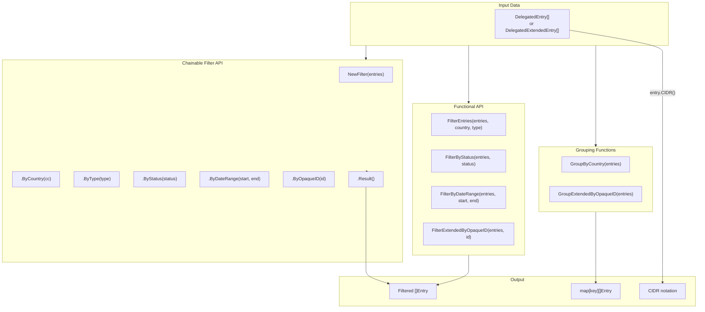

# Filtering & Grouping

The SDK provides powerful filtering and grouping capabilities for analyzing delegation data. Both functional-style functions and a chainable filter API are available.



## Functional Filter Functions

### Standard Delegated Entries

| Function | Description |
|----------|-------------|
| `FilterEntries(entries, country, resType)` | Filter by country and resource type |
| `FilterByStatus(entries, status)` | Filter by status (allocated, assigned, reserved, available) |
| `FilterByDateRange(entries, start, end)` | Filter by date range (inclusive) |

### Extended Delegated Entries

| Function | Description |
|----------|-------------|
| `FilterExtendedByOpaqueID(entries, opaqueID)` | Filter by organization opaqueId |
| `FilterExtendedByCountry(entries, country)` | Filter by country code |
| `FilterExtendedByType(entries, resType)` | Filter by resource type |
| `FilterExtendedByStatus(entries, status)` | Filter by status |

### Grouping Functions

| Function | Description |
|----------|-------------|
| `GroupByCountry(entries)` | Group entries by country code |
| `GroupExtendedByOpaqueID(entries)` | Group extended entries by opaqueId |
| `GroupExtendedByCountry(entries)` | Group extended entries by country |

## Chainable Filter API

```mermaid
flowchart LR
    subgraph Chain["Chain Filter"]
        Start["NewFilter(entries)"]
        C1[".ByCountry(\"CN\")"]
        C2[".ByType(\"ipv4\")"]
        C3[".ByStatus(\"allocated\")"]
        C4[".ByDateRange(start, end)"]
        End[".Result()"]
    end

    Start --> C1 --> C2 --> C3 --> C4 --> End
```

### EntryFilter Methods

| Method | Description |
|--------|-------------|
| `NewFilter(entries)` | Create a new filter chain |
| `.ByCountry(country)` | Filter by ISO 3166 country code |
| `.ByType(resType)` | Filter by resource type (ipv4, ipv6, asn) |
| `.ByStatus(status)` | Filter by status |
| `.ByDateRange(start, end)` | Filter by date range |
| `.ByRegistry(registry)` | Filter by registry name |
| `.Result()` | Get filtered entries |
| `.Count()` | Get count of filtered entries |

### ExtendedEntryFilter Methods

| Method | Description |
|--------|-------------|
| `NewExtendedFilter(entries)` | Create a new extended filter chain |
| `.ByCountry(country)` | Filter by country code |
| `.ByType(resType)` | Filter by resource type |
| `.ByStatus(status)` | Filter by status |
| `.ByOpaqueID(opaqueID)` | Filter by organization opaqueId |
| `.ByDateRange(start, end)` | Filter by date range |
| `.Result()` | Get filtered entries |
| `.Count()` | Get count of filtered entries |

## CIDR Calculation

| Method | Description |
|--------|-------------|
| `entry.CIDR()` | Convert DelegatedEntry to CIDR notation |
| `extEntry.CIDR()` | Convert DelegatedExtendedEntry to CIDR notation |
| `legacyEntry.CIDR()` | Convert LegacyEntry to CIDR notation |

## Examples

### Basic Filtering

```go
package main

import (
    "context"
    "fmt"
    "log"

    apnic "github.com/cyberspacesec/apnic-skills"
)

func main() {
    client := apnic.NewClient()
    ctx := context.Background()

    // Fetch all delegated entries
    entries, err := client.GetDelegatedEntries(ctx)
    if err != nil {
        log.Fatal(err)
    }

    fmt.Printf("Total entries: %d\n", len(entries))

    // Filter by country
    cnEntries := apnic.FilterEntries(entries, "CN", "")
    fmt.Printf("China entries: %d\n", len(cnEntries))

    // Filter by type
    ipv4Entries := apnic.FilterEntries(entries, "", "ipv4")
    fmt.Printf("IPv4 entries: %d\n", len(ipv4Entries))

    // Filter by country and type
    cnIPv4 := apnic.FilterEntries(entries, "CN", "ipv4")
    fmt.Printf("China IPv4: %d\n", len(cnIPv4))

    // Filter by status
    allocated := apnic.FilterByStatus(cnIPv4, "allocated")
    fmt.Printf("China IPv4 allocated: %d\n", len(allocated))
}
```

### Chainable Filter API

```go
package main

import (
    "context"
    "fmt"
    "log"
    "time"

    apnic "github.com/cyberspacesec/apnic-skills"
)

func main() {
    client := apnic.NewClient()
    ctx := context.Background()

    entries, _ := client.GetDelegatedEntries(ctx)

    // Chain filters together
    start := time.Date(2023, 1, 1, 0, 0, 0, 0, time.UTC)
    end := time.Date(2024, 1, 1, 0, 0, 0, 0, time.UTC)

    result := apnic.NewFilter(entries).
        ByCountry("CN").
        ByType("ipv4").
        ByStatus("allocated").
        ByDateRange(start, end).
        Result()

    fmt.Printf("Filtered entries: %d\n", len(result))

    // Using Count()
    count := apnic.NewFilter(entries).
        ByCountry("JP").
        ByType("ipv6").
        Count()

    fmt.Printf("Japan IPv6 entries: %d\n", count)
}
```

### Extended Filter with OpaqueID

```go
package main

import (
    "context"
    "fmt"
    "log"

    apnic "github.com/cyberspacesec/apnic-skills"
)

func main() {
    client := apnic.NewClient()
    ctx := context.Background()

    // Fetch extended entries (with opaqueId)
    entries, err := client.GetExtendedEntries(ctx)
    if err != nil {
        log.Fatal(err)
    }

    // Filter by opaqueId (organization)
    opaqueID := "A92E1062"
    filtered := apnic.NewExtendedFilter(entries).
        ByOpaqueID(opaqueID).
        Result()

    fmt.Printf("Entries for organization %s: %d\n", opaqueID, len(filtered))

    for _, e := range filtered {
        cidr, _ := e.CIDR()
        fmt.Printf("  %s (%s)\n", cidr, e.Type)
    }
}
```

### Grouping by Country

```go
package main

import (
    "context"
    "fmt"
    "log"

    apnic "github.com/cyberspacesec/apnic-skills"
)

func main() {
    client := apnic.NewClient()
    ctx := context.Background()

    entries, _ := client.GetDelegatedEntries(ctx)

    // Group by country
    byCountry := apnic.GroupByCountry(entries)

    fmt.Println("Entries by Country (top 10):")

    // Sort and display
    type kv struct {
        Country string
        Count   int
    }

    var sorted []kv
    for cc, ents := range byCountry {
        sorted = append(sorted, kv{cc, len(ents)})
    }

    // Simple sort (in production, use sort.Slice)
    for i := 0; i < 10 && i < len(sorted); i++ {
        fmt.Printf("  %s: %d\n", sorted[i].Country, sorted[i].Count)
    }
}
```

### Grouping by Organization

```go
package main

import (
    "context"
    "fmt"
    "log"

    apnic "github.com/cyberspacesec/apnic-skills"
)

func main() {
    client := apnic.NewClient()
    ctx := context.Background()

    entries, _ := client.GetExtendedEntries(ctx)

    // Group by opaqueId (organization)
    byOrg := apnic.GroupExtendedByOpaqueID(entries)

    fmt.Printf("Unique organizations: %d\n", len(byOrg))

    // Find organizations with most resources
    type orgInfo struct {
        OpaqueID string
        Count    int
    }

    var orgs []orgInfo
    for id, ents := range byOrg {
        orgs = append(orgs, orgInfo{id, len(ents)})
    }

    fmt.Println("\nOrganizations with most resources:")
    // (In production, sort and show top N)
    for i := 0; i < 5 && i < len(orgs); i++ {
        fmt.Printf("  %s: %d resources\n", orgs[i].OpaqueID, orgs[i].Count)
    }
}
```

### Date Range Filtering

```go
package main

import (
    "context"
    "fmt"
    "time"

    apnic "github.com/cyberspacesec/apnic-skills"
)

func main() {
    client := apnic.NewClient()
    ctx := context.Background()

    entries, _ := client.GetDelegatedEntries(ctx)

    // Define date ranges
    q1Start := time.Date(2024, 1, 1, 0, 0, 0, 0, time.UTC)
    q1End := time.Date(2024, 4, 1, 0, 0, 0, 0, time.UTC)

    q1Entries := apnic.NewFilter(entries).
        ByDateRange(q1Start, q1End).
        Result()

    fmt.Printf("Q1 2024 allocations: %d\n", len(q1Entries))

    // Allocations in last 30 days
    now := time.Now()
    monthAgo := now.AddDate(0, -1, 0)

    recent := apnic.NewFilter(entries).
        ByDateRange(monthAgo, now).
        Result()

    fmt.Printf("Last 30 days: %d\n", len(recent))
}
```

### CIDR Conversion

```go
package main

import (
    "context"
    "fmt"
    "log"

    apnic "github.com/cyberspacesec/apnic-skills"
)

func main() {
    client := apnic.NewClient()
    ctx := context.Background()

    entries, _ := client.GetDelegatedEntries(ctx)

    // Convert entries to CIDR notation
    fmt.Println("First 10 IPv4 entries as CIDR:")
    count := 0

    for _, e := range entries {
        if e.Type != "ipv4" {
            continue
        }

        cidr, err := e.CIDR()
        if err != nil {
            continue
        }

        fmt.Printf("  %s (Country: %s, Status: %s)\n",
            cidr, e.Country, e.Status)

        count++
        if count >= 10 {
            break
        }
    }
}
```

### Combined Analysis

```go
package main

import (
    "context"
    "fmt"
    "log"

    apnic "github.com/cyberspacesec/apnic-skills"
)

func main() {
    client := apnic.NewClient()
    ctx := context.Background()

    entries, _ := client.GetExtendedEntries(ctx)

    // Comprehensive analysis for a country
    country := "AU"

    auIPv4 := apnic.NewExtendedFilter(entries).
        ByCountry(country).
        ByType("ipv4").
        ByStatus("allocated").
        Result()

    auIPv6 := apnic.NewExtendedFilter(entries).
        ByCountry(country).
        ByType("ipv6").
        Result()

    auASN := apnic.NewExtendedFilter(entries).
        ByCountry(country).
        ByType("asn").
        Result()

    fmt.Printf("Resource Summary for %s:\n", country)
    fmt.Printf("  IPv4 allocated: %d\n", len(auIPv4))
    fmt.Printf("  IPv6 entries: %d\n", len(auIPv6))
    fmt.Printf("  ASN entries: %d\n", len(auASN))

    // Group by organization
    auByOrg := apnic.GroupExtendedByOpaqueID(auIPv4)
    fmt.Printf("  Unique IPv4 holders: %d\n", len(auByOrg))
}
```

### Multiple Country Comparison

```go
package main

import (
    "context"
    "fmt"

    apnic "github.com/cyberspacesec/apnic-skills"
)

func main() {
    client := apnic.NewClient()
    ctx := context.Background()

    entries, _ := client.GetDelegatedEntries(ctx)

    countries := []string{"CN", "JP", "KR", "AU", "SG"}

    fmt.Println("IPv4 Allocations by Country:")
    fmt.Println("Country | Allocated | Assigned | Reserved")
    fmt.Println("--------|-----------|----------|---------")

    for _, cc := range countries {
        allocated := len(apnic.NewFilter(entries).
            ByCountry(cc).ByType("ipv4").ByStatus("allocated").Result())
        assigned := len(apnic.NewFilter(entries).
            ByCountry(cc).ByType("ipv4").ByStatus("assigned").Result())
        reserved := len(apnic.NewFilter(entries).
            ByCountry(cc).ByType("ipv4").ByStatus("reserved").Result())

        fmt.Printf("%-7s | %9d | %8d | %8d\n", cc, allocated, assigned, reserved)
    }
}
```

## Data Types

### DelegatedEntry

```go
type DelegatedEntry struct {
    Registry string    // "apnic"
    Country  string    // ISO 3166 code
    Type     string    // "ipv4", "ipv6", "asn"
    Start    string    // Starting address/ASN
    Value    int64     // Count (IPv4) or prefix length (IPv6)
    Date     time.Time // Allocation date
    Status   string    // "allocated", "assigned", "reserved", "available"
}
```

### DelegatedExtendedEntry

```go
type DelegatedExtendedEntry struct {
    Registry string
    Country  string
    Type     string
    Start    string
    Value    int64
    Date     time.Time
    Status   string
    OpaqueID string    // Organization identifier
}
```

## Status Values

| Status | Description |
|--------|-------------|
| `allocated` | Allocated to LIR |
| `assigned` | Assigned to end user |
| `reserved` | Reserved by registry |
| `available` | Available for allocation |

## Resource Types

| Type | Description |
|------|-------------|
| `ipv4` | IPv4 address space |
| `ipv6` | IPv6 address space |
| `asn` | Autonomous System Numbers |

## Error Handling

```go
cidr, err := entry.CIDR()
if err != nil {
    // Possible errors:
    // - ErrInvalidIP: invalid count/prefix value
    // - ErrUnsupportedType: not ipv4 or ipv6
    log.Printf("CIDR conversion failed: %v", err)
}
```
