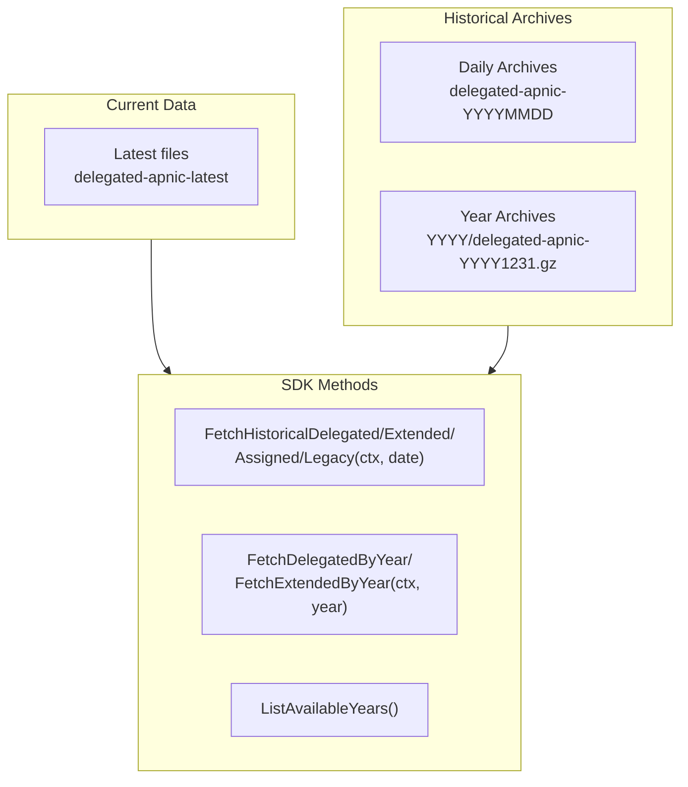
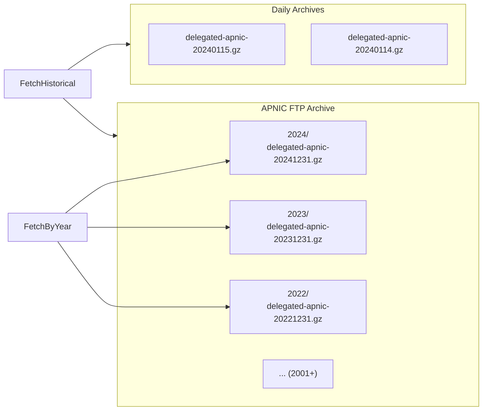
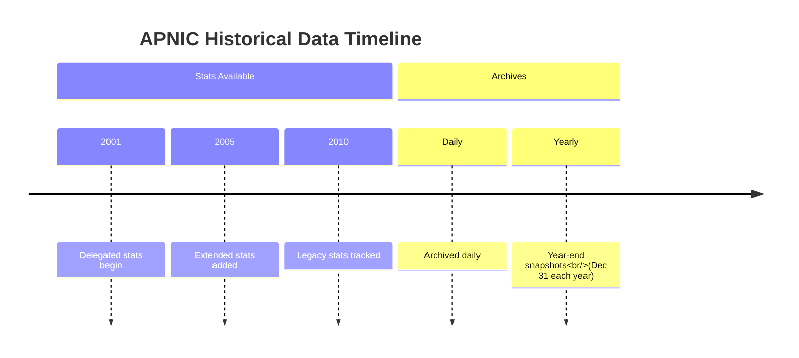

# Historical Data

The SDK provides methods to fetch historical delegation statistics, allowing you to analyze resource allocation trends over time.



## Methods

| Method | Description |
|--------|-------------|
| `FetchHistoricalDelegated(ctx, date)` | Fetch delegated stats for a specific date (YYYYMMDD) |
| `FetchHistoricalExtended(ctx, date)` | Fetch extended stats for a specific date |
| `FetchHistoricalAssigned(ctx, date)` | Fetch assigned stats for a specific date |
| `FetchHistoricalLegacy(ctx, date)` | Fetch legacy stats for a specific date |
| `FetchDelegatedByYear(ctx, year)` | Fetch delegated stats for year-end (December 31) |
| `FetchExtendedByYear(ctx, year)` | Fetch extended stats for year-end |
| `ListAvailableYears()` | List years with available historical data |

## Historical Data Paths



## Examples

### Fetch Historical Delegated Stats

```go
package main

import (
    "context"
    "fmt"
    "log"

    apnic "github.com/cyberspacesec/apnic-skills"
)

func main() {
    client := apnic.NewClient()
    ctx := context.Background()

    // Fetch data for a specific date (YYYYMMDD)
    date := "20240115"
    result, err := client.FetchHistoricalDelegated(ctx, date)
    if err != nil {
        log.Fatal(err)
    }

    fmt.Printf("Historical delegated stats for %s:\n", date)
    fmt.Printf("  Entries: %d\n", len(result.Entries))
    fmt.Printf("  Serial: %d\n", result.Header.Serial)
}
```

### Fetch Year-End Snapshot

```go
package main

import (
    "context"
    "fmt"
    "log"

    apnic "github.com/cyberspacesec/apnic-skills"
)

func main() {
    client := apnic.NewClient()
    ctx := context.Background()

    // Fetch year-end snapshot (December 31)
    year := 2023
    result, err := client.FetchDelegatedByYear(ctx, year)
    if err != nil {
        log.Fatal(err)
    }

    fmt.Printf("Delegated stats for year-end %d:\n", year)
    fmt.Printf("  Entries: %d\n", len(result.Entries))
    fmt.Printf("  Date range: %s to %s\n",
        result.Header.StartDate.Format("2006-01-02"),
        result.Header.EndDate.Format("2006-01-02"))
}
```

### List Available Years

```go
package main

import (
    "fmt"

    apnic "github.com/cyberspacesec/apnic-skills"
)

func main() {
    years := apnic.ListAvailableYears()

    fmt.Printf("Available years (%d):\n", len(years))
    fmt.Printf("  First: %d\n", years[0])
    fmt.Printf("  Last: %d\n", years[len(years)-1])

    // Show all years
    for _, y := range years {
        fmt.Printf("  %d\n", y)
    }
}
```

### Compare Historical Trends

```go
package main

import (
    "context"
    "fmt"
    "log"

    apnic "github.com/cyberspacesec/apnic-skills"
)

func main() {
    client := apnic.NewClient()
    ctx := context.Background()

    years := []int{2020, 2021, 2022, 2023}

    fmt.Println("IPv4 Allocation Growth by Year:")
    fmt.Println("Year | Total Entries | IPv4 Entries")
    fmt.Println("-----|---------------|-------------")

    for _, year := range years {
        result, err := client.FetchDelegatedByYear(ctx, year)
        if err != nil {
            log.Printf("%d: %v", year, err)
            continue
        }

        ipv4Count := 0
        for _, e := range result.Entries {
            if e.Type == "ipv4" {
                ipv4Count++
            }
        }

        fmt.Printf("%d | %13d | %d\n",
            year, len(result.Entries), ipv4Count)
    }
}
```

### Analyze Country Growth Over Time

```go
package main

import (
    "context"
    "fmt"
    "log"

    apnic "github.com/cyberspacesec/apnic-skills"
)

func main() {
    client := apnic.NewClient()
    ctx := context.Background()

    country := "JP" // Japan
    years := []int{2020, 2021, 2022, 2023}

    fmt.Printf("IPv4 allocations for %s:\n", country)

    for _, year := range years {
        result, err := client.FetchDelegatedByYear(ctx, year)
        if err != nil {
            log.Printf("%d: %v", year, err)
            continue
        }

        count := 0
        for _, e := range result.Entries {
            if e.Country == country && e.Type == "ipv4" {
                count++
            }
        }

        fmt.Printf("  %d: %d allocations\n", year, count)
    }
}
```

### Fetch Historical Extended Stats

```go
package main

import (
    "context"
    "fmt"
    "log"

    apnic "github.com/cyberspacesec/apnic-skills"
)

func main() {
    client := apnic.NewClient()
    ctx := context.Background()

    // Extended stats include opaqueId for holder attribution
    date := "20240115"
    result, err := client.FetchHistoricalExtended(ctx, date)
    if err != nil {
        log.Fatal(err)
    }

    fmt.Printf("Extended stats for %s:\n", date)
    fmt.Printf("  Entries: %d\n", len(result.Entries))

    // Count unique holders
    holders := make(map[string]int)
    for _, e := range result.Entries {
        if e.OpaqueID != "" {
            holders[e.OpaqueID]++
        }
    }
    fmt.Printf("  Unique holders: %d\n", len(holders))
}
```

### Fetch Historical Assigned Stats

```go
package main

import (
    "context"
    "fmt"
    "log"

    apnic "github.com/cyberspacesec/apnic-skills"
)

func main() {
    client := apnic.NewClient()
    ctx := context.Background()

    date := "20240115"
    result, err := client.FetchHistoricalAssigned(ctx, date)
    if err != nil {
        log.Fatal(err)
    }

    fmt.Printf("Assigned stats for %s:\n", date)
    fmt.Printf("  Entries: %d\n", len(result.Entries))

    // Assigned stats are aggregated by prefix size
    for _, e := range result.Entries[:5] {
        fmt.Printf("  %s: %s, size=%d\n",
            e.Type, e.Start, e.Value)
    }
}
```

### Fetch Historical Legacy Stats

```go
package main

import (
    "context"
    "fmt"
    "log"

    apnic "github.com/cyberspacesec/apnic-skills"
)

func main() {
    client := apnic.NewClient()
    ctx := context.Background()

    date := "20240115"
    result, err := client.FetchHistoricalLegacy(ctx, date)
    if err != nil {
        log.Fatal(err)
    }

    fmt.Printf("Legacy resources for %s:\n", date)
    fmt.Printf("  Entries: %d\n", len(result.Entries))

    // Legacy resources are early allocations before formal registry systems
    for _, e := range result.Entries {
        cidr, _ := e.CIDR()
        fmt.Printf("  %s (%s)\n", cidr, e.Country)
    }
}
```

### Year-Over-Year Comparison

```go
package main

import (
    "context"
    "fmt"

    apnic "github.com/cyberspacesec/apnic-skills"
)

func main() {
    client := apnic.NewClient()
    ctx := context.Background()

    // Compare consecutive years
    years := apnic.ListAvailableYears()

    var prevResult *apnic.DelegatedResult
    var prevYear int

    for _, year := range years[len(years)-5:] { // Last 5 years
        result, _ := client.FetchDelegatedByYear(ctx, year)

        if prevResult != nil {
            diff := len(result.Entries) - len(prevResult.Entries)
            fmt.Printf("%d vs %d: %+d entries (%.1f%% change)\n",
                year, prevYear, diff,
                float64(diff)/float64(len(prevResult.Entries))*100)
        }

        prevResult = result
        prevYear = year
    }
}
```

## Data Availability



## Error Handling

```go
result, err := client.FetchHistoricalDelegated(ctx, "20240115")
if err != nil {
    // Possible errors:
    // - ErrInvalidDate: date format not YYYYMMDD
    // - ErrInvalidYear: year before 2001
    // - Network timeout
    // - Archive not found
    log.Printf("Historical fetch failed: %v", err)
    return
}
```

## Date Format

- **Daily archives**: `YYYYMMDD` format (e.g., `"20240115"`)
- **Year archives**: Integer year (e.g., `2023`)

Year archives return the **December 31** snapshot for that year.

## Use Cases

1. **Trend Analysis**: Track resource allocation over time
2. **Capacity Planning**: Project future growth based on historical data
3. **Audit Trails**: Verify historical allocation states
4. **Research**: Academic studies on Internet growth
5. **Compliance**: Meet retention requirements
