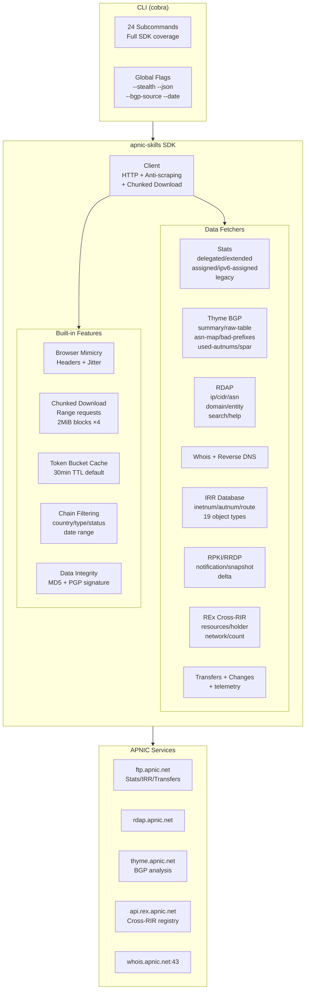
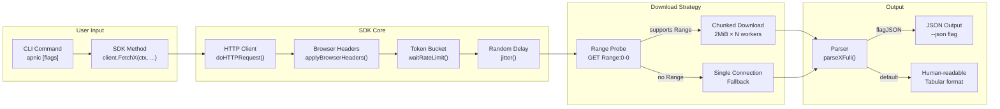

# SDK Reference

The apnic-skills SDK provides comprehensive access to all APNIC public data services through a unified Go client. This page provides an overview of all available data sources and their corresponding SDK methods.

## Architecture Overview



## Data Sources

| Category | Description | Documentation |
|----------|-------------|---------------|
| **Delegated Stats** | IP/ASN allocation records from the APNIC registry | [delegated.md](delegated.md) |
| **Extended Stats** | Delegated stats with organization opaque-IDs | [extended.md](extended.md) |
| **Assigned Stats** | Aggregated assignment counts by prefix size | [assigned.md](assigned.md) |
| **IPv6 Assigned** | Per-prefix IPv6 assignment records | [ipv6-assigned.md](ipv6-assigned.md) |
| **Legacy Stats** | Historical pre-APNIC resource records | [legacy.md](legacy.md) |
| **RDAP** | Structured registration data (IP, ASN, domain, entity) | [rdap.md](rdap.md) |
| **BGP (Thyme)** | Routing table analysis and metrics | BGP documentation |
| **IRR Database** | Internet Routing Registry RPSL objects | IRR documentation |
| **RPKI/RRDP** | RPKI repository synchronization | RPKI documentation |
| **REx** | Cross-RIR resource registry | REx documentation |
| **Transfers** | IP/ASN transfer records | Transfers documentation |
| **Changes** | Resource change history | Changes documentation |
| **Telemetry** | Whois/RDAP service query statistics | Telemetry documentation |
| **Whois** | Raw whois queries and reverse DNS | Whois documentation |

## Fetch Method Flow

All `Fetch*` methods follow a common request flow with built-in anti-scraping protection and optional chunked download for large files:



## Quick Start

```go
package main

import (
    "context"
    "fmt"
    "log"

    apnic "github.com/cyberspacesec/apnic-skills"
)

func main() {
    client := apnic.NewClient()
    ctx := context.Background()

    // RDAP IP lookup
    network, err := client.RDAPLookupIP(ctx, "1.1.1.1")
    if err != nil {
        log.Fatal(err)
    }
    fmt.Printf("Network: %s, Country: %s, Type: %s\n",
        network.Handle, network.Country, network.Type)

    // Fetch Delegated Stats
    entries, err := client.GetDelegatedEntries(ctx)
    if err != nil {
        log.Fatal(err)
    }
    fmt.Printf("Total entries: %d\n", len(entries))

    // Chain filtering
    result := apnic.NewFilter(entries).
        ByCountry("CN").
        ByType("ipv4").
        ByStatus("allocated").
        Result()
    fmt.Printf("CN allocated IPv4 entries: %d\n", len(result))
}
```

## Client Configuration

```go
client := apnic.NewClient(
    apnic.WithCacheTTL(10 * time.Minute),
    apnic.WithUserAgent("my-app/1.0"),
    apnic.WithRDAPBaseURL("https://rdap.apnic.net"),
    apnic.WithWhoisServer("whois.apnic.net:43"),
    apnic.WithWhoisTimeout(15 * time.Second),
    apnic.WithHTTPClient(&http.Client{Timeout: 30 * time.Second}),
)
```

### Anti-Scraping Configuration

```go
client := apnic.NewClient(
    apnic.WithStealth(true),                       // default true
    apnic.WithBrowserUserAgent("Mozilla/5.0 ..."), // custom browser UA
    apnic.WithJitter(200*time.Millisecond, 800*time.Millisecond),
    apnic.WithRateLimit(2.0),                      // requests per second
)
```

### Chunked Download Configuration

For large files (IRR dumps, delegated stats), the SDK uses multi-connection chunked downloads by default:

```go
client := apnic.NewClient(
    apnic.WithMaxConcurrentDownloads(4),  // concurrent Range requests
    apnic.WithChunkSize(2*1024*1024),     // 2MiB per chunk
    apnic.WithDownloadTimeout(5*time.Minute),
)
```

## Result Types

All `Fetch*Result` methods return structured results containing header, summaries, and entries:

| Result Type | Description |
|-------------|-------------|
| `DelegatedResult` | Standard delegated stats with `Header`, `Summaries`, `Entries` |
| `ExtendedResult` | Extended delegated stats with opaque-IDs |
| `AssignedResult` | Aggregated assignment counts |
| `IPv6AssignedResult` | Per-prefix IPv6 assignments |
| `LegacyResult` | Historical legacy records |
| `RDAPNetwork` | RDAP IP/CIDR lookup result |
| `RDAPAutnum` | RDAP ASN lookup result |
| `RDAPDomain` | RDAP domain object |
| `RDAPEntity` | RDAP entity/contact object |

## Caching

The SDK provides `Get*` variants that cache results with a configurable TTL (default 30 minutes):

| Cached Method | Fetch Method | Cache Key |
|---------------|--------------|-----------|
| `GetDelegatedEntries(ctx)` | `FetchDelegatedEntries(ctx)` | `delegated` |
| `GetExtendedEntries(ctx)` | `FetchExtendedEntries(ctx)` | `extended` |
| `GetAssignedEntries(ctx)` | `FetchAssignedEntries(ctx)` | `assigned` |
| `GetLegacyEntries(ctx)` | `FetchLegacyEntries(ctx)` | `legacy` |
| `GetTransfers(ctx)` | `FetchTransfers(ctx)` | `transfers` |

## Chain Filtering

The SDK provides a fluent API for filtering entries:

```go
// Standard chain filtering
result := apnic.NewFilter(entries).
    ByCountry("CN").
    ByType("ipv4").
    ByStatus("allocated").
    ByDateRange(start, end).
    Result()

// Extended chain filtering
extResult := apnic.NewExtendedFilter(extEntries).
    ByCountry("JP").
    ByType("ipv6").
    ByOpaqueID("A92E1062").
    Result()
```

## Error Handling

All methods return errors that can be checked with `errors.Is()`:

```go
import "errors"

entries, err := client.FetchDelegatedEntries(ctx)
if err != nil {
    if errors.Is(err, apnic.ErrNotFound) {
        // Resource not found
    }
    // Handle other errors
}
```

## Next Steps

- [Delegated Stats](delegated.md) - IP/ASN allocation records
- [Extended Stats](extended.md) - Delegated with organization IDs
- [Assigned Stats](assigned.md) - Aggregated by prefix size
- [IPv6 Assigned](ipv6-assigned.md) - Per-prefix IPv6 records
- [Legacy Stats](legacy.md) - Historical resource records
- [RDAP](rdap.md) - Structured registration data queries
