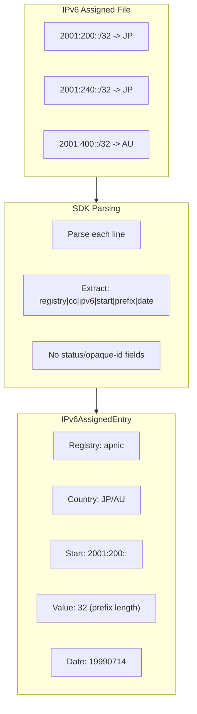
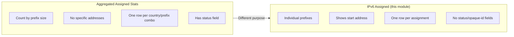

# IPv6 Assigned Stats

IPv6 assigned stats contain per-prefix IPv6 assignment records. Unlike the aggregated "assigned" stats which count assignments by prefix size, this dataset lists each individual IPv6 assignment.

## Overview

The IPv6 assigned file provides a detailed view of IPv6 assignments in the APNIC region, listing each assigned prefix individually rather than aggregating by prefix size. This is useful for enumerating specific IPv6 allocations.



## Methods

| Method | Description |
|--------|-------------|
| `FetchIPv6AssignedEntries(ctx)` | Fetch latest per-prefix IPv6 records |
| `FetchIPv6AssignedEntriesByDate(ctx, date)` | Fetch by date (YYYYMMDD format) |
| `FetchIPv6AssignedResult(ctx, date)` | Full result with header/summary/entries |

### Method Signatures

```go
// Fetch latest IPv6 assigned entries
func (c *Client) FetchIPv6AssignedEntries(ctx context.Context) ([]IPv6AssignedEntry, error)

// Fetch by specific date (YYYYMMDD format)
func (c *Client) FetchIPv6AssignedEntriesByDate(ctx context.Context, date string) ([]IPv6AssignedEntry, error)

// Full result including header and summaries
func (c *Client) FetchIPv6AssignedResult(ctx context.Context, date string) (*IPv6AssignedResult, error)
```

## Data Structures

### IPv6AssignedEntry

```go
type IPv6AssignedEntry struct {
    Registry string    // "apnic"
    Country  string    // ISO 3166-1 alpha-2 country code
    Start    string    // Starting IPv6 address
    Value    int64     // Prefix length (e.g., 32, 48, 56, 64)
    Date     time.Time // Assignment date
}
```

### IPv6AssignedResult

```go
type IPv6AssignedResult struct {
    Header    StatsFileHeader    // File metadata
    Summaries []StatsSummary     // Per-type summaries
    Entries   []IPv6AssignedEntry // Individual IPv6 assignment records
}
```

## Key Differences from Aggregated Assigned Stats



| Feature | Aggregated Assigned | IPv6 Assigned |
|---------|-------------------|---------------|
| Granularity | Count by prefix size | Individual prefixes |
| Address info | No | Yes (start address) |
| Status field | Yes | No |
| Opaque-id field | No | No |
| Date field | No | Yes |

## File Format

The IPv6 assigned file uses a simplified 6-column format:

```
# Header
2|apnic|1737030783|567|20240101|20240116|0

# Summary lines
apnic|*|ipv6|567

# Data lines: registry|cc|ipv6|start|prefix|date
apnic|jp|ipv6|2001:200::|32|19990714
apnic|jp|ipv6|2001:240::|32|19990714
apnic|au|ipv6|2001:400::|32|19990714
```

Note: Unlike delegated/extended files, there is **no status column** and **no opaque-id column**.

## Examples

### Basic Usage

```go
package main

import (
    "context"
    "fmt"
    "log"

    apnic "github.com/cyberspacesec/apnic-skills"
)

func main() {
    client := apnic.NewClient()
    ctx := context.Background()

    // Fetch latest IPv6 assigned entries
    entries, err := client.FetchIPv6AssignedEntries(ctx)
    if err != nil {
        log.Fatal(err)
    }

    fmt.Printf("Total IPv6 assignments: %d\n", len(entries))

    // Print first 5 entries
    for i, entry := range entries {
        if i >= 5 {
            break
        }
        fmt.Printf("%s: %s/%d (assigned %s)\n",
            entry.Country, entry.Start, entry.Value, entry.Date.Format("2006-01-02"))
    }
}
```

### Fetching Full Result

```go
// Fetch with header and summaries
result, err := client.FetchIPv6AssignedResult(ctx, "")
if err != nil {
    log.Fatal(err)
}

fmt.Printf("File version: %s\n", result.Header.Version)
fmt.Printf("Records: %d\n", result.Header.Records)

// Check summaries
for _, summary := range result.Summaries {
    fmt.Printf("Summary: %s = %d\n", summary.Type, summary.Count)
}

// Process entries
for _, entry := range result.Entries {
    fmt.Printf("%s: %s/%d\n",
        entry.Country, entry.Start, entry.Value)
}
```

### Historical Data

```go
// Fetch IPv6 assignments from a specific date
entries, err := client.FetchIPv6AssignedEntriesByDate(ctx, "20240115")
if err != nil {
    log.Fatal(err)
}

fmt.Printf("IPv6 assignments on 2024-01-15: %d\n", len(entries))
```

### Filtering by Country

```go
entries, _ := client.FetchIPv6AssignedEntries(ctx)

// Filter for a specific country
var japanIPv6 []apnic.IPv6AssignedEntry
for _, entry := range entries {
    if entry.Country == "JP" {
        japanIPv6 = append(japanIPv6, entry)
    }
}

fmt.Printf("Japan IPv6 assignments: %d\n", len(japanIPv6))

// Calculate total IPv6 space
for _, entry := range japanIPv6 {
    fmt.Printf("  %s/%d\n", entry.Start, entry.Value)
}
```

### Building CIDR Notation

```go
entries, _ := client.FetchIPv6AssignedEntries(ctx)

// Build CIDR notation for each assignment
for _, entry := range entries {
    // CIDR = start/prefix-length
    cidr := fmt.Sprintf("%s/%d", entry.Start, entry.Value)
    fmt.Printf("%s (%s) - assigned %s\n",
        cidr, entry.Country, entry.Date.Format("2006-01-02"))
}
```

### Analyzing Prefix Length Distribution

```go
entries, _ := client.FetchIPv6AssignedEntries(ctx)

// Count by prefix length
distribution := make(map[int64]int)
for _, entry := range entries {
    distribution[entry.Value]++
}

fmt.Println("IPv6 prefix length distribution:")
for prefix, count := range distribution {
    fmt.Printf("  /%d: %d assignments\n", prefix, count)
}
```

### Comparing with Delegated Stats

```go
// Compare IPv6 in delegated vs IPv6 assigned
delegated, _ := client.FetchDelegatedEntries(ctx)
ipv6Assigned, _ := client.FetchIPv6AssignedEntries(ctx)

// Count IPv6 in delegated
var delegatedIPv6 int
for _, entry := range delegated {
    if entry.Type == "ipv6" {
        delegatedIPv6++
    }
}

fmt.Printf("IPv6 in delegated stats: %d\n", delegatedIPv6)
fmt.Printf("IPv6 in ipv6-assigned: %d\n", len(ipv6Assigned))

// Note: These may differ as ipv6-assigned lists individual assignments
// while delegated may show larger allocations
```

## Data Sources

- **Latest**: `ftp://ftp.apnic.net/pub/stats/apnic/delegated-apnic-ipv6-assigned-latest`
- **Archived**: `ftp://ftp.apnic.net/pub/stats/apnic/delegated-apnic-ipv6-assigned-YYYYMMDD`

## Use Cases

1. **IPv6 Inventory**: Enumerate all IPv6 prefixes assigned in a country
2. **Prefix Enumeration**: Get specific addresses for routing or filtering
3. **Historical Tracking**: Track IPv6 assignment growth over time
4. **Prefix Length Analysis**: Analyze assignment patterns by prefix size

## See Also

- [Assigned Stats](assigned.md) - Aggregated assignment counts by prefix size
- [Delegated Stats](delegated.md) - Individual allocation records (IPv4/IPv6/ASN)
- [Extended Stats](extended.md) - Allocation records with organization IDs
