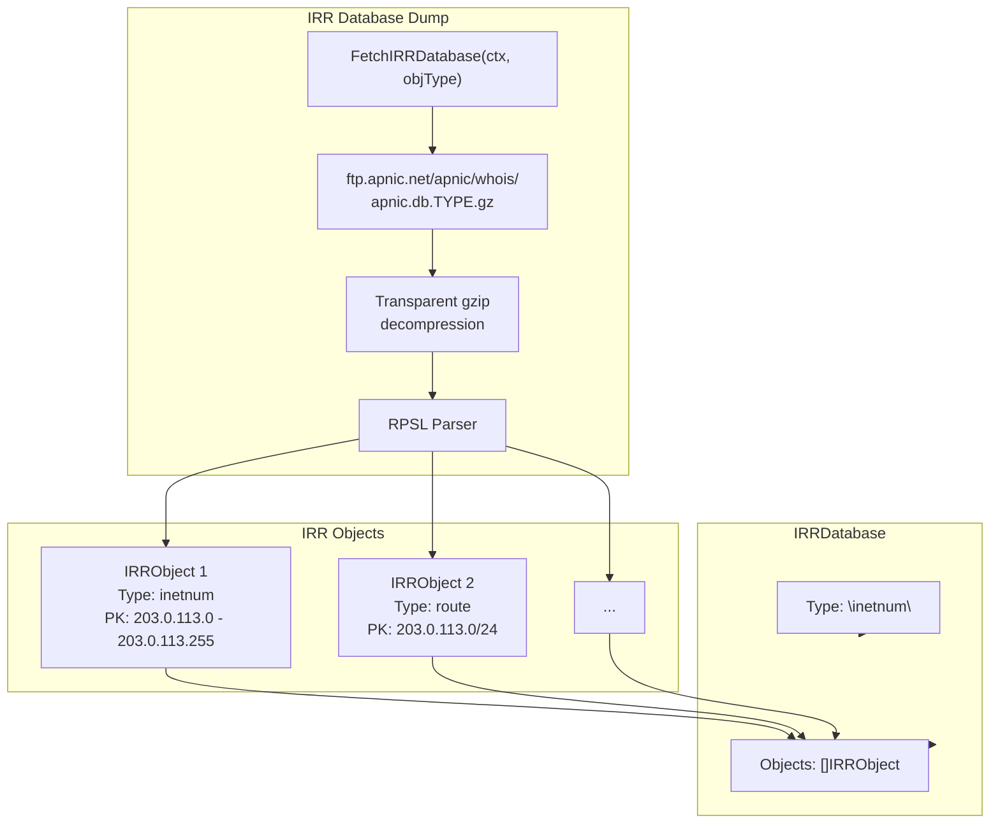
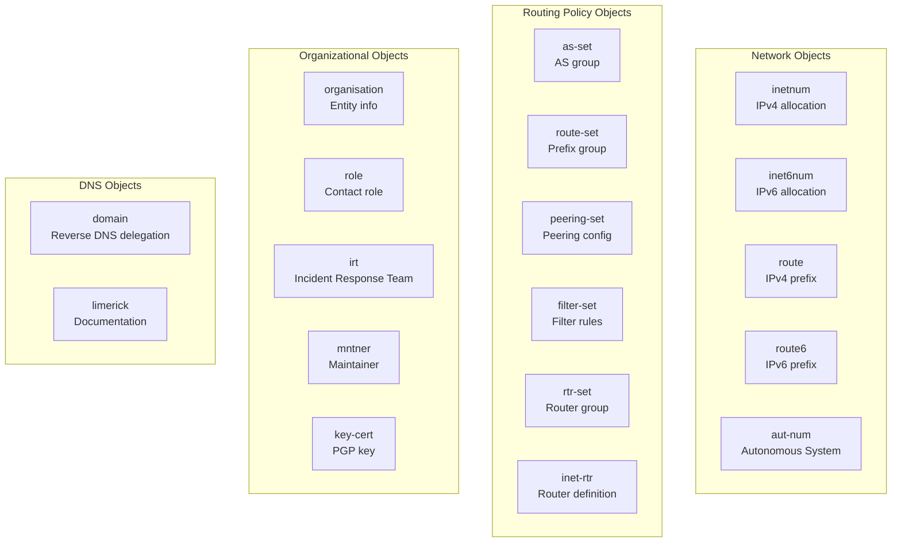
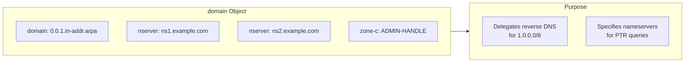

# IRR Database

The Internet Routing Registry (IRR) is a distributed database of routing policy information. APNIC publishes IRR database dumps containing RPSL (Routing Policy Specification Language) objects for 19 different object types.



## Methods

| Method | Description |
|--------|-------------|
| `FetchIRRDatabase(ctx, objType)` | Fetch and parse IRR dump for a specific object type |
| `GetIRRDatabase(ctx, objType)` | Cached IRR database dump |
| `FetchIRRCurrentSerial(ctx)` | Fetch `APNIC.CURRENTSERIAL` (current IRR serial number) |

## Object Types (19)



### IRRObjectTypes List

```go
var IRRObjectTypes = []string{
    "as-block",
    "as-set",
    "aut-num",
    "domain",
    "filter-set",
    "inet6num",
    "inetnum",
    "inet-rtr",
    "irt",
    "key-cert",
    "limerick",
    "mntner",
    "organisation",
    "peering-set",
    "role",
    "route",
    "route6",
    "route-set",
    "rtr-set",
}
```

## Domain Type and Reverse DNS

The `domain` object type is particularly important for reverse DNS delegation:



## Examples

### Fetch inetnum Objects

```go
package main

import (
    "context"
    "fmt"
    "log"

    apnic "github.com/cyberspacesec/apnic-skills"
)

func main() {
    client := apnic.NewClient()
    ctx := context.Background()

    // Fetch inetnum (IPv4 allocation) objects
    db, err := client.FetchIRRDatabase(ctx, "inetnum")
    if err != nil {
        log.Fatal(err)
    }

    fmt.Printf("Total inetnum objects: %d\n", len(db.Objects))

    // Show first few objects
    for i, obj := range db.Objects {
        if i >= 3 {
            break
        }
        fmt.Printf("\nObject %d:\n", i+1)
        fmt.Printf("  Primary Key: %s\n", obj.PrimaryKey)
        for key, values := range obj.Attributes {
            fmt.Printf("  %s: %v\n", key, values)
        }
    }
}
```

### Fetch route Objects

```go
package main

import (
    "context"
    "fmt"
    "log"

    apnic "github.com/cyberspacesec/apnic-skills"
)

func main() {
    client := apnic.NewClient()
    ctx := context.Background()

    // Fetch route objects
    db, err := client.FetchIRRDatabase(ctx, "route")
    if err != nil {
        log.Fatal(err)
    }

    fmt.Printf("Total route objects: %d\n", len(db.Objects))

    // Find routes with specific origin
    for _, obj := range db.Objects {
        if origins, ok := obj.Attributes["origin"]; ok {
            for _, origin := range origins {
                if origin == "AS13335" {
                    fmt.Printf("Route: %s -> %s\n", obj.PrimaryKey, origin)
                }
            }
        }
    }
}
```

### Fetch aut-num (ASN) Objects

```go
package main

import (
    "context"
    "fmt"
    "log"

    apnic "github.com/cyberspacesec/apnic-skills"
)

func main() {
    client := apnic.NewClient()
    ctx := context.Background()

    // Fetch aut-num (ASN) objects
    db, err := client.FetchIRRDatabase(ctx, "aut-num")
    if err != nil {
        log.Fatal(err)
    }

    fmt.Printf("Total aut-num objects: %d\n", len(db.Objects))

    // Print some ASNs
    for i, obj := range db.Objects {
        if i >= 5 {
            break
        }
        fmt.Printf("ASN: %s\n", obj.PrimaryKey)
        if names, ok := obj.Attributes["as-name"]; ok {
            fmt.Printf("  Name: %s\n", names[0])
        }
        if descrs, ok := obj.Attributes["descr"]; ok {
            fmt.Printf("  Description: %s\n", descrs[0])
        }
    }
}
```

### Fetch domain Objects (Reverse DNS Delegation)

```go
package main

import (
    "context"
    "fmt"
    "log"

    apnic "github.com/cyberspacesec/apnic-skills"
)

func main() {
    client := apnic.NewClient()
    ctx := context.Background()

    // Fetch domain objects (reverse DNS delegation)
    db, err := client.FetchIRRDatabase(ctx, "domain")
    if err != nil {
        log.Fatal(err)
    }

    fmt.Printf("Total domain objects: %d\n", len(db.Objects))

    // Show some reverse DNS delegations
    for i, obj := range db.Objects {
        if i >= 5 {
            break
        }
        fmt.Printf("\nDomain: %s\n", obj.PrimaryKey)
        if nss, ok := obj.Attributes["nserver"]; ok {
            fmt.Printf("  Nameservers:\n")
            for _, ns := range nss {
                fmt.Printf("    - %s\n", ns)
            }
        }
    }
}
```

### Get Current IRR Serial

```go
package main

import (
    "context"
    "fmt"
    "log"

    apnic "github.com/cyberspacesec/apnic-skills"
)

func main() {
    client := apnic.NewClient()
    ctx := context.Background()

    serial, err := client.FetchIRRCurrentSerial(ctx)
    if err != nil {
        log.Fatal(err)
    }

    fmt.Printf("Current IRR serial: %d\n", serial)
}
```

### Using Cached IRR Data

```go
package main

import (
    "context"
    "fmt"

    apnic "github.com/cyberspacesec/apnic-skills"
)

func main() {
    client := apnic.NewClient()
    ctx := context.Background()

    // First call fetches from network
    db1, _ := client.FetchIRRDatabase(ctx, "route")
    fmt.Printf("First fetch: %d objects\n", len(db1.Objects))

    // Subsequent Get call uses cache (if within TTL)
    db2, err := client.GetIRRDatabase(ctx, "route")
    if err != nil {
        fmt.Printf("Cache miss or expired\n")
    } else {
        fmt.Printf("From cache: %d objects\n", len(db2.Objects))
    }
}
```

## Data Structures

### IRRDatabase

```go
type IRRDatabase struct {
    Type    string      // Object type (e.g., "inetnum")
    Objects []IRRObject // Parsed RPSL objects
}

type IRRObject struct {
    Type       string              // Object type
    PrimaryKey string              // Primary key value
    Attributes map[string][]string // All attributes (key -> values)
}
```

### RPSL Parsing

The SDK handles RPSL format specifics:

- **Blank lines** separate objects
- **Comment lines** (`#`) are skipped
- **Continuation lines** (leading whitespace or `+`) are folded into the preceding attribute
- **Multi-valued attributes** are collected in a slice

```
inetnum:        203.0.113.0 - 203.0.113.255
netname:        EXAMPLE-NET
descr:          Example Network
descr:          Additional description line
country:        AU
admin-c:        ADMIN-HANDLE
tech-c:         TECH-HANDLE
mnt-by:         MAINT-EXAMPLE
changed:        admin@example.com 20240101
source:         APNIC
```

## Error Handling

```go
db, err := client.FetchIRRDatabase(ctx, "inetnum")
if err != nil {
    // Possible errors:
    // - ErrInvalidIRRType: unknown object type
    // - Network timeout
    // - Decompression failure
    // - Parse error
    log.Printf("IRR fetch failed: %v", err)
    return
}
```

## Large File Handling

IRR dumps can be large (e.g., `apnic.db.inetnum.gz` is 50MB+). The SDK handles this through:

1. **Transparent decompression**: gzip is handled automatically
2. **Chunked download**: Multi-connection download for large files
3. **Streaming parser**: Memory-efficient parsing without loading entire file

```go
// Configure for large files
client := apnic.NewClient(
    apnic.WithChunkSize(2*1024*1024),      // 2MB chunks
    apnic.WithMaxConcurrentDownloads(4),   // 4 concurrent connections
    apnic.WithDownloadTimeout(5*time.Minute),
)
```
