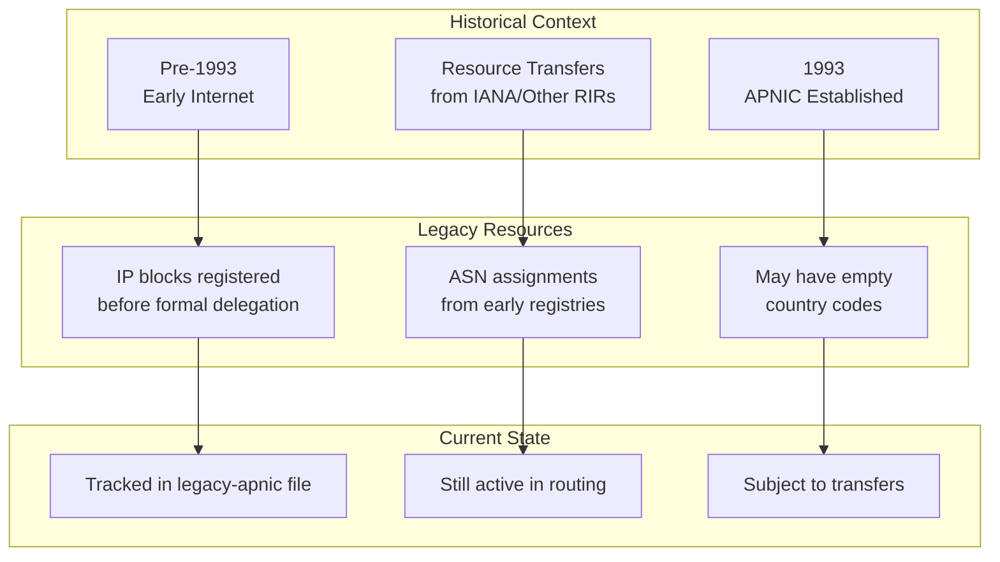
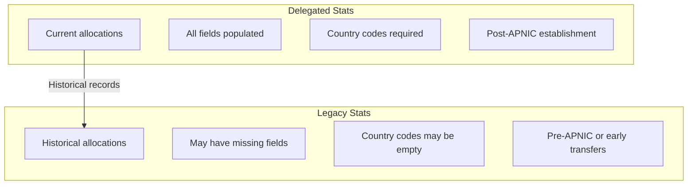

# Legacy Stats

Legacy stats contain historical resource records that were registered before APNIC's establishment or transferred from other registries. These records represent the earliest IP and ASN allocations in the Asia-Pacific region.

## Overview

Legacy resources are those that were allocated before the formal establishment of APNIC or were transferred from other registries during the early days of the Internet. These records may have incomplete information, such as empty country codes.



## Methods

| Method | Description |
|--------|-------------|
| `FetchLegacyEntries(ctx)` | Fetch latest legacy records |
| `GetLegacyEntries(ctx)` | Cached legacy records (30min TTL) |
| `FetchLegacyEntriesByDate(ctx, date)` | Fetch by date (YYYYMMDD format) |
| `FetchLegacyResult(ctx, date)` | Full result with header/summary/entries |

### Method Signatures

```go
// Fetch latest legacy stats
func (c *Client) FetchLegacyEntries(ctx context.Context) (*LegacyResult, error)

// Cached variant - fetches fresh data if cache expired
func (c *Client) GetLegacyEntries(ctx context.Context) ([]LegacyEntry, error)

// Fetch by specific date (YYYYMMDD format)
func (c *Client) FetchLegacyEntriesByDate(ctx context.Context, date string) (*LegacyResult, error)

// Full result including header and summaries
func (c *Client) FetchLegacyResult(ctx context.Context, date string) (*LegacyResult, error)
```

## Data Structures

### LegacyEntry

```go
type LegacyEntry struct {
    Registry string    // "apnic"
    Country  string    // ISO 3166-1 alpha-2 country code (may be empty!)
    Type     string    // "ipv4", "ipv6", or "asn"
    Start    string    // Starting address or AS number
    Value    int64     // Count (IPv4: IPs, IPv6: prefix length, ASN: count)
    Date     time.Time // Original allocation date (may be very old)
    Status   string    // "allocated", "assigned", "reserved"
}
```

### LegacyResult

```go
type LegacyResult struct {
    Header    StatsFileHeader // File metadata
    Summaries []StatsSummary  // Per-type summaries
    Entries   []LegacyEntry   // Historical legacy records
}
```

## Legacy vs Delegated



| Aspect | Delegated Stats | Legacy Stats |
|--------|----------------|--------------|
| Era | Post-APNIC (1993+) | Pre-APNIC or early transfers |
| Country codes | Required | May be empty |
| Data completeness | Full | May have gaps |
| Record count | ~45,000+ | ~2,000 |

## Examples

### Basic Usage

```go
package main

import (
    "context"
    "fmt"
    "log"

    apnic "github.com/cyberspacesec/apnic-skills"
)

func main() {
    client := apnic.NewClient()
    ctx := context.Background()

    // Fetch latest legacy stats
    result, err := client.FetchLegacyEntries(ctx)
    if err != nil {
        log.Fatal(err)
    }

    fmt.Printf("Total legacy entries: %d\n", len(result.Entries))

    // Print header info
    fmt.Printf("\nFile info:\n")
    fmt.Printf("  Version: %s\n", result.Header.Version)
    fmt.Printf("  Records: %d\n", result.Header.Records)

    // Print first 5 entries
    for i, entry := range result.Entries {
        if i >= 5 {
            break
        }
        country := entry.Country
        if country == "" {
            country = "(unknown)"
        }
        fmt.Printf("%s: %s/%d (%s) - %s\n",
            country, entry.Start, entry.Value, entry.Status, entry.Date.Format("2006-01-02"))
    }
}
```

### Finding Entries Without Country Codes

```go
result, _ := client.FetchLegacyEntries(ctx)

// Find legacy entries with empty country codes
var noCountry []apnic.LegacyEntry
for _, entry := range result.Entries {
    if entry.Country == "" {
        noCountry = append(noCountry, entry)
    }
}

fmt.Printf("Legacy entries without country: %d\n", len(noCountry))
for _, entry := range noCountry {
    fmt.Printf("  %s/%d (type: %s, status: %s)\n",
        entry.Start, entry.Value, entry.Type, entry.Status)
}
```

### Analyzing by Resource Type

```go
result, _ := client.FetchLegacyEntries(ctx)

// Count by type
typeCount := make(map[string]int)
for _, entry := range result.Entries {
    typeCount[entry.Type]++
}

fmt.Println("Legacy resources by type:")
for t, count := range typeCount {
    fmt.Printf("  %s: %d\n", t, count)
}

// Calculate IPv4 space
var totalIPv4 int64
for _, entry := range result.Entries {
    if entry.Type == "ipv4" {
        totalIPv4 += entry.Value
    }
}
fmt.Printf("\nTotal legacy IPv4 space: %d IPs\n", totalIPv4)
```

### Historical Date Analysis

```go
result, _ := client.FetchLegacyEntries(ctx)

// Find earliest allocations
var earliest []apnic.LegacyEntry
for _, entry := range result.Entries {
    if !entry.Date.IsZero() {
        earliest = append(earliest, entry)
    }
}

// Sort by date
sort.Slice(earliest, func(i, j int) bool {
    return earliest[i].Date.Before(earliest[j].Date)
})

fmt.Println("10 earliest legacy allocations:")
for i, entry := range earliest {
    if i >= 10 {
        break
    }
    fmt.Printf("  %s: %s/%d (%s)\n",
        entry.Date.Format("2006-01-02"), entry.Start, entry.Value, entry.Type)
}
```

### Using Cached Data

```go
// First call fetches from network
entries1, err := client.GetLegacyEntries(ctx)
if err != nil {
    log.Fatal(err)
}

// Subsequent calls within TTL return cached data
entries2, err := client.GetLegacyEntries(ctx)
if err != nil {
    log.Fatal(err)
}

fmt.Printf("Cached legacy entries: %d\n", len(entries2))
```

### Comparing Legacy with Current Delegated

```go
// Compare legacy vs delegated
legacy, _ := client.FetchLegacyEntries(ctx)
delegated, _ := client.FetchDelegatedEntries(ctx)

// Build set of legacy starts
legacyStarts := make(map[string]bool)
for _, entry := range legacy.Entries {
    if entry.Type == "ipv4" {
        legacyStarts[entry.Start] = true
    }
}

// Check which legacy prefixes are still in delegated
var stillActive, transferred []string
for _, entry := range delegated.Entries {
    if entry.Type == "ipv4" && legacyStarts[entry.Start] {
        stillActive = append(stillActive, entry.Start)
    }
}

fmt.Printf("Legacy IPv4 still in delegated: %d\n", len(stillActive))
```

### CIDR Conversion

```go
result, _ := client.FetchLegacyEntries(ctx)

for _, entry := range result.Entries {
    if entry.Type == "ipv4" {
        cidr, err := entry.CIDR()
        if err != nil {
            continue
        }
        fmt.Printf("%s -> %s (%d IPs)\n",
            entry.Start, cidr.String(), entry.Value)
    }
}
```

## File Format

The legacy stats file follows the same pipe-delimited format as delegated:

```
# Header
2|apnic|1737030783|2345|19930101|20240116|0

# Summary lines
apnic|*|ipv4|1234
apnic|*|ipv6|567
apnic|*|asn|544

# Data lines (note empty country codes possible)
apnic||ipv4|1.0.0.0|256|19830101|allocated
apnic|US|ipv4|3.0.0.0|16777216|19880501|allocated
apnic|JP|asn|179|1|19890201|allocated
```

## Data Sources

- **Latest**: `ftp://ftp.apnic.net/pub/stats/apnic/legacy-apnic-latest`
- **Archived**: `ftp://ftp.apnic.net/pub/stats/apnic/legacy-apnic-YYYYMMDD`

## Historical Context

Legacy resources in the APNIC region typically include:

1. **Early Class A/B allocations**: Large blocks assigned to organizations before CIDR
2. **Pre-RIR assignments**: Networks registered directly with IANA
3. **Early ASN assignments**: AS numbers from the original global pool
4. **Transferred resources**: Blocks moved between registries in the early Internet era

## See Also

- [Delegated Stats](delegated.md) - Current allocation records
- [Transfers](transfers.md) - IP/ASN transfer records
- [RDAP](rdap.md) - Query current registration data for legacy resources
