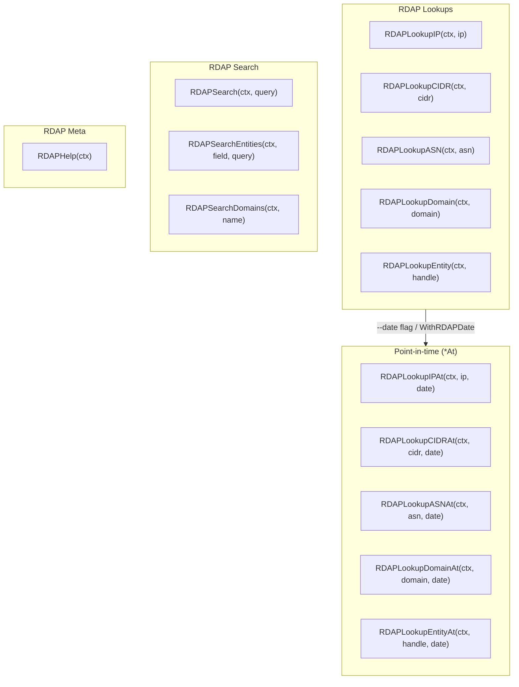
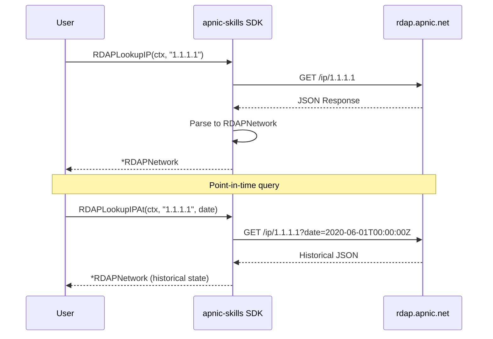
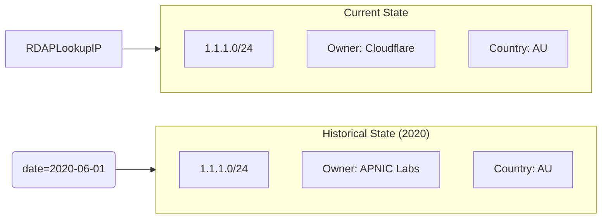

# RDAP Queries

RDAP (Registration Data Access Protocol) provides structured, machine-readable registration data for IP addresses, ASNs, and domains. This is the most important and feature-rich module of the SDK, offering comprehensive query capabilities including point-in-time historical lookups.

## Overview

RDAP replaces the legacy whois protocol with a RESTful JSON API defined in RFC 7480-7485. The APNIC RDAP service provides:

- IP and CIDR network lookups
- ASN (Autonomous System Number) queries
- Domain object queries (reverse DNS)
- Entity/contact searches
- Point-in-time historical queries



## Methods

### Lookup Methods

| Method | Description |
|--------|-------------|
| `RDAPLookupIP(ctx, ip)` | IP address lookup |
| `RDAPLookupCIDR(ctx, cidr)` | CIDR block lookup |
| `RDAPLookupASN(ctx, asn)` | ASN lookup |
| `RDAPLookupDomain(ctx, domain)` | Domain object lookup |
| `RDAPLookupEntity(ctx, handle)` | Entity/contact lookup |

### Point-in-Time Methods

| Method | Description |
|--------|-------------|
| `RDAPLookupIPAt(ctx, ip, date)` | IP address at specific UTC instant |
| `RDAPLookupCIDRAt(ctx, cidr, date)` | CIDR block at specific UTC instant |
| `RDAPLookupASNAt(ctx, asn, date)` | ASN at specific UTC instant |
| `RDAPLookupDomainAt(ctx, domain, date)` | Domain at specific UTC instant |
| `RDAPLookupEntityAt(ctx, handle, date)` | Entity at specific UTC instant |

### Search Methods

| Method | Description |
|--------|-------------|
| `RDAPSearch(ctx, query)` | Entity name search (wildcards supported) |
| `RDAPSearchEntities(ctx, field, query)` | Entity search by field (`fn`/`handle`) |
| `RDAPSearchDomains(ctx, name)` | Search reverse DNS domains |

### Meta Methods

| Method | Description |
|--------|-------------|
| `RDAPHelp(ctx)` | Server capabilities and notices |

## Method Signatures

```go
// Basic lookups
func (c *Client) RDAPLookupIP(ctx context.Context, ip string) (*RDAPNetwork, error)
func (c *Client) RDAPLookupCIDR(ctx context.Context, cidr string) (*RDAPNetwork, error)
func (c *Client) RDAPLookupASN(ctx context.Context, asn int64) (*RDAPAutnum, error)
func (c *Client) RDAPLookupDomain(ctx context.Context, domain string) (*RDAPDomain, error)
func (c *Client) RDAPLookupEntity(ctx context.Context, handle string) (*RDAPEntity, error)

// Point-in-time lookups (history_version_0 extension)
func (c *Client) RDAPLookupIPAt(ctx context.Context, ip string, date time.Time) (*RDAPNetwork, error)
func (c *Client) RDAPLookupCIDRAt(ctx context.Context, cidr string, date time.Time) (*RDAPNetwork, error)
func (c *Client) RDAPLookupASNAt(ctx context.Context, asn int64, date time.Time) (*RDAPAutnum, error)
func (c *Client) RDAPLookupDomainAt(ctx context.Context, domain string, date time.Time) (*RDAPDomain, error)
func (c *Client) RDAPLookupEntityAt(ctx context.Context, handle string, date time.Time) (*RDAPEntity, error)

// Search methods
func (c *Client) RDAPSearch(ctx context.Context, query string) (*RDAPSearchResult, error)
func (c *Client) RDAPSearchEntities(ctx context.Context, field, query string) (*RDAPSearchResult, error)
func (c *Client) RDAPSearchDomains(ctx context.Context, name string) (*RDAPDomainSearchResult, error)

// Meta
func (c *Client) RDAPHelp(ctx context.Context) (*RDAPHelpInfo, error)
```

## Data Structures

### RDAPNetwork

```go
type RDAPNetwork struct {
    ObjectClassName string       // "ip network"
    Handle          string       // Network handle
    StartAddress    string       // Starting IP
    EndAddress      string       // Ending IP
    IPVersion       string       // "v4" or "v6"
    Name            string       // Network name
    Country         string       // Country code
    Type            string       // Allocation type
    Status          []string     // Status values
    CIDR0CIDRs      []CIDR0      // CIDR representation
    Entities        []RDAPEntity // Related entities
    Events          []RDAPEvent  // Events (registration, last changed)
    Remarks         []RDAPRemark // Remarks
    ParentHandle    string       // Parent network handle
    Port43          string       // Whois server
    Notices         []RDAPNotice // Notices
    Links           []RDAPLink   // Related links
    Conformance     []string     // RDAP extensions supported
}
```

### RDAPAutnum

```go
type RDAPAutnum struct {
    ObjectClassName string       // "autnum"
    Handle          string       // ASN handle
    StartAutnum     int64        // Starting ASN
    EndAutnum       int64        // Ending ASN
    Name            string       // AS name
    Type            string       // AS type
    Status          []string     // Status values
    Country         string       // Country code
    Entities        []RDAPEntity // Related entities
    Events          []RDAPEvent  // Events
    Remarks         []RDAPRemark // Remarks
    Port43          string       // Whois server
}
```

### RDAPEntity

```go
type RDAPEntity struct {
    ObjectClassName string        // "entity"
    Handle          string        // Entity handle
    Roles           []string      // Roles (registrant, admin, technical)
    Events          []RDAPEvent   // Events
    Links           []RDAPLink    // Related links
    VcardArray      []interface{} // Contact information (vCard)
    Entities        []RDAPEntity  // Nested entities
    Remarks         []RDAPRemark  // Remarks
    Status          []string      // Status values
}
```

### RDAPDomain

```go
type RDAPDomain struct {
    ObjectClassName string           // "domain"
    Handle          string           // Domain handle
    LDHName         string           // Domain name (LDH format)
    Nameservers     []RDAPNameserver // Nameservers
    Entities        []RDAPEntity     // Related entities
    Events          []RDAPEvent      // Events
    Remarks         []RDAPRemark     // Remarks
    Port43          string           // Whois server
}
```

## Query Flow



## Point-in-Time Queries

APNIC supports the `history_version_0` RDAP extension, allowing queries for the state of a resource at a specific point in time:



### Using Point-in-Time

```go
// Method 1: Direct *At method
date := time.Date(2020, 6, 1, 0, 0, 0, 0, time.UTC)
network, err := client.RDAPLookupIPAt(ctx, "1.1.1.1", date)

// Method 2: Client-level date setting
client := apnic.NewClient(
    apnic.WithRDAPDate(date),
)
network, err := client.RDAPLookupIP(ctx, "1.1.1.1")
// All RDAP queries will use this date

// Method 3: CLI flag
// apnic rdap ip 1.1.1.1 --date 2020-06-01T00:00:00Z
```

## Examples

### IP Address Lookup

```go
package main

import (
    "context"
    "fmt"
    "log"

    apnic "github.com/cyberspacesec/apnic-skills"
)

func main() {
    client := apnic.NewClient()
    ctx := context.Background()

    // Look up IP address
    network, err := client.RDAPLookupIP(ctx, "1.1.1.1")
    if err != nil {
        log.Fatal(err)
    }

    fmt.Printf("Network: %s\n", network.Handle)
    fmt.Printf("Name: %s\n", network.Name)
    fmt.Printf("Country: %s\n", network.Country)
    fmt.Printf("Type: %s\n", network.Type)
    fmt.Printf("Start: %s\n", network.StartAddress)
    fmt.Printf("End: %s\n", network.EndAddress)

    // Print CIDR
    for _, cidr := range network.CIDR0CIDRs {
        if cidr.V4Prefix != "" {
            fmt.Printf("CIDR: %s/%d\n", cidr.V4Prefix, cidr.Length)
        }
    }

    // Print entities
    for _, entity := range network.Entities {
        fmt.Printf("Entity: %s (roles: %v)\n", entity.Handle, entity.Roles)
    }

    // Print events
    for _, event := range network.Events {
        fmt.Printf("Event: %s at %s\n", event.EventAction, event.EventDate)
    }
}
```

### CIDR Lookup

```go
// Look up CIDR block
network, err := client.RDAPLookupCIDR(ctx, "1.1.1.0/24")
if err != nil {
    log.Fatal(err)
}

fmt.Printf("Network: %s\n", network.Handle)
fmt.Printf("Name: %s\n", network.Name)
fmt.Printf("Country: %s\n", network.Country)
fmt.Printf("Type: %s\n", network.Type)
fmt.Printf("Status: %v\n", network.Status)
```

### ASN Lookup

```go
// Look up ASN
asn, err := client.RDAPLookupASN(ctx, 13335)
if err != nil {
    log.Fatal(err)
}

fmt.Printf("ASN: %d-%d\n", asn.StartAutnum, asn.EndAutnum)
fmt.Printf("Name: %s\n", asn.Name)
fmt.Printf("Country: %s\n", asn.Country)
fmt.Printf("Type: %s\n", asn.Type)
fmt.Printf("Status: %v\n", asn.Status)

// Print entities
for _, entity := range asn.Entities {
    fmt.Printf("Entity: %s (roles: %v)\n", entity.Handle, entity.Roles)
}
```

### Entity Lookup

```go
// Look up entity by handle
entity, err := client.RDAPLookupEntity(ctx, "ORG-ARAD1-AP")
if err != nil {
    log.Fatal(err)
}

fmt.Printf("Handle: %s\n", entity.Handle)
fmt.Printf("Roles: %v\n", entity.Roles)

// Entity information is in vcardArray
if len(entity.VcardArray) > 1 {
    // vcardArray[0] is "vcard", vcardArray[1] is array of properties
    fmt.Printf("Has vCard data\n")
}
```

### Entity Search

```go
// Search entities by name (supports wildcards)
result, err := client.RDAPSearch(ctx, "*CLOUDFLARE*")
if err != nil {
    log.Fatal(err)
}

fmt.Printf("Found %d entities\n", len(result.EntitySearchResults))
for _, entity := range result.EntitySearchResults {
    fmt.Printf("  %s\n", entity.Handle)
}

// Search by specific field
result, err = client.RDAPSearchEntities(ctx, "fn", "*GOOGLE*")
if err != nil {
    log.Fatal(err)
}

// Exact handle lookup via search
result, err = client.RDAPSearchEntities(ctx, "handle", "ORG-ARAD1-AP")
```

### Domain Search

```go
// Search reverse DNS domains
domains, err := client.RDAPSearchDomains(ctx, "1")
if err != nil {
    log.Fatal(err)
}

fmt.Printf("Found %d domains\n", len(domains.DomainSearchResults))
for _, domain := range domains.DomainSearchResults {
    fmt.Printf("  %s\n", domain.LDHName)

    // Print nameservers
    for _, ns := range domain.Nameservers {
        fmt.Printf("    NS: %s\n", ns.LDHName)
    }
}
```

### RDAP Help (Server Capabilities)

```go
// Get server capabilities
help, err := client.RDAPHelp(ctx)
if err != nil {
    log.Fatal(err)
}

fmt.Println("RDAP Conformance:")
for _, ext := range help.Conformance {
    fmt.Printf("  %s\n", ext)
    // Examples: history_version_0, cidr0, nro_rdap_profile_0
}

fmt.Println("\nNotices:")
for _, notice := range help.Notices {
    fmt.Printf("  %s\n", notice.Title)
    for _, desc := range notice.Description {
        fmt.Printf("    %s\n", desc)
    }
}
```

### Point-in-Time Historical Query

```go
// Query historical state
date := time.Date(2020, 6, 1, 0, 0, 0, 0, time.UTC)

network, err := client.RDAPLookupIPAt(ctx, "1.1.1.1", date)
if err != nil {
    log.Fatal(err)
}

fmt.Printf("State of 1.1.1.1 on %s:\n", date.Format("2006-01-02"))
fmt.Printf("Network: %s\n", network.Handle)
fmt.Printf("Name: %s\n", network.Name)
fmt.Printf("Country: %s\n", network.Country)
```

### Comparing Historical vs Current

```go
// Compare current vs historical
current, _ := client.RDAPLookupIP(ctx, "1.1.1.1")

date := time.Date(2019, 1, 1, 0, 0, 0, 0, time.UTC)
historical, _ := client.RDAPLookupIPAt(ctx, "1.1.1.1", date)

fmt.Println("Current state:")
fmt.Printf("  Name: %s\n", current.Name)
fmt.Printf("  Country: %s\n", current.Country)

fmt.Println("Historical state (2019-01-01):")
fmt.Printf("  Name: %s\n", historical.Name)
fmt.Printf("  Country: %s\n", historical.Country)

if current.Name != historical.Name {
    fmt.Println("Owner changed!")
}
```

### Setting Default Date for All Queries

```go
// Set default date for all RDAP queries on this client
historicalDate := time.Date(2022, 12, 31, 23, 59, 59, 0, time.UTC)

client := apnic.NewClient(
    apnic.WithRDAPDate(historicalDate),
)

// All queries will use this date
network, _ := client.RDAPLookupIP(ctx, "1.1.1.1")
asn, _ := client.RDAPLookupASN(ctx, 13335)

// Override with explicit *At method
currentNetwork, _ := client.RDAPLookupIPAt(ctx, "1.1.1.1", time.Time{})
```

## RDAP Extensions

APNIC supports several RDAP extensions visible in the `rdapConformance` array:

| Extension | Description |
|-----------|-------------|
| `history_version_0` | Point-in-time historical queries |
| `cidr0` | CIDR notation in responses |
| `nro_rdap_profile_0` | NRO RDAP profile compliance |
| `rdap_level_0` | Base RDAP compliance |

## Status Values

Common status values in RDAP responses:

| Status | Description |
|--------|-------------|
| `active` | Resource is active |
| `deleted` | Resource has been deleted |
| `transfer pending` | Transfer in progress |
| `transfer prohibited` | Cannot be transferred |
| `redeploy pending` | Redelegation in progress |

## Entity Roles

| Role | Description |
|------|-------------|
| `registrant` | Resource holder |
| `administrative` | Administrative contact |
| `technical` | Technical contact |
| `abuse` | Abuse contact |
| `noc` | Network Operations Center |

## Error Handling

```go
import "errors"

network, err := client.RDAPLookupIP(ctx, "invalid")
if err != nil {
    if errors.Is(err, apnic.ErrNotFound) {
        fmt.Println("Resource not found")
    } else if errors.Is(err, apnic.ErrRDAPQueryFailed) {
        fmt.Println("RDAP query failed:", err)
    }
}
```

## API Endpoint

- **Base URL**: `https://rdap.apnic.net`
- **Content-Type**: `application/rdap+json`

## See Also

- [Whois Queries](whois.md) - Legacy whois protocol
- [Extended Stats](extended.md) - Delegated stats with opaque-IDs for cross-referencing
- [REx Cross-RIR](rex.md) - Cross-RIR resource lookup
