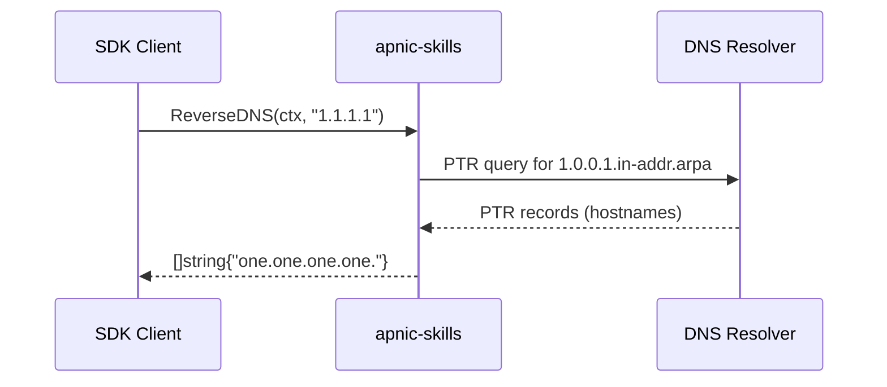
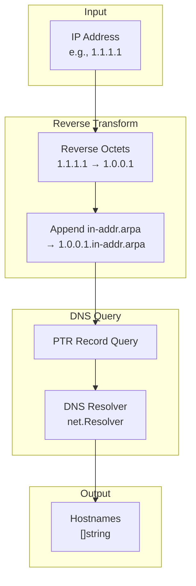

# Reverse DNS

The `apnic-skills` SDK provides reverse DNS (PTR record) lookup functionality. Reverse DNS maps IP addresses back to domain names, which is useful for identifying hostnames, mail server verification, and network troubleshooting.



## Method

| Method | Description |
|--------|-------------|
| `ReverseDNS(ctx, ip)` | Perform a reverse DNS (PTR) lookup for an IP address |

## PTR Query Flow



## Examples

### Basic Reverse DNS Lookup

```go
package main

import (
    "context"
    "fmt"
    "log"

    apnic "github.com/cyberspacesec/apnic-skills"
)

func main() {
    client := apnic.NewClient()
    ctx := context.Background()

    // Reverse DNS lookup for an IP
    hostnames, err := client.ReverseDNS(ctx, "1.1.1.1")
    if err != nil {
        log.Fatal(err)
    }

    fmt.Printf("PTR records for 1.1.1.1:\n")
    for i, name := range hostnames {
        fmt.Printf("  %d: %s\n", i+1, name)
    }
}
```

### Multiple IP Lookups

```go
package main

import (
    "context"
    "fmt"

    apnic "github.com/cyberspacesec/apnic-skills"
)

func main() {
    client := apnic.NewClient()
    ctx := context.Background()

    ips := []string{
        "8.8.8.8",
        "1.1.1.1",
        "208.67.222.222",
    }

    for _, ip := range ips {
        names, err := client.ReverseDNS(ctx, ip)
        if err != nil {
            fmt.Printf("%s: error: %v\n", ip, err)
            continue
        }

        if len(names) == 0 {
            fmt.Printf("%s: no PTR records\n", ip)
        } else {
            fmt.Printf("%s: %s\n", ip, names[0])
        }
    }
}
```

### With Context Timeout

```go
package main

import (
    "context"
    "fmt"
    "log"
    "time"

    apnic "github.com/cyberspacesec/apnic-skills"
)

func main() {
    client := apnic.NewClient()

    // Create context with 5 second timeout
    ctx, cancel := context.WithTimeout(context.Background(), 5*time.Second)
    defer cancel()

    names, err := client.ReverseDNS(ctx, "1.1.1.1")
    if err != nil {
        log.Fatal(err)
    }

    fmt.Printf("Hostnames: %v\n", names)
}
```

### Combined with Whois

```go
package main

import (
    "context"
    "fmt"
    "log"

    apnic "github.com/cyberspacesec/apnic-skills"
)

func main() {
    client := apnic.NewClient()
    ctx := context.Background()
    ip := "1.1.1.1"

    // Get Whois info
    whois, err := client.QueryWhoisIP(ctx, ip)
    if err != nil {
        log.Printf("Whois error: %v", err)
    }

    // Get reverse DNS
    ptr, err := client.ReverseDNS(ctx, ip)
    if err != nil {
        log.Printf("Reverse DNS error: %v", err)
    }

    fmt.Printf("IP: %s\n", ip)
    fmt.Printf("Network: %s\n", whois.Network)
    fmt.Printf("Country: %s\n", whois.Country)
    fmt.Printf("Organization: %s\n", whois.OrgName)
    fmt.Printf("PTR: %v\n", ptr)
}
```

## Output Examples

### Successful Lookup

```
PTR records for 1.1.1.1:
  1: one.one.one.one.
```

### No PTR Records

When no PTR records exist, the function returns an empty slice:

```go
names, err := client.ReverseDNS(ctx, "192.0.2.1")
if err != nil {
    // Check for DNS error
}
if len(names) == 0 {
    fmt.Println("No PTR records found")
}
```

## Testing Injection

The SDK supports injecting a custom reverse DNS resolver for testing purposes:

```go
package main

import (
    "context"
    apnic "github.com/cyberspacesec/apnic-skills"
)

func main() {
    // Inject custom resolver for testing
    apnic.SetLookupAddr(func(ctx context.Context, ip string) ([]string, error) {
        // Return mock data
        if ip == "1.1.1.1" {
            return []string{"mock.example.com."}, nil
        }
        return nil, nil
    })
    defer apnic.SetLookupAddr(nil) // Restore default

    // ... tests that use the injected resolver
}
```

## Error Handling

```go
names, err := client.ReverseDNS(ctx, "1.1.1.1")
if err != nil {
    // Possible errors:
    // - DNS server unreachable
    // - Context deadline exceeded
    // - Network timeout
    log.Printf("Reverse DNS failed: %v", err)
    return
}

// Empty result is valid (no PTR records)
if len(names) == 0 {
    fmt.Println("No PTR records configured")
}
```

## Use Cases

1. **Mail Server Verification**: Check if sending IP has valid reverse DNS
2. **Security Analysis**: Identify hostnames associated with IPs
3. **Network Troubleshooting**: Verify DNS configuration
4. **Log Analysis**: Enrich IP addresses with hostnames
