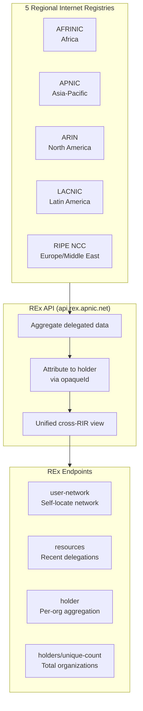
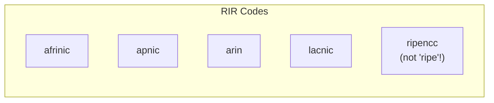
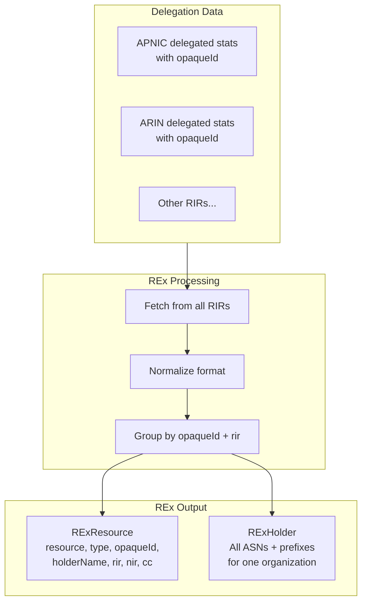

# REx Cross-RIR Resource Registry

REx (Resource EXplorer) is APNIC's cross-RIR resource registry that aggregates delegation data from all five Regional Internet Registries (AFRINIC, APNIC, ARIN, LACNIC, and RIPE NCC) into a unified view with holder attribution via opaqueId.



## Methods

| Method | Description |
|--------|-------------|
| `FetchRExUserNetwork(ctx)` | Self-locate: return covering prefix, ASN, economy for caller's IP |
| `FetchRExResources(ctx, type)` | Cross-RIR recent delegations with holder attribution |
| `FetchRExHolder(ctx, opaqueID, rir)` | Aggregate all resources held by one organization |
| `FetchRExHoldersUniqueCount(ctx)` | Total unique holder count across all RIRs |

## RIR Values

The `rir` parameter for `FetchRExHolder` must be one of:



> **Important**: The RIPE NCC code is `ripencc`, not `ripe`.

## Cross-RIR Aggregation Flow



## Examples

### Self-Locate Network

```go
package main

import (
    "context"
    "fmt"
    "log"

    apnic "github.com/cyberspacesec/apnic-skills"
)

func main() {
    client := apnic.NewClient()
    ctx := context.Background()

    // Determine network from caller's source IP
    network, err := client.FetchRExUserNetwork(ctx)
    if err != nil {
        log.Fatal(err)
    }

    fmt.Printf("Your network information:\n")
    fmt.Printf("  IP: %s\n", network.IP)
    fmt.Printf("  Prefix: %s\n", network.Prefix)
    fmt.Printf("  Origin ASN: %d\n", network.ASN)
    fmt.Printf("  Economy: %s\n", network.Economy)
}
```

### Fetch Recent Delegations

```go
package main

import (
    "context"
    "fmt"
    "log"

    apnic "github.com/cyberspacesec/apnic-skills"
)

func main() {
    client := apnic.NewClient()
    ctx := context.Background()

    // Fetch recent IPv4 delegations
    resources, err := client.FetchRExResources(ctx, "ipv4")
    if err != nil {
        log.Fatal(err)
    }

    fmt.Printf("Recent IPv4 delegations: %d\n", len(resources.Items))

    // Show some entries
    fmt.Println("\nFirst 5 entries:")
    for i, r := range resources.Items {
        if i >= 5 {
            break
        }
        fmt.Printf("  %s (%s) - %s [%s]\n",
            r.Resource, r.Type, r.HolderName, r.RIR)
    }
}
```

### Filter by Resource Type

```go
package main

import (
    "context"
    "fmt"
    "log"

    apnic "github.com/cyberspacesec/apnic-skills"
)

func main() {
    client := apnic.NewClient()
    ctx := context.Background()

    types := []string{"ipv4", "ipv6", "asn", ""} // "" = all types

    for _, t := range types {
        resources, err := client.FetchRExResources(ctx, t)
        if err != nil {
            log.Printf("Type %s: %v", t, err)
            continue
        }

        typeName := t
        if typeName == "" {
            typeName = "all"
        }
        fmt.Printf("%s: %d resources\n", typeName, len(resources.Items))
    }
}
```

### Aggregate Holder Resources

```go
package main

import (
    "context"
    "fmt"
    "log"

    apnic "github.com/cyberspacesec/apnic-skills"
)

func main() {
    client := apnic.NewClient()
    ctx := context.Background()

    // Get holder's complete resource portfolio
    // opaqueId can be obtained from:
    // - RExResource.OpaqueID
    // - DelegatedExtendedEntry.OpaqueID
    opaqueId := "A92E1062" // Example opaqueId
    rir := "apnic"         // RIR responsible for this holder

    holder, err := client.FetchRExHolder(ctx, opaqueId, rir)
    if err != nil {
        log.Fatal(err)
    }

    fmt.Printf("Holder: %s\n", holder.HolderName)
    fmt.Printf("Opaque ID: %s\n", holder.OpaqueID)
    fmt.Printf("Registry: %s\n", holder.Registry)
    if holder.NIR != "" {
        fmt.Printf("NIR: %s\n", holder.NIR)
    }

    fmt.Printf("\nASNs (%d):\n", holder.ASNsCount)
    for _, asn := range holder.ASNs {
        fmt.Printf("  %s\n", asn)
    }

    fmt.Printf("\nIPv4 prefixes (%.1f /24s):\n", holder.IPv4_24Count)
    for _, pfx := range holder.IPv4 {
        fmt.Printf("  %s\n", pfx)
    }

    fmt.Printf("\nIPv6 prefixes (%.1f /48s):\n", holder.IPv6_48Count)
    for _, pfx := range holder.IPv6 {
        fmt.Printf("  %s\n", pfx)
    }
}
```

### Count Unique Holders

```go
package main

import (
    "context"
    "fmt"
    "log"

    apnic "github.com/cyberspacesec/apnic-skills"
)

func main() {
    client := apnic.NewClient()
    ctx := context.Background()

    count, err := client.FetchRExHoldersUniqueCount(ctx)
    if err != nil {
        log.Fatal(err)
    }

    fmt.Printf("Total unique resource holders: %d\n", count.Count)
}
```

### Complete Organization Lookup

```go
package main

import (
    "context"
    "fmt"
    "log"

    apnic "github.com/cyberspacesec/apnic-skills"
)

func main() {
    client := apnic.NewClient()
    ctx := context.Background()

    // Step 1: Find organization in resources
    resources, _ := client.FetchRExResources(ctx, "")

    // Find entries for a specific country
    var opaqueId, rir string
    for _, r := range resources.Items {
        if r.CC == "JP" && r.Type == "ipv4" {
            opaqueId = r.OpaqueID
            rir = r.RIR
            fmt.Printf("Found: %s (opaqueId: %s, rir: %s)\n",
                r.HolderName, opaqueId, rir)
            break
        }
    }

    if opaqueId == "" {
        fmt.Println("No matching organization found")
        return
    }

    // Step 2: Get full resource portfolio
    holder, err := client.FetchRExHolder(ctx, opaqueId, rir)
    if err != nil {
        log.Fatal(err)
    }

    fmt.Printf("\nComplete portfolio for %s:\n", holder.HolderName)
    fmt.Printf("  ASNs: %d\n", holder.ASNsCount)
    fmt.Printf("  IPv4 /24s: %.1f\n", holder.IPv4_24Count)
    fmt.Printf("  IPv6 /48s: %.1f\n", holder.IPv6_48Count)
}
```

## Data Structures

### RExUserNetwork

```go
type RExUserNetwork struct {
    IP      string // Caller's source IP
    Prefix  string // Covering prefix
    ASN     int64  // Origin ASN
    Economy string // ISO country code
}
```

### RExResource

```go
type RExResource struct {
    Resource       string // Prefix or ASN
    Type           string // "ipv4", "ipv6", or "asn"
    OpaqueID       string // Holder's opaque identifier
    HolderName     string // Organization name
    RIR            string // Responsible RIR
    NIR            string // NIR (if applicable)
    DelegationDate string // Date delegated
    TransferDate   string // Date transferred (if any)
    CC             string // Country code
}
```

### RExHolder

```go
type RExHolder struct {
    OpaqueID     string   // Holder's opaque identifier
    Registry     string   // Responsible RIR
    NIR          string   // NIR (if applicable)
    HolderName   string   // Organization name
    ASNs         []string // All ASNs
    ASNsCount    int      // Number of ASNs
    IPv4         []string // All IPv4 prefixes
    IPv4_24Count float64  // IPv4 space in /24 units
    IPv6         []string // All IPv6 prefixes
    IPv6_48Count float64  // IPv6 space in /48 units
}
```

### RExHoldersCount

```go
type RExHoldersCount struct {
    Count int64 // Total unique holders across all RIRs
}
```

## Use Cases

1. **IP Investigation**: Find which organization owns a prefix
2. **Network Self-Location**: Determine your public network identity
3. **Organization Profiling**: Get complete resource portfolio for a company
4. **Cross-RIR Analysis**: Understand resource distribution across regions
5. **Market Intelligence**: Track delegation trends by holder

## Error Handling

```go
holder, err := client.FetchRExHolder(ctx, opaqueId, rir)
if err != nil {
    // Possible errors:
    // - ErrInvalidRExParam: missing opaqueId or rir
    // - REx API error (4xx response with plain text message)
    // - Network timeout
    log.Printf("REx holder fetch failed: %v", err)
    return
}

// Check if REx API returned a client error
if apnic.IsRExAPIError(err) {
    fmt.Println("Client error from REx API")
}
```

## Configuration

```go
client := apnic.NewClient(
    apnic.WithRExBaseURL("https://api.rex.apnic.net"),
    // REx inherits anti-scraping headers from the shared HTTP client
)
```
