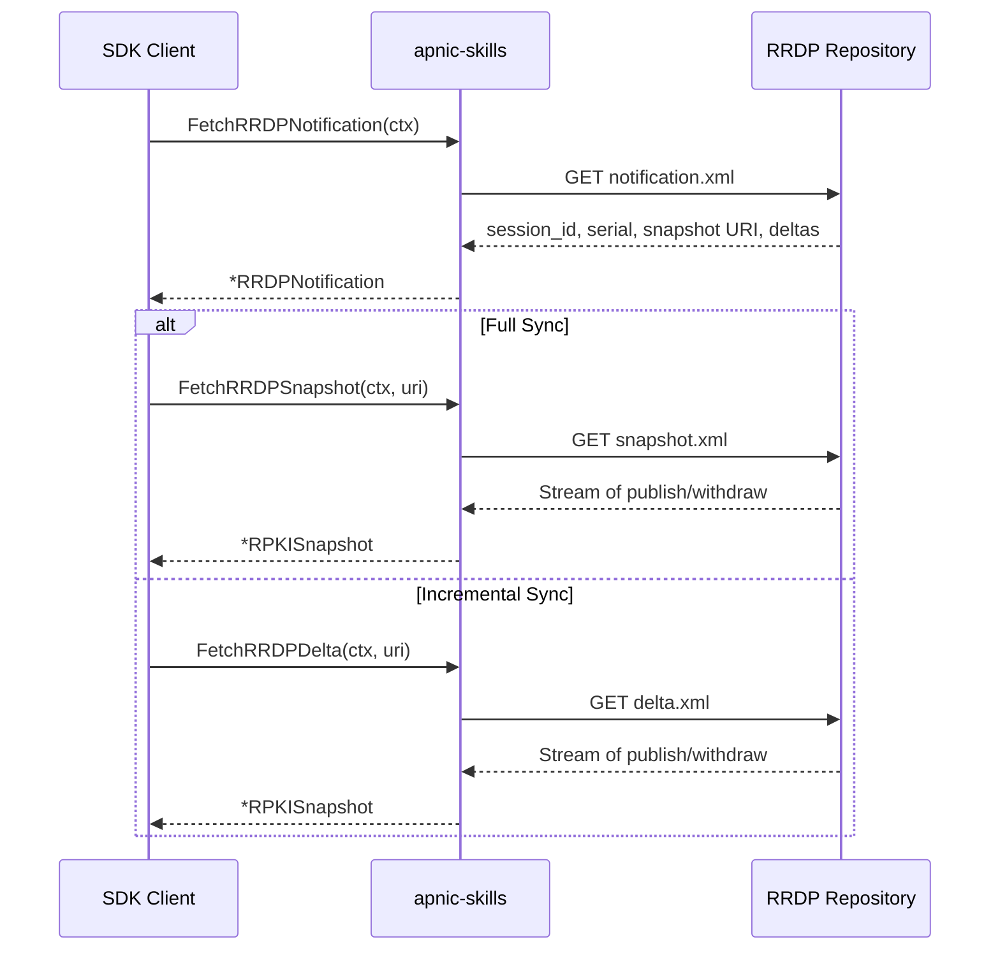
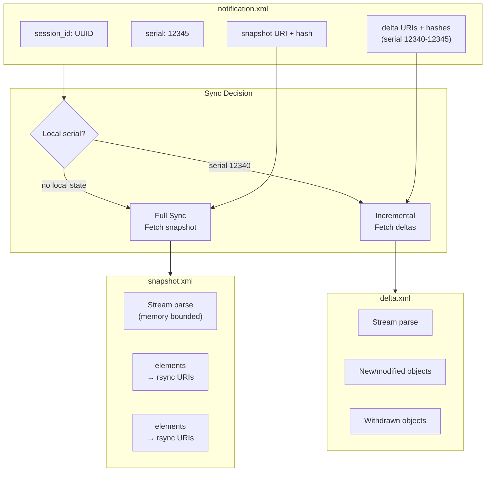
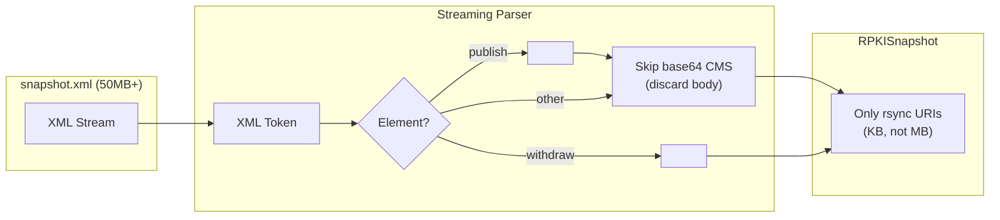

# RPKI / RRDP

Resource Public Key Infrastructure (RPKI) provides a framework for securing Internet routing. The SDK supports RRDP (RPKI Repository Delta Protocol) for synchronizing RPKI data from APNIC's repository.



## Methods

| Method | Description |
|--------|-------------|
| `FetchRRDPNotification(ctx)` | Fetch `notification.xml` with session_id, serial, snapshot and delta references |
| `FetchRRDPSnapshot(ctx, uri)` | Stream-parse snapshot.xml, extract rsync URIs from `<publish>`/`<withdraw>` |
| `FetchRRDPDelta(ctx, uri)` | Stream-parse delta.xml (incremental update) |

## RRDP Synchronization Flow



## Stream Parsing

RRDP files can be large (multi-megabyte). The SDK uses streaming XML parsing to keep memory bounded:



## Examples

### Fetch RRDP Notification

```go
package main

import (
    "context"
    "fmt"
    "log"

    apnic "github.com/cyberspacesec/apnic-skills"
)

func main() {
    client := apnic.NewClient()
    ctx := context.Background()

    // Fetch notification.xml
    notif, err := client.FetchRRDPNotification(ctx)
    if err != nil {
        log.Fatal(err)
    }

    fmt.Printf("Session ID: %s\n", notif.SessionID)
    fmt.Printf("Serial: %d\n", notif.Serial)
    fmt.Printf("\nSnapshot:\n")
    fmt.Printf("  URI: %s\n", notif.Snapshot.URI)
    fmt.Printf("  Serial: %d\n", notif.Snapshot.Serial)
    fmt.Printf("  Hash: %s\n", notif.Snapshot.Hash)

    fmt.Printf("\nDeltas (%d available):\n", len(notif.Deltas))
    for i, d := range notif.Deltas {
        if i >= 5 {
            fmt.Printf("  ... and %d more\n", len(notif.Deltas)-5)
            break
        }
        fmt.Printf("  Serial %d: %s\n", d.Serial, d.URI)
    }
}
```

### Fetch Current Snapshot

```go
package main

import (
    "context"
    "fmt"
    "log"

    apnic "github.com/cyberspacesec/apnic-skills"
)

func main() {
    client := apnic.NewClient()
    ctx := context.Background()

    // Get notification first
    notif, err := client.FetchRRDPNotification(ctx)
    if err != nil {
        log.Fatal(err)
    }

    // Fetch the current snapshot
    snapshot, err := client.FetchRRDPSnapshot(ctx, notif.Snapshot.URI)
    if err != nil {
        log.Fatal(err)
    }

    fmt.Printf("Session ID: %s\n", snapshot.SessionID)
    fmt.Printf("Serial: %d\n", snapshot.Serial)
    fmt.Printf("Published objects: %d\n", len(snapshot.Published))
    fmt.Printf("Withdrawn objects: %d\n", len(snapshot.Withdrawn))

    // Show some published URIs
    fmt.Println("\nFirst 5 published URIs:")
    for i, uri := range snapshot.Published {
        if i >= 5 {
            break
        }
        fmt.Printf("  %s\n", uri)
    }
}
```

### Incremental Synchronization

```go
package main

import (
    "context"
    "fmt"
    "log"

    apnic "github.com/cyberspacesec/apnic-skills"
)

func main() {
    client := apnic.NewClient()
    ctx := context.Background()

    notif, _ := client.FetchRRDPNotification(ctx)

    // Assume we have local state at serial 12340
    localSerial := int64(12340)

    // Find applicable deltas
    var applicableDeltas []apnic.RRDPRef
    for _, d := range notif.Deltas {
        if d.Serial > localSerial {
            applicableDeltas = append(applicableDeltas, d)
        }
    }

    if len(applicableDeltas) == 0 {
        fmt.Println("No new deltas, already up to date")
        return
    }

    fmt.Printf("Applying %d deltas:\n", len(applicableDeltas))

    for _, d := range applicableDeltas {
        delta, err := client.FetchRRDPDelta(ctx, d.URI)
        if err != nil {
            log.Printf("Delta %d failed: %v", d.Serial, err)
            continue
        }

        fmt.Printf("  Serial %d: +%d published, -%d withdrawn\n",
            d.Serial, len(delta.Published), len(delta.Withdrawn))
    }
}
```

### Full RRDP Sync Workflow

```go
package main

import (
    "context"
    "fmt"

    apnic "github.com/cyberspacesec/apnic-skills"
)

func main() {
    client := apnic.NewClient()
    ctx := context.Background()

    // 1. Fetch notification
    notif, err := client.FetchRRDPNotification(ctx)
    if err != nil {
        fmt.Printf("Notification fetch failed: %v\n", err)
        return
    }

    fmt.Printf("Current serial: %d\n", notif.Serial)
    fmt.Printf("Session ID: %s\n", notif.SessionID)

    // 2. Fetch snapshot for full sync
    snapshot, err := client.FetchRRDPSnapshot(ctx, notif.Snapshot.URI)
    if err != nil {
        fmt.Printf("Snapshot fetch failed: %v\n", err)
        return
    }

    fmt.Printf("\nRPKI Repository State:\n")
    fmt.Printf("  Total published: %d\n", len(snapshot.Published))
    fmt.Printf("  Total withdrawn: %d\n", len(snapshot.Withdrawn))

    // 3. Process published URIs
    // URIs are rsync:// format, e.g.,
    // rsync://rpki.apnic.net/repository/...
    prefixCount := 0
    for _, uri := range snapshot.Published {
        // URIs typically contain ROA files (.cer, .mft, .crl)
        // Parse as needed for your use case
        if len(uri) > 4 && uri[len(uri)-4:] == ".cer" {
            prefixCount++
        }
    }
    fmt.Printf("  .cer files: %d\n", prefixCount)
}
```

## Data Structures

### RRDPNotification

```go
type RRDPNotification struct {
    Version   string    // RRDP version
    SessionID string    // Unique session identifier
    Serial    int64     // Current serial number
    Snapshot  RRDPRef   // Reference to current snapshot
    Deltas    []RRDPRef // List of available deltas
}

type RRDPRef struct {
    Serial int64  // Serial number
    URI    string // Download URI
    Hash   string // SHA-256 hash
}
```

### RPKISnapshot

```go
type RPKISnapshot struct {
    Version   string   // RRDP version
    SessionID string   // Session identifier
    Serial    int64    // Serial number
    Published []string // rsync URIs of <publish> elements
    Withdrawn []string // rsync URIs of <withdraw> elements
}
```

## Why Only URIs?

The SDK intentionally discards the base64-encoded CMS bodies:

1. **Memory Efficiency**: Snapshots can be 50MB+ of XML; keeping only URIs reduces to KB
2. **Use Case Alignment**: Most consumers need to know *what* changed, not the full ROA content
3. **Streaming**: Allows processing multi-megabyte files without memory blowup

If you need the full ROA objects, fetch them separately via rsync using the extracted URIs.

## Configuration

```go
client := apnic.NewClient(
    apnic.WithRRDPBaseURL("https://rrdp.apnic.net"),
)
```

## Error Handling

```go
notif, err := client.FetchRRDPNotification(ctx)
if err != nil {
    // Possible errors:
    // - Network timeout
    // - XML parse error
    // - Invalid response
    log.Printf("RRDP fetch failed: %v", err)
    return
}
```
