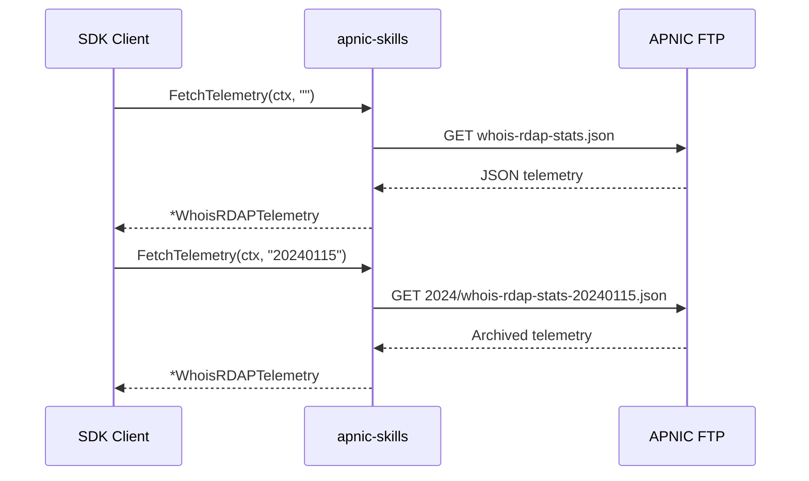
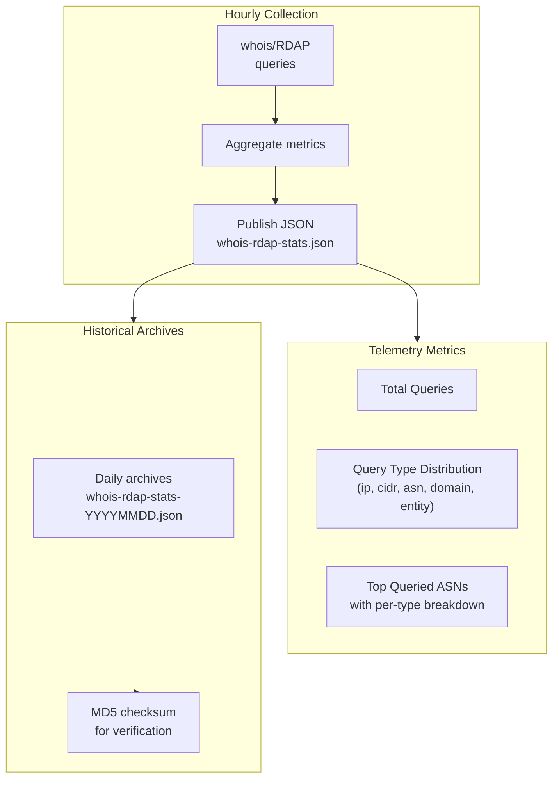

# Telemetry

The SDK provides access to APNIC's whois/RDAP service query telemetry, published hourly with query volume metrics, type distribution, and top-queried ASNs.



## Methods

| Method | Description |
|--------|-------------|
| `FetchTelemetry(ctx, date)` | Fetch whois/RDAP query telemetry; `date=""` for latest, `YYYYMMDD` for archive |
| `FetchTelemetryMD5(ctx, date)` | MD5 checksum for telemetry JSON |

## Telemetry Flow



## Examples

### Fetch Latest Telemetry

```go
package main

import (
    "context"
    "fmt"
    "log"

    apnic "github.com/cyberspacesec/apnic-skills"
)

func main() {
    client := apnic.NewClient()
    ctx := context.Background()

    // Fetch latest telemetry (pass "" for latest)
    telemetry, err := client.FetchTelemetry(ctx, "")
    if err != nil {
        log.Fatal(err)
    }

    fmt.Printf("Whois/RDAP Telemetry:\n")
    fmt.Printf("  Date Range: %s to %s\n",
        telemetry.RDAP.DateRange.Start,
        telemetry.RDAP.DateRange.End)
    fmt.Printf("  Total Queries: %d\n", telemetry.RDAP.TotalQueries)
    fmt.Printf("  Total ASNs Queried: %d\n\n", telemetry.RDAP.TotalASNs)

    fmt.Println("Query Type Distribution:")
    for t, count := range telemetry.RDAP.QueryTypeDistribution {
        fmt.Printf("  %s: %d\n", t, count)
    }

    fmt.Println("\nTop 5 Queried ASNs:")
    for i, asn := range telemetry.RDAP.ASNs {
        if i >= 5 {
            break
        }
        fmt.Printf("  AS%s: %d queries\n", asn.ASN, asn.QueryCount)
    }
}
```

### Fetch Archived Telemetry

```go
package main

import (
    "context"
    "fmt"
    "log"

    apnic "github.com/cyberspacesec/apnic-skills"
)

func main() {
    client := apnic.NewClient()
    ctx := context.Background()

    // Fetch telemetry for a specific date (YYYYMMDD)
    date := "20240115"
    telemetry, err := client.FetchTelemetry(ctx, date)
    if err != nil {
        log.Fatal(err)
    }

    fmt.Printf("Telemetry for %s:\n", date)
    fmt.Printf("  Total Queries: %d\n", telemetry.RDAP.TotalQueries)
}
```

### Analyze Query Type Distribution

```go
package main

import (
    "context"
    "fmt"
    "log"

    apnic "github.com/cyberspacesec/apnic-skills"
)

func main() {
    client := apnic.NewClient()
    ctx := context.Background()

    telemetry, _ := client.FetchTelemetry(ctx, "")

    total := telemetry.RDAP.TotalQueries
    if total == 0 {
        log.Fatal("No queries recorded")
    }

    fmt.Println("Query Type Breakdown:")
    for t, count := range telemetry.RDAP.QueryTypeDistribution {
        pct := float64(count) / float64(total) * 100
        fmt.Printf("  %-10s: %8d (%.1f%%)\n", t, count, pct)
    }
}
```

### Analyze Top ASNs

```go
package main

import (
    "context"
    "fmt"

    apnic "github.com/cyberspacesec/apnic-skills"
)

func main() {
    client := apnic.NewClient()
    ctx := context.Background()

    telemetry, _ := client.FetchTelemetry(ctx, "")

    fmt.Println("Top 10 Queried ASNs:")
    fmt.Println("ASN       | Total Queries | By Type")
    fmt.Println("----------|---------------|--------")

    for i, asn := range telemetry.RDAP.ASNs {
        if i >= 10 {
            break
        }

        // Show breakdown by query type
        types := ""
        for t, c := range asn.QueryCountByType {
            if types != "" {
                types += ", "
            }
            types += fmt.Sprintf("%s:%d", t, c)
        }

        fmt.Printf("AS%-7s | %13d | %s\n",
            asn.ASN, asn.QueryCount, types)
    }
}
```

### Verify Telemetry Integrity

```go
package main

import (
    "context"
    "fmt"
    "log"

    apnic "github.com/cyberspacesec/apnic-skills"
)

func main() {
    client := apnic.NewClient()
    ctx := context.Background()

    // Fetch MD5 checksum
    md5, err := client.FetchTelemetryMD5(ctx, "")
    if err != nil {
        log.Fatal(err)
    }
    fmt.Printf("Telemetry MD5: %s\n", md5)
}
```

### Compare Telemetry Over Time

```go
package main

import (
    "context"
    "fmt"
    "log"

    apnic "github.com/cyberspacesec/apnic-skills"
)

func main() {
    client := apnic.NewClient()
    ctx := context.Background()

    dates := []string{"20240101", "20240108", "20240115"}

    fmt.Println("Telemetry Comparison:")
    fmt.Println("Date       | Total Queries | Top ASN | Top ASN Queries")
    fmt.Println("-----------|---------------|---------|----------------")

    for _, date := range dates {
        t, err := client.FetchTelemetry(ctx, date)
        if err != nil {
            log.Printf("%s: %v", date, err)
            continue
        }

        topASN := "-"
        topCount := int64(0)
        if len(t.RDAP.ASNs) > 0 {
            topASN = "AS" + t.RDAP.ASNs[0].ASN
            topCount = t.RDAP.ASNs[0].QueryCount
        }

        fmt.Printf("%s | %13d | %-7s | %d\n",
            date, t.RDAP.TotalQueries, topASN, topCount)
    }
}
```

## Data Structures

### WhoisRDAPTelemetry

```go
type WhoisRDAPTelemetry struct {
    RDAP struct {
        DateRange struct {
            Start string
            End   string
        }
        TotalQueries          int64
        TotalASNs             int64
        QueryTypeDistribution map[string]int64
        ASNs                  []TelemetryASN
    }
}
```

### TelemetryASN

```go
type TelemetryASN struct {
    ASN              string           // ASN number (without "AS" prefix)
    QueryCount       int64            // Total queries for this ASN
    QueryCountByType map[string]int64 // Queries broken down by type
}
```

## Query Types

| Type | Description |
|------|-------------|
| `ip` | IP address lookup |
| `cidr` | CIDR block lookup |
| `asn` | ASN lookup |
| `domain` | Domain lookup (reverse DNS) |
| `entity` | Entity/contact lookup |
| `search` | Search queries |

## Use Cases

1. **Service Monitoring**: Track query volume trends
2. **Popular Resources**: Identify frequently queried ASNs/prefixes
3. **Capacity Planning**: Understand query patterns for scaling
4. **Research**: Analyze whois/RDAP usage patterns
5. **Anomaly Detection**: Spot unusual query patterns

## Error Handling

```go
telemetry, err := client.FetchTelemetry(ctx, "")
if err != nil {
    // Possible errors:
    // - Network timeout
    // - JSON decode failure
    // - File not found (for invalid dates)
    log.Printf("Telemetry fetch failed: %v", err)
    return
}
```

## Publication Schedule

Telemetry files are published approximately **every hour**:

- Latest: `whois-rdap-stats.json`
- Archives: `YYYY/whois-rdap-stats-YYYYMMDD.json`
- Each file contains metrics for the preceding hour
