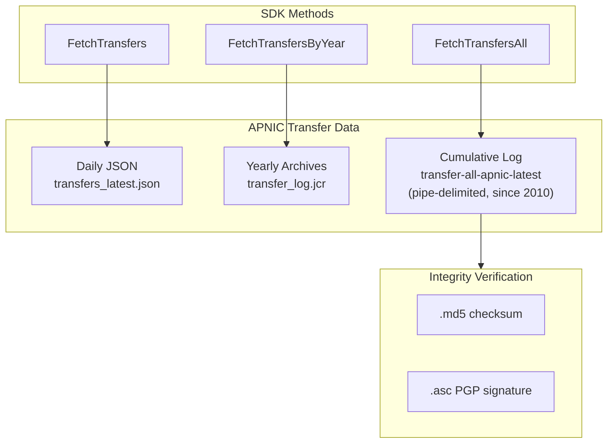
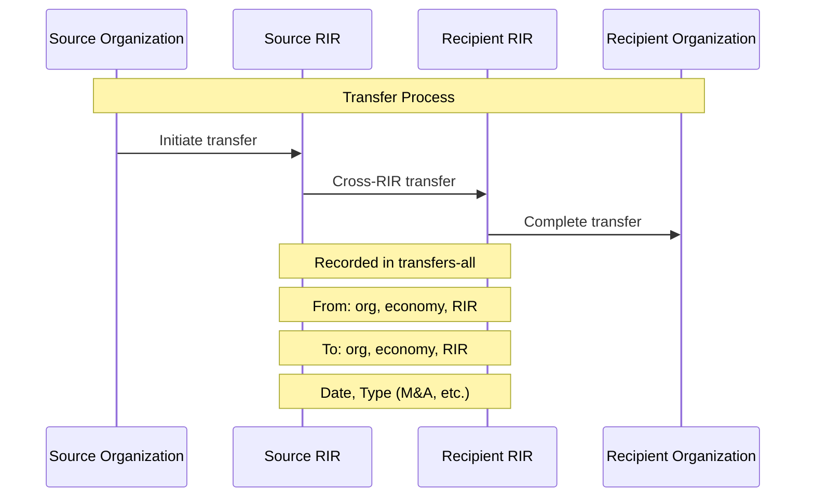

# Transfers

The SDK provides access to APNIC's IP and ASN transfer records, including both the daily JSON snapshot and the cumulative historical transfer log (transfers-all) dating back to 2010.



## Methods

| Method | Description |
|--------|-------------|
| `FetchTransfers(ctx)` | Fetch latest transfer records (daily JSON snapshot) |
| `GetTransfers(ctx)` | Cached transfer records |
| `FetchTransfersByYear(ctx, year)` | Fetch transfers for a specific year |
| `FetchTransfersAll(ctx, date)` | Fetch cumulative transfers-all (pipe-delimited, since 2010) |
| `FetchTransfersAllMD5(ctx, date)` | MD5 checksum for transfers-all |
| `FetchTransfersAllASC(ctx, date)` | PGP signature (.asc) for transfers-all |

## Transfer Flow



## Transfers-All Format

The cumulative `transfers-all` file uses pipe-delimited format:

```
# Comment lines start with #
resource_type|resource|from_org|from_economy|from_rir|prev_date|to_org|to_economy|to_rir|transfer_date|transfer_type
ipv4|203.0.113.0/24|Example Corp|AU|apnic|20100101|New Corp|JP|apnic|20240115|RESOURCE_TRANSFER
asn|64512|Old ISP|US|arin|20150601|Global ISP|SG|apnic|20240201|M&A
```

## Examples

### Fetch Latest Transfers

```go
package main

import (
    "context"
    "fmt"
    "log"

    apnic "github.com/cyberspacesec/apnic-skills"
)

func main() {
    client := apnic.NewClient()
    ctx := context.Background()

    transfers, err := client.FetchTransfers(ctx)
    if err != nil {
        log.Fatal(err)
    }

    fmt.Printf("Producer: %s\n", transfers.Metadata.Producer)
    fmt.Printf("Stats Version: %s\n", transfers.Metadata.StatsVersion)
    fmt.Printf("Transfer Records: %d\n\n", len(transfers.Transfers))

    // Show recent transfers
    for i, t := range transfers.Transfers {
        if i >= 5 {
            break
        }
        fmt.Printf("Date: %s\n", t.TransferDate.Format("2006-01-02"))
        fmt.Printf("  Type: %s\n", t.Type)
        fmt.Printf("  From: %s (%s) via %s\n",
            t.SourceOrganization.Name,
            t.SourceOrganization.CountryCode,
            t.SourceRIR)
        fmt.Printf("  To: %s (%s) via %s\n",
            t.RecipientOrganization.Name,
            t.RecipientOrganization.CountryCode,
            t.RecipientRIR)
        if t.IPv4Nets != nil {
            fmt.Printf("  IPv4: %d networks\n", len(t.IPv4Nets.TransferSet))
        }
        if t.ASNs != nil {
            fmt.Printf("  ASNs: %d ranges\n", len(t.ASNs.TransferSet))
        }
        fmt.Println()
    }
}
```

### Fetch Transfers by Year

```go
package main

import (
    "context"
    "fmt"
    "log"

    apnic "github.com/cyberspacesec/apnic-skills"
)

func main() {
    client := apnic.NewClient()
    ctx := context.Background()

    years := []int{2023, 2024, 2025}

    for _, year := range years {
        transfers, err := client.FetchTransfersByYear(ctx, year)
        if err != nil {
            log.Printf("Year %d: %v", year, err)
            continue
        }

        fmt.Printf("%d: %d transfers\n", year, len(transfers.Transfers))
    }
}
```

### Fetch Cumulative Transfers-All

```go
package main

import (
    "context"
    "fmt"
    "log"

    apnic "github.com/cyberspacesec/apnic-skills"
)

func main() {
    client := apnic.NewClient()
    ctx := context.Background()

    // Fetch latest cumulative file (all transfers since 2010)
    all, err := client.FetchTransfersAll(ctx, "") // "" = latest
    if err != nil {
        log.Fatal(err)
    }

    fmt.Printf("Total transfer records: %d\n", len(all.Records))

    // Analyze by type
    byType := make(map[string]int)
    for _, r := range all.Records {
        byType[r.TransferType]++
    }

    fmt.Println("\nBy Transfer Type:")
    for t, count := range byType {
        fmt.Printf("  %s: %d\n", t, count)
    }

    // Find transfers to/from specific economy
    var toJP, fromJP int
    for _, r := range all.Records {
        if r.ToEconomy == "JP" {
            toJP++
        }
        if r.FromEconomy == "JP" {
            fromJP++
        }
    }
    fmt.Printf("\nTransfers to Japan: %d\n", toJP)
    fmt.Printf("Transfers from Japan: %d\n", fromJP)
}
```

### Fetch Archived Transfers-All

```go
package main

import (
    "context"
    "fmt"
    "log"

    apnic "github.com/cyberspacesec/apnic-skills"
)

func main() {
    client := apnic.NewClient()
    ctx := context.Background()

    // Fetch specific day's archive (YYYYMMDD format)
    date := "20240115"
    archive, err := client.FetchTransfersAll(ctx, date)
    if err != nil {
        log.Fatal(err)
    }

    fmt.Printf("Transfers as of %s: %d records\n", date, len(archive.Records))
}
```

### Verify Transfers-All Integrity

```go
package main

import (
    "context"
    "fmt"
    "log"

    apnic "github.com/cyberspacesec/apnic-skills"
)

func main() {
    client := apnic.NewClient()
    ctx := context.Background()

    // Fetch MD5 checksum
    md5, err := client.FetchTransfersAllMD5(ctx, "")
    if err != nil {
        log.Fatal(err)
    }
    fmt.Printf("MD5: %s\n", md5)

    // Fetch PGP signature
    asc, err := client.FetchTransfersAllASC(ctx, "")
    if err != nil {
        log.Fatal(err)
    }
    fmt.Printf("PGP signature length: %d bytes\n", len(asc))
}
```

### Analyze Transfer History

```go
package main

import (
    "context"
    "fmt"
    "log"
    "time"

    apnic "github.com/cyberspacesec/apnic-skills"
)

func main() {
    client := apnic.NewClient()
    ctx := context.Background()

    all, _ := client.FetchTransfersAll(ctx, "")

    // Group by year
    byYear := make(map[int]int)
    for _, r := range all.Records {
        year := r.TransferDate.Year()
        byYear[year]++
    }

    fmt.Println("Transfers per Year:")
    for y := 2010; y <= time.Now().Year(); y++ {
        if count, ok := byYear[y]; ok {
            fmt.Printf("  %d: %d\n", y, count)
        }
    }

    // Count by resource type
    ipv4 := 0
    ipv6 := 0
    asn := 0
    for _, r := range all.Records {
        switch r.ResourceType {
        case "ipv4":
            ipv4++
        case "ipv6":
            ipv6++
        case "asn":
            asn++
        }
    }

    fmt.Printf("\nBy Resource Type:\n")
    fmt.Printf("  IPv4: %d\n", ipv4)
    fmt.Printf("  IPv6: %d\n", ipv6)
    fmt.Printf("  ASN: %d\n", asn)
}
```

## Data Structures

### TransferRecord (JSON format)

```go
type TransferRecord struct {
    TransferDate         time.Time
    Type                 string // "M&A", "RESOURCE_TRANSFER", etc.
    SourceRIR            string
    RecipientRIR         string
    SourceOrganization   Organization
    RecipientOrganization Organization
    IPv4Nets             *TransferNetSet
    IPv6Nets             *TransferNetSet
    ASNs                 *TransferASNSet
}

type Organization struct {
    Name        string
    CountryCode string
}

type NetRange struct {
    StartAddress string
    EndAddress   string
}

type ASNRange struct {
    StartASN int64
    EndASN   int64
}
```

### TransferAllRecord (Pipe-delimited format)

```go
type TransferAllRecord struct {
    ResourceType           string    // "asn", "ipv4", "ipv6"
    Resource               string    // The ASN or prefix
    FromOrganisation       string
    FromEconomy            string    // Country code
    FromRIR                string
    PreviousDelegationDate time.Time
    ToOrganisation         string
    ToEconomy              string    // Country code
    ToRIR                  string
    TransferDate           time.Time
    TransferType           string    // "M&A", "RESOURCE_TRANSFER", etc.
}
```

## Transfer Types

| Type | Description |
|------|-------------|
| `M&A` | Merger and Acquisition |
| `RESOURCE_TRANSFER` | Standard resource transfer |
| `INTER_RIR` | Inter-RIR transfer |

## Error Handling

```go
transfers, err := client.FetchTransfers(ctx)
if err != nil {
    // Possible errors:
    // - Network timeout
    // - JSON parse failure
    // - Date format error
    log.Printf("Transfer fetch failed: %v", err)
    return
}
```
