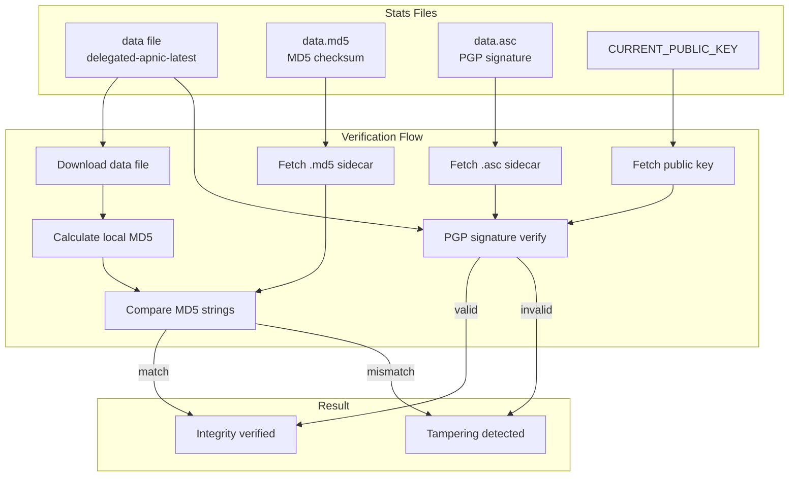
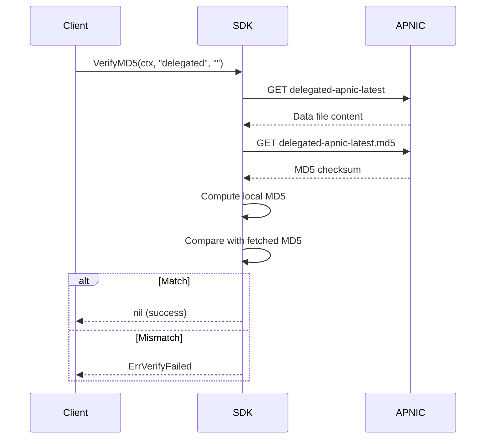

# Data Integrity Verification

The SDK provides comprehensive data integrity verification through MD5 checksums and PGP signatures. All APNIC stats files have corresponding `.md5` and `.asc` sidecar files for verification.



## Methods

| Method | Description |
|--------|-------------|
| `VerifyMD5(ctx, dataType, date)` | End-to-end verification: download data + MD5, compute locally, compare |
| `FetchMD5Checksum(ctx, dataType, date)` | Fetch MD5 checksum (supports BSD/GNU formats) |
| `FetchASCSignature(ctx, dataType, date)` | Fetch PGP signature (.asc) |
| `FetchPublicKey(ctx)` | Fetch APNIC signing public key |

## Supported Data Types

| DataType | Description |
|----------|-------------|
| `delegated` | Standard delegated stats |
| `delegated-extended` | Extended delegated stats |
| `assigned` | Assigned stats |
| `delegated-ipv6-assigned` | IPv6 assigned stats |
| `legacy` | Legacy resources |

## End-to-End Verification Flow



## Examples

### Verify Delegated Stats

```go
package main

import (
    "context"
    "fmt"
    "log"

    apnic "github.com/cyberspacesec/apnic-skills"
)

func main() {
    client := apnic.NewClient()
    ctx := context.Background()

    // End-to-end verification
    err := client.VerifyMD5(ctx, "delegated", "")
    if err != nil {
        log.Fatalf("Verification failed: %v", err)
    }

    fmt.Println("Delegated stats verified successfully!")
}
```

### Verify Extended Stats with Date

```go
package main

import (
    "context"
    "fmt"
    "log"

    apnic "github.com/cyberspacesec/apnic-skills"
)

func main() {
    client := apnic.NewClient()
    ctx := context.Background()

    // Verify archived data
    date := "20240115"
    err := client.VerifyMD5(ctx, "delegated-extended", date)
    if err != nil {
        log.Fatalf("Verification failed: %v", err)
    }

    fmt.Printf("Extended stats for %s verified!\n", date)
}
```

### Fetch MD5 Checksum

```go
package main

import (
    "context"
    "fmt"
    "log"

    apnic "github.com/cyberspacesec/apnic-skills"
)

func main() {
    client := apnic.NewClient()
    ctx := context.Background()

    // Fetch MD5 checksum
    md5, err := client.FetchMD5Checksum(ctx, "delegated", "")
    if err != nil {
        log.Fatal(err)
    }

    fmt.Printf("MD5: %s\n", md5)
}
```

### Manual Verification

```go
package main

import (
    "context"
    "crypto/md5"
    "fmt"
    "log"

    apnic "github.com/cyberspacesec/apnic-skills"
)

func main() {
    client := apnic.NewClient()
    ctx := context.Background()

    // Fetch data
    entries, err := client.FetchDelegatedEntries(ctx)
    if err != nil {
        log.Fatal(err)
    }

    // Fetch expected MD5
    expectedMD5, err := client.FetchMD5Checksum(ctx, "delegated", "")
    if err != nil {
        log.Fatal(err)
    }

    // Compute local MD5 (simplified - in practice you'd hash the raw file)
    localHash := fmt.Sprintf("%x", md5.Sum([]byte(fmt.Sprintf("%v", entries))))

    fmt.Printf("Expected: %s\n", expectedMD5)
    fmt.Printf("Local:    %s\n", localHash)

    if localHash == expectedMD5 {
        fmt.Println("Verified!")
    } else {
        fmt.Println("Mismatch detected!")
    }
}
```

### Fetch PGP Signature

```go
package main

import (
    "context"
    "fmt"
    "log"

    apnic "github.com/cyberspacesec/apnic-skills"
)

func main() {
    client := apnic.NewClient()
    ctx := context.Background()

    // Fetch PGP signature
    asc, err := client.FetchASCSignature(ctx, "delegated", "")
    if err != nil {
        log.Fatal(err)
    }

    fmt.Printf("PGP signature (%d bytes):\n", len(asc))
    fmt.Println(asc[:200] + "...") // Show first 200 chars
}
```

### Fetch Public Key

```go
package main

import (
    "context"
    "fmt"
    "log"

    apnic "github.com/cyberspacesec/apnic-skills"
)

func main() {
    client := apnic.NewClient()
    ctx := context.Background()

    // Fetch APNIC's public key for PGP verification
    pubKey, err := client.FetchPublicKey(ctx)
    if err != nil {
        log.Fatal(err)
    }

    fmt.Printf("APNIC Public Key (%d bytes):\n", len(pubKey))
    fmt.Println(pubKey)
}
```

### Verify All Data Types

```go
package main

import (
    "context"
    "fmt"
    "log"

    apnic "github.com/cyberspacesec/apnic-skills"
)

func main() {
    client := apnic.NewClient()
    ctx := context.Background()

    types := []string{
        "delegated",
        "delegated-extended",
        "assigned",
        "legacy",
    }

    fmt.Println("Verifying all data types:")
    for _, t := range types {
        err := client.VerifyMD5(ctx, t, "")
        if err != nil {
            fmt.Printf("  %s: FAILED - %v\n", t, err)
        } else {
            fmt.Printf("  %s: OK\n", t)
        }
    }
}
```

### Verify Historical Data

```go
package main

import (
    "context"
    "fmt"
    "log"

    apnic "github.com/cyberspacesec/apnic-skills"
)

func main() {
    client := apnic.NewClient()
    ctx := context.Background()

    // Verify data for specific dates
    dates := []string{"20240101", "20240115", "20240201"}

    for _, date := range dates {
        err := client.VerifyMD5(ctx, "delegated", date)
        if err != nil {
            log.Printf("%s: verification failed: %v", date, err)
            continue
        }
        fmt.Printf("%s: verified\n", date)
    }
}
```

## MD5 Checksum Formats

The SDK supports both common MD5 file formats:

### BSD Format
```
MD5 (delegated-apnic-latest) = abc123def456...
```

### GNU Format
```
abc123def456...  delegated-apnic-latest
```

The `FetchMD5Checksum` method extracts the hex hash from either format.

## Error Handling

```go
err := client.VerifyMD5(ctx, "delegated", "")
if err != nil {
    // Possible errors:
    // - ErrVerifyFailed: MD5 mismatch
    // - Network timeout
    // - File not found
    // - Empty MD5 file

    if errors.Is(err, apnic.ErrVerifyFailed) {
        log.Println("Data integrity check failed - possible tampering!")
    }
    return
}
```

## Use Cases

1. **Download Verification**: Ensure files downloaded completely and correctly
2. **Tamper Detection**: Detect if data was modified in transit
3. **Archive Integrity**: Verify historical archives are intact
4. **Compliance**: Meet audit requirements for data integrity
5. **Security**: Protect against man-in-the-middle attacks

## Best Practices

1. **Always verify** after downloading important data
2. **Check historical data** before relying on archived records
3. **Use PGP signatures** for highest assurance (requires external PGP tool)
4. **Log verification results** for audit trails
