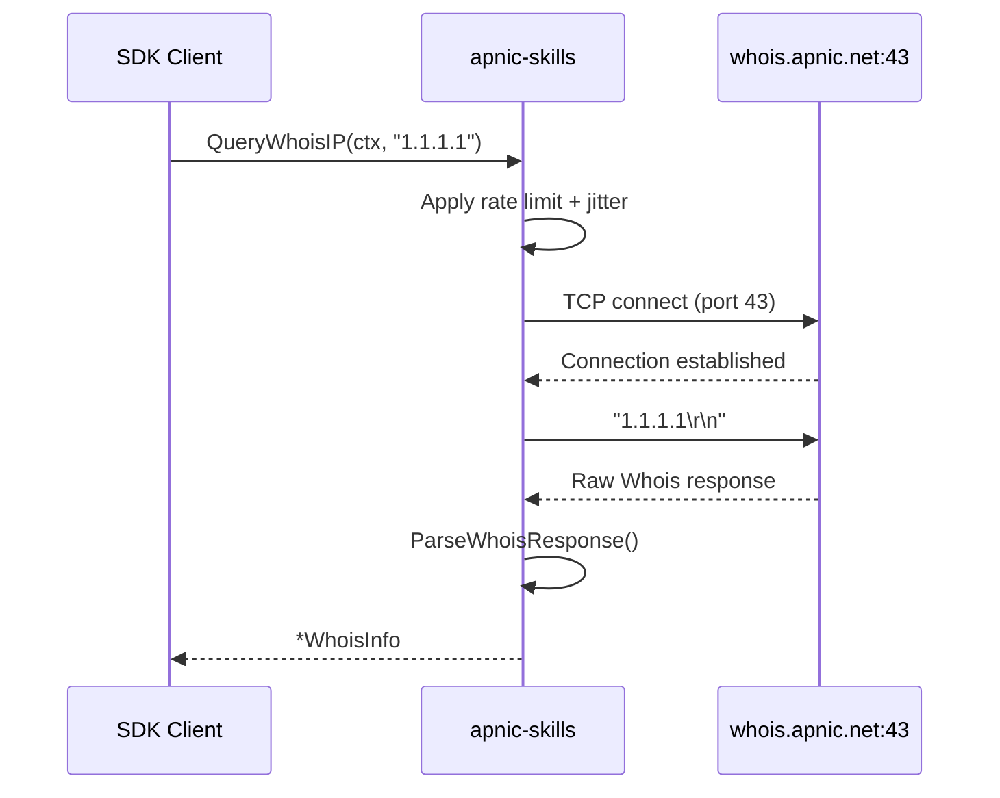
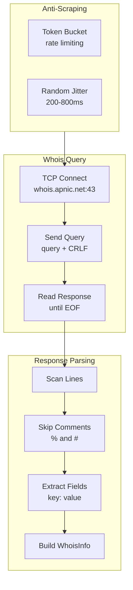

# Whois Queries

The `apnic-skills` SDK provides comprehensive Whois query capabilities against the APNIC Whois server (`whois.apnic.net:43`). Whois is the traditional TCP-based protocol for querying registration data for IP addresses, ASNs, and other Internet resources.



## Methods

| Method | Description |
|--------|-------------|
| `QueryWhois(ctx, query)` | Perform a raw Whois query and return the response text |
| `QueryWhoisIP(ctx, ip)` | Query Whois for an IP address and return parsed result |
| `QueryWhoisASN(ctx, asn)` | Query Whois for an ASN (pass `13335`, not `"AS13335"`) |
| `QueryWhoisWithFlags(ctx, query, flags)` | Query with flags like `"B"` (brief), `"r"` (no recursion) |
| `ParseWhoisResponse(response)` | Parse raw Whois text into structured `WhoisInfo` |

## WhoisInfo Structure

```go
type WhoisInfo struct {
    Network     string    // Network range (e.g., "1.1.1.0 - 1.1.1.255")
    CIDR        []string  // CIDR blocks (e.g., ["1.1.1.0/24"])
    Country     string    // ISO 3166 country code
    OrgName     string    // Organization name
    Parent      string    // Parent allocation
    Created     time.Time // Registration date
    LastUpdated time.Time // Last modification date
}
```

## Query Flow



## Examples

### IP Address Whois Query

```go
package main

import (
    "context"
    "fmt"
    "log"
    "time"

    apnic "github.com/cyberspacesec/apnic-skills"
)

func main() {
    client := apnic.NewClient(
        apnic.WithWhoisTimeout(15 * time.Second),
    )
    ctx := context.Background()

    // Query IP Whois
    info, err := client.QueryWhoisIP(ctx, "1.1.1.1")
    if err != nil {
        log.Fatal(err)
    }

    fmt.Printf("Network: %s\n", info.Network)
    fmt.Printf("CIDR: %v\n", info.CIDR)
    fmt.Printf("Country: %s\n", info.Country)
    fmt.Printf("Organization: %s\n", info.OrgName)
    fmt.Printf("Created: %s\n", info.Created.Format("2006-01-02"))
    fmt.Printf("Last Updated: %s\n", info.LastUpdated.Format("2006-01-02"))
}
```

### ASN Whois Query

```go
package main

import (
    "context"
    "fmt"
    "log"

    apnic "github.com/cyberspacesec/apnic-skills"
)

func main() {
    client := apnic.NewClient()
    ctx := context.Background()

    // Query ASN Whois (pass numeric ASN, not "AS13335")
    info, err := client.QueryWhoisASN(ctx, 13335)
    if err != nil {
        log.Fatal(err)
    }

    fmt.Printf("Organization: %s\n", info.OrgName)
    fmt.Printf("Country: %s\n", info.Country)
}
```

### Raw Whois Query with Flags

```go
package main

import (
    "context"
    "fmt"
    "log"

    apnic "github.com/cyberspacesec/apnic-skills"
)

func main() {
    client := apnic.NewClient()
    ctx := context.Background()

    // Raw query with flags
    // "B" = brief output, "r" = no recursion, "l" = one level less specific
    raw, err := client.QueryWhoisWithFlags(ctx, "8.8.8.8", "B")
    if err != nil {
        log.Fatal(err)
    }

    fmt.Println("Raw Whois Response:")
    fmt.Println(raw)

    // Parse manually if needed
    info := apnic.ParseWhoisResponse(raw)
    fmt.Printf("Network: %s\n", info.Network)
}
```

### Custom Whois Server

```go
package main

import (
    apnic "github.com/cyberspacesec/apnic-skills"
)

func main() {
    client := apnic.NewClient(
        apnic.WithWhoisServer("whois.apnic.net:43"),
        apnic.WithWhoisTimeout(30 * apnic.Second),
    )
    // ... use client
}
```

## Anti-Scraping Integration

Whois queries inherit the SDK's anti-scraping mechanisms:

1. **Rate Limiting**: Token bucket algorithm limits request frequency
2. **Random Jitter**: 200-800ms delay between requests (configurable)
3. **Context Support**: Respects context cancellation and deadlines

```go
// Configure jitter range
client := apnic.NewClient(
    apnic.WithJitter(100*time.Millisecond, 500*time.Millisecond),
    apnic.WithRateLimit(1.0), // 1 request per second max
)
```

## Common Whois Flags

| Flag | Description |
|------|-------------|
| `B` | Brief output (less verbose) |
| `r` | Disable recursion (no referral to other registries) |
| `l` | Show one level less specific |
| `L` | Show all levels less specific |
| `m` | Show one level more specific |
| `M` | Show all levels more specific |

## Error Handling

```go
info, err := client.QueryWhoisIP(ctx, "1.1.1.1")
if err != nil {
    // Common errors:
    // - Connection timeout
    // - Network unreachable
    // - Context canceled
    log.Printf("Whois query failed: %v", err)
    return
}
```
