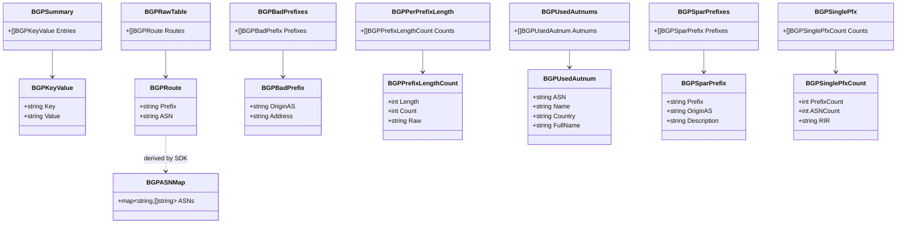
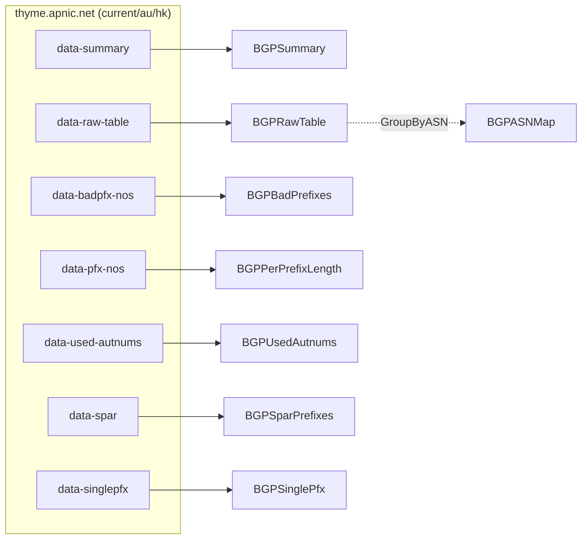

# BGP Types

The BGP family models the data files published by APNIC's *thyme* BGP analysis service at `thyme.apnic.net`. Thyme publishes eight files; the SDK covers all eight and additionally derives an ASN→prefixes map locally from the raw route table. Three geographic views (`current`, `au`, `hk`) are exposed through the `--bgp-source` flag / `FetchBGP*` source argument.

All types live in [`models.go`](https://github.com/cyberspacesec/apnic-skills/blob/main/models.go).

## Class Diagram

## `BGPSummary` / `BGPKeyValue` — `data-summary`

Thyme's summary file is a list of `key: value` pairs preceded by a dash separator line. Values are kept verbatim as strings because thyme mixes counts, percentages and prose in the same column.

| Field | Description |
|-------|-------------|
| `BGPSummary.Entries` | Ordered list of `BGPKeyValue`. |
| `BGPKeyValue.Key` / `.Value` | Raw key and value strings, unparsed. |

## `BGPRawTable` / `BGPRoute` — `data-raw-table`

One `prefix\tASN` line per route.

| Field | Description |
|-------|-------------|
| `BGPRawTable.Routes` | Slice of `BGPRoute`. |
| `BGPRoute.Prefix` | Announced prefix (e.g. `1.1.1.0/24`). |
| `BGPRoute.ASN` | Origin ASN as a string (may be AS-SET form). |

## `BGPASNMap` — derived, not fetched

`BGPASNMap` aggregates `BGPRawTable` routes by origin ASN. It is built locally by the SDK (`GroupByASN`); no extra network request is made. `ASNs` maps each origin ASN to the list of prefixes it originates, in first-seen order.

## `BGPBadPrefix` / `BGPBadPrefixes` — `data-badpfx-nos`

Prefixes longer than `/24` and their origin AS. Such prefixes often indicate route leaks or mis-announcements. The SDK guards against malformed rows by truncating out-of-range data rather than failing the whole file.

| Field | Description |
|-------|-------------|
| `BGPBadPrefix.OriginAS` | Announcing AS. |
| `BGPBadPrefix.Address` | The over-long prefix. |

## `BGPPrefixLengthCount` / `BGPPerPrefixLength` — `data-pfx-nos`

How many prefixes of each length are announced (`/N:count`).

| Field | Description |
|-------|-------------|
| `Length` | The `N` in `/N`. |
| `Count` | Number of prefixes of that length. |
| `Raw` | The original token (e.g. `"/8:16"`), kept for diagnostics. |

## `BGPUsedAutnum` / `BGPUsedAutnums` — `data-used-autnums`

In-use ASNs: `"ASN Name - Description, CC"`. The SDK splits each line into four fields; the `FullName` field preserves the `Name - Description` text that precedes the trailing country code.

| Field | Description |
|-------|-------------|
| `ASN` | AS number string. |
| `Name` | Registered name (e.g. `LVLT-1`). |
| `Country` | ISO country code (e.g. `US`). |
| `FullName` | Full `Name - Description` text. |

## `BGPSparPrefix` / `BGPSparPrefixes` — `data-spar`

Prefixes from the Special Purpose Address Registry (RFC 6890 reserved space) that are nonetheless being announced, with origin AS and description.

## `BGPSinglePfxCount` / `BGPSinglePfx` — `data-singlepfx`

Counts of ASNs that announce fewer than 20 prefixes, broken down by RIR. Each row is `No. of Prefixes / No. of ASNs / RIR`.

| Field | Description |
|-------|-------------|
| `PrefixCount` | The prefix-count bucket (e.g. `1`, `2`, … `<20`). |
| `ASNCount` | Number of ASNs in that bucket. |
| `RIR` | Responsible RIR (`apnic`, `arin`, `ripe`, …). |

## Source-to-type map

## Per-source view

Thyme publishes the same files for three geographic views, selected at fetch time via the `source` argument (`current` is the default):

| Source | Region | Example URL prefix |
|--------|--------|--------------------|
| `current` | Global view (APNIC's perspective) | `thyme.apnic.net/current/...` |
| `au` | Australia-routed view | `thyme.apnic.net/au/...` |
| `hk` | Hong Kong-routed view | `thyme.apnic.net/hk/...` |

The parsed type is identical regardless of source — only the data differs.
